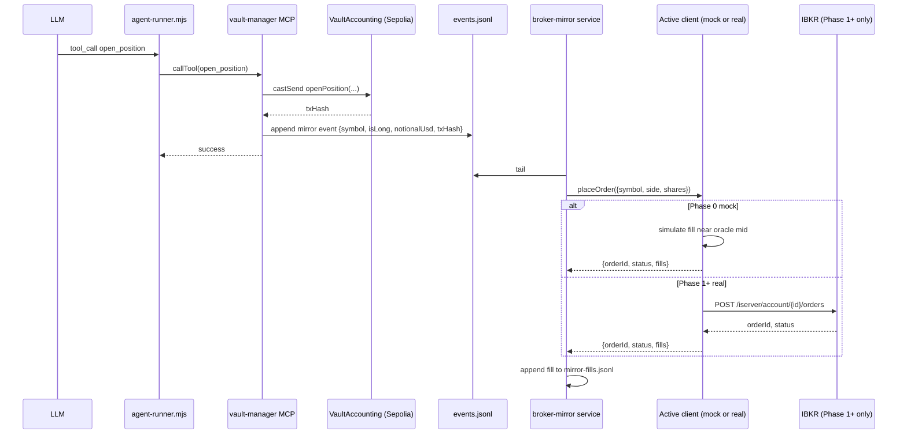

## Broker Mirror — Public Credibility Wedge for IndexFlow

### Strategic positioning (why this exists)

IndexFlow's defensible USP is **leveraged synthetic exposure to the long-tail global mining/commodity equities, vault-managed by AI agents, with onchain audit trail, cross-chain access**. No competitor offers this combination — Helix has US-major synthetic perps but not TSX-V juniors; Backed/Dinari have tokenized stocks but no leverage; Mirror and Synthetix synths are dead.

The hardest sell to institutional LPs and serious capital allocators is: "but your PnL is testnet/synthetic — does the strategy actually work in real markets?". This broker-mirror is the answer. By running the same AI agents against a real (paper, then live) brokerage account and publishing the reconciliation reports + attested monthly statements, we get an audited real-money track record that proves the signal survives real fills, spreads, and execution constraints.

**The mirror is therefore a public marketing/credibility surface, not a private trading desk.** This shapes every design choice below — attestation matters, publishing requires legal review, Phase 1 needs a go/no-go gate before any data goes public.

### Goal

Every time `mining-manager` or `quality-matrix-manager` successfully fires an on-chain `open_position` or `close_position`, we also fire an equivalent broker order. Phase 0 uses a **mock IBKR client** (deterministic simulated fills, no real account, no money flow). Phase 1 swaps to the **real IBKR Client Portal client** against the employer's corporate paper account when KYC clears. Phase 2 (separate plan) is live trading with hard caps. Reports get published at each phase — but only **after** a per-phase go/no-go gate.

**Crucially: leverage is always dropped.** The synthetic perp runs up to 50x; the broker mirror trades cash-equivalent notional initially, with up to 2-4x Reg-T margin only if employer explicitly authorizes. We need to know what the strategy returns **unlevered first**.

### Phases + publishing gates


|                         | Phase 0 (mock, weeks 1-2)                            | Phase 1 (real corporate paper, weeks 4-8)                                   | Phase 2 (live, week 8+)                        |
| ----------------------- | ---------------------------------------------------- | --------------------------------------------------------------------------- | ---------------------------------------------- |
| Account holder          | None (no IBKR account exists)                        | Employer's foreign entity                                                   | Same                                           |
| IBKR client             | `mock-ibkr.mjs` (stub)                               | `real-ibkr.mjs` (Client Portal)                                             | Same                                           |
| Capital                 | Virtual                                              | $1M virtual (corporate paper)                                               | Employer's authorized cap                      |
| Time to start           | Day 1                                                | After corporate KYC (4-8 weeks)                                             | After Phase 1 + employer sign-off              |
| Validates               | Code correctness, event flow, sizing, reconciliation | Real IBKR API quirks, real fill quality, real exchange routing              | Strategy survives real-money execution         |
| Compliance burden       | Zero                                                 | Schedule FA (signing authority) + employer agreement                        | Same as Phase 1 + ongoing reporting            |
| **Published publicly?** | **No** — internal dev data only                      | **Gated** — only after Phase 1 go/no-go criteria met (`phase1-public-gate`) | **Yes** — with monthly attested PDF statements |
| Marketing claim         | None                                                 | "Paper-traded reconciliation track record vs. testnet"                      | "Audited live brokerage track record"          |


The mock-first approach eliminates 4-8 weeks of waiting before any code can be written. By the time the corporate account is approved, the entire pipeline has been exercised for weeks against real on-chain agent fills, and Phase 1 is a single env-var swap.

**The publishing gates are non-negotiable.** Publishing reconciliation data that shows the strategy losing money in real markets is reputational damage to the entire protocol's USP. Each phase needs criteria-based clearance before its data goes public:

- **Phase 0**: never published. Internal validation only.
- **Phase 1 → public**: requires (a) ≥2 weeks of corporate paper data, (b) real-fill PnL within agreed tolerance of oracle PnL (slippage acceptable), (c) no execution bugs, (d) legal review complete (`legal-review-marketing-rule`), (e) attestation pipeline working (`attestation-pipeline`). Failures = fix + re-paper, don't publish.
- **Phase 2 → public**: live data publishes monthly with attested PDF statements. Real-money loss months get published anyway (selective publishing destroys credibility faster than admitted losses) — but only after Phase 1 has established trust.

### Reality-check checkpoints baked into the plan

- Mirror triggers only on tx-confirmed on-chain fills (policy gates, risk-officer pass, `castSend` failures already filter what we mirror).
- Phase 0 mock fills are not market truth. They surface code bugs and reconciliation math errors, not strategy edge. Don't make strategy decisions from Phase 0 data.
- Phase 1 corporate-paper fills are close-but-not-identical to live (paper engine fills near mid, real markets have spread + impact). Strategy decisions are tentative until live data exists.
- Phase 2 (live) only happens after: (a) Phase 1 produces 1-2 weeks of clean reconciliation data, (b) employer authorization is signed, (c) FEMA-aware CA consult is complete.

### Architecture




Bus design (vs in-process call) means the MCP stays synchronous + on-chain-only, and the broker side can be down/restarted without blocking trades. Client interface is identical between mock and real, so swap = config change.

### Concrete components

**1. Mirror event emitter (in `[apps/mcps/vault-manager/index.js](apps/mcps/vault-manager/index.js)`)**

In the `open_position` and `close_position` handlers (~L1810–2080), after a successful `castSend`, append a JSON line to `agents/memory/broker-mirror/events.jsonl`:

```json
{
  "ts": "2026-05-26T05:11:22Z",
  "vault": "0x4dcd…",
  "agent": "mining-manager",
  "assetId": "0xa6be…",
  "symbol": "ABRA.TO",
  "isLong": true,
  "notionalUsd": 12205.40,
  "marginUsd": 1220.54,
  "syntheticLeverage": 10,
  "txHash": "0x1298…",
  "kind": "open"
}
```

Single-line write, fail-soft (errors only logged, never throw to caller). Client-agnostic — same event whether mirror runs under mock or real.

**2. Client interface + implementations (`apps/mcps/broker-mirror/clients/`)**

Common interface in `interface.mjs`:

```js
// All clients implement:
async function placeOrder({ symbol, contract, side, quantity, orderType }) → { orderId, status }
async function getOrderStatus(orderId) → { status, fills: [{price, qty, ts}], filledQty, avgPrice }
async function getQuote(contract) → { last, bid, ask, ts }
async function getAccountEquity() → { totalEquityUsd, buyingPowerUsd, currency }
```

`mock-ibkr.mjs` (Phase 0):

- `getQuote` returns OracleAdapter price (read via existing on-chain helper) ± a small deterministic spread based on a slippage model: `spread_bps = base_bps + size_impact_bps(notional, adv_estimate)`.
- `placeOrder` returns `{orderId: uuid, status: "Filled"}` immediately.
- `getOrderStatus` returns the simulated fill at `mid ± spread/2 ± slippage_impact`.
- `getAccountEquity` returns a configurable virtual balance (default `$1,000,000`).
- Persists "open simulated positions" to `mock-positions.json` so closes can be matched.

`real-ibkr.mjs` (Phase 1+):

- Wraps IBKR Client Portal Web API (`/iserver/account/{id}/orders`, `/iserver/marketdata/snapshot`, `/iserver/auth/status`, `/tickle`).
- Session keepalive every 60s; reconnect on auth lapse.
- Handles `conid` resolution via `/iserver/secdef/search` with cache to `conid-cache.json`.
- Identical interface to mock.

Active client picked at startup:

```js
const client = process.env.IBKR_CLIENT === "real"
  ? await import("./clients/real-ibkr.mjs")
  : await import("./clients/mock-ibkr.mjs");
```

**3. Symbol map (`apps/mcps/broker-mirror/symbols.mjs`)**

Static mapping for the ~30 symbols seen in run logs:

```js
{
  "CRML":      { symbol: "CRML", secType: "STK", exchange: "SMART",   currency: "USD" },
  "AEM.TO":    { symbol: "AEM",  secType: "STK", exchange: "TSE",     currency: "CAD" },
  "ABRA.TO":   { symbol: "ABRA", secType: "STK", exchange: "TSE",     currency: "CAD" },
  "AHR.V":     { symbol: "AHR",  secType: "STK", exchange: "VENTURE", currency: "CAD" },
  "BIG.V":     { symbol: "BIG",  secType: "STK", exchange: "VENTURE", currency: "CAD" },
  "PMT.AX":    { symbol: "PMT",  secType: "STK", exchange: "ASX",     currency: "AUD" },
  "EEE.L":     { symbol: "EEE",  secType: "STK", exchange: "LSE",     currency: "GBP" },
  "0KXS.L":    { _unsupported: "depositary-receipt-only, low IBKR coverage" },
  // ... ~30 total
}
```

Unknown symbols log `status: "skipped", reason: "unknown_symbol"` and never block on-chain flow. New symbols (when bot wires a new asset) get appended to this map manually for Phase 0; Phase 1 adds `/iserver/secdef/search` lookup as fallback.

**4. Account profiles (`apps/mcps/broker-mirror/account-profiles/`)**

`mock.json` (Phase 0):

```json
{
  "id": "MOCK",
  "leverage_cap": 1.0,
  "max_pct_equity_per_position": 0.05,
  "default_currency": "USD",
  "starting_equity_usd": 1000000,
  "mock_slippage_base_bps": 5,
  "mock_size_impact_coef": 0.0008,
  "comment": "Phase 0 development profile. No real money."
}
```

`ibkr-pro.json` (Phase 1, populated when corporate account exists):

```json
{
  "id": "IBKR_PRO",
  "entity": "<employer entity name>",
  "leverage_cap": 1.0,
  "max_pct_equity_per_position": 0.03,
  "default_currency": "USD",
  "auto_fx": true,
  "comment": "Corporate paper account. leverage_cap raised to employer-authorized limit before live."
}
```

**5. Sizing translation**

Synthetic perp size: `notionalUsd = size / 1e30` (already in event). Mirror order rules:

- `targetNotionalUsd = notionalUsd` (drop synthetic leverage entirely for Phase 0/1).
- `cappedNotionalUsd = min(targetNotionalUsd, max_pct_equity_per_position × accountEquity)`.
- `shares = floor(cappedNotionalUsd / lastPrice)` via `client.getQuote()`. Reject if `shares < 1`.
- FX: mock ignores FX (USD-equivalent only). Real client lets IBKR handle FX in corporate paper account (`auto_fx: true`).

**6. Broker-mirror service (`apps/mcps/broker-mirror/index.mjs`)**

Long-running Node process (`npm run mirror:start`). Loop:

```
load active profile (IBKR_ACCOUNT_PROFILE)
load active client (IBKR_CLIENT)
tail events.jsonl (with file position checkpoint in cursor.json)
  for each event:
    look up symbol in symbols.mjs → skip with reason if missing/unsupported
    resolve contract (mock: passthrough; real: conid)
    fetch quote via client.getQuote()
    compute shares (apply profile caps)
    call client.placeOrder({contract, side, shares, orderType: "MKT"})
    poll client.getOrderStatus() until terminal
    append fill to mirror-fills.jsonl with {client, profile, txHash, fillPrice, shares, ...}
```

**7. Reconciliation report (`scripts/broker-mirror-report.mjs`)**

Daily cron (GitHub Actions, same workflow as `vault-agent.yml`): reads `events.jsonl` + `mirror-fills.jsonl` for the past 24h, joins on `txHash`, emits `apps/web/public/agent-metadata/broker-mirror-report.json`:

```json
{
  "windowStart": "...",
  "windowEnd": "...",
  "activeClient": "mock",
  "activeProfile": "MOCK",
  "byAgent": {
    "mining-manager": {
      "events": 14,
      "mirrored": 11,
      "skipped_unknown_symbol": 2,
      "skipped_unsupported": 1,
      "oraclePnlUsd": 482.10,
      "mirrorPnlUsdUnlevered": 31.40,
      "leverageGapMultiple": 15.4,
      "simulatedSlippageBps": 87
    }
  }
}
```

Phase 0 caveat: `mirrorPnlUsdUnlevered` is **simulated**, not real. The number is informative for code correctness (leverage stripping math, oracle→mirror mapping, reconciliation join) but **not for strategy validation**. Phase 1 swap is what produces decision-grade data.

**Render at `/operators/broker-mirror`** (new public page in web app — see "Public Credibility Track" below for full UI spec). Built during Phase 0 but kept behind a feature flag until Phase 1 publishing gate passes.

### Public Credibility Track (because the mirror is a marketing surface, not a private desk)

**8. Public dashboard (`apps/web/src/app/operators/broker-mirror/page.tsx`)**

The page is designed to be **screenshot-able and shareable** — institutional LPs, prospective vault depositors, X/LinkedIn audiences. Spec:

- **Hero metric**: live cumulative real-fill PnL (with phase label: "Mock" / "Paper" / "Live") and # days running.
- **Comparison chart**: oracle PnL vs real-fill PnL over time (cumulative %, dual-line).
- **Per-agent breakdown table**: events / mirrored / skipped / oracle-PnL / real-PnL / slippage bps / hit-rate.
- **Per-symbol coverage strip**: shows which of the bot's universe is being mirrored, which is skipped (with reason).
- **Monthly attested-statement links**: prominent PDF links per month for transparency.
- **Methodology page** (sub-route): explains mock-vs-paper-vs-live phases, redaction approach, what's verifiable, what's not.
- **Phase / verification badge**: clear visual indicator of current phase (`MOCK — NOT REAL DATA`, `PAPER — REAL IBKR EXECUTION`, `LIVE — ATTESTED BROKERAGE STATEMENTS`). No ambiguity for a reader landing on the page.
- **Feature-flagged behind `NEXT_PUBLIC_BROKER_MIRROR_PUBLIC`** until Phase 1 publishing gate passes.

**9. Attestation pipeline**

Monthly cycle once Phase 2 (live) begins:

- Export IBKR brokerage statement PDF (account-level, includes all fills + balances) from Client Portal.
- Redaction script (`scripts/redact-brokerage-statement.mjs`) blacks out account number, employer entity name (if confidential), and any non-trading account details. Leaves fills, dates, symbols, sizes, P&L visible.
- Upload to `apps/web/public/proofs/<YYYY-MM>.pdf`.
- Append metadata to `apps/web/public/agent-metadata/broker-mirror-attestations.json`: `{month, pdfPath, sha256, signedBy, signedAt}`.
- Optional v2: third-party CPA signs a one-page attestation each month ("I attest these PDFs match the IBKR account [REDACTED] for which I have read-only access"). Adds real credibility, costs ~$200-500/month.

What this is NOT (yet):

- Not zero-knowledge proofs (Reclaim Protocol / TLSNotary attestations of brokerage portal screenshots are a v3 enhancement, not v1).
- Not real-time — monthly cadence only.

**10. Legal review (`legal-review-marketing-rule` todo, BLOCKING for public publishing)**

Verify with foundation counsel before any data publishes:

- Does publishing brokerage track record alongside protocol marketing trigger investment-adviser registration (SEC Marketing Rule 206(4)-1, ESMA MAR, SEBI advertising code)? Likely depends on jurisdiction + framing.
- Required disclosures: "past performance not indicative", "synthetic perp PnL is not equivalent to real-market returns", "paper-trading limitations", "results from employer-funded corporate account, not user funds".
- Geographic restrictions on the dashboard (e.g., geo-block US viewers if the foundation determines the page constitutes solicitation in the US).
- Whether the employer entity name needs to be disclosed or can stay redacted.

Output: a one-page disclosures doc rendered on the methodology page + footer of `/operators/broker-mirror`.

**11. Content infrastructure**

Tie into existing `growth/` content system:

- `growth/drafts/broker-mirror-monthly-template.md` — monthly performance recap blog post template.
- `growth/drafts/broker-mirror-thread-template.md` — X thread template for monthly highlights.
- `growth/drafts/broker-mirror-institutional-pager.md` — one-pager for institutional-LP outreach (joined to the existing `growth/VC_OUTREACH_PLAYBOOK.md`).
- Templates stay as drafts until first attestation cycle completes (don't pre-write fictional performance posts).

**8. Env + config**

Add to `[.env.example](.env.example)`:

- `IBKR_CLIENT` (`mock` for Phase 0, `real` for Phase 1+)
- `IBKR_ACCOUNT_PROFILE` (`MOCK` or `IBKR_PRO`)
- `IBKR_GATEWAY_URL` (only used when `IBKR_CLIENT=real`; default `https://localhost:5000`)
- `IBKR_ACCOUNT_ID` (only used when `IBKR_CLIENT=real`; `DU...` for paper, `U...` for live)
- `IBKR_MIRROR_ENABLED` (default `false`)

Add `[AGENT_DEPLOYMENT_MEMORY.md](AGENT_DEPLOYMENT_MEMORY.md)` entry: new local service `broker-mirror`, owner `user`, allowed actions `read`, client=`mock` initially. When Phase 1 begins, update the entry to add the corporate account ID and `client=real`.

### Path C1 (employer corporate account) — non-technical track

Runs in parallel with Phase 0. Must complete before Phase 1 begins.

**Required from employer in writing (single document, signed):**

1. **Authorization** — "Reuben is authorized to deploy strategy [X] on Company's IBKR Pro account up to $[Y] capital."
2. **Capital cap** — max funded amount, max single position size as % of capital.
3. **Loss circuit breaker** — strategy paused at -[N]% drawdown, account flattened at -[M]%.
4. **Profit-share formula** — % of realized PnL above hurdle, paid as contractor fee or bonus quarterly.
5. **IP ownership** — who owns strategy code, agent prompts, Atlas ML weights (you, them, joint).
6. **Reporting** — monthly P&L report to their CFO; auditor sees brokerage statements at year-end.
7. **Exit terms** — what happens to account/strategy/IP if you leave the company.
8. **VC LP consent (if applicable)** — if employer is VC-funded, check LPA permits prop trading; may need explicit LP consent.

**Verify in employer's jurisdiction:**

- Prop trading on own balance sheet is normally license-free in US/UK/SG/UAE/HK. Confirm with employer's corporate counsel.
- Corporate tax on trading profits at entity rate (US ~21%, UK 25%, SG 17%, UAE 9%, HK 16.5%).

**Indian-side compliance (you, before corporate account opens):**

- **FEMA-aware CA consult**. Confirm Schedule FA disclosure requirement (you'll have signing authority over a foreign brokerage account → reportable). Confirm Black Money Act exposure assessment. Confirm tax treatment of profit-share / contractor income. Budget ₹5-10k.
- **No ODI filing needed** (you don't own the entity).
- Income from employer (salary/bonus/contractor fee) = normal Indian taxable income.

### Parallel research spike — options-retargeting feasibility

The bot uses ~10x synthetic perp leverage on testnet. **No real venue offers comparable leverage on TSX-V mining juniors**, so the broker mirror defaults to unlevered. But before committing to cash-only, we want to know: can the *signal* be ported to a structurally different instrument that natively offers leverage — specifically, equity options on US-listed mining majors?

This is a **read-only analytical spike** that runs in parallel with Phase 0 mock dev. No agent changes, no broker code, no live trades. Pure backtest + report.

**Deliverable**: `docs/research/options-retargeting-feasibility.md`

**Universe mapping** (each junior the bot trades → closest optioned US-listed major or sector ETF):


| Bot's symbols                                                                      | Closest optioned proxy                                                                           |
| ---------------------------------------------------------------------------------- | ------------------------------------------------------------------------------------------------ |
| Gold juniors (`SXGC.TO`, `AUAU.V`, `ABRA.TO`, `VGZ.TO`, `TNR.V`, `AHR.V`, `GSR.V`) | `GDXJ` (Junior Gold Miners ETF, deep options), or `JNUG`/`JDST` (2x leveraged ETFs with options) |
| Gold majors (`AEM.TO`, `EDV.L`)                                                    | `NEM`, `GOLD`, `FNV`, `AEM`, `KGC`, `WPM`, `AU`, `GFI` (all liquid options)                      |
| Silver (`BIG.V`, `SGN.V`, `MAG.V` analogs)                                         | `PAAS`, `HL`, `CDE`, `AG`, `ASM`, `MAG`, or `SIL`/`SILJ` ETFs                                    |
| Copper (`CUU.V`, `LUN.TO`, `SURG.V`, `MC2.AX`)                                     | `FCX`, `SCCO`, `TECK`, `ERO`, `HBM`, or `COPX` ETF                                               |
| Lithium / critical minerals (`PMT.AX`, `CRML`, `NCX.V`)                            | `ALB`, `SQM`, `LAC`, `MP`, `LTHM`, `REMX` ETF                                                    |
| Uranium (`EEE.L`, `PWM.V`)                                                         | `CCJ`, `URA`, `URNM` ETFs                                                                        |
| No clean proxy (`0KXS.L`, `0R2O.L`, `TEX.CN`, etc.)                                | Drop from candidate set                                                                          |


**Options structures evaluated**:

1. **ATM monthly calls/puts** (30-45 DTE, delta ~0.5) — 2-4x effective leverage, manageable theta.
2. **Slightly OTM monthly calls/puts** (delta ~0.25-0.35) — 4-8x effective leverage, higher theta drag.
3. **Vertical spreads** (call/put debit spreads) — defined risk, capped reward, 3-5x effective leverage, theta-neutral early.
4. **2x leveraged sector ETFs unlevered** (`JNUG`, `NUGT`, `DUST`, `JDST`) — 2x baseline; with Reg-T 2x = 4x effective; beta-decay penalty if held >5 days.

**Backtest methodology**:

- Source: 30 days of bot trades from `agents/memory/{mining,quality-matrix}-manager/run-log.sepolia.jsonl` (~390 fills).
- For each bot trade, find the corresponding proxy + options structure entry on the same date.
- Simulate fill at mid + estimated half-spread (use yfinance options chain history; if unavailable, use Black-Scholes with historical IV proxy).
- Apply same exit logic as bot (PnL band ±8%/-6%, or rank rotation close).
- Track per-trade: structure cost, entry IV, exit IV, theta accrued, PnL, effective leverage realized.
- Aggregate: total PnL vs synthetic perp PnL, Sharpe vs synthetic perp, max drawdown vs synthetic perp.

**Comparison output**:


| Strategy variant                         | Total return | Sharpe | Max DD | Effective leverage | Theta drag | Notes                              |
| ---------------------------------------- | ------------ | ------ | ------ | ------------------ | ---------- | ---------------------------------- |
| Synthetic perp (testnet baseline)        | X%           | Y      | Z%     | 10x                | None       | Reference                          |
| Cash unlevered, US-major proxies         | A%           | B      | C%     | 1x                 | None       | Plan default                       |
| Cash unlevered, original junior universe | A'%          | B'     | C'%    | 1x                 | None       | Can't actually execute (no broker) |
| ATM monthly options on proxies           | D%           | E      | F%     | 3-4x               | High       |                                    |
| OTM monthly options on proxies           | G%           | H      | I%     | 5-8x               | Very high  |                                    |
| Vertical spreads on proxies              | J%           | K      | L%     | 3-5x               | Low        |                                    |
| 2x leveraged ETF (JNUG/NUGT)             | M%           | N      | O%     | 4x with margin     | None       | Beta decay penalty                 |


**Decision outputs from the spike**:

- **If options on proxies preserve >50% of testnet PnL with manageable theta**: trigger a follow-up plan to retarget agents to the proxy universe + add options-aware decision logic + extend broker mirror with options-trading client capability.
- **If options PnL is dominated by theta/IV losses**: confirm cash-unlevered is the only realistic path; the testnet PnL was structurally unique to the perp engine.
- **If 2x leveraged ETFs preserve the directional signal**: simplest path — extend broker mirror with ETF symbol mappings only, no options complexity.

**What this spike does NOT do**:

- Doesn't change the bot's agent prompts.
- Doesn't change the broker mirror code.
- Doesn't open any accounts.
- Doesn't produce live PnL — purely backtested + simulated.

**Time budget**: 2-3 days of focused work. Can run entirely in parallel with Phase 0 mock dev.

### Out of scope for this plan

- Live trading rollout (separate plan with full risk controls — `live-cap-rollout` todo).
- Options retargeting *implementation* — only the research spike is in scope here. If findings are positive, implementation gets a dedicated plan.
- Web UI for the report (data first, UI second).
- Smart order types (we use MKT only; limit/VWAP after Phase 1 fill quality is known).
- Position reconciliation if mirror gets out of sync (manual flatten + restart for v1).
- Mirroring `allocate_to_perp`, `wire_asset`, or any non-position MCP calls.
- Personal IBKR India / IBKR LLC account in your name — eliminated; not needed with mock-first approach.
- ODI-structured personal foreign vehicle (Path C2) — blocked by RBI rules, not pursuing.
- Prime brokerage / TRS structures — only relevant if this becomes a 7-figure deployment, separate plan.
- CFD brokers — blocked for Indian residents under SEBI; not pursuing.

### Risks I want to flag explicitly

**Technical / execution**

- **Phase 0 mock data is not strategy validation.** It tells us the code is correct. Don't draw strategy conclusions from it. Don't publish it.
- **IBKR Client Portal API (Phase 1) requires a local gateway process** (`clientportal.gw`) that holds a browser session. Annoying to run on Cloud Run; v1 is local-only. If you want fully cloud-hosted, we switch to **TWS API in a headless container** (more work, separate plan).
- Many TSX-V symbols (`AHR.V`, `BIG.V`, `0KXS.L`) trade <$50k/day. A real market order for $10k notional will move the print 2-8%. Phase 1 paper fills won't reflect that — IBKR's paper engine fills near mid. Phase 2 live fills will likely be **worse** than paper. The mock should over-estimate slippage so Phase 0 expectations are conservative.
- The strategy is built to monetize 50x leverage on equities. Stripping leverage means a winning unlevered signal may still be unprofitable after commissions + spreads. Phase 1 will tell us within 2 weeks.
- **Path C1 negotiation may stall** (employer says no, VC LPs object, jurisdiction issues). If that happens, all Phase 0 work is still useful — the mock pipeline is self-contained and can re-target a different broker (Tradier, Alpaca on a US-only retargeted strategy) by writing a third client implementation. Sunk cost is low.

**Public-posture-specific (these are the ones that didn't exist when this was a private desk)**

- **Publishing a losing track record is reputational napalm for the protocol.** Phase 1 publishing gate is the single most important risk control in this plan. Don't ship the dashboard live until paper data justifies it. If Phase 1 data is bad, don't publish anything and pause the strategy.
- **Selective publishing kills credibility faster than admitted losses.** Once you start publishing monthly performance, every month gets published — even bad ones. This is a multi-year commitment, not an opt-out-when-convenient marketing channel. If you can't commit to that, don't start publishing at all.
- **Past-performance disclaimers must be prominent and legally cleared.** Skipping this is what gets foundations sued or fined. `legal-review-marketing-rule` is blocking — not optional.
- **Employer needs to consent to being part of a public credibility story.** Even with their name redacted, "a corporate entity is funding this strategy" implies the existence of the relationship. If the employer doesn't want any public association, Phase 2 publishing might need to wait until you can fund a separate vehicle (which loops back to the ODI/structure problem).
- **Attestation fraud risk if redaction is sloppy.** PDFs with metadata, layer-based redactions (where the underlying text is recoverable), or unintentional account-number leaks have ended careers. Use proper redaction (flatten + re-render the PDF as raster images of redacted regions), not just black rectangles overlaid on text. The redaction script needs adversarial testing before any PDF goes public.
- **Strategy improvement vs. consistency tradeoff.** Iterating on agent prompts mid-stream changes the strategy. A published track record needs to either (a) freeze the strategy or (b) clearly version + segment performance by strategy version. Continuous fine-tuning is incompatible with a clean credibility story.
- **Jurisdiction blocking might be required.** US/UK/Singapore retail securities laws are aggressive about public performance advertising of investment strategies. The foundation's legal counsel may require geo-blocking the public dashboard from certain jurisdictions, which limits the marketing reach exactly where institutional capital lives.

### Optional follow-ups (separate plans, only triggered by data)

- **Live trading switchover** (Phase 2) — hard daily loss caps, pre-trade compliance, position reconciliation, alerting. Built only after Phase 1 produces clean reconciliation data.
- **Options-retargeting implementation** — triggered if the research spike (above) finds that options on US-listed major proxies preserve enough of the testnet PnL to be worth the strategy rewrite. Would rewrite `agents/mining-manager.md` and `agents/quality-matrix-manager.md` prompts to operate on the proxy universe with options-aware decision logic, and extend the broker mirror with an options-capable client.
- **Leveraged ETF retargeting** — triggered if research spike finds that 2x sector ETFs (JNUG/NUGT etc.) preserve the directional signal cleanly. Lighter rewrite than options path — just extends symbol map, no new instrument logic.
- **Portfolio Margin enablement** — if employer authorizes margin trading and account qualifies (>$110k equity), raise `leverage_cap` in `ibkr-pro.json` profile from 1.0 to 3-5x with margin-call pre-flatten controls.
- **Strategy retargeting to US-listed cash equities** — fallback if Path C1 falls through. Rewrites agent prompts to constrain to US-listed majors only. Signal quality on majors is materially different from TSX-V juniors, so expect different (likely lower) edge.
- **Cloud-hosted real-IBKR client** via TWS API in a headless container — if local clientportal.gw becomes operationally annoying.
- **Multi-broker support** — write Tradier/Alpaca clients against the same interface, run cross-broker reconciliation.

