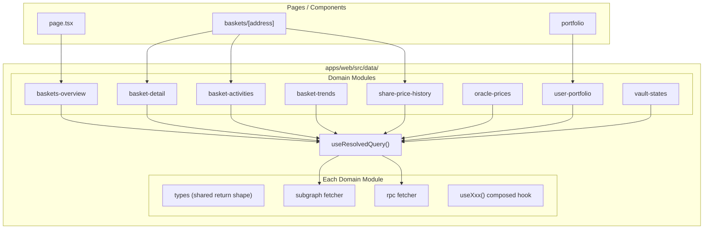

# Unified Subgraph / RPC Data Layer

## Problem

The fallback between subgraph and RPC is implemented differently in every place it appears:

- `**useBasketTrendSnapshots` / `useSharePriceHistory**` -- try-catch inside a single `queryFn` in [useSubgraphQueries.ts](apps/web/src/hooks/subgraph/useSubgraphQueries.ts)
- `**useOraclePriceHistory**` -- runs both hooks in parallel, picks winner via `shouldUseRpcFallback` boolean in [useOraclePriceHistory.ts](apps/web/src/hooks/useOraclePriceHistory.ts)
- **Home / Baskets list pages** -- compute `shouldUseRpcFallback` inline and conditionally map subgraph vs RPC data in [page.tsx](apps/web/src/app/page.tsx), baskets/page.tsx, dashboard/page.tsx, admin pages
- **Portfolio page** -- two parallel data paths (RPC `balanceOf` vs subgraph portfolio) with priority logic plus a separate `useUserCostBasisFallback` in [portfolio/page.tsx](apps/web/src/app/portfolio/page.tsx)
- **Basket detail history** -- `useVaultHistoryFallback` defined inline in the page file in [baskets/[address]/page.tsx](apps/web/src/app/baskets/[address]/page.tsx)
- **Some queries have no RPC fallback at all** (`useBasketsOverviewQuery`, `useBasketDetailQuery`, `useBasketActivitiesQuery`, `useVaultStatesQuery`)

This makes it hard to add, test, or swap data sources. Pages contain data-resolution logic that belongs in a data layer.

## Target Architecture




Each domain module exports:

- **Domain types** -- the canonical return shape (e.g. `BasketOverview[]`)
- `**subgraph(client, params)`** -- a pure async function that fetches from the subgraph and returns the domain type (or `null`)
- `**rpc(publicClient, contracts, params)`** -- a pure async function that fetches from RPC and returns the same domain type (or `null`)
- `**useXxx(params)`** -- a React hook that calls `useResolvedQuery` with both fetchers

## New File Structure

```
apps/web/src/data/
  types.ts                     -- DataSource, ResolvedResult<T>
  useResolvedQuery.ts          -- generic TanStack Query wrapper with fallback logic
  baskets-overview.ts          -- subgraph + rpc + useBasketsOverview()
  basket-detail.ts             -- subgraph + rpc + useBasketDetail()
  basket-activities.ts         -- subgraph + rpc + useBasketActivities()
  basket-trends.ts             -- subgraph + rpc + useBasketTrends()
  share-price-history.ts       -- subgraph + rpc + useSharePriceHistory()
  oracle-prices.ts             -- subgraph + rpc + useOraclePriceHistory()
  user-portfolio.ts            -- subgraph + rpc + useUserPortfolio()
  vault-states.ts              -- subgraph + rpc + useVaultStates()
```

## Core Abstraction: `useResolvedQuery`

The central piece is a generic hook in `data/useResolvedQuery.ts`:

```typescript
type DataSource = "subgraph" | "rpc" | "empty";

type ResolvedResult<T> = {
  data: T | null;
  source: DataSource;
  isLoading: boolean;
  error: Error | null;
};

type ResolvedQueryConfig<T> = {
  queryKey: unknown[];
  subgraphFn: (() => Promise<T | null>) | null;
  rpcFn: (() => Promise<T | null>) | null;
  enabled?: boolean;
  staleTime?: number;
  isEmpty?: (data: T) => boolean;
};

function useResolvedQuery<T>(config: ResolvedQueryConfig<T>): ResolvedResult<T>;
```

Orchestration logic (inside a single `useQuery`):

1. If `subgraphFn` is provided (subgraph enabled), call it
2. If result is non-null and not empty per `isEmpty`, return `{ data, source: "subgraph" }`
3. Otherwise (subgraph disabled, errored, or empty), call `rpcFn`
4. If RPC returns data, return `{ data, source: "rpc" }`
5. Otherwise return `{ data: null, source: "empty" }`

## Per-Domain Module Pattern

Each domain file follows the same structure. Example for `baskets-overview.ts`:

```typescript
// -- Types (re-exported, canonical shape) --
export type BasketOverview = { vault: Address; name: string; /* ... */ };

// -- Subgraph fetcher --
export async function fetchBasketsOverviewSubgraph(
  client: GraphQLClient, params: { first: number; skip: number }
): Promise<BasketOverview[] | null> { /* ... */ }

// -- RPC fetcher --
export async function fetchBasketsOverviewRpc(
  publicClient: PublicClient, contracts: ContractAddresses, params: { first: number; skip: number }
): Promise<BasketOverview[] | null> { /* ... */ }

// -- Composed hook --
export function useBasketsOverview(params?: { first?: number; skip?: number }): ResolvedResult<BasketOverview[]> {
  // wires subgraph client + publicClient + contracts into useResolvedQuery
}
```

RPC fetchers use the existing RPC hooks/patterns (`useBasketInfoBatch`, `useAllBaskets`, `getLogs`, etc.) extracted into pure async functions so they can be called from the resolver.

## Migration Plan

- Existing subgraph query logic from [useSubgraphQueries.ts](apps/web/src/hooks/subgraph/useSubgraphQueries.ts) moves into the `subgraph` fetchers of each domain module (types, raw-type parsing, and transforms stay)
- Existing RPC fallback code scattered across pages and hooks moves into the `rpc` fetchers
- Consumer pages stop computing `shouldUseRpcFallback` -- they just call `useBasketsOverview()` etc. and get a `ResolvedResult`
- The old `useSubgraphQueries.ts` and `useOraclePriceHistory.ts` files get replaced by re-exports from `data/` to avoid a big-bang migration (deprecated aliases)
- Page-local fallback hooks (`useVaultHistoryFallback`, `useUserCostBasisFallback`) move into the appropriate domain module as the `rpc` fetcher

## Key Decisions

- **One file per domain** (not separate subgraph/rpc files) keeps related code together while maintaining clear internal separation via named exports. Each fetcher is a standalone pure async function, independently testable.
- `**useResolvedQuery` owns the fallback logic** -- no page ever decides which source to use. Pages can read `source` from the result for UI hints (e.g. "data from RPC") but don't branch on it.
- **Subgraph client and RPC client are passed as closures** into `useResolvedQuery` so the resolver itself has no React hook dependencies -- it is a pure TanStack Query wrapper.
- **RPC fetchers that don't exist yet** (baskets overview, basket detail, activities, vault states) get stubs that call existing wagmi-based hooks converted to imperative `publicClient` calls. The user can flesh them out incrementally.
- `**useBasketDashboardData`** stays as a composition hook but switches to importing from `data/` modules instead of directly from `useSubgraphQueries`.

## What Changes in Consumer Pages

Before (home page):

```typescript
const subgraph = useBasketsOverviewQuery({ first: 200 });
const { data: baskets } = useAllBaskets();
const { data: basketInfos } = useBasketInfoBatch(vaultAddresses);
const shouldUseRpcFallback = !isSubgraphEnabled || subgraph.isError || ...;
const infos = shouldUseRpcFallback ? rpcInfos : subgraphData.map(...);
```

After:

```typescript
const { data: baskets, source, isLoading } = useBasketsOverview({ first: 200 });
// No fallback logic -- `baskets` is already resolved from the best available source
```

