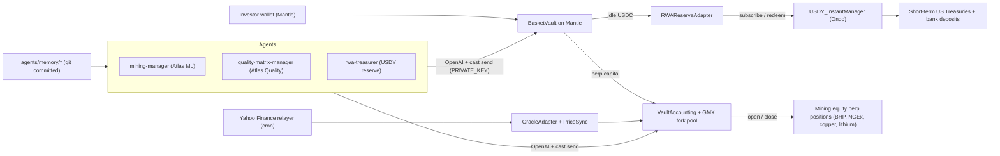

# Mantle Turing Test 2026 - AI x RWA Submission Plan

## One-line pitch

> IndexFlow is an autonomous AI portfolio manager for mining-equity RWA baskets on Mantle, where idle capital earns Ondo USDY treasury yield and OpenAI agents pick and trade the directional book on-chain.

## Why we win this track

The AI x RWA track scores on `RWA depth (60%)` + `Real-World Validity (40%)`. We hit both at once:

- **RWA collateral leg**: idle basket USDC parked in **USDY** (Ondo's treasury-backed yield token) via `USDY_InstantManager.subscribe/redeem`. This is the canonical Mantle RWA primitive (Mantle Showcase partner, `MIP-26` seed liquidity).
- **RWA price-exposure leg**: tokenized synthetic exposure to publicly-traded mining equities (BHP.AX, NGEx, copper / lithium / gold producers) priced via our Yahoo Finance custom oracle relayer + on-chain `OracleAdapter` already in [src/perp/OracleAdapter.sol](src/perp/OracleAdapter.sol).
- **AI autonomy**: two production OpenAI agents (`mining-manager` driven by Atlas ML, `quality-matrix-manager` driven by the analyst's 8-category Quality Matrix) already running on a GitHub Actions cron, signing real on-chain txs (`create_vault`, `wire_asset`, `set_vault_assets`, `allocate_to_perp`, `open_position`, `close_position`), with git-committed memory + `apps/web/public/agent-metadata/<vault>.json` for full audit trail. We add a third agent (`rwa-treasurer`) for the USDY reserve leg.
- **Live "Human vs AI" mechanic**: hackathon explicitly rewards this. We show three agent-managed vaults (mining-manager, quality-matrix-manager, rwa-treasurer) running side-by-side against a human-managed control basket on the same Mantle deployment.

## Architecture (target state)

## Concrete deliverables

### 1. Mantle Sepolia hub deployment

- Add `mantle-sepolia` entry to [config/chains.json](config/chains.json):
  - `chainId: 5003`, `ccipChainSelector: "8236463271206331221"`, `ccipRouter: "0xFd335f8f8B5A1Ab1B5b76b1c9A3b9b8b3B9b8f86"` (full address from CCIP directory), `linkToken: "0x22bd..."`, `role: "hub"`, `rpcAlias: "mantle_sepolia"`, `mockUsdc: true` for v1.
- Add `mantle_sepolia` and `mantle` entries to [foundry.toml](foundry.toml) `[rpc_endpoints]` and `[etherscan]` (use `https://api-sepolia.mantlescan.xyz/api`).
- Add `MANTLE_SEPOLIA_RPC_URL`, `MANTLESCAN_API_KEY` to [.env.example](.env.example).
- Run existing `Deploy.s.sol` against Mantle Sepolia (already config-driven, no Solidity changes needed for hub bring-up).
- Verify all contracts on Mantlescan (mandatory for the 20-Project Deployment Award).
- Update [apps/web/src/config/](apps/web/src/config/) target loading so `mantleSepolia` is the default deployment target in the UI.
- Update [apps/envio/config.yaml](apps/envio/config.yaml) to add Mantle Sepolia network so the indexer covers all events.

### 2. RWA reserve integration with USDY (technical centerpiece)

This is the highest-leverage new contract work. It directly addresses the track's `Depth of AI x RWA integration` scoring criterion.

- New contract `src/rwa/RWAReserveAdapter.sol` (~200 LOC) implementing:
  - `deposit(uint256 usdcAmount)` -> approve USDC to `USDY_InstantManager`, call `subscribe(usdc, usdcAmount)`, hold USDY balance.
  - `withdraw(uint256 usdcAmount)` -> compute USDY needed via `RWADynamicOracle.getPrice()`, approve, call `redeem(usdy, usdyAmount, usdc)`.
  - `getReserveValueUsdc()` view -> USDC balance + USDY balance valued at `RWADynamicOracle.getPrice()`. Used by `BasketVault` NAV.
  - On testnet: ship a `MockUSDYInstantManager` + `MockRWADynamicOracle` (linear yield curve, e.g. 5% APR) so the demo runs without Ondo's mainnet whitelist.
- Modify [src/vault/BasketVault.sol](src/vault/BasketVault.sol):
  - Add `setRWAAdapter(address)` admin call and `rwaTargetBps` (e.g. 7000 = 70% of idle USDC into USDY).
  - Extend `topUpReserve` and existing reserve accounting to call `RWAReserveAdapter.deposit/withdraw` to maintain `rwaTargetBps`.
  - Update NAV calculation to include `rwaAdapter.getReserveValueUsdc()` so investor shares accrue treasury yield.
  - Add `harvestRWAYield()` external for keepers / agents (no privilege required) which simply triggers a NAV refresh and emits an event.
- Foundry tests: `test/rwa/RWAReserveAdapter.t.sol` - subscribe/redeem round-trip, NAV accrual over simulated time, slippage guard, partial redemption when USDC liquidity insufficient.
- New keeper hook in [services/keeper/](services/keeper/) that runs `harvestRWAYield()` once per epoch on Mantle.

### 3. AI agents on Mantle + new "RWA treasurer" agent

- Wire the two production agents (`mining-manager`, `quality-matrix-manager`) to Mantle Sepolia by setting `RPC_URL=mantle_sepolia` and `DEPLOYMENT_CONFIG=apps/web/src/config/mantle-sepolia-deployment.json` in [.github/workflows/vault-agent.yml](.github/workflows/vault-agent.yml). The retired `vault-manager` agent stays excluded from the Mantle matrix.
- Add a new agent file [agents/rwa-treasurer.md](agents/rwa-treasurer.md) (~150 LOC of frontmatter + system prompt, fits the existing markdown-only agent framework documented in [docs/AGENTS_FRAMEWORK.md](docs/AGENTS_FRAMEWORK.md)):
  - Reads `RWADynamicOracle` price, target bps, current adapter holdings.
  - Decides whether to grow or shrink USDY reserve based on pending redemption pipeline (read from `Envio` GraphQL).
  - Calls `BasketVault.allocateToRWA / withdrawFromRWA`.
  - This is the AI agent that operates the RWA leg - explicitly addresses the "Intelligent RWA portfolio management agent" example direction in the track brief.
- Update [agents/quality-matrix-manager.md](agents/quality-matrix-manager.md) policy frontmatter to lower `autoAllocateTargetBps` from 5000 to 3000 since 70% of idle now flows to RWA reserve, not perp.

### 4. Frontend + demo polish

- Add Mantle Sepolia + Mantle mainnet to deployment target picker (`apps/web/src/config/networks.ts` + Privy supported chains).
- New page `/rwa` in the web app showing:
  - Live USDY reserve balance and accrued treasury yield per basket (read via Envio).
  - "AI Operator" badges on each basket card (already implemented via [apps/web/src/hooks/useAgentMetadata.ts](apps/web/src/hooks/useAgentMetadata.ts) - just need styling pass).
  - "Human vs AI" leaderboard: 3 agent vaults vs 1 human-controlled control basket, NAV chart over hackathon period.
- Hero section update on landing page calling out Mantle + RWA framing.
- Privy: confirm Mantle wallet `wallet_addEthereumChain` payload is correct for both 5003 and 5000.

### 5. Submission package

Per DoraHacks requirements + 20-Project Deployment Award checklist:

- Open-source repo (already public).
- One-line pitch (drafted above).
- Demo video >= 2 minutes: agent invokes `subscribe` -> USDY appears in adapter -> investor deposits -> share NAV reflects yield -> agent opens mining-equity perp -> live PnL on `/dashboard`.
- Publicly accessible frontend: deploy `apps/web` to Vercel under `indexflow-mantle.vercel.app`.
- All Mantle contract addresses documented in [docs/DEPLOYMENTS.md](docs/DEPLOYMENTS.md).
- Verified on Mantlescan (every contract).
- DoraHacks BUIDL submission with: tracks `AI x RWA` (primary, nominated for Grand Champion) + `Best UI/UX` (secondary).
- Twitter / X post for Community Voting eligibility.
- One-page submission writeup in [growth/grants/mantle-turing-test-submission.md](growth/grants/mantle-turing-test-submission.md) covering: real-world asset (mining equities + US treasuries), AI's role (autonomous portfolio + RWA reserve management), Mantle realization (CCIP, Ondo USDY, native deployment).

## Submission strengthening additions

These additions target specific scoring criteria and sponsor relationships that the base plan does not yet address. Each one is independently shippable and can be cut in reverse order if scope tightens.

### 6. ERC-8004-style agent identity NFTs

The competing reference project (MantleFlow AI) leans on ERC-8004 agent identity for portable on-chain reputation. We get a stronger version of this for free because we already have two production agents with persistent memory and are adding a third.

- New contract `src/agents/AgentIdentity8004.sol` - soulbound ERC-721 minted once per agent on Mantle. Token metadata includes: agent name, system-prompt hash (so judges can verify the agent has not been silently swapped mid-hackathon), creation block, and a `decisionsLogged` counter that increments via `AgentDecisionLog` (see below).
- `agent-runner.mjs` mints on first run, persists `tokenId` into [agents/memory//state.json](agents/memory), and includes the tokenId on every subsequent on-chain write.
- Submission narrative: "Every agent has a permanent on-chain identity with a verifiable 23-day track record before the deadline."

### 7. On-chain agent decision log

Today, agent decisions are committed to git. Stronger story: mirror the rationale hash on-chain, satisfying the hackathon's "AI-callable on-chain function" requirement in the most literal way.

- New contract `src/agents/AgentDecisionLog.sol`. Public function `logDecision(uint256 agentTokenId, bytes4 actionSelector, address targetVault, bytes32 paramsHash, bytes32 rationaleHash, string calldata rationaleUri)`.
- `rationaleHash = keccak256(llmReasoning)`; `rationaleUri` points to the full reasoning published to GitHub (where the agent memory commit already lives).
- Modify [scripts/agent-runner.mjs](scripts/agent-runner.mjs) so each `cast send` for `open_position` / `close_position` / `allocate_to_perp` / `allocate_to_rwa` is preceded by a `logDecision` call in the same epoch.
- Frontend: surface the decision log as a per-vault "Agent Decisions" tab on `/baskets/[address]` with linked tx + rationale.

### 8. Compliance awareness layer

The AI x RWA scoring rubric explicitly weights "compliance awareness". Address it head-on:

- New contract `src/compliance/ComplianceGate.sol` (configurable allowlist + sanctions blocklist). Default deployment uses a minimal stub; production swap target is Chainalysis Sanctions Oracle on Mantle mainnet.
- Modify [src/vault/BasketVault.sol](src/vault/BasketVault.sol) `deposit()` to consult `complianceGate.isAllowed(msg.sender, depositor)` (gated only when set; address(0) = bypass for backwards compatibility).
- Frontend geo-blocking middleware in [apps/web/middleware.ts](apps/web/middleware.ts) for U.S. and OFAC-sanctioned IPs (Vercel `request.geo`).
- New `/compliance` page documenting RWA risk disclosures, USDY redemption mechanics, and operator obligations.

### 9. mUSD support for stable-share baskets

The Ondo integration is even stronger if we also support mUSD (the rebasing $1-pegged version of USDY). Lets us tell two RWA stories with one adapter.

- Extend `RWAReserveAdapter` with `reserveToken` enum (`USDY` accumulating | `mUSD` rebasing).
- Per-basket `reserveTokenChoice` set at basket creation; risk-averse baskets get $1-stable shares with yield distributed via additional share mints, yield-seeking baskets get accumulating USDY.
- Tests: round-trip wrap/unwrap between USDY and mUSD via `wrap` / `unwrap` on the rUSD contract documented in Ondo's Mantle integration guide.

### 10. Sponsor data integrations (Bybit + Nansen)

Hackathon explicitly mentions Bybit API and Nansen API as available sponsor resources. Wiring them as agent inputs raises the "data source quality" subscore (Alpha & Data, which we cross-nominate) and signals deeper ecosystem fit.

- New MCP server `apps/mcps/bybit` exposing read-only `bybit_perp_quote` (price + OI + funding) for cross-venue spread monitoring.
- New MCP server `apps/mcps/nansen` exposing `nansen_smart_money_flow` for Mantle ecosystem tokens.
- Add both to the optional `mcpServers` list in [agents/mining-manager.md](agents/mining-manager.md) and [agents/quality-matrix-manager.md](agents/quality-matrix-manager.md). Agents can ignore them by default; sponsor judges see we wired them.

### 11. Z.AI as alternative LLM provider

Z.AI is in the sponsor list and the runner is already OpenAI-compatible (`LLM_BASE_URL`). One-line proof point.

- Add `docs/AGENT_LLM_PROVIDERS.md` documenting OpenAI / Z.AI / any OpenAI-compatible endpoint as drop-in choices.
- Add a `--matrix.llm: zai` axis to [.github/workflows/vault-agent.yml](.github/workflows/vault-agent.yml) so the cron runs at least one of the 4 agents on Z.AI infrastructure for the duration of the hackathon, with the run URL linked from the submission writeup.

### 12. Telegram bot for shareability + Alpha & Data crossover

Community Voting and Best UI/UX both reward shareability. The AI Alpha & Data track explicitly calls out Telegram and Discord bots. Cheap to ship and doubles as marketing.

- New service `apps/telegram-bot` (Node, deployable to Cloud Run alongside the existing push-worker).
- Subscribes to `AgentDecisionLog.DecisionLogged` events via Envio GraphQL subscription (no extra RPC infra).
- Posts every agent decision to a public `@indexflow_mantle` channel: action, vault, asset, rationale snippet, Mantlescan tx link.
- Submission writeup: "Every autonomous decision is broadcast in real time to a public Telegram channel. Judges, investors, and the community get the same feed."

### 13. Public Human-vs-AI leaderboard with backtest replay

The hackathon's "Human vs AI mechanism" wording is unusually explicit. Build the artifact that explicitly demonstrates it.

- New page `/leaderboard` showing live NAV and cumulative return for the 3 agent vaults vs 1 human-managed control basket on the same Mantle deployment, refreshed via Envio.
- Below the live chart, a backtest replay using 90 days of historical Atlas Quality Matrix data (already in [apps/mcps/atlas-quality/scoring/matrix.json](apps/mcps/atlas-quality/scoring/matrix.json)) so judges can verify Strategy Alpha without waiting for live hackathon-period returns.
- Embed the chart in the demo video and the DoraHacks submission.

### 14. Dedicated Mantle landing surface

Judges will spend less than two minutes on the landing page. Optimize specifically for them.

- New page `apps/web/src/app/mantle/page.tsx` - one-screen hero pitch: tagline, Mantle network badge, demo video embed, deployed contract addresses with Mantlescan links, three agent vault cards (with live NAV + agent identity tokenId), CTA to `/leaderboard`.
- Reframe the first three paragraphs of [README.md](README.md) so "IndexFlow on Mantle - AI x RWA" is what a judge sees first; the existing GMX-fork architectural detail moves below the fold.

## Files we're touching (high-level)

- New: `src/rwa/RWAReserveAdapter.sol`, `src/rwa/MockUSDYInstantManager.sol`, `src/rwa/MockRWADynamicOracle.sol`, `src/agents/AgentIdentity8004.sol`, `src/agents/AgentDecisionLog.sol`, `src/compliance/ComplianceGate.sol`, `agents/rwa-treasurer.md`, `apps/web/src/app/rwa/page.tsx`, `apps/web/src/app/leaderboard/page.tsx`, `apps/web/src/app/compliance/page.tsx`, `apps/web/src/app/mantle/page.tsx`, `apps/web/middleware.ts`, `apps/mcps/bybit/`, `apps/mcps/nansen/`, `apps/telegram-bot/`, `docs/AGENT_LLM_PROVIDERS.md`, `growth/grants/mantle-turing-test-submission.md`.
- Modified: [config/chains.json](config/chains.json), [foundry.toml](foundry.toml), [.env.example](.env.example), [src/vault/BasketVault.sol](src/vault/BasketVault.sol), [script/Deploy.s.sol](script/Deploy.s.sol) (USDY adapter + identity + decision-log wiring on hub only), [scripts/agent-runner.mjs](scripts/agent-runner.mjs), [services/keeper/](services/keeper/), [.github/workflows/vault-agent.yml](.github/workflows/vault-agent.yml), [apps/envio/config.yaml](apps/envio/config.yaml), [apps/web/src/config/networks.ts](apps/web/src/config/networks.ts), [agents/mining-manager.md](agents/mining-manager.md), [agents/quality-matrix-manager.md](agents/quality-matrix-manager.md), [docs/DEPLOYMENTS.md](docs/DEPLOYMENTS.md), [README.md](README.md), [CHANGELOG.md](CHANGELOG.md).

## Risk / contingency

- **Ondo whitelist on testnet** is unclear. We mitigate by shipping fully-functional mocks that match the `USDY_InstantManager` and `RWADynamicOracle` ABIs, so a `mantle-mainnet` flip is a single-config swap of the adapter target. Demo video uses testnet (mocks); the README + writeup explicitly notes the mainnet swap path.
- **CCIP fees** on Mantle Sepolia require LINK or WMNT. Fund the keeper wallet with at least 50 LINK on Mantle Sepolia from the Chainlink faucet ahead of CCIP demo flows.
- **Agent budget**: each agent run costs roughly 5-15 cents on `gpt-4o`; 23 days x 24 runs/day x 3 agents (mining-manager + quality-matrix-manager + rwa-treasurer) x 0.10 ~= $165. Account for this in `LLM_API_KEY` budget or downgrade `rwa-treasurer` to `gpt-4o-mini`.
- **Scope creep cut order** (reverse priority - drop bottom first if scope tightens):
  1. Z.AI alternative LLM provider matrix run
  2. Telegram bot service
  3. Bybit + Nansen MCP servers
  4. mUSD support (keep USDY-only)
  5. Compliance layer (ship stub allowlist contract only, defer geo-blocking)
  6. ERC-8004 identity NFTs (decision log alone is still strong)
  7. `/rwa` page styling (fold into existing dashboard)
  8. `rwa-treasurer` agent (use simple keeper rebalance)
- **Never drop**: Mantle Sepolia hub deploy, RWAReserveAdapter, AgentDecisionLog, Human-vs-AI leaderboard, demo video, verified Mantlescan contracts, DoraHacks BUIDL submission.

