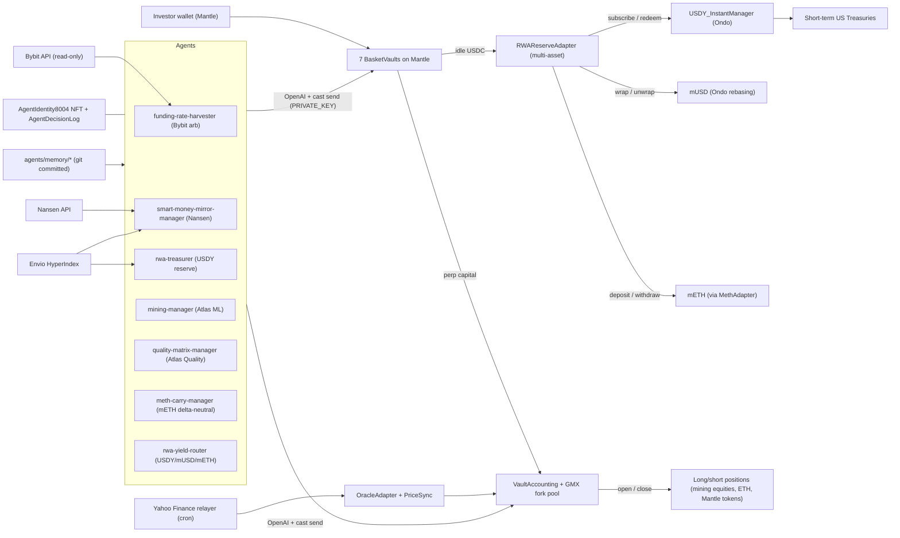

---

name: mantle-rwa-hackathon
overview: "Pitch IndexFlow as an autonomous AI portfolio manager running a fleet of 7 AI-managed vaults on Mantle: two existing mining-equity vaults (mining-manager + quality-matrix-manager) plus five new agents — rwa-treasurer (USDY reserve), meth-carry-manager (mETH delta-neutral carry), rwa-yield-router (USDY/mUSD/mETH yield rotation), funding-rate-harvester (Bybit + internal perp funding arb), and smart-money-mirror-manager (Nansen + anomaly-driven Mantle token basket). Cross-nominates AI x RWA (primary, Mantle-sponsored), AI Trading & Strategy (BGA, Bybit-anchored), and AI Alpha & Data (Mirana, Nansen-anchored). Stretch: Grand Champion + 20-Project Deployment Award + Best UI/UX + Community Voting."
todos:

- id: mantle-hub-deploy
content: Add Mantle Sepolia (chainId 5003, CCIP router/selector) to config/chains.json + foundry.toml + .env.example, run Deploy.s.sol against Mantle, verify every contract on Mantlescan, write apps/web/src/config/mantle-sepolia-deployment.json
status: pending
- id: rwa-adapter-contract
content: Build multi-asset RWAReserveAdapter.sol supporting USDY, mUSD, and mETH as interchangeable reserve tokens (per-basket setReserveToken admin call). All pricing flows through the existing IndexFlow OracleAdapter via two new CustomRelayer asset ids (USDY-USDC, METH-USDC) that the keeper sources from real Ondo and Mantle mainnet contracts via mainnet RPC. Testnet mocks (MockUSDY/MockMUSD/MockMETH, plus MockUSDYInstantManager + MockMUSDWrapper) are plain mintable ERC20s with NO mock prices and NO mock yield curves — only the token contracts themselves are mocked, prices always come from real off-chain data. Foundry tests cover each subscribe/redeem round-trip, NAV accrual, and reserve-token rotation
status: pending
- id: meth-adapter-contract
content: Build MethAdapter.sol — thin wrapper exposing deposit(usdc) -> mETH (internal USDC->WETH swap + mETH wrap) and withdraw(usdc) (mETH unwrap -> WETH -> USDC swap) with slippage guard. Testnet wires to MockMETH; mainnet wires to Mantle's mETH contract. Used by meth-carry-manager vault and as a rotation target for rwa-yield-router
status: pending
- id: mantle-dex-twap-oracle
content: Build a Mantle DEX TWAP relayer (services/keeper/src/mantle-dex-twap.ts or similar) that reads recent swap events from major Mantle DEX pools (Merchant Moe / Agni / FusionX) and posts 5-minute TWAPs for Mantle ecosystem tokens (WMNT, COOK, USDe, others) into the existing on-chain OracleAdapter so the perp engine can price them. Pairs with a small symbol registry doc listing which Mantle tokens are tradable. Required for the smart-money-mirror-manager agent to open perp positions on Mantle ecosystem tokens (rather than building a separate spot DEX execution path)
status: pending
- id: vault-rwa-integration
content: Modify BasketVault.sol to add setRWAAdapter / rwaTargetBps, route idle USDC through the adapter, include adapter holdings (valued via dynamic oracle) in NAV, expose harvestRWAYield(); update Deploy.s.sol to wire adapter on the Mantle hub only
status: pending
- id: agents-on-mantle
content: Point production mining-manager and quality-matrix-manager agents at Mantle Sepolia in .github/workflows/vault-agent.yml; lower quality-matrix-manager autoAllocateTargetBps to 3000 to make room for RWA reserve
status: pending
- id: agent-rwa-treasurer
content: Author agents/rwa-treasurer.md — non-trading agent that reads pending redemption queue from Envio + current USDY adapter holdings, rebalances reserve to rwaTargetBps via allocateToRWA / withdrawFromRWA; writeTools limited to reserve calls only (no perp); model gpt-4o-mini for cost
status: pending
- id: agent-meth-carry
content: Author agents/meth-carry-manager.md — holds mETH as base reserve, opens an ETH short on internal perp sized to a target hedge ratio (default 1.0x, agent may flex 0.85x–1.05x), rebalances hedge when mETH/ETH drifts > 50bps or funding flips by > 100bps annualized; writeTools include allocate_to_perp, open_position, close_position scoped to ETH only
status: pending
- id: agent-rwa-yield-router
content: Author agents/rwa-yield-router.md — reads net yield + redemption-queue depth across USDY / mUSD / mETH; rotates the per-basket reserve target token via a single setReserveToken admin call on the multi-asset RWAReserveAdapter; capped at one rotation per 24h to avoid churn; writeTools limited to set_reserve_token + rebalance_reserve
status: pending
- id: agent-funding-harvester
content: Author agents/funding-rate-harvester.md — reads funding rates from internal VaultAccounting (current epoch) + Bybit perp (via bybit-mcp); opens delta-neutral pair (long on cheap-funding venue, short on expensive) when annualized spread > 8%; for v1 execution stays on internal perp only and Bybit is read-only sentiment; writeTools include open_position, close_position
status: pending
- id: agent-smart-money-mirror
content: Author agents/smart-money-mirror-manager.md — pulls Nansen smart-money flows for Mantle ecosystem tokens (via nansen-mcp) + on-chain anomaly signals from Envio (large swaps, whale outflows); builds a 5–8 asset Mantle token basket weighted by smart-money confidence; opens PERP positions priced via the new Mantle DEX TWAP oracle (NOT spot DEX execution — vault primitive stays USDC + synthetic perp throughout); rebalances weekly; if NANSEN_API_KEY unset, falls back to Envio-only anomaly detection
status: pending
- id: envio-mantle
content: Add Mantle Sepolia to apps/envio/config.yaml so the multichain indexer ingests BasketVault + VaultAccounting + RWAReserveAdapter events on the new hub
status: pending
- id: frontend-mantle-rwa
content: Add Mantle Sepolia + Mantle mainnet to apps/web/src/config/networks.ts and Privy chain list, build /rwa page showing per-basket reserve token (USDY/mUSD/mETH) + accrued yield, and the /fleet page covering all 7 AI-managed vaults
status: pending
- id: demo-deploy
content: Deploy apps/web to Vercel as the public submission URL, smoke-test the full investor flow on Mantle Sepolia for all 7 vaults (deposit -> NAV updates with reserve-token yield -> agent action -> redeem)
status: pending
- id: submission-package
content: Record demo video (>=2 min) walking through all 7 vaults and at least one trade per agent (mining-equity long, mETH carry rebalance, funding-rate arb open, smart-money rotation, RWA yield rotation). Write growth/grants/mantle-turing-test-submission.md with one-line pitch + multi-track framing. Update README + CHANGELOG + docs/DEPLOYMENTS.md. Submit BUIDL on DoraHacks nominated to AI x RWA (primary) + AI Trading & Strategy (secondary, BGA) + AI Alpha & Data (secondary, Mirana) + Best UI/UX. Post X teaser for community voting
status: pending
- id: erc8004-agent-identity
content: Build AgentIdentity8004.sol (ERC-8004-style soulbound NFT minted per agent on Mantle), have agent-runner.mjs mint on first run and write the tokenId into agents/memory//state.json so every subsequent decision references a permanent on-chain identity
status: pending
- id: agent-decision-log
content: Build AgentDecisionLog.sol where every agent write tool (open_position, close_position, allocate_to_perp, allocate_to_rwa) emits a DecisionLogged event carrying the agent tokenId, action selector, target vault, params hash, and keccak256 of the LLM rationale; wire this into agent-runner.mjs so the rationale hash is committed before/with the on-chain action
status: pending
- id: compliance-layer
content: Add OFAC / sanctions wallet screening hook in BasketVault.deposit (configurable allowlist contract IComplianceGate), frontend geo-blocking middleware in apps/web for U.S. + OFAC-sanctioned jurisdictions, and a /compliance page documenting RWA risk disclosures - directly addresses the AI x RWA track 'compliance awareness' scoring criterion
status: pending
- id: bybit-mcp
content: Build apps/mcps/bybit — read-only Bybit perp MCP server exposing bybit_perp_quote (price + OI + 8h funding) and bybit_funding_history. Required dependency for the funding-rate-harvester agent. Env keys BYBIT_API_KEY + BYBIT_API_SECRET; defaults to testnet endpoint
status: pending
- id: nansen-mcp
content: Build apps/mcps/nansen — Nansen MCP server exposing nansen_smart_money_holdings({chain: mantle}) and nansen_token_anomaly({token, lookbackHours}). Required dependency for the smart-money-mirror-manager agent. Env key NANSEN_API_KEY. If unset, server returns synthetic responses sourced from Envio Mantle swap events (degraded fallback)
status: pending
- id: zai-llm-provider
content: Document and smoke-test Z.AI as an alternative LLM_BASE_URL since the runner is already OpenAI-compatible; ship a docs/AGENT_LLM_PROVIDERS.md note + a single CI matrix run pointed at Z.AI to demonstrate sponsor-stack flexibility
status: pending
- id: telegram-bot
content: Add apps/telegram-bot service that subscribes to AgentDecisionLog events (via Envio GraphQL subscription) and posts every agent decision to a public @indexflow_mantle channel with the LLM rationale + tx link, giving us an Alpha & Data crossover plus a shareability surface for Community Voting
status: pending
- id: vault-fleet-leaderboard
content: Build a public /fleet page showing live NAV + cumulative return for all 7 AI-managed vaults side-by-side, with per-vault agent identity tokenIds (ERC-8004) and a link to the on-chain decision log. No human-control basket — the cross-vault comparison IS the story. Includes a 'replay' chart of historical Atlas Quality Matrix backtests (last 90 days) so judges can verify Strategy Alpha without waiting for hackathon-period live runs
status: pending
- id: mantle-landing-readme
content: Carve out a dedicated apps/web/src/app/mantle/page.tsx hero landing optimized for hackathon judges (one-screen pitch, deployed addresses, agent vault links, demo video embed) and reframe the top of README.md so 'IndexFlow on Mantle - AI x RWA' is the first thing a judge reads
status: pending
isProject: false

---

# Mantle Turing Test 2026 - Multi-Track Submission Plan

## One-line pitch

> IndexFlow ships seven AI-managed vaults on Mantle in a single deployment — mining-equity RWA baskets, an mETH delta-neutral carry, a USDY-treasury reserve, a multi-token RWA yield router, a Bybit funding-rate harvester, and a Nansen smart-money mirror — each driven by its own OpenAI agent with a permanent on-chain identity and decision log.

## Vault roster (7 vaults, 7 agents, 1 Mantle deployment)

| #   | Vault                       | Agent                        | Primary track               | What the AI does                                  |
| --- | --------------------------- | ---------------------------- | --------------------------- | ------------------------------------------------- |
| 1   | Minestarters ML Picks       | `mining-manager`             | AI x RWA                    | Atlas ML long/short of mining equities            |
| 2   | Minestarters Quality Matrix | `quality-matrix-manager`     | AI x RWA                    | 8-category quality scoring of mining equities     |
| 3   | USDY Treasurer              | `rwa-treasurer`              | AI x RWA                    | Rebalances USDY reserve to target bps             |
| 4   | mETH Delta-Neutral Carry    | `meth-carry-manager`         | AI x RWA                    | Holds mETH, shorts ETH, manages hedge ratio       |
| 5   | RWA Yield Router            | `rwa-yield-router`           | AI x RWA                    | Rotates reserve across USDY / mUSD / mETH         |
| 6   | Funding-Rate Harvester      | `funding-rate-harvester`     | AI Trading & Strategy (BGA) | Delta-neutral funding arb: internal perp vs Bybit |
| 7   | Smart-Money Mirror          | `smart-money-mirror-manager` | AI Alpha & Data (Mirana)    | Nansen + Envio anomaly-driven Mantle token basket |

## What IndexFlow does today (anchor for primitive decisions)

A `BasketVault` holds USDC and opens **synthetic long/short perp positions** on whatever symbols are wired into the on-chain `OracleAdapter`. The vault never holds the underlying asset. Today the oracle is fed exclusively by the Yahoo Finance custom relayer, so the tradable universe is "any global equity ticker or ETF Yahoo can price". PnL settles in USDC. The two existing agents trade mining-equity baskets against this primitive.

## Primitives we're adding for this submission

To support the 7-vault fleet, three new primitives are introduced. Each one is a deliberate addition with a track-scoring justification — nothing is added just because we can.

| Primitive                                                    | What it adds                                                                                                                                                   | Tracks it unlocks                                                                                                           | Vaults that need it                                 |
| ------------------------------------------------------------ | -------------------------------------------------------------------------------------------------------------------------------------------------------------- | --------------------------------------------------------------------------------------------------------------------------- | --------------------------------------------------- |
| Multi-asset `RWAReserveAdapter` (USDY / mUSD / mETH custody) | Vault balance sheet can hold real-world-asset tokens, not just USDC + synthetic perp                                                                           | AI x RWA (the centerpiece). Without this we are not eligible for the RWA-depth scoring weight                               | rwa-treasurer, meth-carry-manager, rwa-yield-router |
| Mantle DEX TWAP relayer (additional oracle source)           | The existing `OracleAdapter` can also price Mantle ecosystem tokens (WMNT, COOK, USDe, etc.) via 5-minute TWAPs from Merchant Moe / Agni / FusionX swap events | AI Alpha & Data (Mirana) — lets us trade the smart-money basket as synthetic perps without adding a spot DEX execution path | smart-money-mirror-manager                          |
| Bybit MCP server (read-only sentiment)                       | Agents can see cross-venue funding + OI from a major centralised perp venue                                                                                    | AI Trading & Strategy (BGA, Bybit is named in the brief)                                                                    | funding-rate-harvester                              |

**Explicitly NOT added** (keeps the vault primitive consistent):

- No spot DEX execution adapter — smart-money-mirror trades synthetic perps priced via the new Mantle DEX TWAP oracle, same as every other vault.
- No Bybit execution venue (v1) — Bybit is read-only sentiment for funding-rate-harvester. v2 stretch: Byreal Perps CLI execution if scope allows (would also unlock the Agentic Wallets track).
- No new vault accounting path — every vault still holds USDC as the share-redemption asset; the RWA adapter sits behind `BasketVault.reserveBalance()` so NAV math is unchanged from the investor's perspective.

## Why we win this — cross-track strategy

We nominate to three tracks at once. Each track's primary scoring criterion is hit by a dedicated vault, and all 7 vaults share the same Mantle deployment, the same agent-runner framework, the same on-chain decision log, and the same UI surface.

- **AI x RWA (primary, 60% RWA-depth + 40% Real-World Validity)**: Five of seven vaults touch real-world assets — two carry tokenized mining-equity exposure (via the Yahoo Finance custom oracle relayer + on-chain `OracleAdapter` in [src/perp/OracleAdapter.sol](src/perp/OracleAdapter.sol)), and three sit on Mantle's native RWA primitives directly (USDY, mUSD, mETH). The "Intelligent RWA portfolio management agent" example direction in the track brief is satisfied four times over.
- **AI Trading & Strategy (BGA-sponsored)**: Vault 6 explicitly uses the Bybit API (named in the sponsor brief) for cross-venue funding signals, produces verifiable on-chain Alpha receipts via the decision log, and runs delta-neutral so judges can compute a Sharpe from the on-chain history alone.
- **AI Alpha & Data (Mirana-sponsored)**: Vault 7 pairs Nansen smart-money signals with on-chain anomaly detection from Envio, with a Telegram broadcast bot publishing every decision to `@indexflow_mantle` — the Track 2 brief's exact wording.
- **Grand Champion contender**: Submissions are nominated from at least one track; the rubric explicitly rewards ecosystem breadth and "AI × on-chain integration" depth (30% weight). Seven on-chain agents, each with an ERC-8004 identity and a public rationale hash per write, hits both.
- **AI autonomy**: two production OpenAI agents (`mining-manager` driven by Atlas ML, `quality-matrix-manager` driven by the analyst's 8-category Quality Matrix) are already running on a GitHub Actions cron, signing real on-chain txs (`create_vault`, `wire_asset`, `set_vault_assets`, `allocate_to_perp`, `open_position`, `close_position`), with git-committed memory + `apps/web/public/agent-metadata/<vault>.json` for full audit trail. The five new agents reuse the exact same runner + memory + risk-officer second-pass pipeline.

## Architecture (target state)

## Concrete deliverables

### 1. Mantle Sepolia hub deployment

- Add `mantle-sepolia` entry to [config/chains.json](config/chains.json):
  - `chainId: 5003`, `ccipChainSelector: "8236463271206331221"`, `ccipRouter: "0xFd335f8f8B5A1Ab1B5b76b1c9A3b9b8b3B9b8f86"` (full address from CCIP directory), `linkToken: "0x22bd..."`, `role: "hub"`, `rpcAlias: "mantle_sepolia"`, `mockUsdc: true` for v1.
- Add `mantle_sepolia` and `mantle` entries to [foundry.toml](foundry.toml) `[rpc_endpoints]` and `[etherscan]` (use `https://api-sepolia.mantlescan.xyz/api`).
- Add `MANTLE_SEPOLIA_RPC_URL`, `MANTLESCAN_API_KEY` to [.env.example](.env.example).
- Run existing `Deploy.s.sol` against Mantle Sepolia (already config-driven, no Solidity changes needed for hub bring-up).
- Verify all contracts on Mantlescan (mandatory for the 20-Project Deployment Award).
- Update [apps/web/src/config/](apps/web/src/config/) target loading so `mantleSepolia` is the default deployment target in the UI.
- Update [apps/envio/config.yaml](apps/envio/config.yaml) to add Mantle Sepolia network so the indexer covers all events.

### 2. RWA reserve integration with USDY (technical centerpiece)

This is the highest-leverage new contract work. It directly addresses the track's `Depth of AI x RWA integration` scoring criterion.

- New contract `src/rwa/RWAReserveAdapter.sol` (~200 LOC) implementing:
  - `deposit(uint256 usdcAmount)` -> approve USDC to `USDY_InstantManager`, call `subscribe(usdc, usdcAmount)`, hold USDY balance.
  - `withdraw(uint256 usdcAmount)` -> compute USDY needed by reading the USDY-USDC price from the existing IndexFlow `OracleAdapter`, approve, call `redeem(usdy, usdyAmount, usdc)`.
  - `getReserveValueUsdc()` view -> USDC balance + USDY balance valued at the OracleAdapter's USDY-USDC price (CustomRelayer-fed by the keeper from Ondo mainnet `RWADynamicOracle.getPrice()` via mainnet RPC). Used by `BasketVault` NAV.
  - On testnet: ship a `MockUSDYInstantManager` + `MockUSDY` (plain mintable ERC20) so the demo runs without Ondo's mainnet whitelist. The MockUSDYInstantManager reads the USDY-USDC price from the same `OracleAdapter` the rest of the system uses — there are NO mocked prices anywhere. Yield surfaces only through the keeper-posted price growth, which mirrors Ondo's real mainnet accrual.
- Modify [src/vault/BasketVault.sol](src/vault/BasketVault.sol):
  - Add `setRWAAdapter(address)` admin call and `rwaTargetBps` (e.g. 7000 = 70% of idle USDC into USDY).
  - Extend `topUpReserve` and existing reserve accounting to call `RWAReserveAdapter.deposit/withdraw` to maintain `rwaTargetBps`.
  - Update NAV calculation to include `rwaAdapter.getReserveValueUsdc()` so investor shares accrue treasury yield.
  - Add `harvestRWAYield()` external for keepers / agents (no privilege required) which simply triggers a NAV refresh and emits an event.
- Foundry tests: `test/rwa/RWAReserveAdapter.t.sol` - subscribe/redeem round-trip, NAV accrual over simulated time, slippage guard, partial redemption when USDC liquidity insufficient.
- New keeper hook in [services/keeper/](services/keeper/) that runs `harvestRWAYield()` once per epoch on Mantle.

### 3. The 7-agent fleet on Mantle

Two existing agents relocate; five new agents are authored as markdown-only system-prompt files using the same framework documented in [docs/AGENTS_FRAMEWORK.md](docs/AGENTS_FRAMEWORK.md). All seven share the same `agent-runner.mjs`, the same risk-officer second-pass review, the same memory model, and the same ERC-8004 identity + decision-log wiring.

**Existing agents — relocated**

- [agents/mining-manager.md](agents/mining-manager.md) and [agents/quality-matrix-manager.md](agents/quality-matrix-manager.md): point at Mantle Sepolia by setting `RPC_URL=mantle_sepolia` and `DEPLOYMENT_CONFIG=apps/web/src/config/mantle-sepolia-deployment.json` in [.github/workflows/vault-agent.yml](.github/workflows/vault-agent.yml). The retired `vault-manager` agent stays excluded from the Mantle matrix.
- Lower `quality-matrix-manager.autoAllocateTargetBps` from 5000 to 3000 so 70% of idle flows to RWA reserve, not perp.

**New agents**

- [agents/rwa-treasurer.md](agents/rwa-treasurer.md): non-trading agent. Reads `RWADynamicOracle.getPrice()`, current reserve target bps, pending redemption queue from Envio. Decides whether to grow/shrink the USDY reserve via `BasketVault.allocateToRWA / withdrawFromRWA`. Hits the track brief's "Intelligent RWA portfolio management agent" example direction directly. Model `gpt-4o-mini` for cost.
- [agents/meth-carry-manager.md](agents/meth-carry-manager.md): manages a delta-neutral mETH carry book. Holds mETH as reserve via `MethAdapter`, opens an ETH short on internal perp sized to a target hedge ratio (default 1.0x, agent may flex 0.85x–1.05x), rebalances when mETH/ETH drifts > 50bps or funding flips by > 100bps annualized. `writeTools` scoped to ETH symbol only.
- [agents/rwa-yield-router.md](agents/rwa-yield-router.md): reads net yield + redemption-queue depth across USDY / mUSD / mETH from the multi-asset `RWAReserveAdapter`. Calls `setReserveToken` (per-basket) to rotate the basket's reserve into the best-net-yield primitive. Capped at one rotation per 24h to avoid churn. Hits the "RWA yield aggregator" example direction in the track brief.
- [agents/funding-rate-harvester.md](agents/funding-rate-harvester.md): reads funding rates from internal `VaultAccounting` (current epoch) + Bybit perp (via the new `apps/mcps/bybit` server); opens a delta-neutral pair (long on cheap-funding venue, short on expensive) when annualized spread > 8%. For v1, **execution stays on the internal perp only**; Bybit is read-only sentiment. v2 stretch: Bybit execution via Byreal Perps CLI (would also unlock the Agentic Wallets track).
- [agents/smart-money-mirror-manager.md](agents/smart-money-mirror-manager.md): pulls Nansen smart-money holdings on Mantle ecosystem tokens (via `apps/mcps/nansen`) + on-chain anomaly signals from Envio (large swaps, whale outflows on Mantle DEXs). Builds a 5–8 asset Mantle token basket weighted by smart-money confidence, rebalances weekly. If `NANSEN_API_KEY` is unset, the MCP server returns a degraded Envio-only fallback and the agent runs with reduced confidence weights.

### 4. Frontend + demo polish

- Add Mantle Sepolia + Mantle mainnet to deployment target picker (`apps/web/src/config/networks.ts` + Privy supported chains).
- New page `/rwa` showing per-basket reserve token (USDY / mUSD / mETH) + accrued yield (read via Envio).
- New page `/fleet` showing all 7 AI-managed vaults side-by-side: live NAV, cumulative return, per-vault agent identity tokenId (ERC-8004), link to the on-chain decision log. The cross-vault comparison IS the story — no separate human-control basket.
- Existing "AI Operator" badges on each basket card (already implemented via [apps/web/src/hooks/useAgentMetadata.ts](apps/web/src/hooks/useAgentMetadata.ts)) get a styling pass + per-agent variant (Atlas ML / Quality Matrix / USDY Treasurer / mETH Carry / Yield Router / Funding Arb / Smart Money).
- Hero section update on landing page calling out the seven-vault Mantle deployment + three sponsor tracks.
- Privy: confirm Mantle wallet `wallet_addEthereumChain` payload is correct for both 5003 and 5000.

### 5. Submission package

Per DoraHacks requirements + 20-Project Deployment Award checklist:

- Open-source repo (already public).
- One-line pitch (drafted above).
- Demo video >= 2 minutes: agent invokes `subscribe` -> USDY appears in adapter -> investor deposits -> share NAV reflects yield -> agent opens mining-equity perp -> live PnL on `/dashboard`.
- Publicly accessible frontend: deploy `apps/web` to Vercel under `indexflow-mantle.vercel.app`.
- All Mantle contract addresses documented in [docs/DEPLOYMENTS.md](docs/DEPLOYMENTS.md).
- Verified on Mantlescan (every contract).
- DoraHacks BUIDL submission with: tracks `AI x RWA` (primary, nominated for Grand Champion) + `Best UI/UX` (secondary).
- Twitter / X post for Community Voting eligibility.
- One-page submission writeup in [growth/grants/mantle-turing-test-submission.md](growth/grants/mantle-turing-test-submission.md) covering: real-world asset (mining equities + US treasuries), AI's role (autonomous portfolio + RWA reserve management), Mantle realization (CCIP, Ondo USDY, native deployment).

## Submission strengthening additions

These additions target specific scoring criteria and sponsor relationships that the base plan does not yet address. Each one is independently shippable and can be cut in reverse order if scope tightens.

### 6. ERC-8004-style agent identity NFTs

The competing reference project (MantleFlow AI) leans on ERC-8004 agent identity for portable on-chain reputation. We get a stronger version of this for free because we already have two production agents with persistent memory and are adding a third.

- New contract `src/agents/AgentIdentity8004.sol` - soulbound ERC-721 minted once per agent on Mantle. Token metadata includes: agent name, system-prompt hash (so judges can verify the agent has not been silently swapped mid-hackathon), creation block, and a `decisionsLogged` counter that increments via `AgentDecisionLog` (see below).
- `agent-runner.mjs` mints on first run, persists `tokenId` into [agents/memory//state.json](agents/memory), and includes the tokenId on every subsequent on-chain write.
- Submission narrative: "Every agent has a permanent on-chain identity with a verifiable 23-day track record before the deadline."

### 7. On-chain agent decision log

Today, agent decisions are committed to git. Stronger story: mirror the rationale hash on-chain, satisfying the hackathon's "AI-callable on-chain function" requirement in the most literal way.

- New contract `src/agents/AgentDecisionLog.sol`. Public function `logDecision(uint256 agentTokenId, bytes4 actionSelector, address targetVault, bytes32 paramsHash, bytes32 rationaleHash, string calldata rationaleUri)`.
- `rationaleHash = keccak256(llmReasoning)`; `rationaleUri` points to the full reasoning published to GitHub (where the agent memory commit already lives).
- Modify [scripts/agent-runner.mjs](scripts/agent-runner.mjs) so each `cast send` for `open_position` / `close_position` / `allocate_to_perp` / `allocate_to_rwa` is preceded by a `logDecision` call in the same epoch.
- Frontend: surface the decision log as a per-vault "Agent Decisions" tab on `/baskets/[address]` with linked tx + rationale.

### 8. Compliance awareness layer

The AI x RWA scoring rubric explicitly weights "compliance awareness". Address it head-on:

- New contract `src/compliance/ComplianceGate.sol` (configurable allowlist + sanctions blocklist). Default deployment uses a minimal stub; production swap target is Chainalysis Sanctions Oracle on Mantle mainnet.
- Modify [src/vault/BasketVault.sol](src/vault/BasketVault.sol) `deposit()` to consult `complianceGate.isAllowed(msg.sender, depositor)` (gated only when set; address(0) = bypass for backwards compatibility).
- Frontend geo-blocking middleware in [apps/web/middleware.ts](apps/web/middleware.ts) for U.S. and OFAC-sanctioned IPs (Vercel `request.geo`).
- New `/compliance` page documenting RWA risk disclosures, USDY redemption mechanics, and operator obligations.

### 9. Multi-asset reserve adapter (USDY + mUSD + mETH)

Folded into deliverable section 2 above. The `RWAReserveAdapter` now supports three reserve-token modes selectable per basket via `setReserveToken`:

- **USDY** — accumulating treasury-yield token (Ondo). Default for baskets that want yield-share appreciation.
- **mUSD** — rebasing $1-pegged stable. Default for risk-averse baskets that want a stable share price with yield distributed via rebase.
- **mETH** — Mantle-native restaked-ETH yield token, wrapped via `MethAdapter`. Required for the mETH delta-neutral carry vault and a rotation target for the yield router.

Tests: each pair-rotation (USDY↔mUSD, USDY↔mETH, mUSD↔mETH) round-trip with NAV invariant within 10bps.

### 10. Sponsor data integrations (Bybit + Nansen) — first-class

Both MCP servers move from "optional sentiment" to **required dependencies** for two of the new vaults:

- `apps/mcps/bybit` is the data source for `funding-rate-harvester`. Exposes `bybit_perp_quote` (price + OI + 8h funding) and `bybit_funding_history`. Read-only.
- `apps/mcps/nansen` is the data source for `smart-money-mirror-manager`. Exposes `nansen_smart_money_holdings({chain: mantle})` and `nansen_token_anomaly({token, lookbackHours})`. Falls back to Envio-only synthetic responses if `NANSEN_API_KEY` is unset.
- Both are also added as optional inputs to `mining-manager` and `quality-matrix-manager` (sentiment cross-checks, not required).

### 11. Z.AI as alternative LLM provider

Z.AI is in the sponsor list and the runner is already OpenAI-compatible (`LLM_BASE_URL`). One-line proof point.

- Add `docs/AGENT_LLM_PROVIDERS.md` documenting OpenAI / Z.AI / any OpenAI-compatible endpoint as drop-in choices.
- Add a `--matrix.llm: zai` axis to [.github/workflows/vault-agent.yml](.github/workflows/vault-agent.yml) so the cron runs at least one of the 4 agents on Z.AI infrastructure for the duration of the hackathon, with the run URL linked from the submission writeup.

### 12. Telegram bot for shareability + Alpha & Data crossover

Community Voting and Best UI/UX both reward shareability. The AI Alpha & Data track explicitly calls out Telegram and Discord bots. Cheap to ship and doubles as marketing.

- New service `apps/telegram-bot` (Node, deployable to Cloud Run alongside the existing push-worker).
- Subscribes to `AgentDecisionLog.DecisionLogged` events via Envio GraphQL subscription (no extra RPC infra).
- Posts every agent decision to a public `@indexflow_mantle` channel: action, vault, asset, rationale snippet, Mantlescan tx link.
- Submission writeup: "Every autonomous decision is broadcast in real time to a public Telegram channel. Judges, investors, and the community get the same feed."

### 13. Public 7-vault fleet leaderboard with backtest replay

A single `/fleet` page is the centerpiece UI surface. It compares all 7 AI-managed vaults to each other; the cross-vault comparison IS the "many agents, one deployment" story.

- Live NAV + cumulative return for each of the 7 vaults, refreshed via Envio.
- Per-vault agent identity tokenId (ERC-8004) and a link to the on-chain `AgentDecisionLog` filtered by that tokenId.
- A backtest replay using 90 days of historical Atlas Quality Matrix data (already in [apps/mcps/atlas-quality/scoring/matrix.json](apps/mcps/atlas-quality/scoring/matrix.json)) so judges can verify Strategy Alpha without waiting for live hackathon-period returns.
- Embed the page in the demo video and link from the DoraHacks submission.

### 14. Dedicated Mantle landing surface

Judges will spend less than two minutes on the landing page. Optimize specifically for them.

- New page `apps/web/src/app/mantle/page.tsx` — one-screen hero pitch: tagline, Mantle network badge, demo video embed, deployed contract addresses with Mantlescan links, all seven agent vault cards (live NAV + agent identity tokenId + last-action timestamp), CTA to `/fleet`.
- Reframe the first three paragraphs of [README.md](README.md) so "IndexFlow on Mantle — 7 AI-managed vaults" is what a judge sees first; the existing GMX-fork architectural detail moves below the fold.

## Files we're touching (high-level)

- New contracts: `src/rwa/RWAReserveAdapter.sol` (multi-asset USDY/mUSD/mETH), `src/rwa/MethAdapter.sol`, `src/rwa/IRWAReserveAdapter.sol`, `src/rwa/IRWAPrimitives.sol`, `src/rwa/mocks/MockUSDY.sol`, `src/rwa/mocks/MockUSDYInstantManager.sol`, `src/rwa/mocks/MockMUSD.sol`, `src/rwa/mocks/MockMUSDWrapper.sol`, `src/rwa/mocks/MockMETH.sol`, `src/agents/AgentIdentity8004.sol`, `src/agents/AgentDecisionLog.sol`, `src/compliance/ComplianceGate.sol`. All RWA pricing is read from the existing `src/perp/oracle/OracleAdapter.sol` via two new CustomRelayer asset ids — there is no separate RWA-specific oracle.
- New agents (markdown): `agents/rwa-treasurer.md`, `agents/meth-carry-manager.md`, `agents/rwa-yield-router.md`, `agents/funding-rate-harvester.md`, `agents/smart-money-mirror-manager.md`.
- New web pages: `apps/web/src/app/rwa/page.tsx`, `apps/web/src/app/fleet/page.tsx`, `apps/web/src/app/compliance/page.tsx`, `apps/web/src/app/mantle/page.tsx`, `apps/web/middleware.ts`.
- New services: `apps/mcps/bybit/`, `apps/mcps/nansen/`, `apps/telegram-bot/`.
- New docs: `docs/AGENT_LLM_PROVIDERS.md`, `growth/grants/mantle-turing-test-submission.md`.
- Modified: [config/chains.json](config/chains.json), [foundry.toml](foundry.toml), [.env.example](.env.example), [src/vault/BasketVault.sol](src/vault/BasketVault.sol), [script/Deploy.s.sol](script/Deploy.s.sol) (RWA adapter + mETH adapter + identity + decision-log wiring on hub only), [scripts/agent-runner.mjs](scripts/agent-runner.mjs), [services/keeper/](services/keeper/), [.github/workflows/vault-agent.yml](.github/workflows/vault-agent.yml) (expand matrix to 7 agents), [apps/envio/config.yaml](apps/envio/config.yaml), [apps/web/src/config/networks.ts](apps/web/src/config/networks.ts), [agents/mining-manager.md](agents/mining-manager.md), [agents/quality-matrix-manager.md](agents/quality-matrix-manager.md) (lower `autoAllocateTargetBps` to 3000), [docs/DEPLOYMENTS.md](docs/DEPLOYMENTS.md), [README.md](README.md), [CHANGELOG.md](CHANGELOG.md).

## Risk / contingency

- **Ondo whitelist on testnet** is unclear. Mitigated by shipping fully-functional mocks for `USDY_InstantManager`, `RWADynamicOracle`, mUSD, and mETH that match production ABIs. A `mantle-mainnet` flip is a single-config swap. Demo video uses testnet (mocks); README + writeup explicitly notes the mainnet swap path.
- **mETH on Mantle Sepolia** may not exist as a faucet token. `MockMETH` is an ERC4626 with a linear yield curve (e.g. 4% APR) — same swap-to-mainnet pattern as USDY.
- **CCIP fees** on Mantle Sepolia require LINK or WMNT. Fund the keeper wallet with at least 50 LINK on Mantle Sepolia from the Chainlink faucet ahead of CCIP demo flows.
- **Bybit API**: testnet keys are free at testnet.bybit.com. v1 uses Bybit read-only only; no funds at risk on Bybit. If sponsor production keys are issued, v2 stretches to Byreal Perps CLI execution.
- **Nansen API**: paid. If `NANSEN_API_KEY` is not granted by the sponsor, `smart-money-mirror-manager` falls back to a degraded Envio-only mode (anomaly detection from Mantle DEX swap events). Documented in [apps/mcps/nansen/README.md](apps/mcps/nansen/README.md).
- **Agent budget**: each agent run costs roughly 5-15 cents on `gpt-4o`; 23 days x 24 runs/day x 7 agents x ~$0.08 (mix of `gpt-4o` for the two mining agents and `gpt-4o-mini` for the five new ones) ≈ **$310**. Account for this in `LLM_API_KEY` budget. If budget tightens further, drop the three highest-cost vaults (mining-manager + quality-matrix-manager + funding-rate-harvester) to hourly and run the four RWA agents on a 4-hour cadence — cuts spend to ~$130 while preserving the full 7-vault deployment.
- **Scope creep cut order** (reverse priority — drop bottom first if scope tightens):
  1. Z.AI alternative LLM provider matrix run
  2. Telegram bot service
  3. `funding-rate-harvester` agent (drop the Trading track nomination, RWA + Alpha & Data still hold)
  4. `smart-money-mirror-manager` agent (drop the Alpha & Data track nomination)
  5. `rwa-yield-router` agent (deploy single-token reserves per vault, no rotation)
  6. Compliance layer (ship stub allowlist contract only, defer geo-blocking)
  7. ERC-8004 identity NFTs (decision log alone is still strong)
  8. `/rwa` page styling (fold into existing dashboard)
  9. `meth-carry-manager` agent (drop the mETH leg of the RWA story; keep mETH as a yield-router target only)
- **Never drop**: Mantle Sepolia hub deploy, multi-asset RWAReserveAdapter (at minimum USDY), `rwa-treasurer` agent, AgentDecisionLog, /fleet page, demo video, verified Mantlescan contracts, DoraHacks BUIDL submission.

