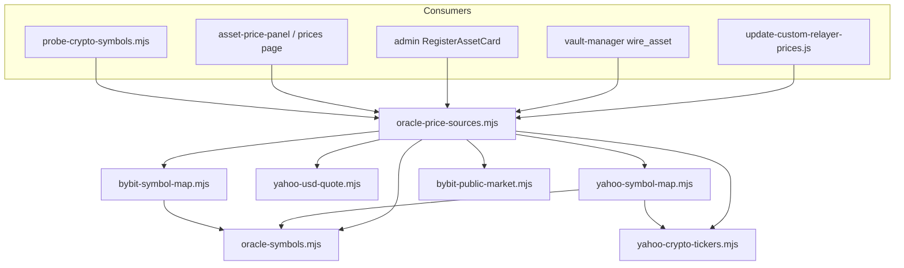

# Oracle price source layering refactor

## Diagnosis

The **yfinance MCP** ([`apps/mcps/yfinance/index.js`](apps/mcps/yfinance/index.js)) was **not** modified for Bybit. Coupling is in shared Yahoo modules, inverted MCP imports, and call sites that reach Yahoo/Bybit directly instead of a neutral registry.

[`apps/shared/oracle-seed-price.mjs`](apps/shared/oracle-seed-price.mjs) already documents the right *intent* (Yahoo first, Bybit index fallback) but still imports `yahoo-symbol-map`, `crypto-oracle-symbols`, and `mcps/bybit/symbol-mapping` — and **is not used everywhere** (e.g. vault-manager `wire_asset` still calls `fetchLivePriceUsd` only).

---

## Full consumer inventory (must migrate)

### Spot / seed price (on-chain keeper + register + wire_asset)

| Consumer | Today | Target |
| -------- | ----- | ------ |
| [`scripts/update-yahoo-finance-prices.js`](scripts/update-yahoo-finance-prices.js) | Inline Yahoo + Bybit fallback | `fetchOracleSpotPricesMap` via registry |
| [`apps/shared/oracle-seed-price.mjs`](apps/shared/oracle-seed-price.mjs) | Ad-hoc Yahoo→Bybit chain | Thin wrapper over registry |
| [`apps/mcps/vault-manager/index.js`](apps/mcps/vault-manager/index.js) `wire_asset` | `fetchLivePriceUsd(symbol)` only | `fetchOracleSeedPriceUsd(symbol)` |
| [`apps/web/.../admin/oracle/page.tsx`](apps/web/src/app/admin/oracle/page.tsx) `RegisterAssetCard` | `fetchYahooFinanceQuote` | `fetchOracleQuote` (registry-backed API) |
| [`apps/web/.../api/yahoo-finance/quote/route.ts`](apps/web/src/app/api/yahoo-finance/quote/route.ts) | Yahoo-only resolution | Delegate to shared registry (keep route for compat) |
| [`scripts/probe-crypto-symbols.mjs`](scripts/probe-crypto-symbols.mjs) | Direct Yahoo + Bybit probes | `probeOracleSources(agentSymbol)` from registry |

### Symbol resolution / classification

| Consumer | Today | Target |
| -------- | ----- | ------ |
| [`apps/shared/yahoo-symbol-map.mjs`](apps/shared/yahoo-symbol-map.mjs) | Crypto + commodity + re-export `isCryptoAgentSymbol` | Commodity + `oracleSymbolToYahooSymbol` only |
| [`apps/shared/crypto-oracle-symbols.mjs`](apps/shared/crypto-oracle-symbols.mjs) | Imports Bybit MCP `KNOWN_BASES` | **Delete** → split into `oracle-symbols` + `yahoo-crypto-tickers` |
| [`apps/web/src/lib/yahoo-finance.ts`](apps/web/src/lib/yahoo-finance.ts) | Re-exports crypto helper | Yahoo URL + `oracleSymbolToYahooSymbol` only |
| [`apps/web/src/lib/offchain-price-chart.ts`](apps/web/src/lib/offchain-price-chart.ts) | `isCryptoAgentSymbol` from yahoo-finance | `oracle-symbols` + `getChartSourcesForSymbol` from registry |
| [`apps/web/.../api/bybit/kline/route.ts`](apps/web/src/app/api/bybit/kline/route.ts) | `isCryptoAgentSymbol` from yahoo-symbol-map | `oracle-symbols` + `bybit-symbol-map` |
| [`apps/web/.../api/yahoo-finance/search/route.ts`](apps/web/src/app/api/yahoo-finance/search/route.ts) | Inline `BASE-USD` regex | `directCryptoSearchResult` from `oracle-symbols` |
| [`scripts/fetch-historical-prices.js`](scripts/fetch-historical-prices.js) | Dynamic import yahoo-symbol-map | Same (Yahoo seeding only — OK) |

### Chart / history (comparison UI — not on-chain oracle)

| Consumer | Today | Target |
| -------- | ----- | ------ |
| [`apps/web/.../asset-price-panel.tsx`](apps/web/src/components/baskets/asset-price-panel.tsx) | `oracleSymbolToYahooSymbol` + `useYahooPriceHistory` + `useBybitPriceHistory` | `useOracleOffchainCharts(agentSymbol)` driven by registry `chart` role |
| [`apps/web/src/app/prices/[assetId]/page.tsx`](apps/web/src/app/prices/[assetId]/page.tsx) | Same pattern | Same |
| [`apps/web/.../api/yahoo-finance/history/route.ts`](apps/web/src/app/api/yahoo-finance/history/route.ts) | Yahoo chart | Unchanged (venue route); registry lists it as chart source |
| [`apps/web/.../api/bybit/kline/route.ts`](apps/web/src/app/api/bybit/kline/route.ts) | Bybit kline | Unchanged; registry lists it |
| [`apps/mcps/yfinance/index.js`](apps/mcps/yfinance/index.js) `get_price_history` | Yahoo history | Unchanged (agent tool) |
| [`apps/mcps/bybit/index.js`](apps/mcps/bybit/index.js) `bybit_kline` | Bybit history | Unchanged (agent tool) |

### Search / discovery

| Consumer | Today | Target |
| -------- | ----- | ------ |
| [`apps/web/src/components/yahoo-finance-search.tsx`](apps/web/src/components/yahoo-finance-search.tsx) | Hits `/api/yahoo-finance/search` | Keep component; search API merges registry `search` providers (Yahoo + crypto direct) |
| [`apps/mcps/yfinance/index.js`](apps/mcps/yfinance/index.js) `yfinance_search` | Yahoo only | Unchanged |

### Explicitly out of scope (Yahoo-only deploy helpers)

- [`scripts/fetch-yf-asset-price.js`](scripts/fetch-yf-asset-price.js) — Forge FFI deploy seed; stays raw Yahoo
- [`apps/shared/yahoo-symbol-policy.mjs`](apps/shared/yahoo-symbol-policy.mjs) — equity write-time ambiguity only
- On-chain reads (`useOracle`, `useOraclePriceHistory`) — Envio/subgraph; not offchain sources

---

## Target architecture: source registry

Central module: **[`apps/shared/oracle-price-sources.mjs`](apps/shared/oracle-price-sources.mjs)**

Each source is a declarative entry:

```js
{
  id: "yahoo",                    // stable string id
  roles: ["spot-oracle", "chart", "search"],
  priority: 10,                   // lower = tried first for spot-oracle
  canHandle(agentSymbol) { ... },
  resolveYahooTicker(agentSymbol) { ... },  // venue-specific
  fetchSpotUsd(agentSymbol) { ... },
  fetchChartPoints(agentSymbol, { lookbackHours }) { ... },
  search(query) { ... },          // optional
}
```

Registered sources (v1):

| id | roles | spot priority | notes |
| -- | ----- | ------------- | ----- |
| `yahoo` | spot-oracle, chart, search | 10 | Uses `yahoo-symbol-map` + `yahoo-usd-quote` / `yahoo-price-history` |
| `bybit-index` | spot-oracle (fallback) | 20 | Only when `canUseBybitIndexOracleFallback` + Yahoo miss |
| `bybit-kline` | chart | — | Never writes on-chain; chart comparison only |

Public API (all consumers use these):

- `fetchOracleSpotPriceUsd(agentSymbol)` — walks `spot-oracle` sources by priority; returns `{ source, priceUsd, ... }` (replaces ad-hoc logic in `oracle-seed-price.mjs`)
- `fetchOracleSpotPricesMap(symbols)` — batch for keeper
- `getChartSourcesForSymbol(agentSymbol)` — `{ primary, fallbacks }` for UI (Yahoo first, Bybit kline when crypto + Yahoo sparse)
- `searchOracleAssets(query)` — merges Yahoo search + `directCryptoSearchResult`
- `probeOracleSources(agentSymbol)` — used by `probe-crypto-symbols.mjs` and docs

[`apps/shared/oracle-seed-price.mjs`](apps/shared/oracle-seed-price.mjs) becomes a **deprecated alias** re-exporting registry functions (keep exports stable for tests/MCPs during migration, then trim).



Dependency rule: **`apps/shared/*` never imports `apps/mcps/*`**. MCPs import shared only.

---

## Module layout (unchanged intent, expanded scope)

### 1. [`apps/shared/oracle-symbols.mjs`](apps/shared/oracle-symbols.mjs)

- `KNOWN_CRYPTO_BASES`, `isCryptoAgentSymbol`, `agentSymbolFromBase`, `directCryptoSearchResult(query)`
- `canUseBybitIndexOracleFallback` / allowlist constants

### 2. [`apps/shared/yahoo-crypto-tickers.mjs`](apps/shared/yahoo-crypto-tickers.mjs)

- `YAHOO_TICKER_OVERRIDES`, `yahooTickerForAgentSymbol`

### 3. Slim [`apps/shared/yahoo-symbol-map.mjs`](apps/shared/yahoo-symbol-map.mjs)

- `YAHOO_SYMBOL_MAP`, `oracleSymbolToYahooSymbol` — no crypto re-exports

### 4. [`apps/shared/bybit-symbol-map.mjs`](apps/shared/bybit-symbol-map.mjs)

- `normaliseAgentSymbolToBybit`, `denormaliseBybitToAgent`; MCP re-exports

### 5. [`apps/shared/oracle-price-sources.mjs`](apps/shared/oracle-price-sources.mjs) (new — registry)

- Source table + public API above
- Keeper logic moves here from script (`fetchOracleSpotPricesMap`, FX conversion for batch submit)

### 6. Rename keeper

- `scripts/update-yahoo-finance-prices.js` → **`scripts/update-custom-relayer-prices.js`**
- Update [`package.json`](package.json), [`.github/workflows/update-prices.yml`](.github/workflows/update-prices.yml), all doc references

---

## Web app changes

### New shared web facade

- [`apps/web/src/lib/oracle-symbols.ts`](apps/web/src/lib/oracle-symbols.ts) — re-export symbol helpers from shared
- [`apps/web/src/lib/oracle-price-sources.ts`](apps/web/src/lib/oracle-price-sources.ts) — thin re-export of registry types/helpers

### New API route (primary lookup for UI)

- **`GET /api/oracle/quote?symbols=ETH-USD,BHP.AX`**
  - Calls `fetchOracleSpotPriceUsd` per symbol
  - Response includes `source: "yahoo" | "bybit-index"`, `priceUsd`, `yahooTicker`, `bybitSymbol`, ambiguity fields (Yahoo path only)
- [`/api/yahoo-finance/quote`](apps/web/src/app/api/yahoo-finance/quote/route.ts) — thin wrapper delegating to same handler (backward compat)

### Hooks

- **`useOracleQuote(symbol)`** — fetches `/api/oracle/quote`; used by `RegisterAssetCard` instead of `fetchYahooFinanceQuote`
- **`useOracleOffchainCharts(agentSymbol, window)`** — encapsulates on-chain + registry chart sources (replaces scattered `oracleSymbolToYahooSymbol` + dual hook wiring in panel/page)
- Keep `useYahooPriceHistory` / `useBybitPriceHistory` as low-level venue hooks called **only** from `useOracleOffchainCharts`

### UI touchpoints

- [`RegisterAssetCard`](apps/web/src/app/admin/oracle/page.tsx) — show seed `source` badge (Yahoo vs Bybit index); deep-link still Yahoo URL when `yahooTicker` present
- [`asset-price-panel.tsx`](apps/web/src/components/baskets/asset-price-panel.tsx), [`prices/[assetId]/page.tsx`](apps/web/src/app/prices/[assetId]/page.tsx) — use `useOracleOffchainCharts`; window label from registry (`windowLabelWithSources` moves beside registry)
- [`offchain-price-chart.ts`](apps/web/src/lib/offchain-price-chart.ts) — import symbol/chart policy from registry helpers only

---

## MCP alignment

| MCP | Change |
| --- | ------ |
| **vault-manager** | `wire_asset` deviation guard uses `fetchOracleSeedPriceUsd` (registry) so crypto gets Bybit fallback same as keeper |
| **yfinance** | **No Bybit** — `yfinance_quote` / `get_price_history` stay Yahoo-only; agents use `bybit_*` for perp context |
| **bybit** | Import `bybit-symbol-map` from shared; no logic change |

---

## Documentation (new canonical doc)

### Create [`docs/ORACLE_PRICE_SOURCES.md`](docs/ORACLE_PRICE_SOURCES.md)

Sections:

1. **Overview** — on-chain oracle (keeper) vs offchain comparison charts vs agent MCP tools
2. **Symbol model** — `BASE-USD` crypto, suffixed equities, commodity overrides (XAU→GC=F)
3. **Registered sources table** — id, roles, priority, when used
4. **Data flow diagram** (keeper → `submitPrices`; UI charts)
5. **How to add a new source** (checklist):
   - Add adapter `apps/shared/sources/<id>.mjs` (or extend registry inline for tiny adapters)
   - Register in `oracle-price-sources.mjs` with `id`, `roles`, `priority`, `canHandle`
   - If `spot-oracle`: wire into keeper batch + `probeOracleSources` + vault-manager path
   - If `chart`: add `/api/<venue>/...` route + hook + register chart role
   - If `search`: extend `searchOracleAssets`
   - Run probe / tests; update `CHANGELOG.md`
6. **Probe & CI** — `npm run probe:crypto-symbols`
7. **Related docs** — link `PRICE_FEED_FLOW`, `ORACLE_SUPPORTED_ASSETS`; **fold** crypto-specific content from [`docs/CRYPTO_ORACLE_COVERAGE.md`](docs/CRYPTO_ORACLE_COVERAGE.md) into this doc and replace the old file with a short redirect stub

### Also update

- [`docs/README.md`](docs/README.md) — list `ORACLE_PRICE_SOURCES.md` under Infrastructure; demote `CRYPTO_ORACLE_COVERAGE` to redirect
- [`docs/PRICE_FEED_FLOW.md`](docs/PRICE_FEED_FLOW.md), [`docs/KEEPER_OPERATIONS.md`](docs/KEEPER_OPERATIONS.md), [`README.md`](README.md) — keeper script rename + link to new doc
- [`apps/web/src/lib/wiki.ts`](apps/web/src/lib/wiki.ts) + [`tooltip-copy.ts`](apps/web/src/lib/tooltip-copy.ts) — admin register / chart source labels mention multi-source seed (not Yahoo-only)
- [`CHANGELOG.md`](CHANGELOG.md) — **Changed** entry

---

## Tests

- [`apps/shared/oracle-seed-price.test.mjs`](apps/shared/oracle-seed-price.test.mjs) — point at registry (Yahoo hit + Bybit fallback)
- **New** `apps/shared/oracle-price-sources.test.mjs` — priority order, skip ineligible sources
- **New** `apps/shared/oracle-symbols.test.mjs`
- Relocate `bybit-symbol-map.test.mjs` to shared
- Keep [`apps/web/src/lib/yahoo-symbol-map.test.ts`](apps/web/src/lib/yahoo-symbol-map.test.ts) for ticker mapping
- Optional: web test for `/api/oracle/quote` crypto fallback mock

---

## Verification

```bash
node --test apps/shared/oracle-symbols.test.mjs apps/shared/oracle-price-sources.test.mjs apps/shared/oracle-seed-price.test.mjs apps/shared/bybit-symbol-map.test.mjs
BYBIT_TESTNET=0 npm run probe:crypto-symbols
npm test --workspace=apps/web -- yahoo-symbol-map
DRY_RUN=1 npm run update-prices:local:dry
```

---

## What stays untouched

- **On-chain contracts** — no Solidity changes
- **yfinance / bybit MCP tool surfaces** — same tool names; internal imports only
- **`fetch-yf-asset-price.js`** — deploy-only Yahoo FFI helper
- **Chart UX behaviour** — Yahoo primary, Bybit kline when sparse; implementation goes through registry
