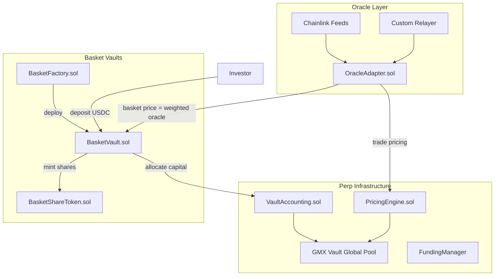
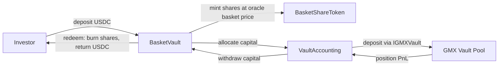

# Perp Infrastructure via GMX v1 Fork

## Source Repository

**Fork target:** `[gmx-io/gmx-contracts](https://github.com/gmx-io/gmx-contracts)` (master branch)

GMX v1 key contract layout:

- `contracts/core/` -- Vault.sol, VaultPriceFeed.sol, Router.sol, PositionRouter.sol, OrderBook.sol, BasePositionManager.sol, ShortsTracker.sol, VaultUtils.sol
- `contracts/oracle/` -- FastPriceFeed.sol (keeper price updates)
- `contracts/tokens/` -- USDG.sol, GLP token, yield trackers
- `contracts/staking/` -- RewardRouter, staking infrastructure
- `contracts/gmx/` -- GMX governance token
- `contracts/peripherals/` -- Reader.sol, Timelock, price feed utilities
- `contracts/libraries/` -- Math, token utils
- `contracts/access/` -- Governable

---

## Architecture Overview




---

## Phase 0: Project Scaffolding

- Initialize Foundry project in `snx-prototype/`
- Set up `foundry.toml` with Arbitrum fork config and **multi-version Solidity compilation**:
  - GMX forked contracts stay at **Solidity 0.6.12** (preserved as-is under `src/gmx/`)
  - Vault + new contracts use **Solidity ^0.8.24** (under `src/vault/` and `src/perp/`)
  - Foundry handles this natively -- each file's pragma determines its compiler version
- Clone GMX v1 contracts into `src/gmx/` as compilable source
- Bring in BasketVault contracts (from hackmoney2026, not cloned -- rewritten into this repo):

```
src/
├── gmx/                    # GMX v1 fork (Solidity 0.6.12)
│   ├── core/               # Vault.sol, VaultUtils.sol, Router.sol, etc.
│   ├── oracle/             # FastPriceFeed.sol (reference, replaced by OracleAdapter)
│   ├── peripherals/        # Reader.sol
│   └── libraries/          # Math, token utils
├── vault/                  # Basket vault system (Solidity ^0.8.24)
│   ├── BasketVault.sol     # GLP-style: deposit/redeem USDC, oracle-priced basket
│   ├── BasketShareToken.sol# ERC20 vault shares (mint on deposit, burn on redeem)
│   ├── BasketFactory.sol   # Deploy new basket vaults with asset configs
│   └── MockUSDC.sol        # For testing
├── perp/                   # Perp infrastructure (Solidity ^0.8.24)
│   ├── OracleAdapter.sol
│   ├── PricingEngine.sol
│   ├── VaultAccounting.sol
│   ├── PerpReader.sol
│   └── interfaces/
│       ├── IPerp.sol
│       ├── IOracleAdapter.sol
│       └── IGMXVault.sol   # 0.8.24 interface for cross-version calls to GMX Vault
└── test/
```

- Set up remappings for GMX internal imports, OpenZeppelin, Solady, and forge-std
- Add `@openzeppelin/contracts`, `forge-std`, `solady` as dependencies
- Verify GMX contracts compile at 0.6.12 and vault/perp contracts at ^0.8.24

---

## Phase 1: Codebase Audit + Strip

### GMX contracts -- KEEP in `src/gmx/` (0.6.12, modify in place)

- **Vault.sol** -- Core liquidity pool + position logic. Add vault accounting hooks, replace price feed references.
- **VaultUtils.sol** -- Fee calculations, validation helpers. Simplify fee model.
- **ShortsTracker.sol** -- Global short tracking. Keep mostly as-is.
- **Router.sol** -- Trade entry point. Simplify for internal usage (strip public swap paths).
- **BasePositionManager.sol** -- Position management base. Extend with vault tracking.

### GMX contracts -- STRIP from `src/gmx/` (delete)

- `contracts/staking/` -- All reward/staking logic
- `contracts/gmx/` -- GMX governance token
- GLP token / public LP minting/burning
- `OrderBook.sol` -- No orderbook per constraints
- Referral system, vesting contracts
- Governance timelock (use simple Ownable for now)
- `PositionRouter.sol` -- Async keeper execution not needed; simplify to direct calls

### Basket vault contracts -- BUILD in `src/vault/` (^0.8.24)

Rewritten from hackmoney2026 BasketVault. **All NAV/DCF logic, fundraising mechanics, and company stage tracking are removed.** Replaced with GLP-style oracle-priced basket model.

- `**BasketShareToken.sol`** -- ERC20 with vault-only mint/burn, 6 decimals. Carried over as-is.
- `**MockUSDC.sol`** -- Carried over as-is for testing.
- `**BasketVault.sol**` -- **Rewritten:**
  - Each basket has a list of assets (bytes32 IDs) with weights (bps, sum to 10000)
  - **Basket price** = `sum(weight_i * OracleAdapter.getPrice(asset_i)) / 10000`
  - **Deposit:** user sends USDC, receives shares = `depositAmount / basketPrice`. Continuous, no deadlines.
  - **Redeem:** user burns shares, receives USDC = `shares * basketPrice`. Continuous.
  - Holds USDC; can allocate portion to perp pool via `VaultAccounting`
  - Config: `oracleAdapter` address, `vaultAccounting` address, asset list + weights (owner-settable)
  - No fundraising stages, no deadlines, no minimum raise, no refund mechanism
  - Fees: configurable deposit/redeem fee in bps
- `**BasketFactory.sol`** -- **Simplified** (replaces MinestartersFactory):
  - `createBasket(name, assets[], weights[], oracleAdapter, vaultAccounting)` -> deploys BasketVault + BasketShareToken
  - Tracks deployed baskets
  - Registers new baskets in VaultAccounting
  - No NAVEngine references

**Removed entirely:** `NAVEngine.sol`, `MinestartersFactory.sol`, `MineStarters.sol`, all DCF/company/stage logic.

### NEW contracts in `src/perp/` (Solidity ^0.8.24)

- `OracleAdapter.sol` -- Unified oracle for equities + commodities (also used by BasketVault for pricing)
- `PricingEngine.sol` -- Oracle price + deterministic slippage (for perp trades)
- `VaultAccounting.sol` -- Vault-level PnL and allocation tracking
- `PerpReader.sol` -- Read-only view contract for positions, PnL, pool state, basket prices
- `interfaces/IPerp.sol` -- Interface for BasketVault to call into perp system
- `interfaces/IOracleAdapter.sol` -- Oracle interface used by both basket and perp layers
- `interfaces/IGMXVault.sol` -- 0.8.24 interface mirroring GMX Vault.sol externals for cross-version calls

### Cross-version interaction

- 0.8.24 contracts (`VaultAccounting`, `PricingEngine`) call into 0.6.12 GMX `Vault.sol` via `IGMXVault.sol` interface (ABI-compatible at EVM level)
- `BasketVault.sol` (0.8.24) calls `VaultAccounting.sol` (0.8.24) directly -- same compiler version

### Capital flow




---

## Phase 2: Oracle Adapter

Replace `VaultPriceFeed.sol` + `FastPriceFeed.sol` with a unified `OracleAdapter.sol`.

### Design

```solidity
// Simplified interface
interface IOracleAdapter {
    function getPrice(bytes32 assetId) external view returns (uint256 price, uint256 timestamp);
    function isStale(bytes32 assetId) external view returns (bool);
}
```

### Feed sources:

- **Commodities (gold, silver, oil):** Chainlink feeds exist on Arbitrum (XAU/USD, XAG/USD). Use directly.
- **US mining equities (BHP, RIO, GOLD, etc.):** Chainlink Data Streams (24/5 equities) if available, otherwise custom off-chain relayer.
- **Niche commodities (copper, lithium, iron ore):** No standard Chainlink feeds. Requires custom off-chain relayer.

### Custom relayer architecture:

- Off-chain service fetches prices from market data APIs
- Signs price updates with authorized keeper key
- Submits to `OracleAdapter.sol` which validates signature + staleness
- Multi-source median aggregation for reliability

### Staleness + safety:

- Per-asset configurable staleness threshold (e.g., 60s for crypto, 5min for equities during market hours, paused overnight/weekends)
- Deviation circuit breaker: reject updates that deviate >X% from last price in single update
- Fallback to last known price with position-opening disabled when stale

---

## Phase 3: Vault Accounting Layer

Build `VaultAccounting.sol` as the bridge between `BasketVault` and the GMX-derived perp pool.

### Responsibilities:

- Track capital allocation per BasketVault (how much USDC each vault has deposited into perp pool)
- Track PnL per vault (aggregate position PnL attributed to each vault)
- Net positions across vaults (if Vault A is long gold and Vault B is short gold, net exposure is reduced)
- Enforce per-vault risk limits (max exposure, max loss)

### `IPerp.sol` interface:

- `depositCapital(address vault, uint256 amount)` -- called by BasketVault.allocateToPerp()
- `withdrawCapital(address vault, uint256 amount)` -- called by BasketVault.withdrawFromPerp()
- `openPosition(address vault, bytes32 asset, bool isLong, uint256 size, uint256 collateral)`
- `closePosition(address vault, bytes32 positionKey)`
- Getter functions: `getVaultState(address vault)`, `getPosition(bytes32 key)`, `getVaultPnL(address vault)`
- Events: `CapitalDeposited`, `CapitalWithdrawn`, `PositionOpened`, `PositionClosed`, `PnLRealized`

### Integration with GMX Vault (cross-version):

- `VaultAccounting` calls `IGMXVault` to forward position operations to the 0.6.12 Vault
- Positions tagged with vault address for PnL attribution
- Mapping `vault => VaultState` tracking deposits, PnL, open interest
- Hook into position close/liquidation to update vault-level PnL

### Basket price integration:

- `BasketVault.getBasketPrice()` reads directly from `OracleAdapter` -- no NAVEngine intermediary
- `PerpReader` can combine basket price + perp PnL for total vault value views

### Vault registration:

- `BasketFactory` registers new BasketVaults in `VaultAccounting` on creation
- Owner can also manually register/deregister vault addresses

---

## Phase 4: Pricing Engine

Simplify pricing to enforce: **price = oracle price + deterministic slippage**.

### Build `PricingEngine.sol`:

- Fetch oracle price from `OracleAdapter`
- Calculate price impact: `impact = tradeSize / availableLiquidity * impactFactor`
- Apply directionally: buys get worse price, sells get worse price (spread)
- No AMM curves, no TWAP drift, no virtual liquidity

### Remove from GMX:

- Any spread logic in `VaultPriceFeed` that references AMM prices
- Complex spread basis points that reference secondary price sources
- FastPriceFeed's deviation-based spread adjustments

---

## Phase 5: Funding Mechanism

Adapt GMX's existing funding rate logic.

### GMX baseline:

- `Vault.sol` tracks `cumulativeFundingRates` per token
- Funding accrues based on `reservedAmounts / poolAmounts` (utilization)
- Applied on position updates (open, close, modify)

### Modifications:

- Anchor funding rate to oracle price (not pool utilization alone)
- Make funding rate proportional to long/short imbalance per asset
- Configurable funding interval (hourly default)
- Ensure correct direction: longs pay shorts when long-heavy, and vice versa

---

## Phase 6: Integration Wiring

### Wire BasketVault <-> OracleAdapter

- BasketVault reads asset prices from `OracleAdapter` for basket pricing on deposit/redeem
- Basket price = weighted sum of oracle prices

### Wire BasketVault <-> VaultAccounting

- `BasketVault.allocateToPerp()` / `withdrawFromPerp()` call into `VaultAccounting`
- `BasketFactory` sets `oracleAdapter` and `vaultAccounting` on new vaults and registers them

### `PerpReader.sol` -- read-only view contract

- Aggregate position data, vault PnL, pool utilization, oracle prices
- Basket price, share price, total vault value
- Designed for off-chain consumption and monitoring

### Manual position management (initial phase)

- Owner or authorized addresses open/close positions via `VaultAccounting`
- No automated strategy execution in this repo

---

## Phase 7: Testing + Documentation

### Testing strategy (Foundry):

- Fork tests against Arbitrum mainnet (for Chainlink feed validation)
- Unit tests per contract (oracle, pricing, vault accounting, positions)
- Integration test: full lifecycle (deposit capital -> open position -> oracle update -> close position -> withdraw)
- Fuzz tests on pricing engine (size inputs, oracle price ranges)

### Documentation:

- `MODIFICATIONS.md` -- what changed vs upstream GMX, and why
- Contract-level NatSpec documentation
- Integration guide: Investor -> BasketVault -> VaultAccounting -> GMX Vault flow

---

## Constraints Enforced

- No orderbook (OrderBook.sol stripped)
- No long-tail assets (max ~20-30 active markets, configurable whitelist in OracleAdapter)
- Optimized for internal usage (no public trading UI)
- USDC as sole collateral/liquidity token
- No NAV/DCF logic -- basket price is purely weighted oracle prices
- No fundraising mechanics (no deadlines, minimum raise, refunds)
- GLP-style continuous deposit/redeem for basket tokens
- Multiple baskets supported via BasketFactory
- Manual position management initially
- No MINE token, no NAVEngine, no MinestartersDistributor

