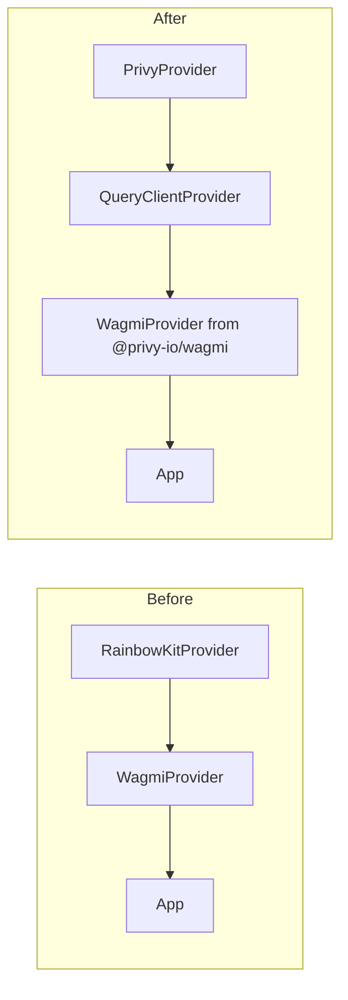

# Privy Auth Integration

## Current Architecture

The app uses **RainbowKit + wagmi + viem** for wallet connection:

- [apps/web/src/config/wagmi.ts](apps/web/src/config/wagmi.ts) -- `getDefaultConfig` from RainbowKit, chains (anvil, sepolia, arbitrumSepolia, arbitrum)
- [apps/web/src/providers/Web3Provider.tsx](apps/web/src/providers/Web3Provider.tsx) -- `WagmiProvider`, `QueryClientProvider`, `RainbowKitProvider`
- [apps/web/src/components/layout/header.tsx](apps/web/src/components/layout/header.tsx) -- RainbowKit `ConnectButton`
- 10 files import `useAccount`, `useChainId`, `useConnect`, `useSwitchChain`, or `ConnectButton`

## Migration Strategy

Replace RainbowKit with Privy while keeping all existing wagmi hooks working. Privy provides drop-in `createConfig` and `WagmiProvider` from `@privy-io/wagmi` that sync Privy's connector state with wagmi, so **all existing wagmi hooks continue to work unchanged**.




## Key Changes

### 1. Dependencies

**Install:**

- `@privy-io/react-auth` -- Privy SDK (login UI, hooks, embedded wallets)
- `@privy-io/wagmi` -- Privy-wagmi bridge (`createConfig`, `WagmiProvider`)
- `@privy-io/chains` -- RPC override helper for custom/local chains

**Remove:**

- `@rainbow-me/rainbowkit`
- `@walletconnect/ethereum-provider` (Privy handles WalletConnect internally)

### 2. Privy Configuration

Create [apps/web/src/config/privy.ts](apps/web/src/config/privy.ts) with:

- `appId` from `NEXT_PUBLIC_PRIVY_APP_ID` env var
- Login methods: `email`, `google`, `wallet` (configured in Privy Dashboard + overridable in code)
- `embeddedWallets.ethereum.createOnLogin: 'users-without-wallets'` -- auto-create embedded wallet for email/Google users
- `supportedChains`: anvil (with RPC override to `http://127.0.0.1:8545`), sepolia, arbitrumSepolia, arbitrum
- `defaultChain`: sepolia (or anvil in dev)
- `appearance.theme`: sync with app's light/dark theme
- `appearance.walletChainType`: `'ethereum-only'`

### 3. Wagmi Config ([apps/web/src/config/wagmi.ts](apps/web/src/config/wagmi.ts))

Replace RainbowKit's `getDefaultConfig` with `@privy-io/wagmi`'s `createConfig`:

```typescript
import { createConfig } from '@privy-io/wagmi';
import { http } from 'wagmi';
import { anvil } from 'viem/chains';
import { sepolia, arbitrumSepolia, arbitrum } from 'wagmi/chains';

export const wagmiConfig = createConfig({
  chains: [anvil, sepolia, arbitrumSepolia, arbitrum],
  transports: {
    [anvil.id]: http('http://127.0.0.1:8545'),
    [sepolia.id]: http(),
    [arbitrumSepolia.id]: http(),
    [arbitrum.id]: http(),
  },
});
```

The E2E mock config can remain as a separate `createConfig` (from `wagmi` directly) for test mode.

### 4. Provider Rewrite ([apps/web/src/providers/Web3Provider.tsx](apps/web/src/providers/Web3Provider.tsx))

Replace provider nesting order (Privy requires this exact order):

```
PrivyProvider
  QueryClientProvider
    WagmiProvider (from @privy-io/wagmi)
      {children}
```

Remove `RainbowKitProvider` and its theme/styles import. Keep `AutoSwitchMetaMaskToDeploymentChain` and `AutoConnectE2EWallet` logic.

### 5. Network/Chain Selector (New Component)

RainbowKit's `ConnectButton` with `chainStatus="icon"` currently provides a built-in chain switcher dropdown. Privy has **no equivalent UI**. We need a custom component.

Create [apps/web/src/components/layout/chain-selector.tsx](apps/web/src/components/layout/chain-selector.tsx):

- Renders a dropdown button showing the current chain icon/name
- Lists all configured chains (Anvil, Sepolia, Arbitrum Sepolia, Arbitrum)
- On selection: calls wagmi's `useSwitchChain().switchChain()` to switch the connected wallet's chain
- Syncs with the existing `DeploymentProvider`: when the user picks a chain, update `setTarget()` so the app-level deployment target stays in sync (matching the current `AutoSwitchMetaMaskToDeploymentChain` behavior, but driven from the UI instead of only from MetaMask)
- For embedded wallets (Privy), uses `useWallets()` from `@privy-io/react-auth` + `wallet.switchChain()` to switch the embedded wallet's chain
- Only visible when a wallet is connected (`useAccount().isConnected`)
- Styled to match the existing header design (border, rounded-md, h-9, etc.)

The existing `AutoSwitchMetaMaskToDeploymentChain` logic in `Web3Provider.tsx` should be generalized to work with any wallet connector (not just MetaMask), since Privy users may be using an embedded wallet rather than MetaMask. The core sync logic stays:

- If the wallet's chain maps to a known deployment target, update `setTarget()`
- If the wallet's chain differs from the deployment target, prompt a switch

### 6. Login/Connect Button ([apps/web/src/components/layout/header.tsx](apps/web/src/components/layout/header.tsx))

Replace RainbowKit's `ConnectButton` with a custom button using Privy hooks:

- `usePrivy()` for `ready`, `authenticated`, `user`, `logout`
- `useLogin()` to trigger the Privy login modal
- `useAccount()` from wagmi still works for wallet address
- Render the new `ChainSelector` alongside the login/account button

The button shows "Log in" when unauthenticated, and the user's truncated address (or email) + a disconnect option when authenticated. The chain selector appears next to it when a wallet is connected.

### 7. Admin Layout Guard ([apps/web/src/app/admin/layout.tsx](apps/web/src/app/admin/layout.tsx))

Currently checks `useAccount().isConnected`. With Privy, a user can be authenticated (via email/Google) but might not have a wallet connected yet. Update to check `usePrivy().authenticated` instead, or keep requiring a wallet by checking both.

### 8. Anvil / Local Testing

Privy supports any EVM chain via `supportedChains`. For Anvil:

- Include `anvil` (chain ID 31337) in both Privy's `supportedChains` and wagmi's `chains`
- Override the RPC URL to `http://127.0.0.1:8545` using `addRpcUrlOverrideToChain` from `@privy-io/chains`
- Privy's auth (email/Google login) still requires internet even for local chain testing -- only the on-chain operations go to the local node
- For E2E tests, the existing mock connector path can remain as a bypass

### 9. Environment Variables

Add to `.env` / `.env.example`:

- `NEXT_PUBLIC_PRIVY_APP_ID` -- from Privy Dashboard (required)
- `NEXT_PUBLIC_PRIVY_CLIENT_ID` -- optional, for multi-environment app clients

Remove:

- `NEXT_PUBLIC_WALLETCONNECT_ID` -- no longer needed (Privy manages WalletConnect internally)

### 10. Clean Up

- Remove [apps/web/src/config/metaMaskExtensionWallet.ts](apps/web/src/config/metaMaskExtensionWallet.ts) (RainbowKit-specific custom wallet)
- Remove `@rainbow-me/rainbowkit/styles.css` import
- Remove RainbowKit-specific theme config from `Web3Provider.tsx`

### 11. Files Affected (Scope)

Files that need changes:

- `apps/web/package.json` -- dependency swap
- `apps/web/src/config/wagmi.ts` -- rewrite config
- `apps/web/src/config/privy.ts` -- new file
- `apps/web/src/components/layout/chain-selector.tsx` -- new file (network picker)
- `apps/web/src/providers/Web3Provider.tsx` -- provider rewrite
- `apps/web/src/components/layout/header.tsx` -- replace ConnectButton, add ChainSelector
- `apps/web/src/app/admin/layout.tsx` -- auth guard update

Files that need NO changes (wagmi hooks still work):

- `apps/web/src/app/baskets/[address]/page.tsx`
- `apps/web/src/app/admin/pool/page.tsx`
- `apps/web/src/app/admin/baskets/[address]/page.tsx`
- `apps/web/src/app/portfolio/page.tsx`
- `apps/web/src/app/prices/[assetId]/page.tsx`
- `apps/web/src/components/baskets/deposit-redeem-panel.tsx`
- All hooks in `apps/web/src/hooks/`

## Privy Dashboard Setup (Manual Step)

Before the code changes work, you need to:

1. Create a Privy app at [dashboard.privy.io](https://dashboard.privy.io)
2. Enable login methods: **Email**, **Google**
3. Enable **Embedded Wallets** for Ethereum
4. Copy the App ID into `NEXT_PUBLIC_PRIVY_APP_ID`
5. Add `http://localhost:3000` to allowed origins

