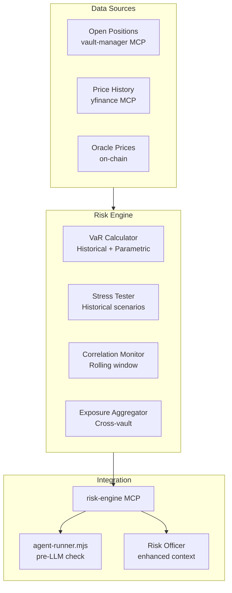

# Institutional Quant Infrastructure Upgrade

This plan adds two major capabilities from the article's institutional playbook:
1. **Performance Attribution** (Atlas) - Decompose trading returns into signal alpha vs timing vs execution
2. **Portfolio Risk Engine** (snx-prototype) - VaR, stress tests, correlation monitoring

---

## Part 1: Performance Attribution (Atlas)

### Goal
Answer: "Did we make money because the signal was good, or because we timed entries well, or despite execution costs?"

### Architecture

```mermaid
flowchart LR
    subgraph DataSources["Data Sources"]
        RunLogs[Agent Run Logs<br/>snx-prototype]
        MLSignals[ML Predictions<br/>Atlas DB]
        Prices[Price History<br/>Yahoo/Oracle]
    end

    subgraph Attribution["Attribution Engine"]
        Ingest[Trade Ingestor]
        Signal[Signal Return Calculator]
        Timing[Timing Alpha Calculator]
        Exec[Execution Cost Calculator]
        Decomp[Return Decomposer]
    end

    subgraph Output["Output"]
        API[/api/v1/attribution/*]
        Dashboard[Dashboard Tab]
    end

    RunLogs --> Ingest
    MLSignals --> Signal
    Prices --> Signal
    Prices --> Timing
    Prices --> Exec
    Ingest --> Decomp
    Signal --> Decomp
    Timing --> Decomp
    Exec --> Decomp
    Decomp --> API
    API --> Dashboard
```

### Data Flow

1. **Trade Ingestor** - Pull closed positions from agent run logs (`agents/memory/*/run-log.*.jsonl`)
2. **Signal Return Calculator** - What would a naive "buy on signal, sell after N days" strategy return?
3. **Timing Alpha Calculator** - Did actual entry/exit timing beat the naive baseline?
4. **Execution Cost Calculator** - Slippage between intended price and oracle settlement price
5. **Return Decomposer** - `Total Return = Signal Alpha + Timing Alpha - Execution Costs + Residual`

### Key Files to Create (Atlas)

| File | Purpose |
|------|---------|
| `src/atlas/attribution/__init__.py` | Module init |
| `src/atlas/attribution/ingestor.py` | Parse snx-prototype run logs into trade records |
| `src/atlas/attribution/signal_returns.py` | Calculate "pure signal" returns (entry on signal, exit after horizon) |
| `src/atlas/attribution/timing_alpha.py` | Compare actual entry/exit to signal-implied timing |
| `src/atlas/attribution/execution_costs.py` | Measure slippage (intended vs settled price) |
| `src/atlas/attribution/decomposer.py` | Orchestrate full attribution breakdown |
| `src/atlas/api/routes/attribution.py` | REST endpoints |
| `static/dashboard/attribution.html` | Dashboard tab |

### Attribution Metrics

**Per-Trade Attribution:**
- `signal_return_pct` - Return if entered at signal, exited at horizon
- `entry_timing_alpha_pct` - Gain/loss from actual entry vs signal time
- `exit_timing_alpha_pct` - Gain/loss from actual exit vs horizon
- `execution_slippage_pct` - Oracle settlement vs market price at decision time
- `total_return_pct` - Actual realized return

**Per-Signal Attribution (which signals made money):**
- Group by `mlScore` bucket (85-90, 90-95, 95-100)
- Group by `compositeScore` bucket
- Group by signal category (drilling, resources, quality matrix)
- Calculate: hit rate, avg return, Sharpe, max drawdown per bucket

### API Endpoints

```
GET  /api/v1/attribution/trades?agent=mining-manager&start=2026-01-01&end=2026-06-01
GET  /api/v1/attribution/summary?agent=mining-manager
GET  /api/v1/attribution/by-signal?signal_type=ml_score&bucket=90-95
GET  /api/v1/attribution/leaderboard  # which signals/agents perform best
```

---

## Part 2: Portfolio Risk Engine (snx-prototype)

### Goal
Add institutional risk controls: daily VaR, stress tests, correlation monitoring, cross-vault exposure limits.

### Architecture



### Key Files to Create (snx-prototype)

| File | Purpose |
|------|---------|
| `apps/mcps/risk-engine/index.js` | MCP server exposing risk tools |
| `apps/mcps/risk-engine/var.js` | VaR calculations (historical simulation, parametric) |
| `apps/mcps/risk-engine/stress.js` | Stress test scenarios |
| `apps/mcps/risk-engine/correlation.js` | Rolling correlation matrix |
| `apps/mcps/risk-engine/exposure.js` | Cross-vault exposure aggregation |
| `apps/shared/risk-scenarios.json` | Predefined stress scenarios (2008, COVID, flash crash) |

### Risk Metrics

**VaR (Value at Risk):**
- 1-day 95% VaR (historical simulation over 252-day window)
- 1-day 99% VaR
- Parametric VaR (faster, for real-time checks)
- Per-vault and aggregate across all vaults

**Stress Tests:**
- **2008 Financial Crisis**: Equities -50%, Gold +25%, correlations spike to 0.8
- **COVID March 2020**: Equities -35% in 3 weeks, VIX spike
- **Flash Crash**: -10% intraday, full recovery
- **Mining Sector Crash**: Miners -40%, commodities flat
- Custom scenarios via `apps/shared/risk-scenarios.json`

**Correlation Monitoring:**
- 20-day rolling correlation matrix across all open positions
- Alert when correlation between "diversified" assets exceeds 0.7
- Recommend position reduction when correlation spike detected

**Cross-Vault Exposure:**
- Aggregate net exposure to each asset across all vaults
- Flag when combined exposure exceeds per-asset limit
- Sector/commodity concentration warnings

### MCP Tools

| Tool | Description |
|------|-------------|
| `get_portfolio_var` | Returns 1d 95%/99% VaR for specified vaults |
| `run_stress_test` | Apply scenario, return projected P&L per vault |
| `get_correlation_matrix` | Current rolling correlations, alerts |
| `get_aggregate_exposure` | Net exposure per asset across vaults |
| `get_risk_summary` | Combined dashboard: VaR + top risks + alerts |

### Integration with Agent Runner

Add to `scripts/agent-runner.mjs`:

```javascript
// Pre-LLM risk check
async function preflightRiskCheck(vaultAddress) {
  const { var95, var99, alerts } = await mcp.call('get_risk_summary', { vaults: [vaultAddress] });
  
  if (var95 > policy.maxVarPct) {
    log.warn(`VaR ${var95}% exceeds limit ${policy.maxVarPct}%`);
    // Inject into system prompt: "Portfolio VaR is elevated. Prioritize risk reduction."
  }
  
  if (alerts.some(a => a.type === 'correlation_spike')) {
    // Inject: "Correlation spike detected between X and Y. Consider reducing one."
  }
}
```

### Risk Officer Enhancement

Extend `agents/risk-officer.md` system prompt to include:

- Current VaR vs policy limit
- Active correlation alerts
- Stress test worst-case for proposed trades
- Cross-vault exposure after proposed changes

---

## Implementation Order

**Phase 1: Foundation (1-2 weeks effort)**
1. Create `risk-engine` MCP with VaR calculator
2. Create Attribution ingestor + signal return calculator in Atlas

**Phase 2: Core Features**
3. Add stress test scenarios to risk-engine
4. Add timing alpha + execution cost calculators to Atlas
5. Integrate risk-engine with agent-runner pre-LLM check

**Phase 3: Polish**
6. Add correlation monitoring
7. Add cross-vault exposure aggregation
8. Build Atlas attribution dashboard tab
9. Enhance risk officer with risk context

---

## Existing Code to Leverage

**Atlas:**
- `scripts/evaluation/backtest_evaluation.py` - Has quintile return calculation logic
- `ml/predict.py` - ML score retrieval
- `src/atlas/api/routes/dashboard.py` - Dashboard pattern to follow

**snx-prototype:**
- `apps/mcps/vault-manager/index.js` - MCP pattern, `get_perp_capital_snapshot`
- `apps/shared/market-regime.mjs` - Risk signal pattern
- `agents/risk-officer.md` - Existing risk review prompt
- `apps/mcps/yfinance/index.js` - Price history retrieval
