# IndexFlow

Repo-canonical company manifest for [Paperclip](https://paperclip.ing), imported by the [`paperclip-agent-companies-plugin`](https://github.com/alvarosanchez/paperclip-agent-companies-plugin) (`schema: agentcompanies/v1`).

This repo is the **source of truth** for everything. Paperclip's scope (this manifest) is the **engineering meta-agents and the growth/ops agents** — the work that benefits from a ticket inbox, budgets, approvals, and a dashboard. **Trading agents stay repo-managed** (see [Out of Scope](#out-of-scope-managed-via-the-repo-not-paperclip) below) and may be promoted into Paperclip later.

See [`docs/AGENTS_FRAMEWORK.md`](docs/AGENTS_FRAMEWORK.md) §Paperclip Integration for the architecture diagram and setup runbook.

## Company

- **Name**: IndexFlow
- **Slug**: `indexflow`
- **What it is**: A structured exposure protocol built around basket vaults that accept USDC, mint transferable basket shares, and optionally allocate capital into a shared GMX-v1-fork perpetual liquidity layer. ([`docs/README.md`](docs/README.md))
- **Why it exists**: Most onchain product structures obscure the difference between portfolio value and redeemability. IndexFlow defines that gap as the difference between *full NAV* and *redeemable liquidity* and treats it as the primary architectural constraint. ([`docs/WHITEPAPER_DRAFT.md`](docs/WHITEPAPER_DRAFT.md) §1)
- **Who it serves (ICP)**: Asset managers, fintech firms, institutional issuers, and RWA operators — people who will create and operate basket vaults on IndexFlow. ([`growth/README.md`](growth/README.md))
- **Planned legal structure**: IndexFlow Foundation (Cayman Foundation Company) + IndexFlow Labs (operating co). Pending incorporation — see [`README.md`](README.md) §Mainnet Readiness TODO and [`docs/REGULATORY_ROADMAP_DRAFT.md`](docs/REGULATORY_ROADMAP_DRAFT.md).
- **Token (planned)**: `$FLOW`. TGE target Q1–Q2 2027. See [`docs/UTILITY_TOKEN_TOKENOMICS.md`](docs/UTILITY_TOKEN_TOKENOMICS.md).

### Public surfaces

| Surface | Value |
|---|---|
| Web app | https://indexflow.app |
| Hosted frontend (planned) | https://app.indexflow.xyz |
| X (primary) | [@indexflowDAO](https://x.com/indexflowDAO) |
| X (auto-broadcast bot, planned) | `@IndexFlowBots` (handle TBD — tracked in [`AGENT_DEPLOYMENT_MEMORY.md`](AGENT_DEPLOYMENT_MEMORY.md)) |
| Telegram | https://t.me/+gNSBM_gBQ1NkNTY1 |
| GitHub | https://github.com/reubenr0d/indexflow-prototype |
| Ops contact | mailto:ops@indexflow.app |
| Envio (live indexer) | `https://indexer.dev.hyperindex.xyz/dbe3f66/v1/graphql` |

### Charter docs (authority order)

Paperclip should mount these as company-scoped reference docs and inject the top three into every employee's `contextSnapshot`.

1. [`docs/WHITEPAPER_DRAFT.md`](docs/WHITEPAPER_DRAFT.md) — category thesis, NAV-vs-redemption architecture, conclusion.
2. [`docs/TECHNICAL_ARCHITECTURE_AND_ROADMAP.md`](docs/TECHNICAL_ARCHITECTURE_AND_ROADMAP.md) — canonical technical truth + roadmap.
3. [`docs/README.md`](docs/README.md) — doc map + one-paragraph protocol definition.
4. [`docs/REGULATORY_ROADMAP_DRAFT.md`](docs/REGULATORY_ROADMAP_DRAFT.md) — Foundation/Labs split, permissionless-protocol launch model, BYO-license.
5. [`growth/README.md`](growth/README.md) — ICP, 4-layer funnel, content pillars.
6. [`growth/X_GROWTH_PLAN.md`](growth/X_GROWTH_PLAN.md) — Season 1 narrative + voice + the single optimised metric.
7. [`growth/X_CONTENT_CALENDAR.md`](growth/X_CONTENT_CALENDAR.md) — date-slotted Season 1 schedule + posting workflow.
8. [`growth/GALXE_CAMPAIGN_PLAN.md`](growth/GALXE_CAMPAIGN_PLAN.md) — Operator Trials guilds + `/operators` Hall of Fame.
9. [`growth/partnerships/README.md`](growth/partnerships/README.md) — partner index + chain deployment lifecycle.
10. [`growth/VC_OUTREACH_PLAYBOOK.md`](growth/VC_OUTREACH_PLAYBOOK.md) — automated VC fundraise pipeline (Clay + Instantly + Expandi + Docsend), Tier 1/2/3 sequencing, signal monitoring. Anchors the `vc-outreach` strategic priority.
11. [`growth/LP_OUTREACH_PLAYBOOK.md`](growth/LP_OUTREACH_PLAYBOOK.md) — LP seeding pipeline (perp-layer market makers + basket-vault depositors). Anchors the `lp-seed-liquidity` strategic priority.
12. [`README.md`](README.md) — engineering architecture, agent matrix, growth checklist, Capital Formation tracker.
13. [`docs/AGENTS_FRAMEWORK.md`](docs/AGENTS_FRAMEWORK.md) — agent fleet architecture (this file's runtime sibling).

## Out of Scope: managed via the repo, not Paperclip

The following are **repo primitives** managed by the existing [`scripts/agent-runner.mjs`](scripts/agent-runner.mjs) + [`.github/workflows/vault-agent.yml`](.github/workflows/vault-agent.yml) flow. **Paperclip does not schedule, budget, or surface tickets for them** (yet — they may be promoted later).

```yaml
outOfScope:
  reason: >
    Trading agents are tightly coupled to keeper-key concurrency, on-chain
    nonce ordering, and the risk-officer second-pass review baked into
    scripts/agent-runner-confirmation.mjs. Paperclip would add ceremony
    without unlocking new capability — yet. Promote later if the
    dashboard's ticket inbox / budget enforcement becomes worth the
    cutover cost.
  agents:
    - id: vault-manager
      promptFile: agents/vault-manager.md
      manageVia: scripts/agent-runner.mjs (manual; retired from CI matrix)
    - id: mining-manager
      promptFile: agents/mining-manager.md
      manageVia: .github/workflows/vault-agent.yml (hourly cron)
      vault: Minestarters ML Picks
    - id: quality-matrix-manager
      promptFile: agents/quality-matrix-manager.md
      manageVia: .github/workflows/vault-agent.yml (hourly cron)
      vault: Minestarters Quality Matrix
    - id: risk-officer
      promptFile: agents/risk-officer.md
      manageVia: scripts/agent-runner-confirmation.mjs (synchronous per-batch LLM call)
  skills:
    - vault-manager
    - yfinance
    - atlas-quality
    - lessons
  brand:
    - id: minestarters
      description: Mining-equity vault family on IndexFlow, powered by the Atlas analytics stack (atlas.minestarters.com).
      relevance: Trading-vault scope; out of Paperclip scope until trading agents are promoted.
  newTradingAgents:
    pattern: Create agents/<name>.md with full frontmatter (entryMode, writeTools, MCP servers, vaultName) and add to .github/workflows/vault-agent.yml setup-matrix. No Paperclip changes required.
```

## Board

```yaml
board:
  - role: founder
    name: Reuben Rodrigues
    titles:
      - Founder, IndexFlow
      - CTO, Minestarters (product line / Atlas stack)
    rights:
      - approve_hires
      - approve_strategy
      - override_budget
      - pause_agent
      - terminate_agent
      - approve_deployments
      - approve_post_to_public_channel    # X / blog / Telegram
    notes: >
      Past: Co-founder of Tenderize (Web3 liquid staking, ~$40M TVL).
      Single named team member as of 2026-05 — see growth/grants/0xlabs-grant-application.md
      ("Team size: 1"). Paperclip should default every approval gate to
      this seat until a second board member is added.
```

## Roles & vocabulary

```yaml
roles:
  - id: curator
    description: Basket owner/operator (human or agent) — creates and manages a BasketVault.
    sourceDoc: docs/ASSET_MANAGER_FLOW.md
  - id: operator
    description: Season 1 campaign persona (Galxe guilds + `/operators` Hall of Fame); also protocol operators (keepers).
    sourceDoc: growth/X_GROWTH_PLAN.md
  - id: allocator
    description: Depositor / LP. Galxe Allocators Guild.
    sourceDoc: growth/GALXE_CAMPAIGN_PLAN.md
  - id: engineer
    description: Agent-builder / integrator. Galxe Engineers Guild.
    sourceDoc: growth/GALXE_CAMPAIGN_PLAN.md
  - id: institutional_issuer
    description: Asset manager / fintech / RWA operator launching a basket under their own license (BYO-license model).
    sourceDoc: docs/REGULATORY_ROADMAP_DRAFT.md
```

## Skills

Skills live in [`agents/skills/`](agents/skills) as plain markdown. Active meta-agents currently use none; brainstormed growth/ops agents propose new ones below.

```yaml
skills:
  active: []                  # The 4 active Paperclip employees use no skill files today.
  proposed:                   # Required before the brainstormed employees can run.
    - name: growth-content
      proposedPath: agents/skills/growth-content.md
      description: >
        X content calendar conventions (status transitions seeded → polished →
        scheduled → posted), draft schema in growth/drafts/, pillar taxonomy
        P1–P6, hook types, brand voice rules. Needed by content-publisher.
    - name: partnerships
      proposedPath: agents/skills/partnerships.md
      description: >
        Partner file frontmatter (status, counterpart, next_milestone,
        co_marketing, funding_intros), 0xLabs intros pipeline, chain
        deployment lifecycle. Needed by partnership-tracker.
    - name: envio-graphql
      proposedPath: agents/skills/envio-graphql.md
      description: >
        Envio HyperIndex GraphQL schema for IndexFlow (BasketCreated,
        BasketDeposit, etc.), live endpoint URL, subscription pattern.
        Needed by broadcast-bot, basket-ideator, and any future
        growth-analytics agent.
    - name: vault-themes
      proposedPath: agents/skills/vault-themes.md
      description: >
        Basket-concept generation rubric: the oracle-coverage matrix
        (which symbols/exchanges are live per network), the existing-vault
        inventory rules (don't propose themes already on-chain), the
        target curator persona taxonomy (Track A institutional / Track B
        crypto builder / Track C AI-agent builder per the Galxe campaign),
        season-narrative alignment heuristics (does the theme anchor a
        free X-calendar slot?), and red-flag rules (themes that need
        unsupported oracles, regulatory-sensitive sectors, single-issuer
        concentration). Needed by basket-ideator.
```

## Employees

### Active (in Paperclip)

Every active employee is a shell-adapter agent that invokes the existing [`scripts/agent-runner.mjs`](scripts/agent-runner.mjs). Frontmatter on the linked `agents/*.md` file stays as-is and is parsed by the runner, NOT Paperclip — Paperclip schedules the tick, captures stdout/stderr + exit code into `heartbeat_runs`, records token spend in `cost_events`, and surfaces tickets/approvals.

`kind: prompt-only` employees are read by sibling scripts as system prompts for per-batch LLM calls — they have no heartbeat. Paperclip should list them in the org chart for visibility but not schedule them.

```yaml
employees:
  - id: self-improver-issues
    state: active
    title: Self-Improver (Issues Channel)
    role: meta-engineer
    team: engineering
    reportsTo: founder
    promptFile: agents/self-improver-issues.md
    adapter:
      type: shell
      command: npm
      args: ["run", "agent:run", "--", "self-improver-issues"]
      cwd: ${REPO_ROOT}
      envPassthrough:
        - LLM_API_KEY
        - LLM_BASE_URL
        - LLM_MODEL
        - LLM_MODEL_SELF_IMPROVER_ISSUES
        - GH_TOKEN
        - AGENT_NETWORK
        - AGENT_NON_INTERACTIVE_WRITE_EXECUTE
        - AGENT_MAX_TURNS
    skills: []
    governance:
      writeApprovalKind: risk-officer-second-pass
      writeApprovalAgent: risk-officer-self-improvement-issues
      mayOpenGitHubIssues: true
      mayOpenGitHubPRs: false
      mayCommitToMain: false
      mayPostPublicChannel: false
    notes: >
      Drafts proposals into `.agent-self-improvement/proposed-issues.json`.
      The issue risk-officer vets the manifest, then
      `scripts/apply-self-improvement-issues.mjs --open-issues` materialises
      surviving entries as GitHub Issues. Humans triage and reply
      `/agent implement` to invoke `issue-implementer`.

  - id: issue-implementer
    state: active
    title: Issue Implementer (PR Channel)
    role: meta-engineer
    team: engineering
    reportsTo: founder
    promptFile: agents/issue-implementer.md
    adapter:
      type: shell
      command: npm
      args: ["run", "agent:run", "--", "issue-implementer"]
      cwd: ${REPO_ROOT}
      envPassthrough:
        - LLM_API_KEY
        - LLM_BASE_URL
        - LLM_MODEL
        - LLM_MODEL_ISSUE_IMPLEMENTER
        - GH_TOKEN
        - AGENT_NETWORK
        - AGENT_NON_INTERACTIVE_WRITE_EXECUTE
        - AGENT_MAX_TURNS
    skills: []
    governance:
      writeApprovalKind: risk-officer-second-pass
      writeApprovalAgent: risk-officer-self-improvement
      mayOpenGitHubIssues: false
      mayOpenGitHubPRs: true
      mayCommitToMain: false
      mayPostPublicChannel: false
    notes: >
      Triggered by `/agent implement` on an issue. Drafts edits into
      `.agent-self-improvement/proposed-edits.json`; the risk-officer
      vets the manifest, then `scripts/apply-self-improvement-proposals.mjs`
      opens a draft PR. A human merges (or doesn't).

  - id: risk-officer-self-improvement
    state: active
    title: Risk Officer (Self-Improvement PRs)
    role: reviewer
    team: engineering
    kind: prompt-only
    promptFile: agents/risk-officer-self-improvement.md
    governance:
      consumedBy: scripts/run-self-improvement-risk-officer.mjs
      verdicts: [approve, downsize, veto]
    notes: >
      Vets every proposal manifest emitted by issue-implementer before
      the PR-opener applies it. No heartbeat.

  - id: risk-officer-self-improvement-issues
    state: active
    title: Risk Officer (Self-Improvement Issues)
    role: reviewer
    team: engineering
    kind: prompt-only
    promptFile: agents/risk-officer-self-improvement-issues.md
    governance:
      consumedBy: scripts/run-self-improvement-issue-risk-officer.mjs
      verdicts: [approve, downsize, veto]
    notes: >
      Vets every issue-proposal manifest emitted by self-improver-issues
      before `gh issue create` is called. Softer rubric than the PR-side
      reviewer; the issues channel is the speculative-ideas surface. No heartbeat.
```

### Brainstorm (proposed for review)

Four growth/ops agents grounded in concrete repo artefacts they would unblock. Each proposes a new `agents/<id>.md` prompt file that needs to be authored before Paperclip can schedule it. Workflow: operator approves the proposal → operator (or `issue-implementer`) drafts the prompt file → re-sync `COMPANY.md` flips `state: brainstorm` → `state: active`.

```yaml
brainstorm:

  - id: content-publisher
    state: brainstorm
    title: X Content Publisher
    role: growth-content
    team: growth
    reportsTo: founder
    proposedPromptFile: agents/content-publisher.md
    rationale: >
      32 drafts seeded under growth/drafts/ for the Mon May 25 → Sun Jun 21
      Season 1 calendar. Posting cadence is manual today; one missed slot
      breaks the week's narrative arc. The "edit + post" workflow in
      growth/X_CONTENT_CALENDAR.md is a perfect agent surface: read the
      next slot, surface the polished draft to the founder as a ticket,
      after human posts capture the URL, mark `status: posted` + fill
      `posted_url` in the calendar. NEVER auto-posts.
    proposedScope:
      reads:
        - growth/X_CONTENT_CALENDAR.md
        - growth/drafts/**/*.md
        - growth/templates/**/*.md
        - growth/X_GROWTH_PLAN.md
      writes:
        - growth/X_CONTENT_CALENDAR.md (status + posted_url updates only)
        - growth/drafts/<date>-<type>-<topic>.md (polish-pass diffs, gated by approval)
      ticketsTo: founder
      heartbeat: "0 8 * * *"      # 08:00 UTC, well before the 15:00 / 16:30 UTC posting windows
    proposedSkills: [growth-content]
    proposedMcps:
      - id: repo-editor-mcp
        rationale: read + diff draft files; same allowlist guard as issue-implementer
      - id: twitter-mcp (NEW)
        rationale: optional, read-only at first (fetch posted URL after the fact); writing only after explicit founder opt-in per post
    governance:
      mayCommitToMain: false
      mayOpenGitHubIssues: false
      mayOpenGitHubPRs: true        # for calendar status updates
      mayPostPublicChannel: false   # human-in-the-loop for every X post in v1
      writeApprovalKind: human-per-post
    proposedBudgetUsd: 25
    blockers:
      - Author agents/content-publisher.md prompt file
      - Author agents/skills/growth-content.md
      - Decide whether twitter-mcp ships in v1 or stays human-only

  - id: partnership-tracker
    state: brainstorm
    title: Partnership Tracker
    role: growth-ops
    team: growth
    reportsTo: founder
    proposedPromptFile: agents/partnership-tracker.md
    rationale: >
      115+ partner rows in growth/partnerships/ (5 active per-partner
      files + the 110-row 0xLabs intros pipeline). The `next_milestone_date`
      column in growth/partnerships/README.md silently goes stale; the
      `awaiting_response` status has no automated nudge. Live blockers
      (e.g. "Nox handle TBD blocking Sun Jun 14 co-tweet") need to surface
      faster than the founder's manual review cadence.
    proposedScope:
      reads:
        - growth/partnerships/**/*.md
        - growth/X_CONTENT_CALENDAR.md      # cross-ref partnership slots
        - AGENT_DEPLOYMENT_MEMORY.md        # cross-ref planned chain spokes
      writes:
        - growth/partnerships/<partner>.md (status + next_milestone_date updates only)
      ticketsTo: founder
      heartbeat: "0 9 * * 1"    # weekly Monday 09:00 UTC
    proposedSkills: [partnerships]
    proposedMcps:
      - id: repo-editor-mcp
      - id: gh-cli (via existing GH_TOKEN passthrough)
        rationale: file outreach-tracking issues for blockers
    governance:
      mayCommitToMain: false
      mayOpenGitHubIssues: true     # blocker / stale-followup tickets
      mayOpenGitHubPRs: true        # partner-file frontmatter updates
      mayPostPublicChannel: false
      writeApprovalKind: risk-officer-second-pass
      writeApprovalAgent: risk-officer-self-improvement-issues
    proposedBudgetUsd: 15
    blockers:
      - Author agents/partnership-tracker.md prompt file
      - Author agents/skills/partnerships.md

  - id: broadcast-bot
    state: brainstorm
    title: BasketCreated Broadcast Bot
    role: growth-automation
    team: growth
    reportsTo: founder
    proposedPromptFile: agents/broadcast-bot.md
    rationale: >
      Already a planned resource in AGENT_DEPLOYMENT_MEMORY.md (X account
      `@IndexFlowBots`, owner: user). Watches Envio HyperIndex for
      BasketCreated events on the hub testnet and drafts a templated tweet
      per new basket (name, curator handle, asset count, hub deep-link
      with `utm_source=x&utm_campaign=season-1` so Envio attribution
      survives). First N posts approved manually; auto-post after the
      operator opts in per the AGENT_DEPLOYMENT_MEMORY.md note.
    proposedScope:
      reads:
        - Envio GraphQL endpoint (BasketCreated subscription)
        - apps/web/src/config/*-deployment.json (basket URL templating)
      writes:
        - Drafts to founder's ticket inbox (v1)
        - X via @IndexFlowBots auth (v2, after manual approval threshold met)
      heartbeat: "*/15 * * * *"   # poll every 15 min until subscription-MCP exists
    proposedSkills: [envio-graphql, growth-content]
    proposedMcps:
      - id: envio-graphql-mcp (NEW)
        rationale: GraphQL queries against the live Envio endpoint; read-only
      - id: twitter-mcp (NEW)
        rationale: post-only via @IndexFlowBots auth (DISTINCT from @indexflowDAO auth)
    governance:
      mayCommitToMain: false
      mayPostPublicChannel: true (after manual approval threshold; never @indexflowDAO)
      writeApprovalKind: human-per-post (v1) → cap+rate-limit (v2)
    proposedBudgetUsd: 20
    blockers:
      - Author agents/broadcast-bot.md prompt file
      - Build apps/mcps/envio-graphql/ (or reuse a community Envio MCP)
      - Build apps/mcps/twitter/ + obtain @IndexFlowBots credentials
      - Re-key the @IndexFlowBots AGENT_DEPLOYMENT_MEMORY.md row from planned → live with concrete handle

  - id: basket-ideator
    state: brainstorm
    title: Basket Concept Ideator
    role: growth-product
    team: growth
    reportsTo: founder
    proposedPromptFile: agents/basket-ideator.md
    activatingPriority: season-1-operator-trials   # the Season 1 success metric *is* new basket creations; this agent is the front of that flywheel
    rationale: >
      The Season 1 metric is "new testnet baskets created from
      utm_source=x per week" — without a steady cadence of NEW basket
      themes hitting the testnet there's no event for broadcast-bot
      to announce, no curator story for content-publisher to feature,
      and no fresh deep-link for the X content calendar to drive
      traffic to. The two trading agents we ship today (mining-manager,
      quality-matrix-manager) cover one product line (Minestarters).
      We need a structured idea pipeline that proposes new basket
      THEMES — the trading agents and curator humans still own
      execution. Pure suggest-only surface; never deploys, never
      curates a vault directly.
    proposedScope:
      reads:
        - docs/ORACLE_SUPPORTED_ASSETS.md   # candidate asset must have an oracle (or flag what's needed)
        - apps/web/src/config/*-deployment.json    # avoid proposing themes already covered
        - agents/*.md                        # know which trading agents already exist + their vault bindings
        - growth/X_CONTENT_CALENDAR.md       # cross-ref upcoming slots to align launch timing
        - growth/X_GROWTH_PLAN.md            # narrative arcs that a new basket can anchor
        - growth/GALXE_CAMPAIGN_PLAN.md      # Track A/B/C personas a new basket should serve
        - growth/partnerships/**/*.md        # partner-aligned basket themes (e.g. an Avalanche-native basket post-spoke deploy)
        - Envio HyperIndex (BasketCreated event history → don't re-propose themes already live)
      writes:
        - growth/basket-concepts/queue/<date>-<theme-slug>.md (one markdown per proposal, frontmatter: status, theme, target_curator_persona, season_1_slot_alignment, oracle_gap_flag, estimated_launch_eta)
        - growth/basket-concepts/REGISTRY.md (append-only roll-up of all proposals + status)
      ticketsTo: founder
      heartbeat: "0 9 * * 1"   # weekly Monday 09:00 UTC — gives the founder Tue/Wed to review for a Thu/Fri launch
      cadenceTarget:
        seasonOne: 1_new_basket_proposal_per_week
        postSeasonOne: 1_per_two_weeks
      neverDoes:
        - Deploying or creating BasketVault contracts (handoff to existing repo trading-agent flow)
        - Authoring agents/*.md prompts for new trading agents (founder or issue-implementer's job)
        - Posting to any public channel (broadcast-bot owns external announcements)
        - Proposing themes that lack oracle coverage without an explicit oracle_gap_flag + remediation note
    proposedSkills: [growth-content, vault-themes, envio-graphql]
    proposedMcps:
      - id: repo-editor-mcp
        rationale: read deployment configs, existing agent prompts, oracle docs; write basket concept files under growth/basket-concepts/queue/
      - id: envio-graphql-mcp (NEW)
        rationale: query live BasketCreated event history to de-dupe themes (shared dependency with broadcast-bot)
      - id: gh-cli
        rationale: file one issue per approved concept with category:vault-concept routing to the trading-agent author workflow
      - id: web-search-mcp (NEW, optional)
        rationale: market signal input (sector rotations, trending tickers, ETF flows); fallback is founder context injection
    governance:
      mayCommitToMain: false
      mayOpenGitHubIssues: true        # one issue per approved basket concept → handoff to repo flow
      mayOpenGitHubPRs: true           # for growth/basket-concepts/queue/<date>-<slug>.md drafts
      mayPostPublicChannel: false
      mayDeployContracts: false        # CRITICAL: this is the boundary; trading agents and human operators deploy
      writeApprovalKind: risk-officer-second-pass
      writeApprovalAgent: risk-officer-self-improvement-issues
    proposedBudgetUsd: 15
    handoff:
      # Pure suggest-only — execution lives in the existing repo flow:
      # 1. basket-ideator proposes growth/basket-concepts/queue/<date>-<slug>.md
      # 2. Founder reviews; if approved, flips status: proposed → status: approved
      # 3. Founder (or issue-implementer) creates/updates agents/<vault-name>-manager.md
      #    OR binds an existing trading agent's vault override to the new basket
      # 4. Existing scripts/agent-runner.mjs + .github/workflows/vault-agent.yml deploys + runs it
      # 5. Once on-chain, broadcast-bot picks up the BasketCreated event
      # 6. content-publisher slots the launch into the X calendar
      downstreamAgentTouchpoints: [broadcast-bot, content-publisher]
      downstreamRepoFlow: scripts/agent-runner.mjs + .github/workflows/vault-agent.yml
    blockers:
      - Author agents/basket-ideator.md prompt file
      - Author agents/skills/vault-themes.md (oracle-coverage matrix, existing-vault inventory rules, target curator persona taxonomy, season-narrative alignment heuristics)
      - Decide whether the optional web-search MCP ships in v1 or whether market signal stays a founder context injection
      - Confirm envio-graphql-mcp build is shared with broadcast-bot (don't build twice)
    unblocked:
      - "[2026-05-26] growth/basket-concepts/ scaffold landed: README.md (frontmatter schema + lifecycle proposed→approved→launched→retired + handoff diagram), REGISTRY.md (append-only roll-up), queue/2026-05-26-ai-infrastructure-basket.md (first worked example, manually seeded to validate the workflow before basket-ideator is authored)"

  - id: docs-syncer
    state: brainstorm
    title: Docs Drift Syncer
    role: meta-engineer
    team: engineering
    reportsTo: founder
    proposedPromptFile: agents/docs-syncer.md
    rationale: >
      .cursor/rules/docs-sync.mdc mandates that docs stay current after
      code changes, but it's enforced only when an agent happens to
      remember. A dedicated agent that runs after every commit-results
      push, diffs touched files against documented surfaces, and proposes
      doc-update issues catches drift the manual review misses.
      Routes through the existing issue-implementer pipeline — no new
      approval surface needed.
    proposedScope:
      reads:
        - scripts/agent-runner.mjs vs docs/AGENTS_FRAMEWORK.md
        - apps/mcps/**/ vs docs/AGENTS_FRAMEWORK.md §MCP Servers
        - apps/web/src/lib/wiki.ts vs docs/*.md
        - package.json scripts vs README.md
        - new agents/<name>.md vs COMPANY.md employees list
      writes:
        - GitHub Issues with category:docs-drift (consumed by issue-implementer via /agent implement)
      heartbeat: "*/45 * * * *"   # after vault-agent.yml commit-results lands
    proposedSkills: []
    proposedMcps:
      - id: repo-editor-mcp
      - id: gh-cli
    governance:
      mayCommitToMain: false
      mayOpenGitHubIssues: true
      mayOpenGitHubPRs: false      # all PR work goes via issue-implementer
      mayPostPublicChannel: false
      writeApprovalKind: risk-officer-second-pass
      writeApprovalAgent: risk-officer-self-improvement-issues
    proposedBudgetUsd: 15
    blockers:
      - Author agents/docs-syncer.md prompt file
      - Decide whether it ships as a third self-improver variant (drift-channel) or its own agent
```

### Backlog (deferred — promote when the trigger fires)

Good ideas that don't earn a slot **today** but are worth keeping warm. Each one carries an explicit `promote_when:` trigger so the question "is this ready yet?" has an objective answer, not a vibe. When a trigger fires, lift the entry into the `brainstorm:` block above, author the prompt file, and follow the standard Lifecycle.

```yaml
backlog:

  - id: vc-outreach-agent
    role: growth-ops
    team: growth
    activatingPriority: vc-outreach    # promoted to a live strategic priority — agent now activates on volume, not on whether to do the work at all
    rationale: >
      The strategic priority is live (see goals.vc-outreach). The substrate
      exists in growth/VC_OUTREACH_PLAYBOOK.md (Clay enrichment, Instantly,
      Expandi, Docsend). The question is no longer "should we do VC
      outreach" but "is the manual volume high enough that an agent earns
      its slot?" Tier 1 outreach stays human forever (brand-sensitive);
      the agent's surface is Tier 2/3 sequencing, signal monitoring, and
      list-building diffs.
    proposedScope:
      reads: [growth/VC_OUTREACH_PLAYBOOK.md, growth/partnerships/**/*.md, AGENT_DEPLOYMENT_MEMORY.md]
      writes: [drafts in growth/vc-outreach/queue/ for human review; updates to growth/VC_OUTREACH_PLAYBOOK.md target lists with frontmatter status changes]
      ticketsTo: founder
      heartbeat: "0 10 * * 1"   # weekly Monday 10:00 UTC
      neverDoes: [Tier 1 outreach drafts; sending any external message; modifying Docsend permissions]
    promote_when:
      any:
        - manual_outreach_volume_per_week_hours: ">= 2"
        - playbook_template_reuses_per_month: ">= 5"
        - second_human_seat_added: bd_or_finance_hire
        - foundation_or_labs_incorporated: true   # the round goes live; volume spikes
        - first_term_sheet_received: true          # diligence support workload appears
    proposedSkills: [partnerships, growth-content]
    proposedMcps:
      - id: clay-mcp (NEW or third-party)
        rationale: read enriched VC contact lists; never writes back
      - id: gh-cli
    blockers:
      - Draft agents/vc-outreach-agent.md prompt file when first trigger fires
      - Decide whether Tier 1 personalisation drafts route through the agent (default: NO; humans-only)

  - id: lp-outreach-agent
    role: growth-ops
    team: growth
    activatingPriority: lp-seed-liquidity   # symmetric with vc-outreach-agent
    rationale: >
      Same tooling spine as vc-outreach (Clay + Instantly + Expandi),
      different audience: market-maker BD teams and DAO treasurers. The
      pitch material is more technical (perp pool risk parameters, OI
      cap dynamics, funding-rate floors) which makes a structured-prompt
      agent more valuable for first-draft compliance — fewer accidental
      misstatements about deposit risk that a brand-aware founder edits
      to fix vs writes from scratch.
    proposedScope:
      reads: [growth/LP_OUTREACH_PLAYBOOK.md, docs/PERP_RISK_MATH.md, docs/GLOBAL_POOL_MANAGEMENT_FLOW.md, docs/TECHNICAL_ARCHITECTURE_AND_ROADMAP.md, apps/web/src/config/*-deployment.json, growth/partnerships/**/*.md]
      writes: [drafts in growth/lp-outreach/queue/ for human review; LP-list frontmatter status updates]
      ticketsTo: founder
      heartbeat: "0 11 * * 1"   # weekly Monday 11:00 UTC (one hour after vc-outreach to avoid LLM contention)
      neverDoes: [sending any external message; quoting deposit caps or APYs without citing docs/PERP_RISK_MATH.md or docs/GLOBAL_POOL_MANAGEMENT_FLOW.md; promising terms]
    promote_when:
      any:
        - mainnet_audit_passed: true                    # LPs start engaging only post-audit
        - lp_outreach_playbook_completes_tier_targets: true  # stub is fleshed out enough to drive automation
        - first_perp_pool_deposit_inbound: true         # success → followup workload appears
        - manual_lp_outreach_volume_per_week_hours: ">= 2"
    proposedSkills: [partnerships, envio-graphql]
    proposedMcps:
      - id: clay-mcp
      - id: envio-graphql-mcp (NEW)   # query live perp-pool utilisation to attach as social proof in outreach
      - id: gh-cli
    blockers:
      - Author agents/lp-outreach-agent.md prompt file when first trigger fires
      - growth/LP_OUTREACH_PLAYBOOK.md target lists fleshed out (current state: stub)
      - Per-LP risk parameter envelope finalised in docs/PERP_RISK_MATH.md + docs/GLOBAL_POOL_MANAGEMENT_FLOW.md
      - Decide whether Tier 1 (top-5 MM teams) drafts route through the agent (default: NO; humans-only)

  - id: galxe-quest-monitor
    role: growth-automation
    team: growth
    rationale: >
      Season 1 Galxe campaign (Onboarding + Educators + Engineers guilds)
      and Boost.xyz onchain actions are designed but not yet deployed —
      growth/GALXE_CAMPAIGN_PLAN.md Week 0 setup is still pending. No live
      surface to monitor today.
    proposedScope:
      reads:
        - Galxe campaign API
        - Boost.xyz claim events
        - growth/GALXE_CAMPAIGN_PLAN.md
      writes: [daily summary ticket to founder; anomaly issues via gh CLI]
      heartbeat: "0 */4 * * *"
    promote_when:
      all:
        - galxe_space_live: true
        - first_quest_published: true
      any:
        - daily_quest_completions: ">= 50"
        - first_quest_verification_anomaly_observed: true
    proposedSkills: [growth-content]
    proposedMcps: [galxe-mcp (NEW), boost-xyz-mcp (NEW)]
    blockers:
      - Galxe space + Boost.xyz actions go live (Week 0 of campaign)
      - Decide whether quest verification API is queryable without auth

  - id: leaderboard-worker
    role: infra
    team: engineering
    rationale: >
      Already planned in AGENT_DEPLOYMENT_MEMORY.md as a GCP Cloud Run
      service (`indexflow-leaderboard-worker`, owner: user). Today the
      shape is a plain worker (Envio subscription → write to Firestore →
      serve /operators). No LLM reasoning surface, so Paperclip would
      add ceremony without unlocking new capability.
    promote_when:
      any:
        - hall_of_fame_blurbs_need_natural_language_generation: true
        - leaderboard_rules_require_judgement_call: e.g. anti-sybil scoring beyond deterministic heuristics
        - operator_spotlight_drafting_lands_in_scope: true
    blockers:
      - The plain-worker version ships first per AGENT_DEPLOYMENT_MEMORY.md
      - Reasoning surface concretely emerges (don't promote speculatively)

  - id: growth-analytics
    role: growth-ops
    team: growth
    rationale: >
      Weekly `utm_source=x&utm_campaign=season-1` BasketCreated rollup is
      the canonical Season 1 success metric per growth/X_GROWTH_PLAN.md.
      Currently overlaps with leaderboard-worker's data plane — folding
      it into that service avoids two systems pulling the same Envio
      subscription.
    promote_when:
      any:
        - leaderboard_worker_explicitly_excludes_utm_analytics: true
        - second_analyst_surface_needed: e.g. weekly board-report rollup spanning growth + ops + treasury
        - season_2_planning_demands_cross_campaign_attribution: true
    proposedSkills: [envio-graphql]
    blockers:
      - Confirm leaderboard-worker scope when it ships
      - If folded in: contribute a `/api/growth-analytics` route to that service instead of authoring a new agent
```

**Re-evaluate the backlog every season boundary** (start of Season 2 planning, post-mainnet, post-TGE). Promotion is a one-line change: copy the entry up into `brainstorm:`, then follow the [Lifecycle](#lifecycle-how-a-new-agent-gets-to-active) above.

## Routines

Heartbeat schedules for active employees. Brainstormed agents inherit their `heartbeat` from the proposal block above and activate on promotion.

```yaml
routines:
  - id: self-improver-issues-tick
    employee: self-improver-issues
    schedule: "30 * * * *"        # after vault-agent commit lands on main
    timezone: UTC
    state: paused                  # CI cron is the canonical scheduler today
    invocationSource: scheduler
    note: >
      In CI this runs as a downstream job in vault-agent.yml so it sees
      the freshly-pushed run log. Keep paused in Paperclip until/unless
      the CI cron is cut over.

  - id: issue-implementer-on-demand
    employee: issue-implementer
    schedule: null                 # triggered by /agent implement on an issue
    invocationSource: callback
    state: enabled
    note: >
      Wired in CI via .github/workflows/issue-implementer.yml. Paperclip
      need only surface the run history; the trigger lives on GitHub.
```

## Strategic priorities

Paperclip should surface these as the active company goals so every employee's `contextSnapshot` carries the "why" from task → goal → mission.

```yaml
goals:
  - id: season-1-operator-trials
    name: Season 1 — Operator Trials
    horizon: "2026-05-25 → 2026-06-21"
    sourceDoc: growth/X_GROWTH_PLAN.md
    metric: New testnet baskets created from `utm_source=x` per week.
    cadenceTarget:
      newBasketsLaunchedPerWeek: 1   # the metric only moves if we keep shipping new themes; basket-ideator owns the pipeline
    surfaces:
      - Galxe (Onboarding + Educators guilds)
      - Boost.xyz (onchain actions, separate from Galxe)
      - Custom `/operators` Hall of Fame
    tracks:
      - A — Institutional managers (BYO-license)
      - B — Crypto builders
      - C — AI-agent builders
    weekArcs:
      - "Week 1: NAV-vs-exit-liquidity signature thread + launch thread"
      - "Week 2: Mantle spoke demo + curator onboarding"
      - "Week 3: Engineers Guild + iExec / Secret Network / Nox confidential-infra trinity"
      - "Week 4: BYO-license institutional thread + season-close Spaces"
    agentFlywheel:
      # The Season 1 metric only moves if these three agents work as a chain:
      - basket-ideator       # (brainstorm) proposes themes weekly → growth/basket-concepts/queue/
      - "<repo-trading-agent>"  # (OUT of Paperclip) deploys + manages the approved vault — vault-manager / mining-manager / quality-matrix-manager / new agents authored from approved concepts
      - broadcast-bot        # (brainstorm) announces BasketCreated via @IndexFlowBots
      - content-publisher    # (brainstorm) folds the launch into the X content calendar

  - id: hub-and-spoke-expansion
    name: Hub-and-spoke chain expansion
    horizon: 2026-Q2 → 2026-Q3
    sourceDoc: growth/partnerships/chains/README.md
    metric: Live spoke deployments (Sepolia hub + Fuji spoke live; planned Mantle Sepolia, BNB Smart Chain Testnet, Alephium testnet).

  - id: mainnet-readiness
    name: Mainnet readiness
    horizon: 2026-Q3 → 2027-Q1
    sourceDoc: README.md
    blockers:
      - Smart contract audit
      - IndexFlow Foundation + IndexFlow Labs incorporation
      - Production oracle redundancy
      - Keeper redundancy
      - Regulatory positioning per docs/REGULATORY_ROADMAP_DRAFT.md (permissionless protocol model)

  - id: flow-token-launch
    name: $FLOW token + governance
    horizon: 2027-Q1 → 2027-Q2 (TGE target)
    sourceDoc: docs/UTILITY_TOKEN_TOKENOMICS.md

  - id: partnership-pipeline
    name: Active partnerships
    sourceDoc: growth/partnerships/README.md
    active:
      - Avalanche (Ava Labs) — co-marketing agreed, funding intros made (feeds `vc-outreach`)
      - Mantle — chain spoke deploy pending, co-marketing gated
      - iExec — confidential-agent co-tweet Week 3
      - Secret Network — private-basket standalone Week 3
      - Nox — MPC-signing standalone Week 3 (handle TBD)
      - Theseus — vault deploy unlocks co-marketing
      - 0xLabs — grant + 110-protocol introductions pipeline (feeds both `vc-outreach` and `lp-seed-liquidity` via warm-intro routing)

  - id: vc-outreach
    name: VC fundraise (Seed → Series A)
    horizon: 2026-Q3 → 2027-Q1 (gated on Foundation/Labs incorporation)
    sourceDocs:
      - growth/VC_OUTREACH_PLAYBOOK.md
      - docs/REGULATORY_ROADMAP_DRAFT.md   # entity structure that closes the round
      - docs/UTILITY_TOKEN_TOKENOMICS.md   # informs equity/token-warrant terms
    metric: Term sheets received → firms in active diligence → capital committed (USD)
    targets:
      - tier1_contacts: 50–80 (warm intro OR strong portfolio overlap)
      - tier2_contacts: 150–250 (thesis-aligned, no warm path)
      - tier3_contacts: 300–500 (broad crypto VC, weaker fit)
      - first_close_target: TBD (operator to set)
    automation: 90% (Clay enrichment + Instantly sequences + Expandi LinkedIn + Trigify signal monitoring); 10% manual (Tier 1 personalisation, VC calls, monthly investor updates)
    activeFunnel:
      - Crypto-native funds with DeFi infrastructure or structured-products thesis (Variant, Polychain, Multicoin, Paradigm, 1kx, Robot Ventures, Hack VC, Spartan, Maven11, Castle Island, A&T Capital — operator to validate the live list during enrichment)
      - Strategic angels from the existing partner network (Avalanche, Mantle ecosystem funds, Ava Labs portfolio)
      - 0xLabs warm-intro routing (priority 1 for Tier 1 outreach)
    blockers:
      - Foundation (Cayman) + Labs incorporation per README.md §Mainnet Readiness TODO §Legal/Entity
      - Trackable deck (Docsend / Notion) — README.md §Growth §VC Pipeline checklist
      - Sending domains warmed (Instantly.ai) — same checklist
    feedsInto:
      - mainnet-readiness (audit + ops budget)
      - flow-token-launch (TGE roadmap requires runway)
    backlogAgent: vc-outreach-agent   # promote when manual outreach > 2h/week per Backlog promote_when

  - id: lp-seed-liquidity
    name: LP seeding (perp pool + basket vaults)
    horizon: 2026-Q3 testnet stress → 2027-Q1 mainnet launch
    sourceDocs:
      - growth/LP_OUTREACH_PLAYBOOK.md
      - docs/PERP_RISK_MATH.md                 # parametrised LP risk envelope
      - docs/GLOBAL_POOL_MANAGEMENT_FLOW.md    # shared OI pool the perp-layer LPs deposit into
      - docs/TECHNICAL_ARCHITECTURE_AND_ROADMAP.md
    rationale: >
      Portfolio value and exit liquidity are not the same thing — and exit
      liquidity is bounded by perp-pool depth. Without LP capital in the
      shared OI pool, baskets cannot run their long/short hedge legs and
      the redeemable-NAV guarantee weakens. LP seeding is therefore a
      product-viability gate, not a growth nice-to-have.
    tracks:
      - id: perp-layer-lps
        priority: 1
        what: USDC deposits into the shared perp OI pool (backs every basket's hedge leg)
        targets: Professional market makers (Wintermute, GSR, Amber, Selini, Auros, Cumberland, B2C2, FalconX, Galaxy Digital — operator to validate); onchain MM funds; specialist DeFi liquidity desks.
        pitch: Funding-rate spread + protocol fee share with parametrised risk (see docs/PERP_RISK_MATH.md + docs/GLOBAL_POOL_MANAGEMENT_FLOW.md).
        vehicle: Direct USDC deposit into the shared OI pool contract (per-chain address in apps/web/src/config/*-deployment.json).
      - id: basket-vault-depositors
        priority: 2
        what: USDC into individual basket vaults (the Galxe "Allocators Guild" persona, scaled up)
        targets: DAO treasuries sitting on idle USDC (Lido, Aave, Optimism RetroPGF, Arbitrum, ENS, Compound, MakerDAO/Sky, Uniswap, Gitcoin — operator to validate); fintech treasuries; family offices via partner network.
        pitch: Transferable basket shares with curator-managed NAV; allocator Hall of Fame credit (Season 1 → ongoing).
        vehicle: Deposit via app.indexflow.xyz into a curator's BasketVault.
      - id: insurance-fund-seeders
        priority: 3
        what: USDC into the protocol insurance fund (deferred — design TBD)
        targets: Same pool as perp-layer LPs but with risk-on tranche appetite.
    metric:
      - perpPoolUsdcDeposited
      - basketTvlUsd
      - perpPoolUtilizationCeilingHit_count  # signal that LPs are tapped out → expand or raise rates
    blockers:
      - growth/LP_OUTREACH_PLAYBOOK.md authored (initial stub committed; needs target-list build-out)
      - Mainnet audit cleared (LPs won't deposit pre-audit)
      - Per-LP risk parameter envelope finalised in docs/PERP_RISK_MATH.md + docs/GLOBAL_POOL_MANAGEMENT_FLOW.md (deposit caps, funding-rate floors, withdrawal queue)
      - First-look terms decided (revshare %? equity warrant? service fee credit?)
    feedsInto:
      - mainnet-readiness (LP depth is a launch gate, not a post-launch lever)
      - season-1-operator-trials (warm-intro pipeline to allocators)
      - partnership-pipeline (0xLabs intros doubles as LP intro pipeline)
    backlogAgent: lp-outreach-agent   # symmetric promote_when triggers; see Backlog
```

## Budgets

Per-employee monthly spend caps. Paperclip's `cost_events` ledger enforces these — 100% auto-pauses, 80% soft warning. **Active budgets are real; brainstormed ones activate on promotion.**

```yaml
budgets:
  defaultCurrency: USD
  cycle: monthly
  active:
    - employee: self-improver-issues
      monthlyCapUsd: 30
      softWarnPct: 80
    - employee: issue-implementer
      monthlyCapUsd: 40
      softWarnPct: 80
  proposedOnPromotion:
    - employee: content-publisher
      monthlyCapUsd: 25
    - employee: partnership-tracker
      monthlyCapUsd: 15
    - employee: broadcast-bot
      monthlyCapUsd: 20
    - employee: docs-syncer
      monthlyCapUsd: 15
    - employee: basket-ideator
      monthlyCapUsd: 15
  totalActive: 70
  totalIfAllPromoted: 160
```

## Governance

Authoritative rules — Paperclip MUST surface these to every employee on every heartbeat (inject as a header in `contextSnapshot` or as a pinned company-skill).

- [`AGENTS.md`](AGENTS.md) — repo-wide agent policy:
  - **Never auto-commit**. Commits are user-only. Paperclip employees writing to the working tree must surface a diff and stop.
  - **Foundry command reliability** — use the `PATH="/Users/reuben/.foundry/bin:$PATH" forge ...` pattern.
  - **ABI regeneration** — only via `forge build` + `scripts/extract-abis.js`. Never hand-edit ABI files.
  - **Local redeploy rule** — when contracts change and Docker Anvil is up, run `npm run redeploy:local`.
  - **Deployment safety rules** — conservative by default; new infra requires explicit user approval in-session.
- [`AGENT_DEPLOYMENT_MEMORY.md`](AGENT_DEPLOYMENT_MEMORY.md) — the allowlist for every cloud / on-chain resource an employee may touch. **If a resource isn't listed there as `agent`-owned, treat it as protected.**
- **Public-channel posting is human-gated by default.** No Paperclip employee may post to `@indexflowDAO`, the IndexFlow blog, Telegram, or any official surface without `mayPostPublicChannel: true` AND a per-post approval (or, for `broadcast-bot`, a cap+rate-limit envelope set by the founder).
- **Repo / Paperclip boundary**: Paperclip schedules engineering and growth meta-agents. Trading agents and their risk-officer remain repo-managed via [`scripts/agent-runner.mjs`](scripts/agent-runner.mjs) + [`.github/workflows/vault-agent.yml`](.github/workflows/vault-agent.yml). Crossing the boundary requires founder approval (see `approvalsRequired` below).

```yaml
governance:
  rulesFiles:
    - AGENTS.md
    - AGENT_DEPLOYMENT_MEMORY.md
  hardConstraints:
    - id: never_auto_commit
      description: Employees must never run `git commit` autonomously.
    - id: deployment_memory_allowlist
      description: Cloud and on-chain resources not listed in AGENT_DEPLOYMENT_MEMORY.md are read-only.
    - id: public_channel_human_gate
      description: All posts to @indexflowDAO / blog / Telegram require per-post founder approval; brainstormed broadcast-bot posts only via @IndexFlowBots after manual approval threshold.
    - id: scope_boundary
      description: Paperclip manages engineering meta + growth/ops agents only. Trading agents stay repo-managed until explicitly promoted.
  approvalsRequired:
    - new_employee_hire
    - promotion_from_brainstorm
    - promotion_of_trading_agent_into_paperclip
    - mcp_server_addition
    - budget_increase_above_25pct
    - deployment_resource_creation
    - post_to_public_channel
```

## Sync Contract

```yaml
sync:
  direction: repo_to_paperclip
  mode: overwrite
  cadence: daily
  triggers:
    - manual          # operator clicks "Sync now" in Paperclip
    - file_change     # COMPANY.md, agents/*.md, agents/skills/*.md modified on main
  trackedPaths:
    - COMPANY.md
    - agents/*.md
    - agents/skills/*.md
    - agents/mcp-servers.json
    - AGENTS.md
    - AGENT_DEPLOYMENT_MEMORY.md
  bridgeBack:
    # Runtime evidence flows the other way via these git-tracked files,
    # which scripts/agent-runner.mjs writes and the commit-results job
    # in .github/workflows/vault-agent.yml pushes back to main.
    - agents/memory/<agent>/paperclip-heartbeat.json
    - agents/memory/<agent>/state.json
    - agents/memory/<agent>/run-log.<network>.jsonl
  trade_offs:
    runtimeOnlyInPostgres:
      - heartbeat_runs        # only the bridge summary makes it to git
      - cost_events
      - activity_log
      - ticket_threads
      - approvals
    rationale: >
      "Config + lightweight memory" scope. Promote to "everything in git"
      by adding a periodic export script that dumps these tables into
      JSONL under agents/memory/<agent>/paperclip/ and including it in
      the commit-results job.
```

## Lifecycle: how a new agent gets to active

```mermaid
flowchart LR
  idea[Idea] --> brainstorm["Add to COMPANY.md brainstorm: with rationale + scope + blockers"]
  brainstorm --> approve[Founder approves]
  approve --> author["Author agents/&lt;id&gt;.md + any new skills/MCPs"]
  author --> sync[Paperclip daily auto-sync picks it up]
  sync --> active["Flip state: brainstorm → state: active in COMPANY.md"]
  active --> run[Paperclip schedules first heartbeat]
  run --> observe[Monitor for 1 week]
  observe --> tune[Tune budget / routine / approval gates]
```



Trading agents follow the same lifecycle in reverse if/when promoted: they're already authored in `agents/*.md`, so the cutover is just adding them to the active employees list and flipping their CI cron off.

---

**Quickstart for the operator (Reuben, in a separate shell, outside this repo):**

```bash
# 1. Install Paperclip locally
mkdir -p ~/paperclip && cd ~/paperclip
npx paperclipai onboard --yes

# 2. Install the agent-companies plugin
pnpm add paperclip-agent-companies-plugin
# (restart Paperclip to load the plugin)

# 3. In the Paperclip UI:
#    - Settings -> Agent Companies -> Add source
#    - URL: file:///Users/reuben/Desktop/minestarters/code/snx-prototype
#      (or https://github.com/reubenr0d/indexflow-prototype)
#    - Click "Discover", then "Import as new company" (creates the IndexFlow company)
#    - Enable daily auto-sync (overwrite mode is the plugin default)

# 4. Confirm every ACTIVE employee's adapter cwd resolves to this repo root
#    and the listed env vars are set in your shell / Paperclip secrets.
#    Active employees today: issue-implementer (callback-only),
#    self-improver-issues (paused), plus two prompt-only risk officers.

# 5. Review the brainstorm/ section in COMPANY.md and pick which growth
#    agents to promote first. For each one approved:
#      a. Author agents/<id>.md (use issue-implementer if you want)
#      b. Author agents/skills/<skill>.md if it needs one
#      c. Flip state: brainstorm → state: active in COMPANY.md
#      d. Push to main; Paperclip will pick it up on next sync
```
