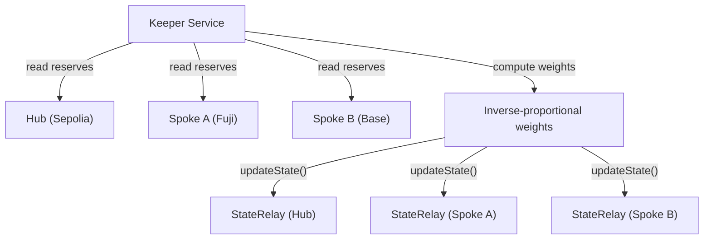
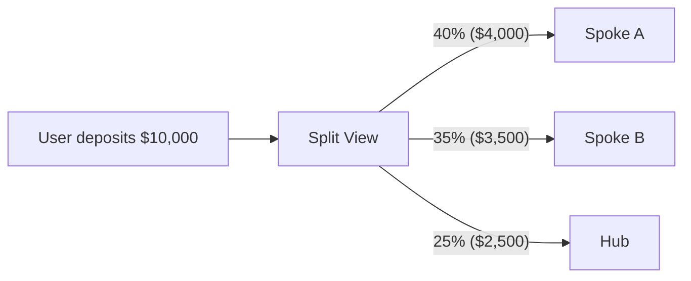
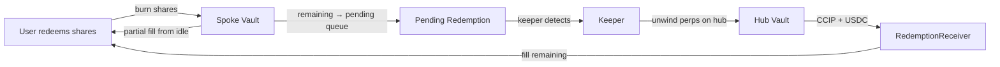

Every multi-chain DeFi app makes you pick the chain. Arbitrum or Optimism? Base or Avalanche? You pick wrong, you get worse execution, higher slippage, or an illiquid pool. And nobody tells you which chain was the right one until after you've committed.

We deleted the chain picker. IndexFlow's hub-and-spoke coordination layer posts routing weights from a keeper, enforces them with an on-chain deposit guard, and splits deposits across spoke chains in the UI -- so users see one deposit flow while capital distributes proportionally to where execution liquidity is deepest.

## Why Hub-and-Spoke

The first version of cross-chain coordination used a CCIP mesh: every chain broadcast pool state to every other chain, and an `IntentRouter` escrowed funds while keepers decided where to route them. That works for 2-3 chains. It does not work for 100.

A mesh of N chains requires O(N²) CCIP messages per sync epoch. At 10 chains that's 90 messages. At 50 chains that's 2,450 messages. CCIP fees scale linearly per message, so the coordination layer becomes more expensive than the deposits it's routing.

Hub-and-spoke collapses this to O(N). Sepolia is the hub -- the sole chain running the perpetual liquidity layer. Spoke chains are deposit-only: they accept USDC, mint basket shares, and hold reserves, but all perp execution happens on the hub. A `StateRelay` contract on each chain receives keeper-posted state (routing weights, global PnL adjustments) in a single transaction per epoch. No mesh, no quadratic messaging, no `IntentRouter` escrow.

## The Signal: Inverse-Proportional Routing

Routing weights are computed off-chain by the keeper service and posted on-chain via `StateRelay.updateState()`. The keeper reads vault reserves on every deployed chain, computes global NAV, and derives per-chain weights that are **inverse-proportional** to each chain's share of total reserves.

Chains with less capital get higher weight. Chains approaching capacity get lower weight. The effect is self-balancing: deposits flow toward underweight chains, preventing any single chain from accumulating a disproportionate share of TVL.



The keeper posts weights, global NAV, and per-chain PnL adjustments every epoch. Each `StateRelay` stores the latest state with a timestamp. Stale state (older than a configurable threshold) causes the deposit guard to reject deposits -- the protocol never routes capital using outdated information.

## On-Chain Deposit Routing Guard

Spoke chains enforce routing discipline at the contract level. `BasketVault` includes a deposit routing guard that checks the caller's deposit amount against the chain's routing weight from `StateRelay`:

```solidity
uint256 maxDeposit = (globalNav * chainWeight) / 10_000;
uint256 currentReserves = _idleUSDC();
require(currentReserves + amount <= maxDeposit, "RoutingGuard: exceeds chain weight");
```

The guard prevents any single chain from accepting more capital than its weight allows. If Spoke A has a 20% weight and the global NAV is $10M, deposits to Spoke A are capped at $2M total reserves. Once a chain reaches its cap, further deposits revert -- the UI steers users to chains with remaining capacity.

This is enforced on-chain, not just in the UI. Even if someone bypasses the frontend and calls the vault directly, the guard holds.

## UI-Driven Deposit Splitting

The frontend reads routing weights from `StateRelay` on each chain and presents a split deposit view. When a user enters a deposit amount, the UI shows how the deposit will be divided across chains:



Each leg is a separate on-chain transaction. The UI presents them as a stepper -- deposit to Chain A, switch network, deposit to Chain B, switch network, deposit to Hub. Privy smart wallets make network switching seamless since the user's address is the same everywhere.

Users can also deposit to a single chain if they prefer. The split view is a recommendation, not a requirement. The on-chain guard ensures no chain exceeds its weight regardless of how the user chooses to distribute.

## Cross-Chain Redemptions

Deposits are straightforward -- USDC goes into the spoke vault and shares are minted locally. Redemptions are harder because the spoke vault may not hold enough idle USDC to fill the full redemption.

When a user redeems on a spoke chain and the vault's idle reserves are insufficient, the redemption enters a **pending** state. The keeper detects pending redemptions, sources USDC from the hub (where perp positions can be unwound), and fills them via CCIP using the `RedemptionReceiver` contract on the spoke chain.



The `RedemptionReceiver` validates inbound CCIP messages, matches them to pending redemption IDs, and transfers USDC to the redeemer. The UI shows redemption status in real time -- instant fills for small redemptions within idle reserves, pending status with keeper fill progress for larger ones.

## PnL Distribution

Spoke chains don't run perps, but their share price must reflect the hub's perp PnL. The keeper computes a global PnL adjustment each epoch and posts it to every chain's `StateRelay`. Each spoke's `BasketVault._pricingNav()` includes this adjustment when calculating share price:

```solidity
int256 pnlAdjustment = stateRelay.getChainPnlAdjustment(localChainSelector);
uint256 adjustedNav = uint256(int256(idleNav) + pnlAdjustment);
```

This ensures share prices stay consistent across chains even though perp execution only happens on the hub. A user who deposited on Spoke A sees the same share price movement as a user on the hub, proportional to their chain's share of global TVL.

## Chain-Invisible UX via Privy Smart Wallets

Each user gets a Privy smart wallet with the same address on every chain. Deposits on any spoke mint shares to that address. Redemptions burn shares from that address. The portfolio view aggregates holdings across all chains. From the user's perspective, they own basket shares -- the chain distribution is a protocol implementation detail.

## What This Means

Hub-and-spoke replaces the mesh coordination model with something that scales. Adding a new spoke chain requires deploying a `BasketVault`, a `StateRelay`, and registering the chain in the keeper's config. No new CCIP peer wiring, no quadratic message growth, no `IntentRouter` escrow complexity.

For spoke chains, the value proposition is pure: deposit infrastructure with routing discipline and share price consistency, backed by the hub's perp execution engine. For users, it means deposits split intelligently across chains without manual chain selection. For the protocol, it means scaling to 100+ chains without coordination overhead growing faster than TVL.

The trust model is explicit: keeper liveness for state posting and redemption fills, CCIP message delivery for cross-chain redemptions, and Privy wallet custody are the external dependencies. Routing weight enforcement and deposit caps are on-chain with no off-chain bypass.

## Get Started

The hub-and-spoke contracts are open source. Read the full technical spec in our [Cross-Chain Coordination docs](/docs/cross-chain-coordination), explore the contracts on [GitHub](https://github.com/reubenr0d/indexflow-prototype/tree/main/src/coordination), or try a deposit on testnet to see routing-guarded deposits in action.
