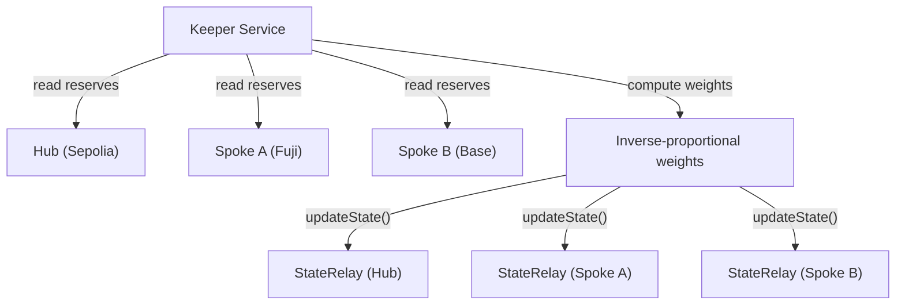
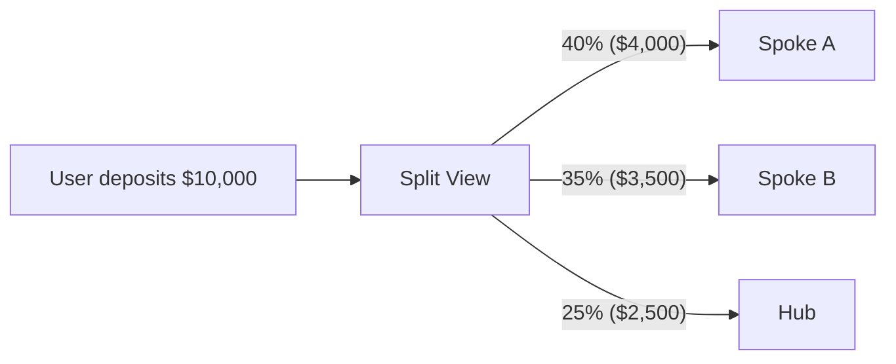
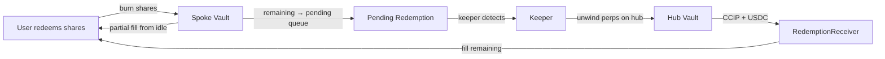

Every multi-chain DeFi app makes you pick the chain. Arbitrum or Optimism? Base or Avalanche? You pick wrong, you get worse execution, higher slippage, or an illiquid pool. And nobody tells you which chain was the right one until after you've committed.

We deleted the chain picker. IndexFlow's hub-and-spoke coordination layer posts routing weights from a keeper, enforces eligibility with an on-chain deposit guard on each `BasketVault`, and **computes** the recommended split in the web app from that weight table. Users walk a stepper of one transaction per chain; **Privy** (embedded smart wallet) handles chain switching and signing so the same address can execute each leg without a manual wallet dance.

## Why Hub-and-Spoke

Hub-and-spoke keeps coordination costs linear in the number of chains. Sepolia is the hub -- the sole chain running the perpetual liquidity layer. Spoke chains are deposit-only: they accept USDC, mint basket shares, and hold reserves, but all perp execution happens on the hub.

A `StateRelay` contract on each chain receives keeper-posted state (routing weights, global PnL adjustments) in a single transaction per epoch. The keeper reads every chain, computes the global table, and writes the result back to each chain directly. That keeps the coordination layer operationally simple even as the number of spokes grows.

## The Signal: Inverse-Proportional Routing

Routing weights are computed off-chain by the keeper service and posted on-chain via `StateRelay.updateState()`. The keeper reads vault reserves on every deployed chain, computes global NAV, and derives per-chain weights that are **inverse-proportional** to each chain's share of total reserves.

Chains with less capital get higher weight. Chains approaching capacity get lower weight. The effect is self-balancing: deposits flow toward underweight chains, preventing any single chain from accumulating a disproportionate share of TVL.



The keeper posts weights and per-vault PnL adjustments every epoch. Each `StateRelay` stores the latest values with timestamps. For **pricing**, if a posted global PnL adjustment is older than `maxStaleness`, the vault stops applying it until the next keeper update (spokes fall back to on-vault USDC only for the adjustment term). The **deposit** path does not use that staleness flag: it only compares the chain's cached routing weight to a vault-level threshold, as below.

## On-Chain Deposit Routing Guard

The contract does **not** recompute how much of a deposit should land on each chain. That split is a **client** concern (see below). On-chain, `BasketVault.deposit()` only answers whether **this** chain is still meant to accept deposits at all, given the latest keeper-posted weight for this chain.

When a `StateRelay` is wired, `deposit()` requires the cached local weight to clear a per-vault minimum (basis points). Chains the keeper has marked as **over-allocated** (low weight in the global table) fall below that threshold and **reject every deposit** until weights move again:

```solidity
if (address(stateRelay) != address(0)) {
    uint256 weight = stateRelay.getLocalWeight();
    require(weight >= minDepositWeightBps, "Chain not accepting deposits");
}
```

`minDepositWeightBps` is owner-configurable (zero means no restriction, for backward compatibility). There is no `amount`-based cap derived from global NAV in `deposit()`; discipline is whether this chain's **posted weight is still high enough** (the keeper still treats it as under-capacity relative to peers) to clear the threshold, not a per-tx reserve ceiling.

This is enforced on-chain, not just in the UI. Even if someone bypasses the frontend and calls the vault directly, an over-allocated chain still reverts until the keeper posts a higher weight for it.

## UI-Driven Deposit Splitting

The frontend reads the routing weight table from `StateRelay` (any instance after a keeper epoch; the table is replicated per chain) and presents a split deposit view. When a user enters a deposit amount, the UI shows how the deposit will be divided across chains:



Each leg is a separate on-chain transaction. The stepper walks the user chain by chain; **Privy** drives approve/deposit sends for the embedded wallet so network switches stay in one product flow. The user's address is the same on every chain.

Users can also deposit to a single chain if they prefer. The split view is a recommendation, not a requirement. Each chain's vault still applies its own weight threshold: you cannot "force" deposits onto a chain the keeper has marked as closed for deposits, no matter how the UI splits the rest.

## Cross-Chain Redemptions

Deposits are straightforward -- USDC goes into the spoke vault and shares are minted locally. Redemptions are harder because the spoke vault may not hold enough idle USDC to fill the full redemption.

When a user redeems on a spoke chain and the vault's idle reserves are insufficient, the redemption enters a **pending** state. The keeper detects pending redemptions, sources USDC from the hub (where perp positions can be unwound), and fills them via CCIP using the `RedemptionReceiver` contract on the spoke chain.



The `RedemptionReceiver` validates inbound CCIP messages, forwards USDC into the target vault, and calls `processPendingRedemption(id)` so the vault completes payout to the user. The UI shows redemption status in real time -- instant fills for small redemptions within idle reserves, pending status with keeper fill progress for larger ones.

## PnL Distribution

Spoke chains don't run perps, but their share price must reflect the hub's perp PnL. The keeper posts a signed **per-vault** global adjustment on every `StateRelay`. `BasketVault._pricingNav()` combines on-vault value, local perp PnL (hub only), and that global term when it is not stale:

```solidity
uint256 base = idleUsdcExcludingFees + perpAllocated;
// Hub: localPnL from VaultAccounting. Spoke: localPnL = 0.
int256 globalAdj;
if (address(stateRelay) != address(0)) {
    (int256 pnl, bool stale) = stateRelay.getGlobalPnLAdjustment(address(this));
    if (!stale) globalAdj = pnl;
}
int256 total = int256(base) + localPnL + globalAdj;
uint256 nav = total > 0 ? uint256(total) : 0;
```

This keeps share pricing aligned with hub execution while deposits and redemptions stay ordinary EVM calls on each chain.

## Chain-Invisible UX via Privy Smart Wallets

Each user gets a Privy smart wallet with the same address on every chain. Deposits on any spoke mint shares to that address. Redemptions burn shares from that address. The portfolio view aggregates holdings across all chains. From the user's perspective, they own basket shares -- the chain distribution is a protocol implementation detail.

## What This Means

Hub-and-spoke scales cleanly. Adding a new spoke chain requires deploying a `BasketVault`, a `StateRelay`, and registering the chain in the keeper's config. The keeper can then incorporate that chain into the routing table and PnL distribution loop without changing the core deposit flow.

For spoke chains, the value proposition is pure: deposit infrastructure with routing discipline and share price consistency, backed by the hub's perp execution engine. For users, it means deposits split intelligently across chains without manual chain selection. For the protocol, it means scaling to 100+ chains without coordination overhead growing faster than TVL.

The trust model is explicit: keeper liveness for state posting and redemption fills, CCIP message delivery for cross-chain redemptions, and Privy wallet custody are the external dependencies. Whether a chain accepts deposits at all is enforced on-chain via the weight threshold; how users **allocate** size across chains is enforced by UX plus economics, not by a second on-chain router.

## Get Started

The hub-and-spoke contracts are open source. Read the full technical spec in our [Cross-Chain Coordination docs](/docs/cross-chain-coordination), explore the contracts on [GitHub](https://github.com/reubenr0d/indexflow-prototype/tree/main/src/coordination), or try a deposit on testnet to see routing-guarded deposits in action.
