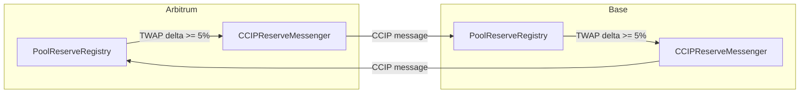
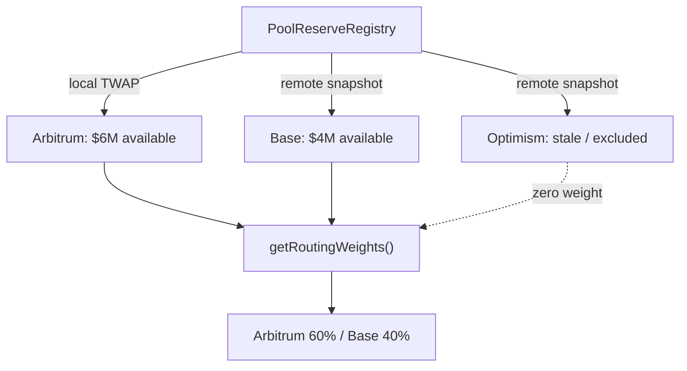
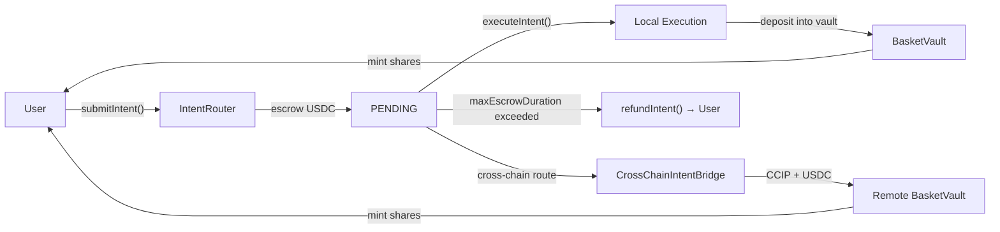

Every multi-chain DeFi app makes you pick the chain. Arbitrum or Optimism? Base or Avalanche? You pick wrong, you get worse execution, higher slippage, or an illiquid pool. And nobody tells you which chain was the right one until after you've committed.

We deleted the chain picker. IndexFlow's cross-chain coordination layer reads GMX pool depth on every chain, syncs state via Chainlink CCIP, and routes deposits proportionally to chains with the deepest available liquidity. The user submits an intent. The protocol does the rest.

## Why Now

Multi-chain DeFi is the default now. Protocols deploy to 5-10 chains. But the routing layer -- the part that decides *where* a user's capital goes -- is still manual. Users choose a chain at deposit time based on vibes, habit, or whichever bridge they used last. The protocol has no say.

This creates three problems. First, liquidity herds onto whichever chain is most popular, not whichever chain has the best execution conditions. Second, less active chains become ghost deployments with thin pools and worse pricing. Third, users who pick the wrong chain get worse outcomes with no recourse.

IndexFlow is a structured exposure protocol. Basket vaults hold allocations across spot and perpetual positions, backed by a shared GMX-fork liquidity pool on each chain. The quality of execution depends directly on the depth of that pool. So we built an on-chain system that makes chain selection a protocol decision, not a user decision.

## The Signal: GMX Pool Depth, Not TVL

Most routing systems use TVL as their signal. TVL is a vanity metric for routing purposes -- it tells you how much is locked, not how much is available for execution. IndexFlow reads `gmxVault.poolAmounts(usdc)` on each chain: the actual USDC available in the shared perpetual pool. This is the execution liquidity that determines whether a deposit can be processed cleanly.

But instantaneous pool reads are gameable. A whale deposit or withdrawal can spike or crater the pool amount in a single block, tricking a naive router into sending deposits to a manipulated chain.

## TWAP: Smoothing the Signal

The `PoolReserveRegistry` contract maintains a time-weighted average of pool depth. Every time `observe()` is called, it advances a cumulative sum:

```solidity
uint256 elapsed = block.timestamp - t.lastObservationTime;
t.cumulativePoolAmount += t.lastPoolAmount * elapsed;
uint256 currentPool = gmxVault.poolAmounts(usdc);
t.lastPoolAmount = currentPool;
t.lastObservationTime = uint48(block.timestamp);
uint256 totalAge = block.timestamp - twapStartTime;
t.twapPoolAmount = t.cumulativePoolAmount / totalAge;
```

This accumulator is gas-efficient (no checkpoint arrays) and damps single-block manipulation. The default TWAP window is 30 minutes. If observations become stale beyond `maxObservationAge`, the registry falls back to the instantaneous pool read rather than serving indefinitely stale data.

`observe()` is piggybacked on user-initiated operations (intent submissions, executions), so the TWAP advances naturally with protocol activity without requiring a dedicated keeper.

## Syncing State Across Chains with CCIP

Each chain runs its own `PoolReserveRegistry`. The `CCIPReserveMessenger` broadcasts pool snapshots to peer chains via Chainlink CCIP. But broadcasting every block would be expensive and unnecessary.



The messenger uses **delta-triggered** broadcasts: it only sends when the TWAP pool amount has moved by at least 5% (configurable via `broadcastThresholdBps`) relative to the last broadcast, *or* when a `maxBroadcastInterval` backstop timer expires. This balances freshness against CCIP fees.

On the receiving side, inbound messages are validated against a peer allowlist (source chain + sender address) and rate-limited per chain per hour. A `maxDeltaPerUpdate` circuit breaker rejects remote state updates where the TWAP moved by more than the configured threshold in a single message, preventing a compromised peer from injecting extreme values.

## Proportional Routing Weights

`getRoutingWeights()` returns per-chain weights in basis points that sum to 10,000. The formula is straightforward: each chain's weight is proportional to its `availableLiquidity` (TWAP pool minus reserved). Chains whose remote snapshot is stale (older than `maxStaleness`) or whose oracle adapter reports broken feeds are excluded with zero weight.



This is proportional routing, not winner-take-all. If Arbitrum has 60% of the available liquidity and Base has 40%, deposits split 60/40, not 100/0. This prevents herding and keeps all chains liquid.

If total available liquidity across all chains is zero, routing falls back to 100% local execution as a safety default.

## Intent-Based Deposits: Escrow, Execute, or Refund

Users don't call `deposit()` on a specific chain's vault. They submit a deposit **intent** to the `IntentRouter`:



1. **Submit**: User calls `submitIntent()`. USDC is pulled into the router's escrow. The intent is recorded as PENDING.
2. **Execute (local)**: A keeper calls `executeIntent()` to deposit the escrowed USDC into a basket vault on this chain, minting shares to the user. Or the user can call `submitAndExecute()` for immediate local execution with MEV protection.
3. **Execute (cross-chain)**: The keeper routes the intent to `CrossChainIntentBridge`, which sends the USDC and intent metadata via CCIP to the destination chain. On arrival, the bridge deposits into the target basket vault and mints shares to the user's address.
4. **Refund**: If the intent sits in escrow longer than `maxEscrowDuration`, anyone can call `refundIntent()` to return the USDC to the user. No funds can be stuck.

The `IntentRouter` is UUPS upgradeable (it holds user funds in escrow, so upgradeability is essential for bug fixes) and the `CrossChainIntentBridge` is stateless (it relays, never holds).

## Chain-Invisible UX via Privy Smart Wallets

The final piece is Privy account abstraction. Each user gets a smart wallet that has the same address on every chain. When the `CrossChainIntentBridge` mints shares on a destination chain, they go to the same address the user logged in with. From the user's perspective, they deposited USDC and received basket shares. They never chose a chain, signed a bridge transaction, or worried about gas on the destination.

## Oracle Consistency: Quorum-Based Config Consensus

Multi-chain deployments have an oracle drift problem: each chain's `OracleAdapter` could be configured with different staleness thresholds, deviation bands, or feed types, causing NAV discrepancies for the same basket across chains.

`OracleConfigQuorum` solves this without relying on a single home chain. The same contract is deployed symmetrically on every chain. An admin on any chain proposes a config change; the proposal is broadcast to all peers via CCIP. Each peer stores the vote, and when a configurable quorum threshold (e.g. 2-of-3 chains) is reached with matching config hashes, the config is auto-applied to the local `OracleAdapter`. Chain-specific Chainlink feed addresses are preserved locally. This guarantees consistent oracle parameters everywhere without requiring manual coordination or trusting a single canonical chain.

## What This Means

The coordination layer changes the operational model for multi-chain structured products. Instead of deploying independently to each chain and hoping users distribute themselves efficiently, the protocol actively measures execution conditions and routes capital accordingly.

For vault operators, this means every chain stays liquid. For users, it means better execution regardless of which chain they happen to be connected to. For the protocol, it means TVL distributes according to actual execution capacity rather than social proof or marketing spend.

The trust model is explicit: CCIP message delivery, keeper honesty for intent execution, and Privy wallet custody are the external dependencies. Everything else -- TWAP integrity, routing weights, escrow safety, oracle config quorum -- is enforced on-chain with configurable circuit breakers and fallbacks.

## Get Started

The coordination layer contracts are open source. Read the full technical spec in our [Cross-Chain Coordination docs](/docs/cross-chain-coordination), explore the contracts on [GitHub](https://github.com/reubenr0d/indexflow-prototype/tree/main/src/coordination), or try a deposit on testnet to see intent-based routing in action.
