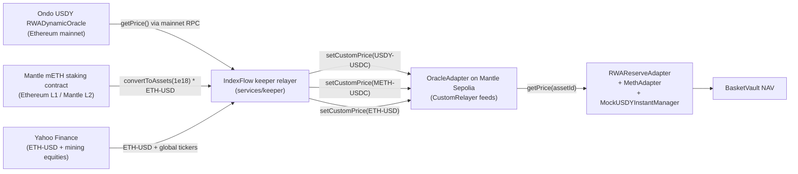

For the [Mantle Turing Test 2026](https://dorahacks.io/hackathon/mantleturingtesthackathon2026/detail), we are shipping seven AI-managed vaults to Mantle in a single deployment.

Five of them are new. Two are the mining-equity agents already running on Sepolia. They all share the same vault contracts, the same perp engine, the same oracle adapter, the same agent runner, and the same on-chain decision log. The difference between any two of them is one markdown file.

This post walks through what the fleet is, why Mantle's RWA primitives unlock vaults we could not build anywhere else today, and the one design constraint we held the line on: **no mocked prices**. Anywhere.

## The Roster

Seven vaults, seven agents, one Mantle hub.

| #   | Vault                         | Agent                           | Track                       | What the AI does                                  |
| --- | ----------------------------- | ------------------------------- | --------------------------- | ------------------------------------------------- |
| 1   | Minestarters ML Picks         | `mining-manager`                | AI x RWA                    | Atlas ML long/short of mining equities            |
| 2   | Minestarters Quality Matrix   | `quality-matrix-manager`        | AI x RWA                    | 8-category analyst-grade quality scoring          |
| 3   | USDY Treasurer                | `rwa-treasurer`                 | AI x RWA                    | Rebalances Ondo USDY reserve to target bps        |
| 4   | mETH Delta-Neutral Carry      | `meth-carry-manager`            | AI x RWA                    | Holds mETH, shorts ETH, manages hedge ratio       |
| 5   | RWA Yield Router              | `rwa-yield-router`              | AI x RWA                    | Rotates reserve across USDY / mUSD / mETH         |
| 6   | Funding-Rate Harvester        | `funding-rate-harvester`        | AI Trading & Strategy (BGA) | Delta-neutral funding arb: internal perp vs Bybit |
| 7   | Smart-Money Mirror            | `smart-money-mirror-manager`    | AI Alpha & Data (Mirana)    | Nansen + Envio anomaly-driven Mantle basket       |

Vaults 1–5 chase the headline AI x RWA track. Vaults 6 and 7 are scoped to satisfy the BGA and Mirana sponsor tracks respectively, each with the data source the sponsor brief explicitly names (Bybit for BGA, Nansen for Mirana). All seven contribute to Grand Champion eligibility because the rubric rewards ecosystem breadth across tracks rather than a single deep submission.

This is not a marketing arrangement. The vault primitive is the same across all seven: USDC enters, the agent allocates between an RWA reserve and synthetic perp positions, the share token settles in USDC on redemption. The differentiation is entirely upstream — in the markdown file that defines what the agent does with the same toolset.

## Why Mantle Specifically

We have been running [two production agents on Sepolia](/blog/two-ai-agents-live-on-testnet) for a month. The protocol works there. So why move?

Mantle is the only public testnet environment where you can simultaneously touch:

- **Ondo USDY** — tokenized US Treasury notes with on-chain interest accrual via Ondo's `RWADynamicOracle.getPrice()` at [`0xA96abbe61AfEdEB0D14a20440Ae7100D9aB4882f`](https://mantlescan.xyz/address/0xA96abbe61AfEdEB0D14a20440Ae7100D9aB4882f) on Mantle mainnet
- **Ondo mUSD** — a $1-pegged rebasing variant of USDY at [`0xab575258d37EaA5C8956EfABe71F4eE8F6397cF3`](https://mantlescan.xyz/address/0xab575258d37EaA5C8956EfABe71F4eE8F6397cF3), suited to compliance-conservative balance sheets that want a stable share price
- **Mantle mETH** — restaked ETH yield token with validator-driven exchange-rate growth via the canonical Staking contract at `0xe3cBd06D7dadB3F4e6557bAb7EdD924CD1489E8f` on Ethereum L1, mirrored to L2 mETH at `0xcDA86A272531e8640cD7F1a92c01839911B90bb0`

No other L2 currently has all three primitives live, audited, and indexable. Ethereum mainnet does, but at gas costs that make a perp engine impractical for a vault with anything less than seven figures of TVL. Mantle solves both — sub-cent gas for the perp opens and closes, and first-class RWA tokens on the same chain.

For a fleet of vaults that need to hold real-world-asset reserves *and* trade synthetic perps cheaply on the same balance sheet, Mantle is structurally the right home.

## The Constraint: No Mocked Prices

Here is the constraint we wrote down at the start of the build and refused to break.

> No price in any contract may be set by an admin, hardcoded into a mock, or invented by a yield curve.

This is a stricter rule than it sounds. The natural way to build an RWA testnet demo on Mantle Sepolia is to deploy mock tokens (USDY, mUSD, mETH do not exist on Sepolia) with linear yield curves baked into their oracle reads — say 5% APR for USDY, 4% APR for mETH. That works, the numbers look believable, the chart slopes up.

It is also exactly what makes RWA testnet demos uninteresting. The "yield" is whatever the developer typed into a constant. A strategy that performs well against that data tells you nothing about how it would perform against Ondo's actual treasury-bill accrual or Mantle's actual validator returns.

So we held a different bar. On testnet, the token contracts themselves are mocks (because the real USDY / mUSD / mETH ERC20s do not exist on Mantle Sepolia, and Ondo will not whitelist a testnet vault through OndoIDRegistry without KYC anyway). But **every price the contracts read comes from a real off-chain source**, posted on-chain by the same keeper relayer pattern that already powers the existing mining-equity vaults.



When `RWAReserveAdapter.getReserveValueUsdc()` runs to value the USDY held on behalf of a vault, it does this:

```28:32:src/rwa/RWAReserveAdapter.sol
    /// @notice OracleAdapter precision (matches the perp engine).
    uint256 public constant ORACLE_PRECISION = 1e30;

    /// @notice Decimal scaler 1e18 <-> 1e6.
    uint256 public constant E12 = 1e12;
```

```196:217:src/rwa/RWAReserveAdapter.sol
    /// @dev Value `amount` of `token` in USDC units (6 decimals) using
    ///      OracleAdapter for USDY and mETH, $1-flat for mUSD.
    function _valueInUsdc(ReserveToken token, uint256 amount) internal view returns (uint256) {
        if (token == ReserveToken.USDY) {
            uint256 price = _readPrice1e30(usdyUsdcAssetId);
            // amount (1e18) * price (1e30) / (1e12 * 1e30) -> 1e6
            return (amount * price) / (E12 * ORACLE_PRECISION);
        }
        if (token == ReserveToken.MUSD) {
            // mUSD is rebasing $1-pegged: balance/1e12 is the USDC value.
            return amount / E12;
        }
        // mETH: same shape as USDY but uses the methUsdcAssetId feed.
        uint256 priceMeth = _readPrice1e30(methUsdcAssetId);
        return (amount * priceMeth) / (E12 * ORACLE_PRECISION);
    }

    function _readPrice1e30(bytes32 assetId) internal view returns (uint256 price) {
        require(!oracleAdapter.isStale(assetId), "RWA price stale");
        (price, ) = oracleAdapter.getPrice(assetId);
        require(price > 0, "RWA price zero");
    }
```

The `_readPrice1e30` call goes to the exact same `OracleAdapter` that prices BHP.AX and FDY.TO for the mining agents — same staleness guards, same custom-relayer pattern, same keeper. The keeper just gets a new job on its cron: once per epoch, query Ondo's mainnet `RWADynamicOracle.getPrice()` via a mainnet RPC, query Mantle's mainnet mETH exchange rate, and post both as `setCustomPrice` updates on the Mantle Sepolia `OracleAdapter`.

The result: USDY yield surfaces in the on-chain NAV at exactly the rate Ondo's treasury portfolio is actually earning. mETH's restaking yield surfaces at exactly the rate Mantle validators are actually paying. Neither rate was typed by us.

The only place "mockness" remains is the ERC20 token contracts themselves. `MockUSDY`, `MockMUSD`, and `MockMETH` are plain mintable ERC20s with no yield logic and no price logic. They exist solely because the real tokens cannot be acquired by a testnet vault. On mainnet, the deploy script swaps them for the real contracts and nothing else changes — the adapter, the keeper, the agents, and the vault math are unchanged.

## The Reserve Adapter

The structural addition to the protocol is a per-vault [`RWAReserveAdapter`](https://github.com/reubenr0d/indexflow-prototype/blob/main/src/rwa/RWAReserveAdapter.sol). Each vault gets its own adapter instance pinned to one BasketVault via `onlyVault` access control. The adapter holds exactly one reserve token at a time — USDY, mUSD, or mETH — and exposes three mutating operations:

- `deposit(usdcAmount)` — pulls USDC from the vault, routes it through the configured primitive (Ondo InstantManager for USDY, mUSD wrapper for mUSD, the MethAdapter for mETH), holds the resulting reserve token.
- `withdraw(usdcAmount)` — computes how much reserve token to redeem using the OracleAdapter price, calls the primitive's redeem path, returns USDC to the vault.
- `setReserveToken(newToken)` — atomically redeems the entire current reserve to USDC and re-subscribes into the new token. Capped at one rotation per 24h to prevent agent churn.

The `BasketVault` calls `adapter.getReserveValueUsdc()` inside its NAV calculation. Investors hold vault shares that reflect both the perp PnL and the RWA reserve's appreciation. When USDY's price ticks up, every share-holder's NAV ticks up at the same time. No claim periods, no admin-triggered yield distributions, no off-chain reconciliation. The on-chain NAV is the ledger.

That is a structural property of the design, not a feature. We picked it because the alternative — separate yield-distribution events that the vault has to track and the agent has to react to — adds state we cannot justify when the yield is already a deterministic function of an external price.

## What Each New Agent Actually Does

The agent files are short. The strategy lives in a few hundred words of system prompt. Here is what each of the five new agents is responsible for:

**[`rwa-treasurer`](https://github.com/reubenr0d/indexflow-prototype/blob/main/agents/rwa-treasurer.md)** is the non-trading agent. It reads the pending redemption queue from Envio, current reserve holdings from the adapter, and the target reserve ratio `rwaTargetBps` on the vault. If too much USDC is sitting idle versus the target, it calls `allocateToRWA`. If the redemption queue is approaching the available USDC, it calls `withdrawFromRWA` to free liquidity. It cannot open perp positions; the `writeTools` whitelist excludes everything except reserve calls.

**[`meth-carry-manager`](https://github.com/reubenr0d/indexflow-prototype/blob/main/agents/meth-carry-manager.md)** runs a delta-neutral mETH carry book. It holds mETH as reserve and opens a synthetic ETH short on the internal perp engine sized to a target hedge ratio (default 1.0x, agent may flex to 0.85x–1.05x based on funding signal). It rebalances the hedge when mETH/ETH drifts more than 50 basis points or when funding flips by more than 100 basis points annualized. The strategy earns mETH staking yield while staying flat on ETH price exposure.

**[`rwa-yield-router`](https://github.com/reubenr0d/indexflow-prototype/blob/main/agents/rwa-yield-router.md)** reads net realised yield across USDY, mUSD, and mETH and decides which primitive each managed vault should be parked in. The router calls `setReserveToken` to rotate when a competing primitive offers more than 75 basis points of annualized advantage net of slippage. The 24-hour cooldown is in the contract, not the agent, so the constraint is enforceable rather than aspirational.

**[`funding-rate-harvester`](https://github.com/reubenr0d/indexflow-prototype/blob/main/agents/funding-rate-harvester.md)** reads funding from the internal `VaultAccounting` (per-epoch) and from Bybit perp (via the new `apps/mcps/bybit` MCP server, read-only). When annualized funding spread crosses 8%, it opens a one-sided position on the internal perp — long on the cheap-funding side. For v1, execution stays internal; Bybit is sentiment only. A v2 stretch unlocks Bybit execution via the Byreal Perps CLI, which would also satisfy the Agentic Wallets track.

**[`smart-money-mirror-manager`](https://github.com/reubenr0d/indexflow-prototype/blob/main/agents/smart-money-mirror-manager.md)** pulls smart-money holdings on Mantle ecosystem tokens via the new Nansen MCP and pairs them with on-chain anomaly signals from Envio (large swaps, whale outflows on Mantle DEX pools). It builds a 5–8 asset Mantle basket weighted by smart-money confidence and opens synthetic long perp positions priced via a new Mantle DEX TWAP relayer that pushes 5-minute TWAPs into the same `OracleAdapter`. Rebalances weekly. If `NANSEN_API_KEY` is unset, the Nansen MCP falls back to a degraded Envio-only mode rather than failing.

Each of these is a markdown file. The same `agent-runner.mjs` that drives the two production mining agents drives all five new ones. The same risk-officer second-pass review wraps their writes. The same `agents/memory/` substrate carries their state across runs. The same `AgentDecisionLog` contract receives a `logDecision` event for every on-chain action with a `rationaleHash = keccak256(llmReasoning)` so an auditor can verify the agent's stated reasoning matches what shipped to the chain.

## The Three Tracks

A single Mantle deployment with the right composition lets us nominate to three sponsor tracks rather than picking one.

**AI x RWA (Mantle sponsor)** is the centerpiece. Five of the seven vaults hold real-world assets — two carry tokenized mining-equity exposure via the on-chain OracleAdapter, three sit directly on Ondo and Mantle RWA primitives. The track brief's example direction "Intelligent RWA portfolio management agent" is satisfied at least four times over. The "compliance awareness" scoring weight is addressed by an `IComplianceGate` hook in `BasketVault.deposit()` plus a `/compliance` page documenting USDY redemption mechanics and risk disclosures.

**AI Trading & Strategy (BGA sponsor)** specifies Bybit support in the brief. Vault 6 reads from Bybit. Every funding-rate-harvester decision lands on the on-chain decision log with the rationale hash, so judges can verify the strategy's signal-to-execution mapping without taking our word for anything. Because the strategy is delta-neutral, an external Sharpe ratio can be computed from the chain history alone.

**AI Alpha & Data (Mirana sponsor)** specifies Nansen support and calls out Telegram/Discord bots as an example direction. Vault 7 uses Nansen. A small `apps/telegram-bot` service subscribes to `AgentDecisionLog.DecisionLogged` events via Envio's GraphQL subscription and posts every agent decision — across all seven vaults, not just the smart-money mirror — to a public `@indexflow_mantle` channel with the rationale and the Mantlescan tx link.

**Grand Champion**, **20-Project Deployment Award**, **Best UI/UX**, and **Community Voting** are downstream of the same submission package. We need verified contracts on Mantlescan, a public deployment, and a coherent submission narrative. All three flow from the same work.

## The Honest Caveats

A submission post should say what it cannot say.

The USDY, mUSD, and mETH ERC20s on this deployment are mocks. They are mocks because Mantle Sepolia does not host the real tokens, not because we wanted to avoid the integration. On mainnet, the deploy script swaps in the real `0x5bE26527e817998A7206475496fDE1E68957c5A6` USDY contract, the real `0xab575258d37EaA5C8956EfABe71F4eE8F6397cF3` mUSD, and the real Mantle mETH staking contract. The adapter, the keeper, the agents, and the vault math are unchanged across the swap.

Ondo's mainnet USDY subscription requires the calling address to be registered in the OndoIDRegistry. That is a KYC step we do not satisfy on a hackathon-deployment timescale. A mainnet IndexFlow vault that wants real USDY backing has to either (1) get its vault operator wallet whitelisted through Ondo's standard onboarding process or (2) hold rUSDY (the rebasing wrapper) acquired via a secondary market route. Both paths exist; neither is plausible in 23 days. The testnet demo uses our mocks-with-real-prices design specifically to give a credible preview of the mainnet behaviour without papering over the whitelist requirement.

mUSD on testnet has zero yield. Real mainnet mUSD earns yield via rebase — token balances grow at Ondo's published APY. We made a deliberate choice not to simulate rebase on testnet because there is no honest off-chain price feed for it; you would have to admin-set the rebase rate, which is exactly the mocked-yield surface we refused to ship. So testnet mUSD is a 0%-yield, $1-pegged, compliance-friendly reserve. The yield-router agent can still rotate into it for risk-off posture; it just will not out-earn USDY or mETH there. On mainnet, the rebase yield surfaces naturally via balance growth.

PnL on this deployment is synthetic perpetual PnL settled against on-chain oracle prices, not realized cash-equity returns. Real markets have real spreads. The [next-proof-step note from the previous post](/blog/two-ai-agents-live-on-testnet#the-next-proof-step) still applies: we are working toward a paper-trading sidecar that reconciles testnet trades against real-market fills. That work is independent of this submission.

## Try It

When the deployment is live, the submission package will include:

- **Mantle Sepolia hub**: all seven contracts verified on Mantlescan, deployment addresses documented in [docs/DEPLOYMENTS.md](https://github.com/reubenr0d/indexflow-prototype/blob/main/docs/DEPLOYMENTS.md)
- **Fleet page**: live NAV + cumulative return for all seven vaults side-by-side at `indexflow-mantle.vercel.app/fleet`, with the agent identity tokenId and decision-log link per vault
- **RWA page**: per-vault reserve token (USDY / mUSD / mETH) and accrued yield at `/rwa`, populated from Envio
- **Mantle landing**: a one-screen judge-optimized hero at `/mantle` with the demo video embed, deployment addresses, and all seven agent cards
- **Telegram channel**: real-time broadcast of every agent decision at `@indexflow_mantle`
- **Demo video**: at least one trade per agent — mining-equity long, mETH carry rebalance, funding arb open, smart-money rotation, RWA yield rotation

The repo is open source at [github.com/reubenr0d/indexflow-prototype](https://github.com/reubenr0d/indexflow-prototype). The agent definitions are in `agents/`. The reserve adapter, MethAdapter, and oracle wiring are in `src/rwa/`. The keeper relayer that bridges the Ondo and Mantle mainnet price reads onto the testnet OracleAdapter is in `services/keeper/`.

If you want to write your own agent on top of this surface, the [agent framework docs](/docs/agents-framework) walk through skills, MCP tools, and the runtime contract. The seven agents in this submission are not a closed set — they are seven examples of what one file plus the IndexFlow protocol surface can do.

## Further reading

- [Two AI Agents Are Live on Our Testnet](/blog/two-ai-agents-live-on-testnet) — the two production mining agents that anchor vaults 1 and 2 in this fleet
- [Your Vault Manager Is a Markdown File](/blog/autonomous-ai-agents-managing-vaults) — how the agent runner, memory layer, and risk-officer review work end-to-end
- [Five Waves of On-Chain Exposure](/blog/five-waves-on-chain-exposure) — where IndexFlow's reserve-backed redeemability fits in the broader category evolution
- [The IndexFlow Agent Company](/blog/indexflow-agent-company) — the manifest and governance constraints that sit around the agents
