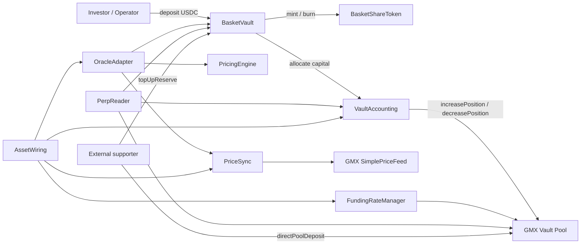
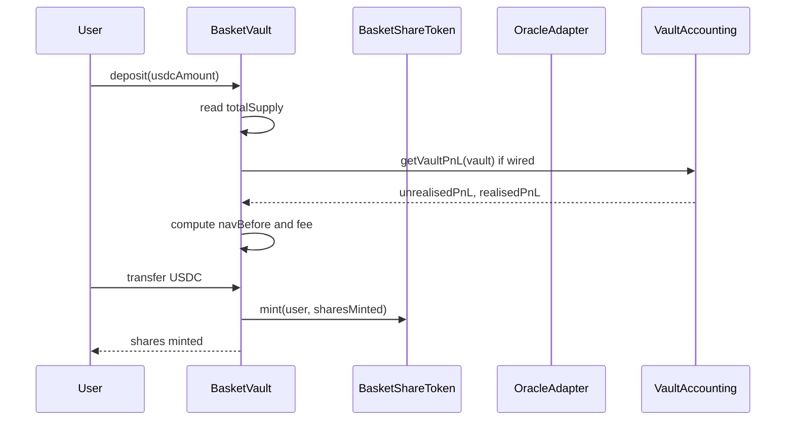
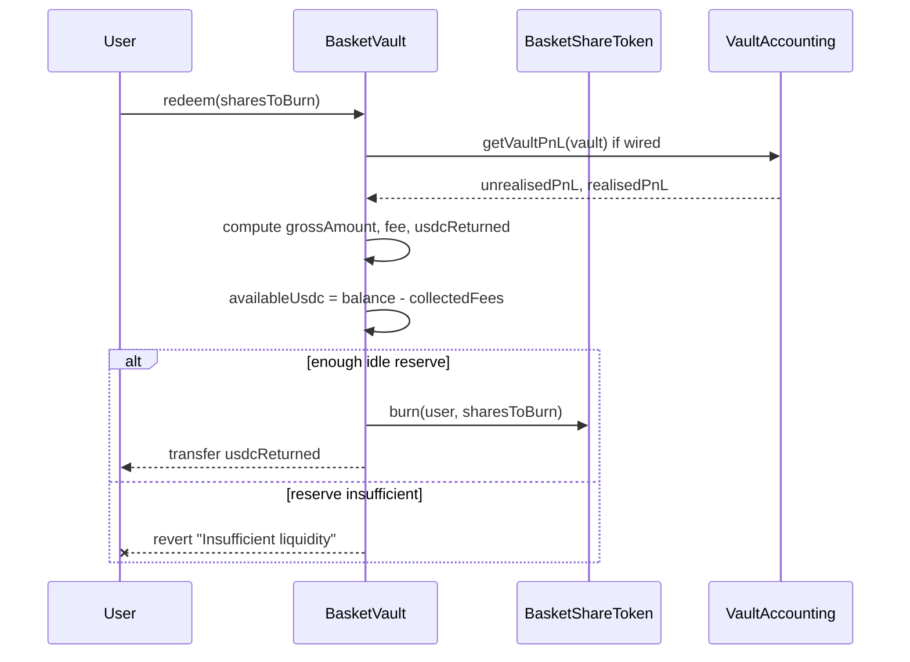
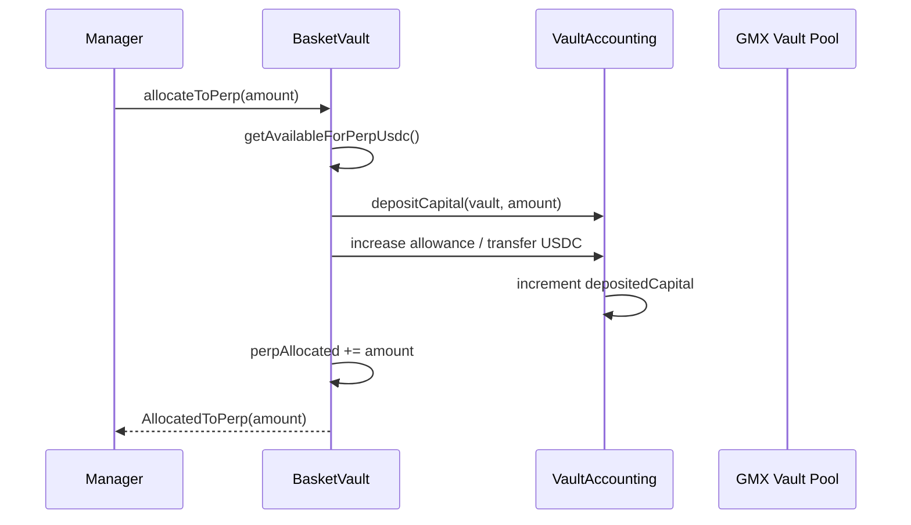
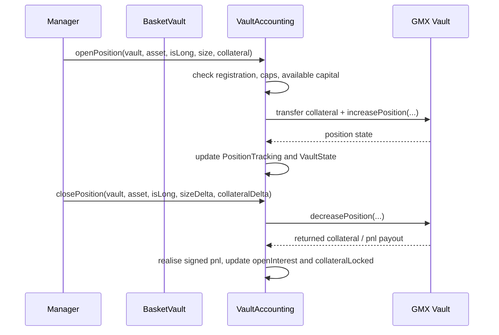
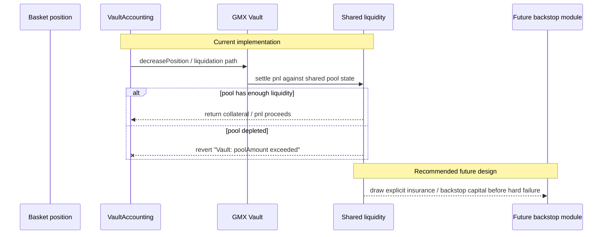
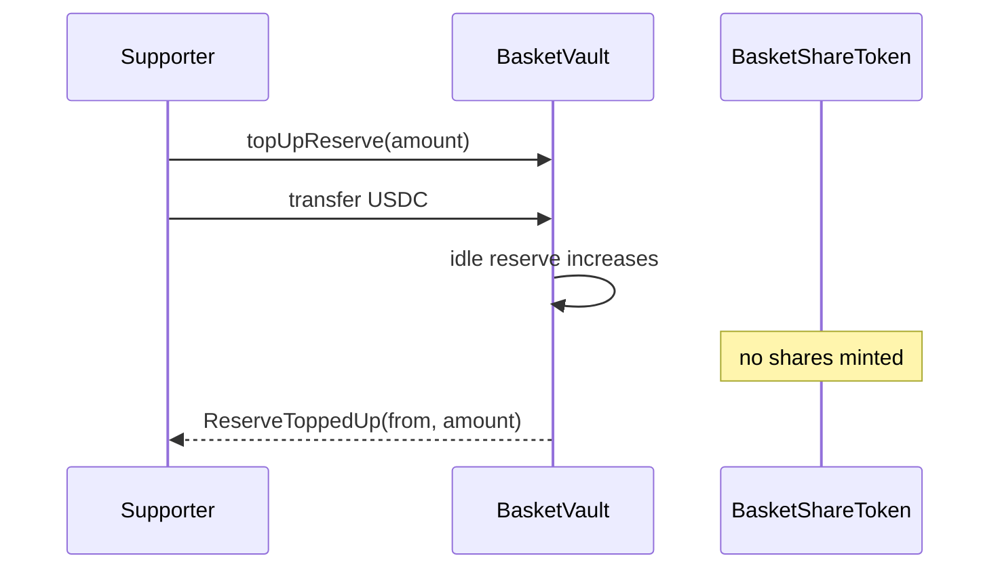
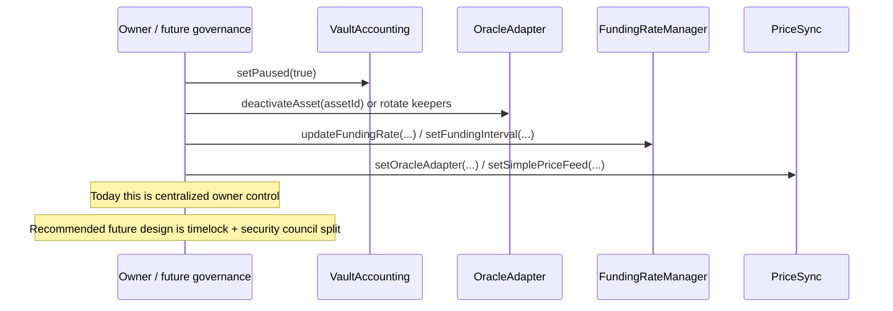

# IndexFlow Technical Whitepaper

Status: technical repository draft  
Date: 2026-04-14  
Scope: current repository implementation plus explicitly labeled roadmap items

This document is the canonical engineering whitepaper for the current `snx-prototype` repository snapshot. When repository markdown, slide language, and deployed code diverge, this document treats code as the source of truth for implemented behavior and labels everything else as draft or recommendation.

Status labels used throughout:

- `Implemented today` means the behavior exists in this repository’s current contracts, scripts, tests, or read models.
- `Documented in repo drafts` means the behavior appears in repository markdown or planning docs but is not implemented on-chain.
- `Recommended future design` means a design recommendation made in this paper to reconcile the current repo with the target IndexFlow architecture.

## Abstract

IndexFlow is a structured-exposure protocol built around basket vaults that accept USDC, mint transferable basket shares, and optionally allocate part of their capital into a shared perpetual-liquidity layer derived from a GMX v1 fork. The protocol’s core economic truth is explicit in the current implementation: basket shares are priced from mark-to-market vault NAV, but redemptions are paid only from idle USDC held by the basket. That makes reserve depth a hard product-quality parameter rather than a secondary growth metric.

In the current repo, `BasketVault` holds user funds, prices shares from idle USDC plus perp allocation plus attributed PnL, and gates redemptions by immediate idle liquidity. `VaultAccounting` sits between baskets and the shared GMX vault, tracks per-basket capital buckets and realized/unrealized PnL, and opens positions in a shared counterparty pool. `OracleAdapter`, `PricingEngine`, `FundingRateManager`, `PriceSync`, `PerpReader`, and `AssetWiring` provide the oracle, pricing, funding, monitoring, and deployment surfaces around that core. Code refs: `src/vault/BasketVault.sol` `L12-L313`; `src/perp/VaultAccounting.sol` `L12-L513`; `src/perp/OracleAdapter.sol` `L7-L286`; `src/perp/PricingEngine.sol` `L7-L150`; `src/perp/FundingRateManager.sol` `L8-L241`; `src/perp/PriceSync.sol` `L7-L183`; `src/perp/PerpReader.sol` `L11-L262`; `src/perp/AssetWiring.sol` `L19-L86`.

This paper formalizes the current implementation, identifies the exact places where repo code stops and roadmap language begins, and proposes a coherent next-step architecture for governance, tokenomics, backstops, and multi-chain expansion.

## Introduction and protocol thesis

IndexFlow’s thesis is that structured exposure should be the primary user abstraction, while a shared perpetual-liquidity substrate handles execution and capital efficiency underneath it. The basket is what the investor owns; the shared pool is what makes the strategy executable at scale.

The current repository already encodes three defining protocol choices:

1. Basket shares are transferable ERC-20 instruments with 6 decimals via `BasketShareToken`, minted and burned only by the parent vault. Code refs: `src/vault/BasketShareToken.sol` `BasketShareToken.constructor()` `L21-L24`; `BasketShareToken.decimals()` `L27-L29`; `BasketShareToken.mint()` `L34-L36`; `BasketShareToken.burn()` `L41-L43`.
2. Basket NAV is not just idle cash. It includes idle USDC, capital allocated to the perp module, realized PnL, and unrealized PnL when `VaultAccounting` is wired. Code refs: `src/vault/BasketVault.sol` `_totalVaultValue()` `L294-L296`; `_pricingNav()` `L299-L305`.
3. Redemption liquidity is not equal to NAV. `redeem()` prices against `_pricingNav()` but hard-reverts if the vault does not hold enough idle USDC after reserved fees. Code refs: `src/vault/BasketVault.sol` `BasketVault.redeem()` `L172-L191`.

That third choice is the central design truth the whitepaper should preserve. In IndexFlow, total value and redeemable liquidity are different state variables. This is not a documentation caveat. It is the main solvency and UX constraint around which the protocol must be designed.

The repo’s supporting docs already explain this operating model from both investor and operator perspectives. Code-adjacent doc refs: `docs/SHARE_PRICE_AND_OPERATIONS.md`; `docs/ASSET_MANAGER_FLOW.md`; `docs/INVESTOR_FLOW.md`; `docs/GLOBAL_POOL_MANAGEMENT_FLOW.md`.

## System overview and module map

The current repository is best understood as a basket layer on top of a shared GMX-derived perp stack with a separate monitoring surface and a deployment/wiring surface.



### Current module map

| Module | Status | Responsibility | Trust model | Key references |
| --- | --- | --- | --- | --- |
| `BasketVault` | Implemented today | Accepts USDC, mints shares, prices NAV, gates redemption, allocates to perp module, supports non-dilutive reserve top-ups | `Ownable`, non-upgradeable, `ReentrancyGuard` | `src/vault/BasketVault.sol` `L12-L313` |
| `BasketShareToken` | Implemented today | Transferable 6-decimal share token | Mint/burn restricted to parent vault | `src/vault/BasketShareToken.sol` `L6-L43` |
| `BasketFactory` | Implemented today | Deploys baskets, sets fees, optionally registers them with `VaultAccounting` | `Ownable`, non-upgradeable | `src/vault/BasketFactory.sol` `L8-L84` |
| `VaultAccounting` | Implemented today | Tracks per-basket capital, PnL, open interest, collateral, and shared-pool position lifecycle | `Ownable` + `wirers`, non-upgradeable, `ReentrancyGuard` | `src/perp/VaultAccounting.sol` `L12-L513` |
| `OracleAdapter` | Implemented today | Normalized oracle for Chainlink and custom-relayed prices | `Ownable` + keepers + wirers | `src/perp/OracleAdapter.sol` `L7-L286` |
| `PricingEngine` | Implemented today | Deterministic oracle-plus-impact execution quote model | `Ownable`, read-only at execution time | `src/perp/PricingEngine.sol` `L7-L150` |
| `FundingRateManager` | Implemented today | Calculates and pushes GMX funding parameters | `Ownable` + keepers + wirers | `src/perp/FundingRateManager.sol` `L8-L241` |
| `PriceSync` | Implemented today | Syncs `OracleAdapter` prices into GMX `SimplePriceFeed` | `Ownable` + wirers; sync itself is permissionless | `src/perp/PriceSync.sol` `L7-L183` |
| `PerpReader` | Implemented today | Read aggregation for dashboards and monitoring | Stateless, immutable references | `src/perp/PerpReader.sol` `L11-L262` |
| `AssetWiring` | Implemented today | One-transaction local/testnet asset bootstrap across oracle, GMX, and perp stack | `Ownable` for `govCall`, but `wireAsset()` is permissionless | `src/perp/AssetWiring.sol` `L19-L86` |
| Deploy scripts | Implemented today | Local stack deployment, GMX fork bootstrapping, keeper wiring, BHP.AX seeding | Deployer-controlled scripts | `script/DeployLocal.s.sol` `L34-L162` |
| Subgraph | Implemented today | Basket state, activity, snapshots, exposure, protocol state | Off-chain indexer | `apps/subgraph/schema.graphql` `L1-L182`; `apps/subgraph/src/mappings/helpers.ts` `L74-L222` |

### Read-model surface

The protocol already has a separate read plane. `PerpReader` exposes basket snapshots, pool utilization, oracle state, and GMX position reads. The subgraph persists basket-level fee, reserve, activity, and exposure state via `Basket`, `BasketSnapshot`, `BasketExposure`, `VaultStateCurrent`, `OraclePriceUpdate`, and related entities. Code refs: `src/perp/PerpReader.sol` `getBasketInfo()` `L103-L117`; `getPoolUtilization()` `L202-L212`; `apps/subgraph/schema.graphql` `L1-L182`; `apps/subgraph/src/mappings/helpers.ts` `refreshBasketFromChain()` `L74-L127`; `syncBasketSnapshot()` `L134-L188`.

## Vault and NAV accounting specification

### Accounting identities

`Implemented today`

The current basket accounting model is:

```text
idleUsdc = max(usdc.balanceOf(vault) - collectedFees, 0)
bookValue = idleUsdc + perpAllocated
pricingNav = max(bookValue + realisedPnL + unrealisedPnL, 0)
sharePrice = PRICE_PRECISION                      if totalSupply == 0
sharePrice = pricingNav * PRICE_PRECISION / totalSupply otherwise
```

Deposit minting and redemption math are:

```text
depositFee = usdcAmount * depositFeeBps / 10_000
netDeposit = usdcAmount - depositFee
sharesMinted = netDeposit                         if totalSupply == 0
sharesMinted = netDeposit * totalSupply / navBefore otherwise

grossRedeem = sharesToBurn * pricingNav / totalSupply
redeemFee = grossRedeem * redeemFeeBps / 10_000
usdcReturned = grossRedeem - redeemFee
require(usdcReturned <= idleUsdc, "Insufficient liquidity")
```

Code refs: `src/vault/BasketVault.sol` `BasketVault.deposit()` `L142-L167`; `BasketVault.redeem()` `L172-L191`; `_totalVaultValue()` `L294-L296`; `_pricingNav()` `L299-L305`; `_idleUsdcExcludingFees()` `L309-L313`. Repo doc refs: `docs/SHARE_PRICE_AND_OPERATIONS.md`.

### Reserve policy

`Implemented today`

The basket uses a reserve target only to gate additional perp allocation:

```text
requiredReserveUsdc = _totalVaultValue() * minReserveBps / 10_000
availableForPerpUsdc = max(idleUsdc - requiredReserveUsdc, 0)
```

This policy is deliberately conservative on idle cash but notably does **not** use full mark-to-market NAV. `getRequiredReserveUsdc()` is based on `_totalVaultValue()`, which includes idle USDC plus `perpAllocated`, but excludes realized and unrealized PnL. That means reserve gating is currently book-value-based, while share pricing is mark-to-market-based. Code refs: `src/vault/BasketVault.sol` `getRequiredReserveUsdc()` `L260-L262`; `getAvailableForPerpUsdc()` `L266-L270`; `_totalVaultValue()` `L294-L296`; `_pricingNav()` `L299-L305`.

That distinction matters operationally:

- a profitable basket can have a high share price but unchanged reserve headroom until profits are withdrawn back from `VaultAccounting`;
- a losing basket can still have a reserve target anchored to book value rather than reduced NAV;
- reserve policy is therefore not a direct solvency formula and should be described as an allocation-control rule, not a full redemption guarantee.

### ERC-4626 alignment and current deviations

`Implemented today`

The repo does not implement ERC-4626 directly, but its deposit/redeem semantics are close enough that integrators will read it through an ERC-4626 lens: atomic deposit, atomic redeem, total-assets-like pricing, and share conversion logic.[^erc4626]

`Recommended future design`

If IndexFlow wants to expose a formal vault standard, the correct path is:

1. treat the current contract as ERC-4626-like for synchronous flows;
2. document the idle-reserve redemption bound explicitly;
3. add an asynchronous request model, likely ERC-7540-style, if the protocol wants redemptions against allocated capital rather than idle cash.[^eip7540]

Current repo behavior is simpler and stricter: redemption is synchronous and bounded by idle USDC; if reserves are insufficient, the call reverts. Code refs: `src/vault/BasketVault.sol` `BasketVault.redeem()` `L172-L191`.

### Basket composition semantics

`Implemented today`

On-chain basket composition is presently a list of active asset ids, not a weighted index. `BasketVault` stores `AssetAllocation[]` with only `bytes32 assetId`, validates each asset against the oracle, and exposes `getAssetCount()` / `getAssetAt()`. There is no stored weight vector, rebalance schedule, or basket-level target-allocation math in the contract. Code refs: `src/vault/BasketVault.sol` `AssetAllocation` `L23-L26`; `setAssets()` `L88-L98`; `getAssetCount()` `L275-L279`; `getAssetAt()` `L283-L287`.

This is enough for asset admission and basket identification, but not enough for a formal “index methodology” section. The whitepaper should therefore describe the current repo as supporting basket asset sets with manager-directed perp exposure, not yet fully weighted on-chain indices.

### Sequence: deposit flow



Code refs: `src/vault/BasketVault.sol` `BasketVault.deposit()` `L142-L167`; `src/vault/BasketShareToken.sol` `mint()` `L34-L36`; `src/perp/VaultAccounting.sol` `getVaultPnL()` `L406-L433`.

### Sequence: redemption flow



Code refs: `src/vault/BasketVault.sol` `BasketVault.redeem()` `L172-L191`; `src/vault/BasketShareToken.sol` `burn()` `L41-L43`.

## Shared perp pool design and solvency model

### Current architecture

`Implemented today`

Every basket can optionally wire itself to `VaultAccounting`, deposit capital into a per-basket accounting bucket, and open GMX positions through a single shared trader account: the `VaultAccounting` contract itself. This creates a shared-liquidity counterparty model in which multiple baskets consume and replenish the same GMX pool state. Code refs: `src/vault/BasketVault.sol` `setVaultAccounting()` `L112-L114`; `allocateToPerp()` `L198-L212`; `withdrawFromPerp()` `L216-L226`; `src/perp/VaultAccounting.sol` `depositCapital()` `L210-L229`; `withdrawCapital()` `L231-L261`; `openPosition()` `L265-L329`; `closePosition()` `L331-L389`.

Per-vault accounting state is stored in `IPerp.VaultState`:

- `depositedCapital`
- `realisedPnL`
- `openInterest`
- `collateralLocked`
- `positionCount`
- `registered`

Code refs: `src/perp/interfaces/IPerp.sol` `VaultState` `L8-L20`; `src/perp/VaultAccounting.sol` `_vaultStates` and registration logic `L26-L35`, `L143-L170`.

### Shared-pool capital surface

`Implemented today`

The protocol’s shared-pool exposure is real, not merely conceptual:

- positions are opened against the same GMX vault;
- long and short reserve consumption is reflected in shared `poolAmounts`, `reservedAmounts`, `globalShortSizes`, and `guaranteedUsd`;
- profitable closes can drain the same pool that other baskets depend on.

Code refs: `src/perp/PerpReader.sol` `getPoolUtilization()` `L202-L212`; `script/DeployLocal.s.sol` `_deployGmx()` `L83-L109`.

Existing integration tests already demonstrate the coupling:

- two offsetting vaults can settle without draining the pool when aggregate PnL nets out;
- a stressed shared pool can allow the first profitable close and revert on the second with `Vault: poolAmount exceeded`.

Test refs: `test/GlobalLiquiditySharingIntegration.t.sol` `test_globalLiquidity_multiVault_happyPath_sharesPoolState()` `L98-L137`; `test_globalLiquidity_offsettingPnl_preservesGlobalPoolAmount()` `L139-L172`; `test_globalLiquidity_multiVault_stress_secondCloseReverts_whenPoolDrained()` `L174-L199`; `test_globalLiquidity_twoBaskets_e2e_sharingAndCoupling()` `L201-L265`.

### Solvency surface

`Implemented today`

The current first-party solvency model has four layers:

1. `BasketVault` redemption is constrained by idle USDC on hand.
2. `BasketVault.allocateToPerp()` is constrained by a reserve policy and optional `maxPerpAllocation`.
3. `VaultAccounting` capital withdrawals are constrained by `depositedCapital + realisedPnL - collateralLocked`.
4. final execution solvency is delegated to GMX pool state.

Code refs: `src/vault/BasketVault.sol` `allocateToPerp()` `L198-L212`; `setMaxPerpAllocation()` `L125-L127`; `getAvailableForPerpUsdc()` `L266-L270`; `src/perp/VaultAccounting.sol` `_availableCapital()` `L468-L472`.

This gives the system reasonable operational brakes, but it does **not** create a complete first-party loss waterfall. There is no insurance fund, no explicit backstop vault, no socialized-loss module, and no asynchronous withdrawal queue in repo code today.

### Sequence: allocate-to-perps flow



Code refs: `src/vault/BasketVault.sol` `allocateToPerp()` `L198-L212`; `src/perp/VaultAccounting.sol` `depositCapital()` `L210-L229`.

### Sequence: position lifecycle



Code refs: `src/perp/VaultAccounting.sol` `openPosition()` `L265-L329`; `closePosition()` `L331-L389`.

## Pricing, oracle, funding, and slippage framework

### Oracle model

`Implemented today`

`OracleAdapter` supports two feed types:

- `Chainlink`, where prices are read directly on `getPrice()`;
- `CustomRelayer`, where authorized keepers write prices subject to deviation limits and staleness thresholds.

All prices are normalized to `1e30`. The adapter tracks asset config, last relayed price, keepers, wirers, and a human-readable symbol registry. Code refs: `src/perp/interfaces/IOracleAdapter.sol` `L6-L56`; `src/perp/OracleAdapter.sol` `configureAsset()` `L93-L120`; `submitPrice()` `L136-L149`; `submitPrices()` `L154-L171`; `getPrice()` `L179-L190`; `isStale()` `L213-L225`.

### GMX price synchronization

`Implemented today`

`PriceSync` is the bridge from `OracleAdapter` into the GMX fork’s `SimplePriceFeed`. Mapping administration is owner/wirer-gated, but `syncAll()` and `syncPrices()` are permissionless. That keeps the basket oracle and the GMX execution oracle aligned, assuming operators actually sync promptly. Code refs: `src/perp/PriceSync.sol` `addMapping()` `L75-L84`; `syncAll()` `L111-L116`; `syncPrices()` `L120-L126`; `_syncOne()` `L179-L183`.

### Deterministic execution quotes

`Implemented today`

`PricingEngine` computes:

```text
executionPrice = oraclePrice ± oraclePrice * impactBps / 10_000
impactBps = min(sizeDelta * impactFactorBps / availableLiquidity, maxImpactBps)
```

It reverts on stale oracle data and supports per-asset impact curves with defaults. Code refs: `src/perp/PricingEngine.sol` `configureAssetImpact()` `L65-L72`; `setDefaultImpact()` `L77-L82`; `getExecutionPrice()` `L92-L109`; `_calculateImpact()` `L135-L150`.

The important limitation is that `PricingEngine` is currently a quote engine, not the canonical execution engine. `VaultAccounting.openPosition()` and `closePosition()` call directly into GMX and do not consult `PricingEngine`. The whitepaper should therefore present deterministic slippage as an implemented quoting primitive and a recommended future execution primitive, not as something already enforced at trade settlement.

### Funding

`Implemented today`

`FundingRateManager` can:

- map asset ids to GMX tokens;
- calculate an imbalance-driven funding-rate suggestion from GMX `reservedAmounts` and `globalShortSizes`;
- push GMX `setFundingRate()` values via keeper.

Code refs: `src/perp/FundingRateManager.sol` `configureFunding()` `L127-L141`; `mapAssetToken()` `L146-L149`; `calculateFundingRateFactor()` `L157-L159`; `updateFundingRate()` `L165-L167`; `_calculateFundingRateFactor()` `L207-L241`.

The repo currently treats this as an administrative/keeper surface rather than an autonomous control loop. That distinction matters. The funding module exists, but baskets are not yet routed through a closed-loop funding policy pipeline.

### Recommended future pricing model

`Recommended future design`

The next coherent protocol step is a two-layer pricing model:

1. `OracleAdapter` as the canonical source of spot, staleness, and deviation policy;
2. `PricingEngine` as the canonical executable price engine for basket-managed positions, with deterministic slippage, fee rules, and utilization-aware penalties.

That would let IndexFlow formalize pool pricing the way Jupiter formalizes its pool account and weight buffers, while still keeping GMX-like shared liquidity underneath where appropriate.[^jupiterpool]

## Margining, liquidation, and loss-waterfall / backstop design

### Current margining and liquidation path

`Implemented today`

Current position risk is primarily inherited from the GMX fork. `VaultAccounting` enforces basket-local caps and accounting, but actual position increases and decreases are forwarded to the GMX vault. Code refs: `src/perp/VaultAccounting.sol` `setMaxOpenInterest()` `L185-L191`; `setMaxPositionSize()` `L193-L199`; `openPosition()` `L265-L329`; `closePosition()` `L331-L389`.

`getVaultPnL()` then rebuilds basket-level unrealized PnL by iterating over tracked open position keys, calling `gmxVault.getPositionDelta()`, and subtracting funding-rate delta if cumulative funding has moved since entry. Code refs: `src/perp/VaultAccounting.sol` `getVaultPnL()` `L406-L433`; `_safeCumulativeFundingRate()` `L507-L513`.

### Current loss waterfall

`Implemented today`

The current practical waterfall is:

1. position collateral and GMX accounting absorb losses at the leg level;
2. profitable closes draw from shared GMX pool liquidity;
3. if GMX pool liquidity is insufficient, the close can revert with `Vault: poolAmount exceeded`;
4. there is no first-party insurance or backstop module after that point.

This behavior is not hypothetical. It is demonstrated in the shared-pool stress suite and in the dedicated metrics harness. Test refs: `test/GlobalLiquiditySharingIntegration.t.sol` `L174-L199`; `test/WhitepaperMetrics.t.sol` `L148-L193`.

### Sequence: liquidation and backstop flow



### Recommended backstop architecture

`Recommended future design`

IndexFlow should explicitly choose a first-party backstop before presenting itself as a production shared-liquidity coordination layer. The repo’s current tokenomics draft already points in that direction via a staking backstop pool and redemption reserve.[^tokenomicsdraft]

The minimum coherent design would be:

1. a primary backstop module funded by stake-to-insure capital;
2. a secondary circuit breaker, such as asynchronous redemptions or withdrawal queues during stress;
3. explicit bankruptcy disclosures for stakers and operators;
4. a deterministic order for pool loss absorption, backstop draw, and final failure.

Drift’s insurance fund and safety-module documentation are the closest official references for this kind of explicit “stake to insure” language.[^driftif][^driftdsm][^driftifstaking] Hyperliquid’s documentation is a good reference for spelling out liquidation robustness and protocol-vault backstops.[^hyperoracle][^hyperliquidations][^hypervaults]

## Liquidity support flows (reserves and pool top-ups)

### Basket reserve top-ups

`Implemented today`

Any account can call `BasketVault.topUpReserve(amount)` to transfer USDC into a basket without minting new shares. This is economically non-dilutive: the added reserve accrues to existing share holders by increasing idle USDC and therefore increasing `pricingNav`, assuming share supply is unchanged. Code refs: `src/vault/BasketVault.sol` `topUpReserve()` `L230-L234`; `_pricingNav()` `L299-L305`.

The new metrics harness makes the effect explicit. In a deterministic local scenario:

| Metric | Before top-up | After 25,000 USDC top-up |
| --- | --- | --- |
| Idle reserve | 50,000 USDC | 75,000 USDC |
| Pricing NAV | 100,000 USDC | 125,000 USDC |
| Reserve ratio | 50.00% | 60.00% |
| Immediately redeemable share fraction | 50.00% | 60.00% |

After the top-up, a previously failing redemption becomes executable. Test refs: `test/WhitepaperMetrics.t.sol` `WhitepaperMetricsBasketTest.test_metrics_reserveDepth_redemptionHeadroom_and_topUpEffect()` `L12-L95`.

### Shared-pool top-ups

`Implemented today`

The repository also distinguishes basket reserve support from shared-pool support. GMX pool funding is performed by direct transfer to the GMX vault followed by `directPoolDeposit(token)`. This is a protocol/pool operation, not a basket accounting event, and no basket shares are minted. Script refs: `script/DeployLocal.s.sol` `_deployGmx()` `L83-L109`. Operator doc refs: `docs/GLOBAL_POOL_MANAGEMENT_FLOW.md`.

### Sequence: reserve top-up flow



### Recommended support-policy language

`Recommended future design`

The whitepaper should formally distinguish:

- basket reserve top-ups, which improve redemption depth and accrue to current share holders;
- shared-pool top-ups, which improve trading capacity and liquidation resilience across all connected baskets.

This avoids the common documentation error of blending investor capital, protocol capital, and emergency support capital into one notional “TVL” figure.

## Governance, permissions, emergency controls, and upgradeability

### Implemented today

The current control model is straightforward and centralized:

- `BasketVault`, `BasketFactory`, `OracleAdapter`, `PricingEngine`, `FundingRateManager`, `PriceSync`, and `AssetWiring` are `Ownable` and non-upgradeable.
- `OracleAdapter`, `VaultAccounting`, `FundingRateManager`, and `PriceSync` expose `wirer` roles for selective config updates.
- `OracleAdapter` and `FundingRateManager` expose keeper roles.
- `VaultAccounting` has the only first-party pause surface via `setPaused(bool)`.
- the GMX fork keeps its own `gov` and keeper surfaces.

Code refs: `src/vault/BasketVault.sol` `onlyOwner` admin functions `L88-L135`; `src/vault/BasketFactory.sol` `L36-L45`; `src/perp/OracleAdapter.sol` `setKeeper()` `L73-L76`; `setWirer()` `L81-L84`; `src/perp/VaultAccounting.sol` `setWirer()` `L133-L139`; `setPaused()` `L201-L206`; `src/perp/FundingRateManager.sol` `setKeeper()` `L93-L96`; `setWirer()` `L101-L104`; `src/perp/PriceSync.sol` `setWirer()` `L157-L160`; `src/perp/AssetWiring.sol` `govCall()` `L82-L86`.

The deploy flow makes this explicit. `DeployLocal` installs the deployer as owner/keeper across first-party modules, gives `AssetWiring` elevated wiring powers, and assigns GMX `gov` to `AssetWiring` for local bootstrap. Code refs: `script/DeployLocal.s.sol` `_deployPerp()` `L111-L130`; `_deployAssetWiring()` `L132-L155`; `_deployBasketFactory()` `L157-L162`.

### Documented in repo drafts

The repo’s tokenomics draft explicitly frames current governance as centralized and proposes future basket bonds, fee-distributor governance, voting escrow, emission gauges, redemption reserve, and treasury governance. Repo draft ref: `docs/UTILITY_TOKEN_TOKENOMICS.md`.

### Recommended future design

IndexFlow needs a two-speed governance design:

1. slow governance for token-defined control points such as asset admission, manager admission, chain expansion, and treasury policy;
2. fast risk governance for pauses, oracle disables, cap changes, and emergency routing.

The closest official design references are Drift’s risk and safety surfaces, Jupiter’s explicit custody and multisig ceremony language, and dYdX’s staking-plus-governance chain model.[^drifttoken][^dydxutility][^dydxmica]

Concrete recommendations:

- add a timelocked governance owner above first-party modules;
- move emergency pause and cap changes to a security-council style role;
- formalize manager admission and oracle admission as governed registries;
- keep upgradeability off by default unless there is a compelling operational reason to add proxies.

### Upgradeability

`Implemented today`

The first-party contracts in this repo are constructor-initialized and non-upgradeable. Upgrade operations today mean redeploying modules and rewiring dependencies. Code refs: constructors in `src/vault/BasketVault.sol` `L72-L82`, `src/vault/BasketFactory.sol` `L27-L32`, `src/perp/OracleAdapter.sol` `L64-L66`, `src/perp/PricingEngine.sol` `L46-L50`, `src/perp/FundingRateManager.sol` `L78-L86`, `src/perp/PriceSync.sol` `L59-L64`, `src/perp/AssetWiring.sol` `L33-L48`.

### Sequence: emergency/admin flow



## Tokenomics and incentive sequencing

### Implemented today

There is no token contract, no emissions module, no insurance fund, no treasury contract, and no on-chain governance token logic in the current repo. The only implemented value channels are:

- basket-level deposit and redeem fees retained as `collectedFees` and withdrawable by the basket owner;
- non-dilutive reserve top-ups into baskets;
- non-dilutive shared-pool top-ups into the GMX vault.

Code refs: `src/vault/BasketVault.sol` `setFees()` `L103-L108`; `collectFees()` `L240-L246`; `topUpReserve()` `L230-L234`; `docs/GLOBAL_POOL_MANAGEMENT_FLOW.md`.

### Documented in repo drafts

The repo’s tokenomics draft proposes a fixed-supply token with illustrative allocations, including emissions, treasury/POL, team, backstop seed, community, and initial DEX liquidity, plus future modules like `StakingPool`, `FeeDistributor`, `VotingEscrow`, `GaugeController`, `LiquidityMining`, `RedemptionReserve`, `BasketBonding`, and `Treasury`. Repo draft refs: `docs/UTILITY_TOKEN_TOKENOMICS.md` `Token Supply and Distribution Sketch`; `L236-L277` in the source markdown.

The current draft allocation sketch is:

| Draft bucket | Draft share |
| --- | --- |
| Emissions / Liquidity Mining | 40% |
| Treasury / Protocol-Owned Liquidity | 20% |
| Team / Contributors | 15% |
| Backstop Pool Seed | 10% |
| Community / Ecosystem | 10% |
| Initial DEX Liquidity | 5% |

The draft also uses an illustrative fixed supply of `100,000,000` tokens.

### Recommended future design

The requested team assumption for this paper is:

- private round: `$1M` at `$10M FDV`;
- sequencing: `seed liquidity first, emit later`.

Using the draft’s illustrative `100,000,000` token supply, a `$10M` FDV implies a private-round token price of `$0.10` and a `$1M` round implies `10,000,000` tokens, or `10%` of fully diluted supply.

That private-round bucket does **not** exist in the repo draft today, so the draft requires reconciliation. A mechanically consistent example is:

| Recommended bucket | Share | Token count at 100M supply | Notes |
| --- | --- | --- | --- |
| Private round | 10% | 10.0M | `$1M` at `$0.10` / token, no TGE unlock |
| Emissions / incentives | 30% | 30.0M | Smaller than draft, consistent with “emit later” |
| Treasury / protocol-owned liquidity | 20% | 20.0M | Multisig / governed deployment |
| Team / contributors | 15% | 15.0M | 12-month cliff, 36-month vest |
| Backstop / safety seed | 10% | 10.0M | Reserved for insurance and safety incentives |
| Community / ecosystem | 10% | 10.0M | Grants, ecosystem, retroactive incentives |
| Initial DEX liquidity | 5% | 5.0M | Launch liquidity and market operations |

Recommended vesting and activation schedule:

- Private round: 12-month cliff, 24-month linear vest, zero TGE liquidity.
- Team / contributors: 12-month cliff, 36-month linear vest.
- Treasury / POL: governance multisig custody, released only by explicit policy.
- Backstop seed: locked until a real backstop module exists.
- Emissions: begin only after reserve-depth, monitoring, and solvency KPIs are live.
- Initial DEX liquidity: available at TGE but paired with conservative float management.

Recommended token utility surface:

- governance over basket support, oracle admission, chain expansion, incentive direction, routing budgets, and protocol-owned liquidity;
- fee-linked treasury or staker value channels only after risk surfaces and disclosures are explicit;
- manager-admission bonds or safety-module staking after bankruptcy handling is formalized.

This is deliberately not a generic-governance-token design. The defensible utility is coordination over hard control points plus explicit stake-to-insure or fee-routing rights, not abstract voting alone. Comparable official references include GMX token emissions and vesting, Gains’ buyback / solvency mechanics, Drift’s insurance fund and safety module, dYdX’s staking-and-governance model, Sommelier’s fee-to-staker framing, and Hyperliquid’s explicit HYPE staking surface.[^gmxgmx][^gmxrewards][^gainsvault][^gainsfaq][^driftif][^driftdsm][^dydxutility][^sommelier][^hyperstake]

## Security model and audit plan

### Threat model

The current protocol’s dominant risks are economic and operational rather than purely arithmetic:

- reserve insufficiency during redemption;
- shared-pool depletion from correlated profitable closes;
- oracle staleness or bad custom-relayer submissions;
- manager misuse of allocation or position controls;
- rounding or fee-edge exploitation around share mint / burn;
- governance centralization and emergency misconfiguration.

### Current invariants

`Implemented today`

The following invariants are already encoded or strongly implied by code:

- `pricingNav = max(idleUsdcExcludingFees + perpAllocated + realisedPnL + unrealisedPnL, 0)`;
- redemptions cannot transfer more than idle USDC excluding reserved fees;
- `allocateToPerp` cannot exceed reserve-preserving headroom and optional max allocation;
- `withdrawCapital` cannot exceed `depositedCapital + realisedPnL - collateralLocked`;
- `openPosition` respects optional `maxOpenInterest` and `maxPositionSize` caps;
- `paused` blocks capital and position mutations inside `VaultAccounting`.

Code refs: `src/vault/BasketVault.sol` `L172-L191`, `L198-L212`, `L260-L270`, `L299-L313`; `src/perp/VaultAccounting.sol` `L185-L206`, `L231-L261`, `L265-L389`, `L468-L472`.

### Audit priorities

Recommended audit depth should focus on:

1. share accounting and reserve math in `BasketVault`;
2. realized/unrealized PnL attribution and position-key bookkeeping in `VaultAccounting`;
3. oracle normalization, staleness, and deviation policy in `OracleAdapter`;
4. GMX integration assumptions and price-sync timing;
5. admin and emergency-role blast radius;
6. any future backstop, token, or async-redemption module before deployment.

### Suggested production rollout

`Recommended future design`

1. keep initial deployment centralized but transparent;
2. add full monitoring and stress metrics before enabling token incentives;
3. add async redemption or a backstop before marketing “deep liquidity” claims;
4. audit tokenomics-linked contracts separately from core basket/perp contracts;
5. only then open governance over risk-sensitive control points.

## Implementation details (interfaces, events, storage notes)

### Contract responsibilities, role model, and upgrade surface

| Contract | Purpose | Roles | Upgrade model | Storage / state notes |
| --- | --- | --- | --- | --- |
| `BasketVault` | Basket reserve, share mint/burn, reserve policy, perp bridge | `owner` | Non-upgradeable | Stores fees, `perpAllocated`, `minReserveBps`, `maxPerpAllocation`, and a dynamic asset-id array |
| `BasketShareToken` | ERC-20 share instrument | parent vault only | Non-upgradeable | No admin mutable state beyond immutable `VAULT` |
| `BasketFactory` | Basket deployment and initial wiring | `owner` | Non-upgradeable | Append-only `baskets` array, mutable default oracle/perp addresses |
| `VaultAccounting` | Per-basket capital, positions, PnL, caps, pause | `owner`, `wirers` | Non-upgradeable | `_vaultStates`, `_positions`, `_openPositionKeys`, asset-token map, caps, pause flag |
| `OracleAdapter` | Oracle normalization and keeper submissions | `owner`, `wirers`, `keepers` | Non-upgradeable | `_assetConfigs`, `_prices`, append-only `assetList`, symbol registry |
| `PricingEngine` | Quote-only deterministic execution pricing | `owner` | Non-upgradeable | Per-asset impact config plus defaults |
| `FundingRateManager` | Funding policy and GMX funding updates | `owner`, `wirers`, `keepers` | Non-upgradeable | Asset-token map, funding config map, interval, default factors |
| `PriceSync` | Oracle-to-GMX price propagation | `owner`, `wirers` | Non-upgradeable | Array + index map for mapped assets; permissionless sync path |
| `PerpReader` | Read aggregation | none | Non-upgradeable | Immutable references only |
| `AssetWiring` | Local/testnet asset bootstrap | `owner` for `govCall`; `wireAsset()` permissionless | Non-upgradeable | References to all core modules and GMX vault |

### Solidity interface pack

The following interfaces normalize the current public surface without inventing roadmap functions.

```solidity
interface IBasketVault {
    function deposit(uint256 usdcAmount) external returns (uint256 sharesMinted);
    function redeem(uint256 sharesToBurn) external returns (uint256 usdcReturned);
    function allocateToPerp(uint256 amount) external;
    function withdrawFromPerp(uint256 amount) external;
    function topUpReserve(uint256 amount) external;
    function collectFees(address to) external;

    function setAssets(bytes32[] calldata assetIds) external;
    function setFees(uint256 depositFeeBps, uint256 redeemFeeBps) external;
    function setVaultAccounting(address vaultAccounting) external;
    function setOracleAdapter(address oracleAdapter) external;
    function setMaxPerpAllocation(uint256 cap) external;
    function setMinReserveBps(uint256 bps) external;

    function shareToken() external view returns (address);
    function usdc() external view returns (address);
    function oracleAdapter() external view returns (address);
    function vaultAccounting() external view returns (address);
    function depositFeeBps() external view returns (uint256);
    function redeemFeeBps() external view returns (uint256);
    function collectedFees() external view returns (uint256);
    function perpAllocated() external view returns (uint256);
    function maxPerpAllocation() external view returns (uint256);
    function minReserveBps() external view returns (uint256);
    function name() external view returns (string memory);
    function getAssetCount() external view returns (uint256);
    function getAssetAt(uint256 index) external view returns (bytes32);
    function getSharePrice() external view returns (uint256);
    function getPricingNav() external view returns (uint256);
    function getRequiredReserveUsdc() external view returns (uint256);
    function getAvailableForPerpUsdc() external view returns (uint256);
}

interface IBasketFactory {
    function createBasket(string calldata name, uint256 depositFeeBps, uint256 redeemFeeBps)
        external
        returns (address);
    function setVaultAccounting(address vaultAccounting) external;
    function setOracleAdapter(address oracleAdapter) external;
    function getAllBaskets() external view returns (address[] memory);
    function getBasketCount() external view returns (uint256);
    function usdc() external view returns (address);
    function oracleAdapter() external view returns (address);
    function vaultAccounting() external view returns (address);
}

interface IBasketShareToken {
    function mint(address to, uint256 amount) external;
    function burn(address from, uint256 amount) external;
    function decimals() external pure returns (uint8);
    function totalSupply() external view returns (uint256);
    function balanceOf(address user) external view returns (uint256);
}

interface IVaultAccounting {
    struct VaultState {
        uint256 depositedCapital;
        int256 realisedPnL;
        uint256 openInterest;
        uint256 collateralLocked;
        uint256 positionCount;
        bool registered;
    }

    function depositCapital(address vault, uint256 amount) external;
    function withdrawCapital(address vault, uint256 amount) external;
    function openPosition(address vault, bytes32 asset, bool isLong, uint256 size, uint256 collateral) external;
    function closePosition(address vault, bytes32 asset, bool isLong, uint256 sizeDelta, uint256 collateralDelta)
        external;

    function registerVault(address vault) external;
    function deregisterVault(address vault) external;
    function mapAssetToken(bytes32 assetId, address token) external;
    function setMaxOpenInterest(address vault, uint256 cap) external;
    function setMaxPositionSize(address vault, uint256 cap) external;
    function setPaused(bool paused) external;
    function setWirer(address account, bool active) external;

    function getVaultState(address vault) external view returns (VaultState memory);
    function getVaultPnL(address vault) external view returns (int256 unrealised, int256 realised);
    function isVaultRegistered(address vault) external view returns (bool);
    function getRegisteredVaultCount() external view returns (uint256);
    function getPositionKey(address vault, bytes32 asset, bool isLong) external pure returns (bytes32);
    function totalDeposited() external view returns (uint256);
    function paused() external view returns (bool);
}

interface IOracleAdapterLike {
    enum FeedType {
        Chainlink,
        CustomRelayer
    }

    struct AssetConfig {
        address feedAddress;
        FeedType feedType;
        uint256 stalenessThreshold;
        uint256 deviationBps;
        uint8 decimals;
        bool active;
    }

    struct PriceData {
        uint256 price;
        uint256 timestamp;
    }

    function configureAsset(
        string calldata symbol,
        address feedAddress,
        FeedType feedType,
        uint256 stalenessThreshold,
        uint256 deviationBps,
        uint8 decimals_
    ) external;
    function deactivateAsset(bytes32 assetId) external;
    function submitPrice(bytes32 assetId, uint256 price) external;
    function submitPrices(bytes32[] calldata assetIds, uint256[] calldata prices_) external;
    function setKeeper(address keeper, bool active) external;
    function setWirer(address account, bool active) external;

    function getPrice(bytes32 assetId) external view returns (uint256 price, uint256 timestamp);
    function getPrices(bytes32[] calldata assetIds) external view returns (PriceData[] memory);
    function isStale(bytes32 assetId) external view returns (bool);
    function isAssetActive(bytes32 assetId) external view returns (bool);
    function getAssetConfig(bytes32 assetId) external view returns (AssetConfig memory);
}

interface IPricingEngine {
    function setOracleAdapter(address oracleAdapter) external;
    function configureAssetImpact(bytes32 assetId, uint256 impactFactorBps, uint256 maxImpactBps) external;
    function setDefaultImpact(uint256 impactFactorBps, uint256 maxImpactBps) external;
    function getExecutionPrice(bytes32 assetId, uint256 sizeDelta, uint256 availableLiquidity, bool isLong)
        external
        view
        returns (uint256 executionPrice);
    function getOraclePrice(bytes32 assetId) external view returns (uint256 price, uint256 timestamp);
    function calculateImpact(bytes32 assetId, uint256 sizeDelta, uint256 availableLiquidity)
        external
        view
        returns (uint256 impactBps);
}

interface IFundingRateManager {
    function setKeeper(address keeper, bool active) external;
    function setWirer(address account, bool active) external;
    function setFundingInterval(uint256 interval) external;
    function setDefaultFunding(uint256 baseFactor, uint256 maxFactor) external;
    function configureFunding(
        bytes32 assetId,
        uint256 baseFundingRateFactor,
        uint256 maxFundingRateFactor,
        uint256 imbalanceThresholdBps
    ) external;
    function mapAssetToken(bytes32 assetId, address token) external;
    function calculateFundingRateFactor(bytes32 assetId) external view returns (uint256);
    function updateFundingRate(uint256 newFundingRateFactor, uint256 newStableFundingRateFactor) external;
    function getLongShortRatio(bytes32 assetId) external view returns (uint256);
    function getCurrentFundingRate(address token) external view returns (uint256);
    function getNextFundingRate(address token) external view returns (uint256);
}

interface IPriceSync {
    function addMapping(bytes32 assetId, address gmxToken) external;
    function removeMapping(bytes32 assetId) external;
    function syncAll() external;
    function syncPrices(bytes32[] calldata assetIds) external;
    function setWirer(address account, bool active) external;
    function setOracleAdapter(address oracleAdapter) external;
    function setSimplePriceFeed(address simplePriceFeed) external;
    function getMappingCount() external view returns (uint256);
    function getMapping(uint256 index) external view returns (bytes32 assetId, address gmxToken);
    function isMapped(bytes32 assetId) external view returns (bool);
}

interface IAssetWiring {
    function wireAsset(string calldata symbol, uint256 seedPriceRaw8) external;
    function govCall(address target, bytes calldata data) external returns (bytes memory);
}
```

Interface source refs: `src/vault/BasketVault.sol`; `src/vault/BasketFactory.sol`; `src/vault/BasketShareToken.sol`; `src/perp/interfaces/IPerp.sol`; `src/perp/interfaces/IOracleAdapter.sol`; `src/perp/PricingEngine.sol`; `src/perp/FundingRateManager.sol`; `src/perp/PriceSync.sol`; `src/perp/AssetWiring.sol`.

### TypeScript call shapes

The frontend ABI source of truth is `apps/web/src/abi/contracts.ts`. A normalized viem-style shape for the current public surface is:

```ts
type Address = `0x${string}`;
type Hex = `0x${string}`;

export type BasketVaultRead = {
  shareToken(): Promise<Address>;
  usdc(): Promise<Address>;
  oracleAdapter(): Promise<Address>;
  vaultAccounting(): Promise<Address>;
  name(): Promise<string>;
  depositFeeBps(): Promise<bigint>;
  redeemFeeBps(): Promise<bigint>;
  collectedFees(): Promise<bigint>;
  perpAllocated(): Promise<bigint>;
  maxPerpAllocation(): Promise<bigint>;
  minReserveBps(): Promise<bigint>;
  getAssetCount(): Promise<bigint>;
  getAssetAt(args: [bigint]): Promise<Hex>;
  getSharePrice(): Promise<bigint>;
  getPricingNav(): Promise<bigint>;
  getRequiredReserveUsdc(): Promise<bigint>;
  getAvailableForPerpUsdc(): Promise<bigint>;
};

export type BasketVaultWrite = {
  deposit(args: [bigint]): Promise<Hex>;
  redeem(args: [bigint]): Promise<Hex>;
  allocateToPerp(args: [bigint]): Promise<Hex>;
  withdrawFromPerp(args: [bigint]): Promise<Hex>;
  topUpReserve(args: [bigint]): Promise<Hex>;
  collectFees(args: [Address]): Promise<Hex>;
  setAssets(args: [Hex[]]): Promise<Hex>;
  setFees(args: [bigint, bigint]): Promise<Hex>;
  setVaultAccounting(args: [Address]): Promise<Hex>;
  setOracleAdapter(args: [Address]): Promise<Hex>;
  setMaxPerpAllocation(args: [bigint]): Promise<Hex>;
  setMinReserveBps(args: [bigint]): Promise<Hex>;
};

export type VaultAccountingCalls = {
  depositCapital(args: [Address, bigint]): Promise<Hex>;
  withdrawCapital(args: [Address, bigint]): Promise<Hex>;
  openPosition(args: [Address, Hex, boolean, bigint, bigint]): Promise<Hex>;
  closePosition(args: [Address, Hex, boolean, bigint, bigint]): Promise<Hex>;
  getVaultState(args: [Address]): Promise<{
    depositedCapital: bigint;
    realisedPnL: bigint;
    openInterest: bigint;
    collateralLocked: bigint;
    positionCount: bigint;
    registered: boolean;
  }>;
  getVaultPnL(args: [Address]): Promise<[bigint, bigint]>;
};

export type OracleAdapterCalls = {
  getPrice(args: [Hex]): Promise<[bigint, bigint]>;
  getPrices(args: [Hex[]]): Promise<Array<{ price: bigint; timestamp: bigint }>>;
  isStale(args: [Hex]): Promise<boolean>;
  isAssetActive(args: [Hex]): Promise<boolean>;
  submitPrice(args: [Hex, bigint]): Promise<Hex>;
  submitPrices(args: [Hex[], bigint[]]): Promise<Hex>;
};
```

ABI source ref: `apps/web/src/abi/contracts.ts`.

### Event inventory

| Module | Operational events |
| --- | --- |
| `BasketVault` | `Deposited`, `Redeemed`, `AllocatedToPerp`, `WithdrawnFromPerp`, `AssetsUpdated`, `FeesCollected`, `ReservePolicyUpdated`, `ReserveToppedUp` |
| `BasketFactory` | `BasketCreated` |
| `VaultAccounting` / `IPerp` | `VaultRegistered`, `VaultDeregistered`, `CapitalDeposited`, `CapitalWithdrawn`, `PositionOpened`, `PositionClosed`, `PnLRealized`, plus risk-config events |
| `OracleAdapter` | `AssetConfigured`, `AssetRemoved`, `PriceUpdated`, `KeeperUpdated`, `WirerSet` |
| `PricingEngine` | `ImpactConfigured`, `DefaultImpactUpdated` |
| `FundingRateManager` | `FundingConfigured`, `FundingRateUpdated`, `FundingIntervalUpdated`, `KeeperUpdated`, `WirerSet` |
| `PriceSync` | `Synced`, `MappingAdded`, `MappingRemoved`, `WirerSet` |
| `AssetWiring` | `AssetWired` |

### Gas and security annotations for hot paths

| Function | Main gas drivers | External calls | Main risks / mitigations |
| --- | --- | --- | --- |
| `BasketVault.deposit()` | one ERC-20 transfer, one mint, one optional PnL read | `usdc.safeTransferFrom`, `vaultAccounting.getVaultPnL`, `shareToken.mint` | Reentrancy protected; precision depends on 6-decimal USDC and `pricingNav`; zero-supply bootstrap mints 1:1 |
| `BasketVault.redeem()` | one optional PnL read, one burn, one ERC-20 transfer | `vaultAccounting.getVaultPnL`, `shareToken.burn`, `usdc.safeTransfer` | Reentrancy protected; hard idle-liquidity bound prevents over-redemption; share price can exceed cash on hand |
| `BasketVault.allocateToPerp()` | allowance update + capital bridge | `usdc.safeIncreaseAllowance`, `vaultAccounting.depositCapital` | Reserve policy only uses book value, not mark-to-market NAV; owner-controlled |
| `VaultAccounting.depositCapital()` | one ERC-20 transfer, storage updates | `usdc.safeTransferFrom` | Registered-vault check and pause guard; no price execution yet |
| `VaultAccounting.openPosition()` | cap checks, GMX transfer, GMX position read | `safeTransfer`, `gmxVault.increasePosition`, `gmxVault.getPosition` | Shared-pool tail risk; caller auth check; position-count semantics need review for repeated increases |
| `VaultAccounting.closePosition()` | GMX close, balance diff, storage mutation | `gmxVault.decreasePosition`, `gmxVault.getPosition` | Shared-pool depletion can hard-revert; realized PnL depends on returned balance vs collateral at risk |
| `VaultAccounting.getVaultPnL()` | O(n) over open position keys | `gmxVault.getPositionDelta`, funding-rate read | View-only but can become expensive with many legs; funding comment in interface/docs should be reconciled with implementation |
| `OracleAdapter.submitPrices()` | loop over asset ids | none beyond storage writes | Deviation and staleness policy reduce bad submissions; relies on keeper trust |
| `PriceSync.syncAll()` | loop over mapped assets | `oracleAdapter.getPrice`, `simplePriceFeed.setPrice` | Permissionless sync helps liveness; stale sync policy depends on oracle freshness |

### Storage notes

- `BasketVault` uses a dynamic `AssetAllocation[]` in a non-hot path. Hot-path accounting variables are flat integers.
- `VaultAccounting` separates vault state, position state, open-key enumeration, and cap maps. `getVaultPnL()` is linear in the number of tracked open keys for a basket.
- `OracleAdapter` and `PriceSync` both use append-only arrays plus mapping indexes for discovery and swap-remove only where needed.
- All core monetary variables use explicit unit conventions: USDC in `1e6`, oracle and pricing values in `1e30`, GMX position size in USD-like `1e30`.

## Testing and verification strategy

### Existing baseline

Before this whitepaper pass, the repository already had a full Foundry baseline of `133/133` passing tests, as observed during planning.

After adding the deterministic whitepaper metrics harness in this pass, the full repo suite now passes `162/162` tests on `2026-04-14` using:

```bash
PATH="/Users/reuben/.foundry/bin:$PATH" forge test --root /Users/reuben/Desktop/minestarters/code/snx-prototype
```

Existing test coverage already demonstrates:

- full basket deposit -> allocate -> trade -> withdraw -> redeem flows;
- profitable and loss-making basket round trips;
- reserve gating and top-up behavior;
- per-vault open-interest and position-size caps;
- shared GMX liquidity behavior across multiple baskets;
- failure of the second profitable close under stressed shared-pool depletion.

Test refs: `test/Integration.t.sol` `test_basketE2E_fullRoundTrip()` `L831-L902`; `test_basketE2E_perpLoss()` `L908-L951`; `test_basketE2E_reserveBlocks_thenTopUp_allowsAllocation()` `L953-L986`; `test_riskLimits_oiCap()` `L992-L1014`; `test/GlobalLiquiditySharingIntegration.t.sol` `L98-L265`.

### Added deterministic metrics harness

This whitepaper pass adds `test/WhitepaperMetrics.t.sol` to produce reproducible, whitepaper-grade metrics over reserve depth, shared-pool utilization, and shared-pool stress behavior. Test ref: `test/WhitepaperMetrics.t.sol` `L11-L193`.

Observed outputs from the targeted run:

| Scenario | Metric | Observed value |
| --- | --- | --- |
| Reserve-depth test | idle reserve before top-up | `50,000 USDC` |
| Reserve-depth test | pricing NAV before top-up | `100,000 USDC` |
| Reserve-depth test | reserve ratio before top-up | `5,000 bps` |
| Reserve-depth test | idle reserve after top-up | `75,000 USDC` |
| Reserve-depth test | pricing NAV after top-up | `125,000 USDC` |
| Reserve-depth test | reserve ratio after top-up | `6,000 bps` |
| Reserve-depth test | redemption size made executable by top-up | `75,000 USDC` on `60,000` shares |
| Utilization test | basket deposited capital | `60,000 USDC` |
| Utilization test | basket open interest | `20,000 USD (1e30)` |
| Utilization test | collateral locked | `10,000 USDC` |
| Utilization test | GMX pool amount | `1,010,000 USDC` |
| Utilization test | reserved amount | `20,000 USDC` |
| Utilization test | pool utilization | `198 bps` |
| Shared-pool stress test | pool before first close | `250,000 USDC` |
| Shared-pool stress test | reserved before first close | `160,000 USDC` |
| Shared-pool stress test | pool after first close | `120,000 USDC` |
| Shared-pool stress test | liquidity consumed by first close | `130,000 USDC` |

### Coverage that still needs to exist for production confidence

`Recommended future design`

The repo should add:

- invariant tests for `pricingNav`, share conversion, and no-value-creation loops;
- stale-oracle and price-dispersion tests on both read and sync surfaces;
- repeated-increase / partial-close position-tracking tests;
- stress tests for correlated profitable closes across more than two baskets;
- async-redemption / backstop tests once those modules exist;
- multi-chain accounting segregation tests if chain-local instances are added.

## Appendix A: competitor comparisons with citations

### Design patterns relevant to IndexFlow

| Protocol | Official source | Most relevant takeaway for IndexFlow |
| --- | --- | --- |
| GMX | GMX docs on intro, tokenomics, and rewards[^gmxintro][^gmxgmx][^gmxrewards] | Shared-liquidity oracle-priced execution can be legible if pricing, fee splits, and vesting are clearly documented |
| Jupiter Perps | Jupiter developer docs on the pool account[^jupiterpool] | Investors and integrators expect explicit AUM, cap, and weight-buffer accounting |
| Gains Network | Gains gToken vault docs and staker docs[^gainsvault][^gainsstaker][^gainsfaq] | LP-as-counterparty vaults need explicit exchange-rate math, withdrawal friction, and solvency-restoration logic |
| Drift | Drift insurance fund, safety module, and token docs[^driftif][^driftifstaking][^driftdsm][^drifttoken] | Stake-to-insure modules need explicit bankruptcy risk, cooldowns, and fee-linked incentives |
| dYdX Chain | dYdX Foundation utility and rewards posts[^dydxutility][^dydxrewards][^dydxmica] | Fee-linked staking and governance are stronger than abstract governance-only utility |
| Hyperliquid | Hyperliquid oracle, liquidations, protocol-vault, and staking docs[^hyperoracle][^hyperliquidations][^hypervaults][^hyperstake] | Sophisticated perps integrators expect explicit liquidation mechanics, protocol backstop descriptions, and staking lockup rules |
| Sommelier | Sommelier cellar docs[^sommelier] | Vault docs should openly document ERC-4626 deviations, share locks, and `totalAssets` caveats |
| Synthetix V3 | Synthetix V3 docs[^synthetixv3] | Shared collateral allocated across markets is a proven design reference for pooled risk budgets |

### Dated valuation snapshot

Point-in-time market-cap context should be treated only as dated background, not protocol truth. The snapshot below was gathered on `2026-04-14` from public market-data APIs.

| Asset / protocol | Approx. market cap on snapshot date | Source |
| --- | --- | --- |
| GMX | `$63.7m` | CoinGecko API snapshot[^coingecko] |
| Gains Network | `$17.5m` | CoinGecko API snapshot[^coingecko] |
| Drift | `$29.4m` | CoinGecko API snapshot[^coingecko] |
| dYdX | `$82.9m` | CoinGecko API snapshot[^coingecko] |
| Synthetix | `$101.7m` | CoinGecko API snapshot[^coingecko] |
| Jupiter | `$601.6m` | CoinGecko API snapshot and DeFiLlama protocol endpoint[^coingecko][^defillama] |
| Hyperliquid | `$10.7b` | CoinGecko API snapshot[^coingecko] |
| Sommelier | `$135k` | CoinGecko API snapshot, with stale page timestamp noted at retrieval[^coingecko] |

Interpretation for IndexFlow:

- a `$10M` FDV is plausible only as an early coordination token, not as a claim of product-market fit;
- the strongest comparables route value through fee participation, staking security, or hard control points;
- protocols with unclear value channels and weak float discipline can trade far below their architectural ambitions.

## Appendix B: glossary

- `Allocated capital`: USDC a basket has moved from its own reserve into `VaultAccounting`.
- `Backstop`: dedicated capital that absorbs losses after the primary pool is insufficient.
- `Book value`: idle USDC plus `perpAllocated`, before realized/unrealized PnL.
- `Custom relayer`: keeper-written oracle source used when Chainlink is unavailable or unsuitable.
- `Idle reserve`: USDC held directly in `BasketVault`, net of reserved fees.
- `Pricing NAV`: mark-to-market basket value used for share pricing.
- `Reserve depth`: fraction of pricing NAV that is immediately redeemable from idle reserve.
- `Shared pool`: the GMX-derived liquidity pool whose state is shared across baskets.
- `Top-up`: non-dilutive capital injection into either a basket reserve or the shared pool.
- `Wirer`: privileged address allowed to perform selected configuration tasks without being the full owner.

## Appendix C: open questions and repo/code mismatches

1. `BasketVault.redeem()` is strictly synchronous and idle-reserve-bounded. There is no async redemption queue or partial-fill mechanism in current code. Code ref: `src/vault/BasketVault.sol` `L172-L191`.
2. Reserve policy uses `_totalVaultValue()` rather than full `pricingNav`, so reserve gating excludes realized and unrealized PnL. Code refs: `src/vault/BasketVault.sol` `L260-L270`, `L294-L305`.
3. On-chain basket composition is an asset-id list, not a weighted index methodology. Code refs: `src/vault/BasketVault.sol` `L23-L26`, `L88-L98`.
4. `PerpReader.getTotalVaultValue()` uses raw USDC balance and does not subtract `collectedFees`, while `BasketVault._pricingNav()` excludes fees. This is a read-model mismatch. Code refs: `src/perp/PerpReader.sol` `L162-L171`; `src/vault/BasketVault.sol` `L309-L313`.
5. `PerpReader.getBasketInfo()` sets both `basketPrice` and `sharePrice` to `bv.getSharePrice()`. If the product wants a distinct basket-level index price, that field is not implemented today. Code refs: `src/perp/PerpReader.sol` `L103-L117`.
6. `AssetWiring.wireAsset()` is permissionless and deploys `MockIndexToken`, which is appropriate for local/testnet bootstrap but not a production admission-control model. Code refs: `src/perp/AssetWiring.sol` `L19-L77`.
7. There is no first-party token, insurance fund, redemption reserve, timelock, security council, or proxy upgradeability in repo code today. Any whitepaper language implying these are live would be inaccurate.
8. `FundingRateManager` exists, but basket execution does not route through a closed-loop funding policy system. It remains an owner/keeper surface. Code refs: `src/perp/FundingRateManager.sol` `L157-L167`.
9. Shared-pool stress currently ends in a hard revert, not an explicit protocol-managed backstop. Test refs: `test/GlobalLiquiditySharingIntegration.t.sol` `L174-L199`; `test/WhitepaperMetrics.t.sol` `L148-L193`.
10. `VaultAccounting.openPosition()` increments `positionCount` even when adding to an already-open key, which may overcount unique legs under repeated increases. Code ref: `src/perp/VaultAccounting.sol` `L294-L329`.
11. The `IPerp` comment says `getVaultPnL()` unrealized output excludes funding accrual, but `VaultAccounting.getVaultPnL()` subtracts a funding-fee estimate from unrealized PnL. Interface comments should be reconciled with implementation. Code refs: `src/perp/interfaces/IPerp.sol` `L83-L88`; `src/perp/VaultAccounting.sol` `L406-L433`.
12. Repo docs contain no canonical local source for private-round terms. The requested `$1M` at `$10M` FDV assumption therefore needs reconciliation against any external deck or fundraising material before publication.

---

[^erc4626]: Ethereum.org, "ERC-4626 Tokenized Vault Standard", https://ethereum.org/en/developers/docs/standards/tokens/erc-4626/
[^eip7540]: EIP-7540, "Asynchronous ERC-4626 Tokenized Vaults", https://eips.ethereum.org/EIPS/eip-7540
[^gmxintro]: GMX Docs, "Intro", https://docs.gmx.io/docs/intro.md
[^gmxgmx]: GMX Docs, "GMX Token", https://docs.gmx.io/docs/tokenomics/gmx-token.md
[^gmxrewards]: GMX Docs, "Rewards", https://docs.gmx.io/docs/tokenomics/rewards.md
[^jupiterpool]: Jupiter Developer Docs, "Pool Account", https://dev.jup.ag/docs/perps/pool-account
[^gainsvault]: Gains Docs, "gToken Vaults", https://docs.gains.trade/liquidity-farming-pools/gtoken-vaults.md
[^gainsstaker]: Gains Docs, "Staker Functions", https://docs.gains.trade/liquidity-farming-pools/gtoken-vaults/staker-functions.md
[^gainsfaq]: Gains Docs, "Staker FAQ", https://docs.gains.trade/liquidity-farming-pools/gtoken-vaults/staker-faq.md
[^sommelier]: Sommelier Docs, "Cellars AKA ERC-4626 Vaults", https://sommelier-finance.gitbook.io/sommelier-documentation/smart-contracts/advanced-smart-contracts/cellars-aka-erc-4626-vaults
[^hyperoracle]: Hyperliquid Docs, "Oracle", https://hyperliquid.gitbook.io/hyperliquid-docs/hypercore/oracle
[^hyperliquidations]: Hyperliquid Docs, "Liquidations", https://hyperliquid.gitbook.io/hyperliquid-docs/trading/liquidations
[^hypervaults]: Hyperliquid Docs, "Protocol Vaults", https://hyperliquid.gitbook.io/hyperliquid-docs/hypercore/vaults/protocol-vaults
[^hyperstake]: Hyperliquid Docs, "How to stake HYPE", https://hyperliquid.gitbook.io/hyperliquid-docs/onboarding/how-to-stake-hype
[^drifttoken]: Drift, "Introducing the Drift Governance Token", https://www.drift.trade/governance/introducing-the-drift-governance-token
[^driftif]: Drift Docs, "What is the Insurance Fund?", https://docs.drift.trade/protocol/insurance-fund
[^driftifstaking]: Drift Docs, "Insurance Fund Staking", https://docs.drift.trade/protocol/insurance-fund/insurance-fund-staking
[^driftdsm]: Drift Docs, "Drift Safety Module", https://docs.drift.trade/drift-safety-module
[^dydxutility]: dYdX Foundation, "DYDX Token Utility Explained", https://www.dydx.foundation/blog/dydx-token-utility-explaned
[^dydxrewards]: dYdX Foundation, "Understanding Rewards and Fees on the dYdX Chain", https://www.dydx.foundation/blog/understanding-rewards-and-fees-on-the-dydx-chain
[^dydxmica]: dYdX Foundation, "Navigating MiCA: What the DYDX Token Means in a Regulated World", https://www.dydx.foundation/blog/dydx-mica-whitepaper
[^synthetixv3]: Synthetix Docs, "Synthetix V3", https://docs.synthetix.io/synthetix-v3
[^tokenomicsdraft]: Repository draft, `docs/UTILITY_TOKEN_TOKENOMICS.md`
[^coingecko]: CoinGecko API snapshot taken on 2026-04-14 via `simple/price` endpoint for `gmx,gains-network,drift-protocol,hyperliquid,jupiter-exchange-solana,sommelier,havven,dydx-chain`.
[^defillama]: DeFiLlama API snapshot for Jupiter taken on 2026-04-14, https://api.llama.fi/protocol/jupiter
