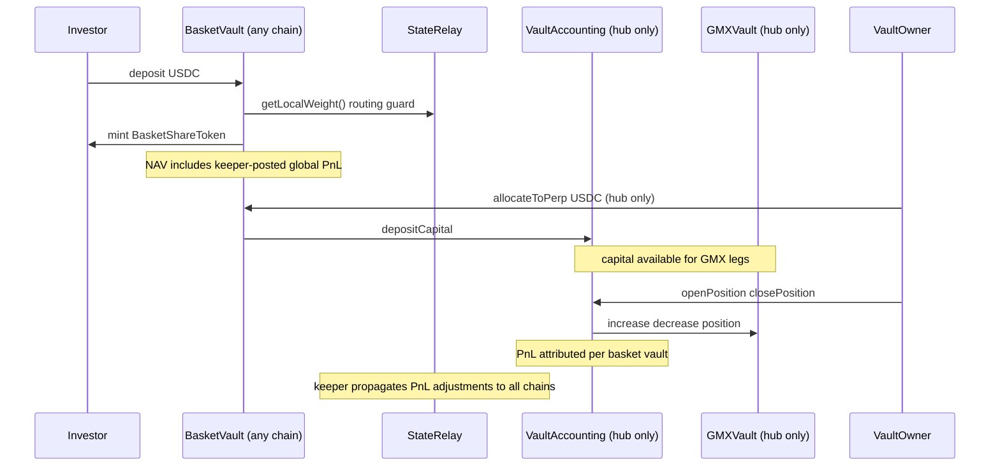

# Investor flow: basket shares and perp exposure

This document describes what **basket share holders** interact with and how value moves, in plain language. For deployment and keeper operations (PriceSync, funding, oracles), see the **Operations** section in [README.md](../README.md).

## What you hold

- You deposit **USDC** into a **BasketVault** and receive **BasketShareToken** (ERC20, 6 decimals).
- Shares represent a pro-rata claim on the vault’s assets **as implemented by the contracts**: USDC in the vault, USDC recorded as sent to the perp module (`perpAllocated`), and **perp PnL** attributed to your vault through **VaultAccounting** (realised on closes; unrealised is mark-to-market via GMX).

## Deposit and redeem (typical investor path)

### Deposit (with cross-chain routing guard)

1. **Choose a chain** — The protocol runs a **hub-and-spoke** topology: Sepolia is the sole perp chain (hub), while spoke chains (Fuji, and potentially 100+) accept deposits only. The web UI shows a **split view** with each chain's routing weight and available capacity.
   - **Single-chain deposit:** If you select one chain, the UI checks whether that chain's local weight meets the `minDepositWeightBps` threshold. If the weight is below threshold, the UI prompts you to switch to a multi-chain split or pick a different chain.
   - **Multi-chain deposit:** The UI shows a split breakdown across eligible chains, proportional to their routing weights. You approve and submit one deposit transaction per chain.
2. **On-chain guard** — When you call `BasketVault.deposit(amount)`, the vault checks `StateRelay.getLocalWeight() >= minDepositWeightBps`. If the local chain's weight is below the threshold, the transaction reverts with `"Chain not accepting deposits"`. This prevents deposits on chains the keeper has flagged as over-allocated.
3. **Minting** — After the routing check, the vault takes a **deposit fee** (if configured) and mints shares using **NAV-based pricing** (which includes a keeper-posted **global PnL adjustment** — see pricing below).

### Redeem (with pending queue for cross-chain fills)

1. **Redeem** — You call `redeem(shares)`. The vault prices your shares against the current `_pricingNav()` and deducts any **redeem fee**.
2. **Instant fill** — If the vault holds enough **idle USDC** (on-hand balance minus reserved fees), you receive the full payout immediately and your shares are burned. The UI displays this as an **instant redemption**.
3. **Partial fill + pending queue** — If idle USDC is insufficient (common on spoke chains where perp capital lives on Sepolia), the vault **partially fills** from whatever USDC is available, burns the corresponding pro-rata shares, and **queues the remainder** as a `PendingRedemption`. Your remaining shares are locked in the vault (transferred to the contract). The UI shows the **instant portion** (filled immediately) and the **pending portion** (awaiting cross-chain fill).
4. **Cross-chain fill** — The keeper service detects pending redemptions, initiates a CCIP transfer of USDC from the hub chain, and the `RedemptionReceiver` on the spoke chain receives the bridged USDC and calls `processPendingRedemption(id)` to complete payout. The UI updates the redemption status from pending to completed.

Entry and exit pricing for shares is tied to mark-to-market vault NAV, including keeper-posted global PnL adjustments from the hub's perp positions.

## Liquidity model (as implemented)

- **Liquid for investor redeem** — Idle USDC in `BasketVault` that can be paid out on `redeem`, net of reserved fees (`collectedFees`).
- **Non-liquid to investor until owner action** — Capital recorded as `perpAllocated` and funds currently in `VaultAccounting` / GMX position path.
- **Direct investor withdrawal from perp allocation is not available** — investors do not call `withdrawFromPerp`; that function is `onlyOwner` on the basket vault.

## Pricing and valuation views

- **`getSharePrice()`** — Uses mark-to-market NAV (`_pricingNav()`):
  - idle USDC (excluding reserved fees),
  - `perpAllocated` bookkeeping,
  - realised + unrealised PnL from `VaultAccounting.getVaultPnL` (hub only; zero on spokes),
  - **keeper-posted global PnL adjustment** from `stateRelay.getGlobalPnLAdjustment(vault)` — this propagates hub perp performance to spoke vaults so share prices stay consistent across chains. Stale adjustments (past `maxStaleness`) are excluded.
- Anyone -- including audit firms, fund administrators, and regulators -- can
  independently verify NAV by calling `getSharePrice()` on-chain at any block,
  without relying on off-chain calculations or manager-reported values.
- **PerpReader.getTotalVaultValue** — Also returns mark-to-market vault value and is useful for monitoring.
- There is no weighted-base `getBasketPrice()` dependency in mint/redeem pricing.

## Perp allocation (operator / vault owner path)

Moving USDC into or out of the shared perp pool is **not** something passive shareholders do on-chain; both flows are **`onlyOwner`** on the basket vault. **Perp allocation is only available on the hub chain (Sepolia)** where `VaultAccounting` and the GMX pool are deployed. Spoke-chain vaults have no `vaultAccounting` wired.

- **`allocateToPerp` / `withdrawFromPerp`** — Move USDC between the basket vault and **VaultAccounting** (subject to `maxPerpAllocation` if set). **Hub-only**: these functions require `vaultAccounting` to be set, which is only the case on Sepolia.
- **Positions** — Opened in **VaultAccounting**’s name on GMX; PnL flows back as USDC when positions are reduced. The basket vault’s **`perpAllocated`** is an accounting entry; actual balances live in **VaultAccounting** / GMX until withdrawn.
- **Investor implication** — If more capital is allocated to perp, investor redemption headroom on the hub falls until the owner pulls funds back with `withdrawFromPerp` (or new reserve USDC is added). Spoke-chain redemptions rely on keeper-bridged USDC for any shortfall.
- **Routing weights** — The keeper service steers new deposits toward Sepolia when more perp capital is needed by assigning it a higher weight in `StateRelay`. Spoke chains with excess idle USDC get lower weights.

## Leverage risk in plain language

- Position size can be larger than posted collateral, so gains and losses are magnified versus the collateral amount.
- If price moves sharply against a leveraged leg, the vault's perp position can be liquidated.
- Liquidation and adverse perp PnL reduce vault value, which can lower basket NAV/share price.
- For operator-level mechanics and risk controls, see [ASSET_MANAGER_FLOW.md](./ASSET_MANAGER_FLOW.md) and [SHARE_PRICE_AND_OPERATIONS.md](./SHARE_PRICE_AND_OPERATIONS.md).
- For full formulas and interaction-level checks used by operators, see [PERP_RISK_MATH.md](./PERP_RISK_MATH.md) and [OPERATOR_INTERACTIONS.md](./OPERATOR_INTERACTIONS.md).

## What investors do **not** control

| Area | Who controls it |
|------|------------------|
| Basket asset registration and fees | Basket vault **owner** (`setAssets`, `setFees`, …) |
| Oracle assets and feeds | **OracleAdapter** owner / keepers (custom relayer) |
| Whether GMX sees the same prices as the oracle | **Keepers / anyone** running **PriceSync** + feed permissions (see README) |
| Funding parameters on GMX | **FundingRateManager** keepers / owner |
| Risk caps and pause | **VaultAccounting** owner (`maxOpenInterest`, `maxPositionSize`, `setPaused`) |
| Cross-chain routing weights and deposit acceptance | **Keeper service** via **StateRelay** (`updateState`) |
| Global PnL adjustment for spoke pricing | **Keeper service** via **StateRelay** (`globalPnLAdjustment`) |
| Pending redemption processing | **Keeper** (`processPendingRedemption`) + **RedemptionReceiver** (CCIP) |
| Emergency upgrades / admin keys | Deploy configuration and governance outside this doc |

## Institutional access

The deposit and redeem paths described above are the same for all participants,
including institutional operators that wrap vault interaction inside their own
regulated fund vehicles. A licensed asset manager can use an institutional
custodian (Fireblocks, Anchorage, or equivalent) to hold USDC and basket share
tokens, sign transactions on behalf of a fund, and interact with `BasketVault`
through the same permissionless `deposit()` and `redeem()` functions. No
protocol-level changes are required.

Because the entire on-chain flow is USDC-in / shares-out with synthetic-only
exposure, there are no underlying equities or commodities to custody -- only
USDC and `BasketShareToken`.

For the full institutional access pattern and compliance considerations, see
[Institutional access via operator licenses](./REGULATORY_ROADMAP_DRAFT.md#institutional-access-via-operator-licenses)
in the Regulatory Roadmap.

## Related reading

- [README.md](./README.md) — Architecture diagram, **Operations** (PriceSync vs OracleAdapter, Chainlink vs custom relayer, funding).
- [ASSET_MANAGER_FLOW.md](./ASSET_MANAGER_FLOW.md) — Curator and asset manager runbook: setup, allocation, position operations, risk controls, and caveats.
- [MODIFICATIONS.md](../MODIFICATIONS.md) — Changes versus upstream GMX (repo root, not in-app docs).

## UI visibility

- `/baskets/[address]` shows **unrealised, realised, and net P&L** tiles (pure RPC via `PerpReader.getVaultPnL`) and a **share price history chart** (subgraph snapshots with RPC multi-block fallback).
- `/baskets/[address]` includes a **Vault History** timeline (deposits, redeems, allocations, position activity, and related tx links).
- On `/baskets/[address]`, the deposit/redeem panel keeps a stable quote area to reduce layout shift; switching tabs clears the typed amount.
- The deposit/redeem card uses icon tabs for Deposit/Redeem mode switching and keeps inline transaction feedback for approval and submission flow.
- `/baskets` list cards show **24h / 7d share price trend pills** with live data from subgraph or RPC fallback.
- `/portfolio` displays per-basket and aggregate **cost basis** (net deposited minus redeemed), **P&L**, and **ROI %** — sourced from subgraph history with an RPC log-scanning fallback.
