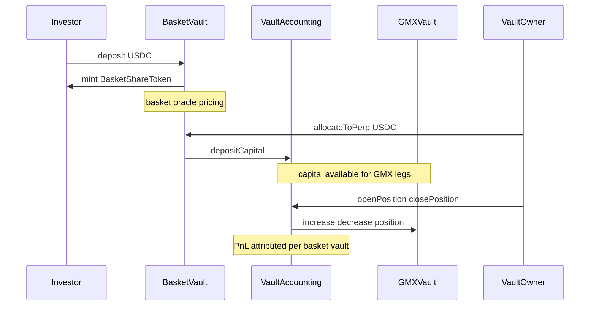

# Investor flow: basket shares and perp exposure

This document describes what **basket share holders** interact with and how value moves, in plain language. For deployment and keeper operations (PriceSync, funding, oracles), see the **Operations** section in [README.md](../README.md).

## What you hold

- You deposit **USDC** into a **BasketVault** and receive **BasketShareToken** (ERC20, 6 decimals).
- Shares represent a pro-rata claim on the vault’s assets **as implemented by the contracts**: USDC in the vault, USDC recorded as sent to the perp module (`perpAllocated`), and **perp PnL** attributed to your vault through **VaultAccounting** (realised on closes; unrealised is mark-to-market via GMX).

## Deposit and redeem (typical investor path)

1. **Deposit** — You approve USDC and call `BasketVault.deposit(amount)`. The vault takes a **deposit fee** (if configured), then mints shares using **NAV-based pricing**.
2. **Redeem** — You call `redeem(shares)`. The vault burns shares and returns USDC from the same **NAV-based pricing path**, minus any **redeem fee**, subject to **idle USDC liquidity actually held in the basket vault** (computed from on-hand USDC and excluding reserved fees in `collectedFees`).

Entry and exit pricing for shares is tied to mark-to-market vault NAV.

## Liquidity model (as implemented)

- **Liquid for investor redeem** — Idle USDC in `BasketVault` that can be paid out on `redeem`, net of reserved fees (`collectedFees`).
- **Non-liquid to investor until owner action** — Capital recorded as `perpAllocated` and funds currently in `VaultAccounting` / GMX position path.
- **Direct investor withdrawal from perp allocation is not available** — investors do not call `withdrawFromPerp`; that function is `onlyOwner` on the basket vault.

## Pricing and valuation views

- **`getSharePrice()`** — Uses mark-to-market NAV:
  - idle USDC (excluding reserved fees),
  - `perpAllocated` bookkeeping,
  - realised + unrealised PnL from `VaultAccounting.getVaultPnL`.
- **PerpReader.getTotalVaultValue** — Also returns mark-to-market vault value and is useful for monitoring.
- There is no weighted-base `getBasketPrice()` dependency in mint/redeem pricing.

## Perp allocation (operator / vault owner path)

Moving USDC into or out of the shared perp pool is **not** something passive shareholders do on-chain; both flows are **`onlyOwner`** on the basket vault.

- **`allocateToPerp` / `withdrawFromPerp`** — Move USDC between the basket vault and **VaultAccounting** (subject to `maxPerpAllocation` if set).
- **Positions** — Opened in **VaultAccounting**’s name on GMX; PnL flows back as USDC when positions are reduced. The basket vault’s **`perpAllocated`** is an accounting entry; actual balances live in **VaultAccounting** / GMX until withdrawn.
- **Investor implication** — If more capital is allocated to perp, investor redemption headroom falls until the owner pulls funds back with `withdrawFromPerp` (or new reserve USDC is added).

## Leverage risk in plain language

- Position size can be larger than posted collateral, so gains and losses are magnified versus the collateral amount.
- If price moves sharply against a leveraged leg, the vault's perp position can be liquidated.
- Liquidation and adverse perp PnL reduce vault value, which can lower basket NAV/share price.
- For operator-level mechanics and risk controls, see [ASSET_MANAGER_FLOW.md](ASSET_MANAGER_FLOW.md) and [SHARE_PRICE_AND_OPERATIONS.md](SHARE_PRICE_AND_OPERATIONS.md).
- For full formulas and interaction-level checks used by operators, see [PERP_RISK_MATH.md](PERP_RISK_MATH.md) and [OPERATOR_INTERACTIONS.md](OPERATOR_INTERACTIONS.md).

## What investors do **not** control

| Area | Who controls it |
|------|------------------|
| Basket asset registration and fees | Basket vault **owner** (`setAssets`, `setFees`, …) |
| Oracle assets and feeds | **OracleAdapter** owner / keepers (custom relayer) |
| Whether GMX sees the same prices as the oracle | **Keepers / anyone** running **PriceSync** + feed permissions (see README) |
| Funding parameters on GMX | **FundingRateManager** keepers / owner |
| Risk caps and pause | **VaultAccounting** owner (`maxOpenInterest`, `maxPositionSize`, `setPaused`) |
| Emergency upgrades / admin keys | Deploy configuration and governance outside this doc |

## Related reading

- [README.md](../README.md) — Architecture diagram, **Operations** (PriceSync vs OracleAdapter, Chainlink vs custom relayer, funding).
- [ASSET_MANAGER_FLOW.md](ASSET_MANAGER_FLOW.md) — Basket/perp manager runbook: setup, allocation, position operations, risk controls, and caveats.
- [MODIFICATIONS.md](../MODIFICATIONS.md) — Changes versus upstream GMX.

## UI visibility

- `/baskets/[address]` includes a **Vault History** timeline (deposits, redeems, allocations, position activity, and related tx links).
- On `/baskets/[address]`, the deposit/redeem panel keeps a stable quote area to reduce layout shift; switching tabs clears the typed amount.
- The deposit/redeem card now surfaces a live quote preview, action icons, and inline transaction states for approval, submission, confirmation, and retry handling.
