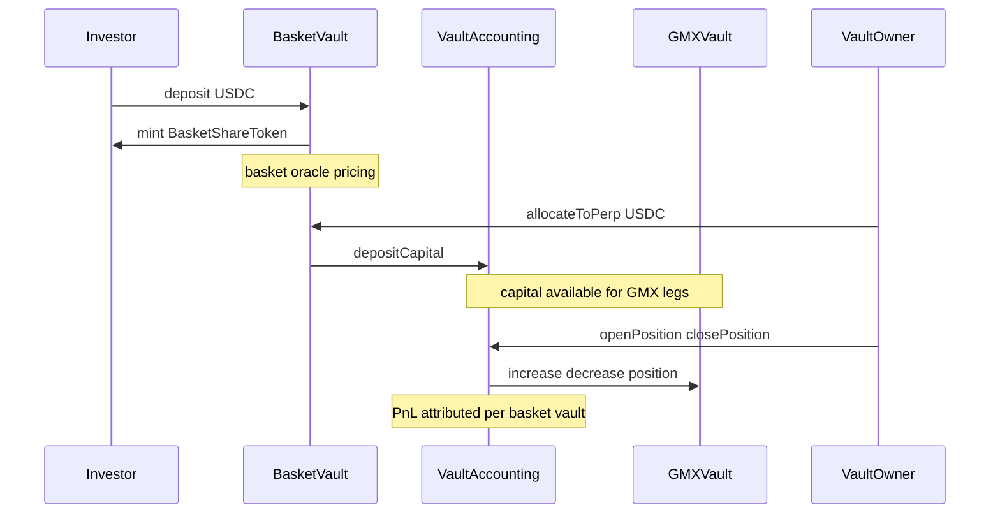

# Investor flow: basket shares and perp exposure

This document describes what **basket share holders** interact with and how value moves, in plain language. For deployment and keeper operations (PriceSync, funding, oracles), see the **Operations** section in [README.md](../README.md).

## What you hold

- You deposit **USDC** into a **BasketVault** and receive **BasketShareToken** (ERC20, 6 decimals).
- Shares represent a pro-rata claim on the vault’s assets **as implemented by the contracts**: USDC in the vault, USDC recorded as sent to the perp module (`perpAllocated`), and **perp PnL** attributed to your vault through **VaultAccounting** (realised on closes; unrealised is mark-to-market via GMX).

## Deposit and redeem (typical investor path)

1. **Deposit** — You approve USDC and call `BasketVault.deposit(amount)`. The vault takes a **deposit fee** (if configured), then mints shares using the **oracle basket price**: a weighted sum of configured asset prices from **OracleAdapter** (same economic definition the vault uses for mint/burn).
2. **Redeem** — You call `redeem(shares)`. The vault burns shares and sends USDC using that same **basket oracle price**, minus any **redeem fee**, subject to **idle USDC liquidity actually held in the basket vault** (computed from on-hand USDC and excluding reserved fees in `collectedFees`).

So entry and exit pricing for shares is tied to the **basket oracle**, not necessarily to full mark-to-market NAV if the vault has open perp legs.

## Liquidity model (as implemented)

- **Liquid for investor redeem** — Idle USDC in `BasketVault` that can be paid out on `redeem`, net of reserved fees (`collectedFees`).
- **Non-liquid to investor until owner action** — Capital recorded as `perpAllocated` and funds currently in `VaultAccounting` / GMX position path.
- **Direct investor withdrawal from perp allocation is not available** — investors do not call `withdrawFromPerp`; that function is `onlyOwner` on the basket vault.

## How basket price differs from “full NAV”

- **`getBasketPrice()`** — Weighted oracle composition only (no perp PnL).
- **`getSharePrice()`** — Uses USDC in the vault (excluding fees reserved in `collectedFees`) plus the **`perpAllocated` bookkeeping** over total supply. It does **not** include unrealised perp PnL.
- **Mark-to-market basket value** — For a fuller picture, off-chain tooling can use **PerpReader.getTotalVaultValue**, which adds unrealised and realised PnL from **VaultAccounting.getVaultPnL** to on-vault USDC and `perpAllocated`.

Investors should treat oracle basket price as the **mint/redeem exchange rate**, and NAV-style metrics as **separate** unless the product UI explicitly combines them.

## Perp allocation (operator / vault owner path)

Moving USDC into or out of the shared perp pool is **not** something passive shareholders do on-chain; both flows are **`onlyOwner`** on the basket vault.

- **`allocateToPerp` / `withdrawFromPerp`** — Move USDC between the basket vault and **VaultAccounting** (subject to `maxPerpAllocation` if set).
- **Positions** — Opened in **VaultAccounting**’s name on GMX; PnL flows back as USDC when positions are reduced. The basket vault’s **`perpAllocated`** is an accounting entry; actual balances live in **VaultAccounting** / GMX until withdrawn.
- **Investor implication** — If more capital is allocated to perp, investor redemption headroom falls until the owner pulls funds back with `withdrawFromPerp` (or new reserve USDC is added).

## What investors do **not** control

| Area | Who controls it |
|------|------------------|
| Basket composition and fees | Basket vault **owner** (`setAssets`, `setFees`, …) |
| Oracle assets and feeds | **OracleAdapter** owner / keepers (custom relayer) |
| Whether GMX sees the same prices as the oracle | **Keepers / anyone** running **PriceSync** + feed permissions (see README) |
| Funding parameters on GMX | **FundingRateManager** keepers / owner |
| Risk caps and pause | **VaultAccounting** owner (`maxOpenInterest`, `maxPositionSize`, `setPaused`) |
| Emergency upgrades / admin keys | Deploy configuration and governance outside this doc |

## Related reading

- [README.md](../README.md) — Architecture diagram, **Operations** (PriceSync vs OracleAdapter, Chainlink vs custom relayer, funding).
- [ASSET_MANAGER_FLOW.md](ASSET_MANAGER_FLOW.md) — Basket/perp manager runbook: setup, allocation, position operations, risk controls, and caveats.
- [MODIFICATIONS.md](../MODIFICATIONS.md) — Changes versus upstream GMX.
