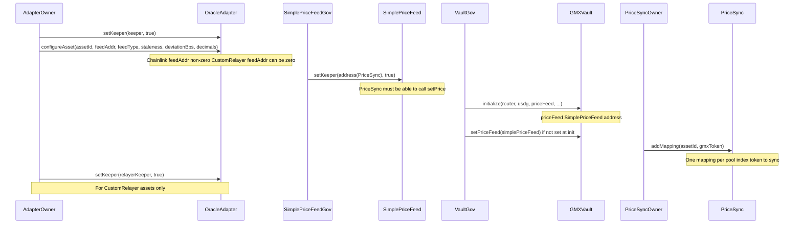
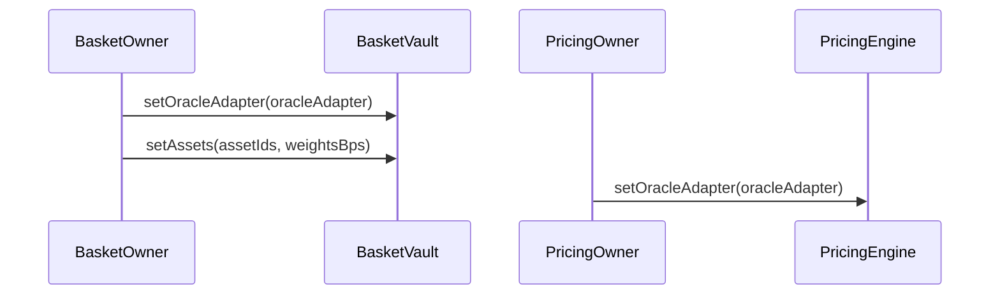
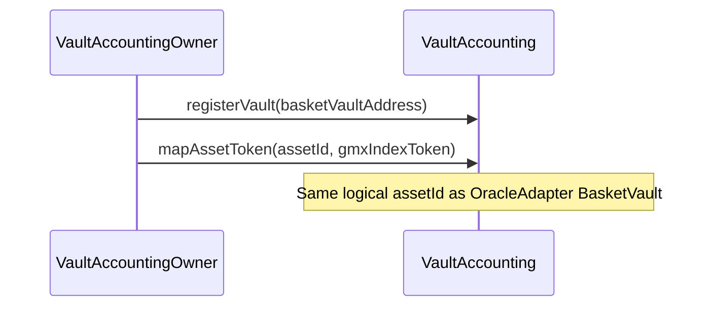
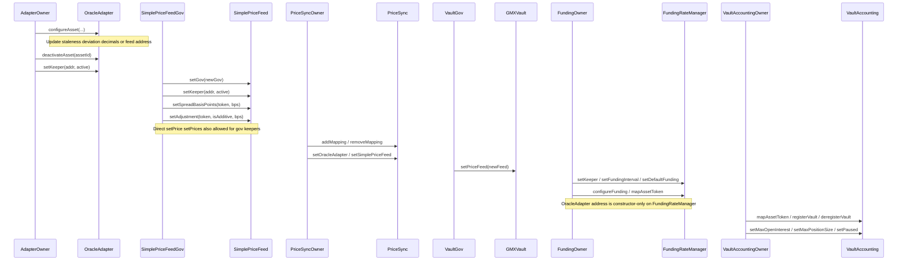
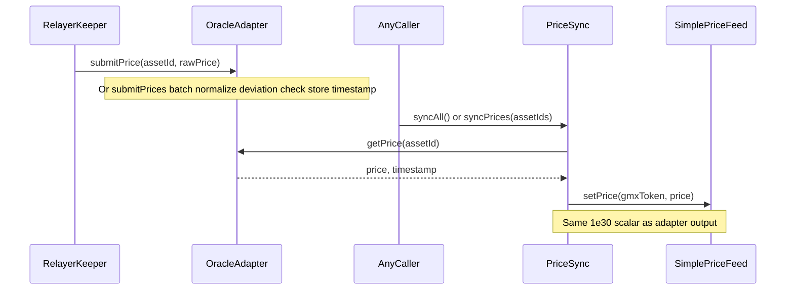
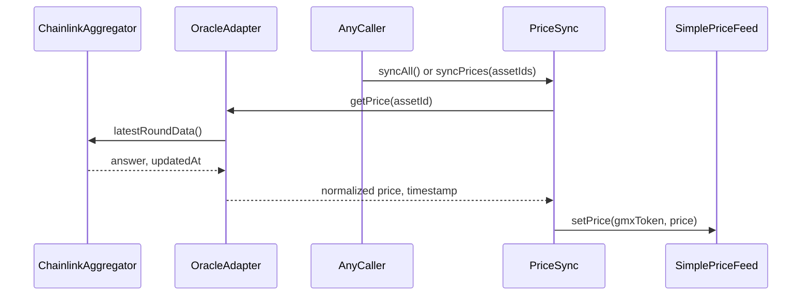
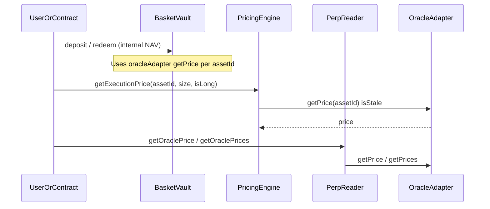
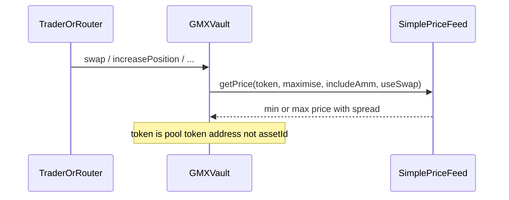
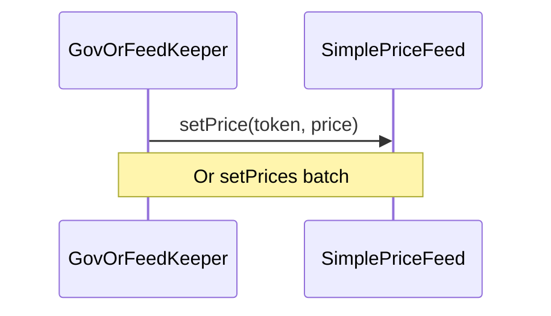
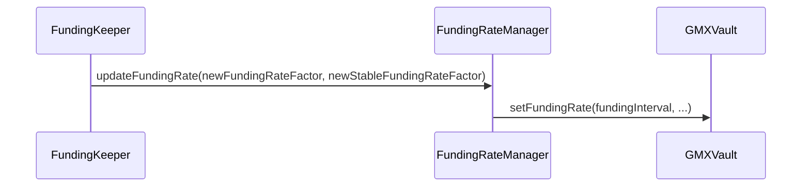

# Price feed lifecycle and contract interactions

This document describes how oracle prices flow through the system, how the GMX fork consumes them, and which **admin** calls wire everything together. Diagrams use Mermaid **sequence** form: each participant is a vertical lane; time runs downward.

**Precision:** `OracleAdapter` and `SimplePriceFeed` both normalize to **1e30** (`PRICE_PRECISION`) for reads that leave the adapter; custom `submitPrice` uses the asset’s configured decimals before normalization.

**Behavioral split:** A **view** call to `OracleAdapter.getPrice` for a **Chainlink** asset reads `latestRoundData` at call time. The GMX **Vault** does not call the adapter; it reads **`SimplePriceFeed`** via `IVaultPriceFeed`. Stored GMX prices change only when **`PriceSync`** runs (or when `SimplePriceFeed` gov/keepers call `setPrice` / `setPrices` directly).

---

## Contracts at a glance

| Contract | Path | Role |
|----------|------|------|
| **OracleAdapter** | [`src/perp/OracleAdapter.sol`](../src/perp/OracleAdapter.sol) | Canonical oracle: Chainlink on `getPrice`, or keeper-written prices for `CustomRelayer` assets; staleness and deviation rules. **Ownable** owner. |
| **PriceSync** | [`src/perp/PriceSync.sol`](../src/perp/PriceSync.sol) | Copies adapter prices into `SimplePriceFeed` per `assetId → gmxToken` mappings. `syncAll` / `syncPrices` are **permissionless**. **Ownable** owner for mappings and pointer updates. |
| **SimplePriceFeed** | [`src/gmx/core/SimplePriceFeed.sol`](../src/gmx/core/SimplePriceFeed.sol) | Minimal **`IVaultPriceFeed`**: per-token stored price, optional spread for min/max. **gov** + **keepers** may set prices. |
| **Vault (GMX)** | [`src/gmx/core/VaultAdmin.sol`](../src/gmx/core/VaultAdmin.sol), [`VaultPricing.sol`](../src/gmx/core/VaultPricing.sol) | **`priceFeed`** address; `getMinPrice` / `getMaxPrice` delegate to `IVaultPriceFeed`. **gov** for `setPriceFeed` and `initialize`. |
| **BasketVault** | [`src/vault/BasketVault.sol`](../src/vault/BasketVault.sol) | Share NAV uses **`OracleAdapter`** (`assetId` keys). Owner: `setOracleAdapter`, `setAssets`, etc. |
| **PricingEngine** | [`src/perp/PricingEngine.sol`](../src/perp/PricingEngine.sol) | Execution price = oracle mid + slippage; **`OracleAdapter`**. Owner: `setOracleAdapter`. |
| **VaultAccounting** | [`src/perp/VaultAccounting.sol`](../src/perp/VaultAccounting.sol) | Perp accounting; **`OracleAdapter`** fixed at deploy. Owner: **`registerVault`**, **`mapAssetToken(assetId, gmxToken)`** (required to open positions), risk/pause setters. |
| **PerpReader** | [`src/perp/PerpReader.sol`](../src/perp/PerpReader.sol) | Read-only aggregation: GMX vault + adapter. |
| **FundingRateManager** | [`src/perp/FundingRateManager.sol`](../src/perp/FundingRateManager.sol) | Keeper calls `updateFundingRate` → GMX `setFundingRate`. Owner: `setKeeper`, `mapAssetToken`, `configureFunding`, `setDefaultFunding`, `setFundingInterval`. **`OracleAdapter` is fixed at deploy.** |

---

## 1. Bootstrap after deploy (admin / gov)

Typical order (exact deploy script may vary). Solid arrows are transactions; notes capture requirements.

**Basket / perp app wiring (owner, not oracle-specific but part of lifecycle):**

**VaultAccounting (perp positions must resolve `assetId` → GMX index token):**

---

## 2. Ongoing admin (reconfiguration)

These can happen any time after bootstrap. They do not by themselves update token prices unless they change feed type or mappings.

---

## 3. Custom relayer asset: price write then GMX sync

Keeper must be allowed on **`OracleAdapter`**. **`PriceSync`** must be a **keeper** on **`SimplePriceFeed`**.

---

## 4. Chainlink asset: no submitPrice; sync pulls fresh read

There is **no** `submitPrice` path for Chainlink-type assets. `getPrice` calls the aggregator inside the adapter. Anyone may still call **`PriceSync`** to push that value into **`SimplePriceFeed`**.

---

## 5. Consumers: reads (no admin)

### 5a. Basket and perp modules using the adapter

### 5b. GMX vault and routers using SimplePriceFeed

---

## 6. Optional: direct feed override (gov / keeper)

If automation or emergency ops bypass **`PriceSync`**, **`SimplePriceFeed`** gov or any **keeper** on the feed can set storage directly. This can **diverge** from **`OracleAdapter`** until the next sync or another manual set.

---

## 7. Operational checklist (summary)

1. **OracleAdapter:** Owner configures each `assetId` (`configureAsset`), enables relayer keepers (`setKeeper`) for custom assets.
2. **SimplePriceFeed:** Gov registers **`PriceSync`** as keeper (`setKeeper(priceSync, true)`).
3. **PriceSync:** Owner adds **`addMapping(assetId, gmxToken)`** for every asset the pool prices by token address.
4. **GMX Vault:** Gov ensures **`priceFeed`** points at **`SimplePriceFeed`** (`initialize` or `setPriceFeed`).
5. **Runtime:** For custom assets, **`submitPrice`** then **`sync*`**; for Chainlink, **`sync*`** on your cadence (and/or rely on adapter-only views for basket/PricingEngine).
6. **VaultAccounting:** Owner **`registerVault`** for each basket and **`mapAssetToken(assetId, gmxToken)`** for every traded asset (align `assetId` with the adapter and basket).
7. **BasketVault / PricingEngine:** Owners point instances at the same **`OracleAdapter`** if economics should stay aligned.

---

## 8. Related: GMX funding parameters (not the price feed)

Funding updates **do not** write `OracleAdapter` or `SimplePriceFeed`. Authorized keepers push global factors into the GMX vault.

---

For narrative investor-facing context, see [INVESTOR_FLOW.md](INVESTOR_FLOW.md). For upstream GMX differences, see [MODIFICATIONS.md](../MODIFICATIONS.md).
