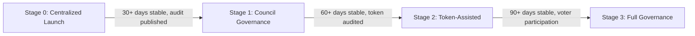

# Regulatory Roadmap (Draft)

> **Status: Draft working memo**
>
> This document is a brainstorming aid for product and legal structuring. It is
> **not legal advice**, does not approve any launch path, and should not be used
> as a substitute for advice from counsel in the target jurisdiction.

## Why this exists

This repo is not a generic DeFi app. In the current implementation:

- users deposit **USDC** into a **BasketVault**
- users receive redeemable **BasketShareToken** interests
- the basket owner can move capital into a shared perp module
- the manager or authorized operator can open and close leveraged positions
- current oracle docs include equity and commodity-style references such as
  `BHP.AX`
- a draft utility token concept exists in
  [UTILITY_TOKEN_TOKENOMICS.md](./UTILITY_TOKEN_TOKENOMICS.md)

That combination likely creates a regulatory perimeter well beyond a normal
wallet-only token interface.

## Working view of the perimeter

This is the current product-risk inference, not a final legal conclusion:

- The basket interests may be treated as **units in a collective investment
  undertaking**, **transferable securities**, or both depending on structure and
  jurisdiction.
- The perp sleeve may be treated as **MiFID II financial instrument
  derivatives**, especially where exposure references equities, commodities, or
  other non-crypto assets.
- If the product is classified under existing financial-services law, **MiCA may
  not be the main launch regime**. MiCA is designed for crypto-assets and
  services not already regulated elsewhere.
- A "closed marketplace" can narrow the go-to-market path, but it does **not**
  automatically make the product unregulated.
- Permissionless deployment does not eliminate regulatory risk. It shifts the
  risk profile: the protocol layer is software, but any entity operating a
  frontend, holding treasury, or marketing the product may still trigger
  obligations.

## Chosen launch pathway: permissionless protocol

The project has adopted the **permissionless protocol** model rather than a
regulated-entity model. The core thesis: IndexFlow deploys as open-source smart
contracts that anyone can interact with directly. No single entity acts as
issuer, custodian, or counterparty. Access is not gated at the protocol layer.

This pathway is used by Uniswap, Aave, Lido, dYdX (pre-chain migration),
Compound, and most major DeFi protocols. It rests on the argument that a
sufficiently decentralized protocol is software infrastructure, not a regulated
financial service.

### Launch profile

- **Permissionless protocol** -- contracts deployed on-chain, callable by anyone
- **Retail-accessible** -- no investor qualification at the protocol layer
- **Foundation-governed** -- protocol owned by a non-profit foundation entity,
  not a company
- **Per-chain deployments** -- each chain gets an independent instance with
  ring-fenced KPIs and attribution
- **Hard geo-block U.S. at the frontend** -- frontend, hosted interfaces, and
  marketing block U.S. persons
- **No KYC/KYB at the protocol layer** -- onboarding restrictions apply only to
  hosted frontends and foundation-controlled interfaces
- **OFAC/sanctions screening at frontend** -- wallet screening before
  transactions are submitted through hosted interfaces
- **Decentralized oracle** -- Chainlink, Pyth, or equivalent replaces the
  prototype Yahoo Finance relayer before mainnet
- **No utility/governance token at initial launch** -- token follows once
  decentralization milestones are met

## What probably does not work

These assumptions are high risk and should not be used as launch premises,
even under the permissionless model:

- "Permissionless" means no regulation applies to any participant in the stack
- Non-custodial means no AML / sanctions / licensing analysis for frontend
  operators
- Tokenizing fund interests avoids securities or fund rules in all
  jurisdictions
- Synthetic equity or commodity exposure can be sold like a generic crypto app
- A governance token can launch simultaneously with the core product without
  changing the regulatory surface
- Yahoo Finance-style relayed pricing is acceptable for production use
- "Sufficient decentralization" is achieved by deploying contracts alone --
  governance, oracle, and upgrade control must also be credibly distributed
- Geo-blocking at the frontend is sufficient without terms of service, risk
  disclosures, and sanctions screening

## Proposed foundation structure

The permissionless path requires separating the protocol from any single
operating entity. The standard structure uses three components:

### Entity chart

```
┌─────────────────────────────────────────┐
│         IndexFlow Foundation            │
│     (Cayman Foundation Company)         │
│                                         │
│  - Owns protocol IP (licensed from Labs)│
│  - Deploys and governs smart contracts  │
│  - Holds treasury / protocol reserves   │
│  - No shareholders, no profit motive    │
│  - Directors + supervisor as required   │
│  - Custodies governance token supply    │
│    (when launched)                       │
└────────────────┬────────────────────────┘
                 │ services agreement
                 │ + IP license
┌────────────────▼────────────────────────┐
│          IndexFlow Labs                 │
│    (Operating company, any jurisdiction)│
│                                         │
│  - Employs developers                   │
│  - Builds protocol software             │
│  - Operates hosted frontend             │
│  - Signs vendor contracts (auditors,    │
│    oracle providers, infra)             │
│  - Licenses IP to Foundation            │
│  - Can raise equity funding separately  │
└────────────────┬────────────────────────┘
                 │ frontend operation
                 │ + compliance scope
┌────────────────▼────────────────────────┐
│         Hosted Frontend                 │
│                                         │
│  - app.indexflow.xyz (or similar)       │
│  - Geo-blocking (U.S. + restricted)     │
│  - OFAC / sanctions wallet screening    │
│  - Terms of service + risk disclosures  │
│  - Operated by Labs under agreement     │
│    with Foundation                      │
└─────────────────────────────────────────┘
```

### Responsibilities

| Entity | Owns | Operates | Raises capital |
| --- | --- | --- | --- |
| Foundation | Protocol IP, treasury, governance token supply, deployed contracts | Protocol governance, grant programs, ecosystem coordination | Token sales (if any), grants, donations |
| Labs | Development tooling, internal IP pre-license | Frontend, keeper infrastructure, oracle relayers (pre-decentralization) | Equity rounds, service revenue from Foundation |
| DAO (future) | Governance power via token | Parameter governance, treasury allocation votes | N/A |

### IP flow

1. Labs develops protocol software and owns pre-publication IP.
2. Labs grants Foundation an irrevocable, royalty-free license to the protocol
   code.
3. Foundation publishes code as open source and deploys contracts.
4. Labs retains ability to build proprietary tooling, frontends, and services
   on top of the open protocol.

### Foundation jurisdiction considerations

| Jurisdiction | Pros | Cons |
| --- | --- | --- |
| Cayman Islands | Fast setup (4-6 weeks), well-understood by DeFi counsel, no income tax, Foundation Company structure purpose-built for protocols | Limited local substance, some investor perception risk |
| Switzerland | Strong legal framework, crypto-friendly reputation, FINMA clarity on token classification | Slower setup, higher cost, more substance requirements |
| Panama | Low cost, privacy-friendly | Less established for DeFi, weaker legal precedent |
| BVI | Fast, low cost, common for holding structures | Less specific foundation law than Cayman |

The Cayman Foundation Company is recommended as the default unless counsel
advises otherwise. It is the most battle-tested structure for permissionless
DeFi protocols.

## Roadmap

### Phase 0: Product scope freeze

Goal: lock the product decisions that affect legal structure and audit scope.

Required decisions:

- confirm permissionless protocol model (done)
- confirm retail-accessible, no protocol-level investor gating (done)
- confirm per-chain deployment model with ring-fenced attribution (done)
- select first launch chain (Arbitrum One is the current leading candidate)
- define initial asset set for mainnet (which symbols, which oracle sources)
- confirm transfer policy on `BasketShareToken` (transferable by default)
- confirm governance token is deferred to post-launch

Deliverables:

- one-page product scope summary
- initial asset set and oracle source plan
- list of features explicitly deferred from v1

### Phase 1: Foundation and entity setup

Goal: establish the legal entities that will own and operate the protocol.

Steps:

- engage crypto-specialized counsel for foundation setup
- incorporate Foundation entity (Cayman Foundation Company recommended)
- incorporate or formalize Labs company
- execute services agreement (Labs provides development to Foundation)
- execute IP license agreement (Labs licenses protocol IP to Foundation)
- set up Foundation bank account and crypto custody (multi-sig)
- appoint initial Foundation directors and supervisor (if required)

Deliverables:

- Foundation incorporation documents
- Labs-Foundation services agreement
- IP license agreement
- Foundation multi-sig wallet (Gnosis Safe) for treasury and contract ownership

### Phase 2: Decentralization buildout

Goal: move protocol control from a single deployer to credibly distributed
governance.

Steps:

- deploy Gnosis Safe multi-sig as protocol owner (Foundation-controlled)
- deploy OpenZeppelin TimelockController for non-emergency admin actions
- migrate oracle from Yahoo Finance relayer to Chainlink / Pyth / RedStone
- formalize keeper rotation and redundancy policy
- design governance token contract (ERC-20 + vote delegation)
- prepare token distribution plan aligned with progressive decentralization
  stages

Deliverables:

- multi-sig deployed and tested on testnet
- timelock deployed and tested on testnet
- oracle migration completed on testnet
- governance token contract drafted (not deployed)
- keeper redundancy plan documented

### Phase 3: Legal wrapper and frontend compliance

Goal: make the hosted frontend legally defensible and compliant with
applicable restrictions.

Steps:

- draft Terms of Service establishing "protocol, not a service" framing
- draft risk disclosures covering: manager discretion, leverage and liquidation
  risk, oracle risk, stablecoin depeg risk, limited redemption liquidity,
  shared-pool counterparty risk, smart contract risk
- implement geo-blocking at the frontend (U.S. + OFAC-sanctioned jurisdictions)
- integrate OFAC/sanctions wallet screening (Chainalysis, TRM Labs, or similar)
- add risk acknowledgment flow to frontend (user accepts disclosures before
  first interaction)
- review and update whitepaper to align with actual contract behavior

Deliverables:

- Terms of Service (published on frontend)
- Privacy Policy (published on frontend)
- Risk disclosure document
- Geo-blocking implementation
- Wallet screening integration
- Whitepaper final draft

### Phase 4: Audit and launch preparation

Goal: complete security review and operational readiness.

Steps:

- engage audit firm (scope: BasketVault, VaultAccounting, OracleAdapter, GMX
  integration, PriceSync, FundingRateManager, PricingEngine, AssetWiring)
- address audit findings and re-verify fixes
- establish bug bounty program (Immunefi recommended)
- deploy monitoring and alerting (oracle staleness, reserve levels, pool
  utilization, position health)
- write incident response runbook
- write mainnet deploy script (`DeployMainnet.s.sol` or chain-specific variant)
- test full deployment flow on Arbitrum Sepolia (or target chain testnet)
- dry-run mainnet deployment with Foundation multi-sig

Deliverables:

- audit report (published)
- bug bounty program (live)
- monitoring dashboard and alerting
- incident response runbook
- mainnet deploy script tested end-to-end
- deployment dry-run log

### Phase 5: Mainnet launch and progressive decentralization

Goal: deploy on the first chain and begin the governance transition.

Steps:

- deploy contracts to mainnet via Foundation multi-sig
- verify contracts on block explorer
- transfer contract ownership to Foundation multi-sig + timelock
- deploy subgraph to decentralized Graph Network
- launch hosted frontend with all compliance measures active
- publish audit report, bug bounty details, and risk disclosures
- begin progressive decentralization (see governance sequence below)
- monitor KPIs: TVL, volume, fees, oracle health, reserve ratios
- plan second chain deployment based on first-chain metrics

Deliverables:

- mainnet deployment registry
- verified contracts on block explorer
- live frontend with compliance measures
- published audit report and bug bounty
- KPI dashboard for chain-specific attribution

### Phase 6: Regulated access tier (post-launch)

Goal: offer a licensed onboarding and product-management service for operators,
issuers, and institutions that lack their own compliance infrastructure.

The permissionless protocol layer remains unchanged. The regulated tier is an
additional hosted service built on top of the same contracts by Labs or a
dedicated Labs subsidiary.

Steps:

- engage counsel to determine the best licensing path (AIFM, MiFID investment
  firm, or DLT Pilot Regime) in one EU member state
- incorporate a regulated subsidiary under Labs (or enter a regulated-partner /
  white-label arrangement)
- build KYC/KYB onboarding pipeline for institutional clients
- secure licensed reference data vendors (Bloomberg, Refinitiv, or equivalent)
  for the regulated product tier
- implement compliant product issuance: transfer-restricted basket shares,
  investor qualification checks, redemption gating, and suspension procedures
- establish NAV governance framework: documented valuation policy, stale-price
  handling, valuation challenge procedures
- build regulatory reporting pipeline (AIFMD Annex IV, MiFIR transaction
  reports, or equivalent as required by the license)
- draft institutional investor disclosures, subscription documents, and risk
  packs

Deliverables:

- regulated subsidiary incorporated (or partner agreement executed)
- licensing application submitted
- KYC/KYB onboarding pipeline operational
- licensed data vendor agreements signed
- institutional investor disclosure pack
- regulatory reporting pipeline tested

**Entry criteria:** Protocol operational for 6+ months on mainnet, audit report
published, sufficient TVL and volume to justify licensing cost, counsel engaged
and classification memo obtained.

**Relationship to the permissionless protocol:**

- Operators with their own licenses can build on the permissionless protocol at
  any time without using this tier.
- The regulated tier serves clients that want compliant access without obtaining
  their own license.
- Protocol governance and decentralization are not affected; the regulated
  subsidiary is a consumer of the protocol, not a gatekeeper of it.

## Progressive decentralization sequence

Governance evolves in four stages. Each stage has explicit entry criteria so
that decentralization is earned through operational maturity, not rushed for
optics.

### Stage 0: Centralized launch

**Timeline:** Day 1 through Month 1

- Foundation multi-sig (3-of-5 Gnosis Safe) owns all first-party modules
- Keeper EOAs operate oracle submissions and funding rate updates
- No governance token
- Foundation directors have full operational authority
- Emergency pause available to any multi-sig signer

**Entry criteria:** Mainnet deployment complete, audit report published.

### Stage 1: Council governance

**Timeline:** Month 1 through Month 3

- Expand multi-sig to 4-of-7 security council with external members
- Deploy TimelockController (48-hour delay on non-emergency actions)
- Emergency actions (pause, oracle disable, cap reduction) remain fast-path
  through council-only, no timelock delay
- Formalize keeper rotation: at least 2 independent keeper operators
- Oracle fully migrated to decentralized feeds (Chainlink/Pyth)
- Begin community feedback on governance token design

**Entry criteria:** Stable operation for 30+ days, no critical incidents, oracle
fully decentralized, council members identified and onboarded.

### Stage 2: Token-assisted governance

**Timeline:** Month 3 through Month 6+

- Foundation launches governance token
- Token holders can propose and vote on slow-path actions:
  - asset admission and removal
  - chain expansion approvals
  - fee policy changes
  - treasury allocation (grants, POL, incentives)
  - manager admission criteria
- Security council retains emergency powers (pause, oracle override, cap
  changes)
- All governance-approved actions go through timelock
- Token distribution begins per the approved allocation plan

**Entry criteria:** Council governance stable for 60+ days, token contract
audited, distribution plan finalized, community engagement sufficient for
meaningful governance participation.

### Stage 3: Full protocol governance

**Timeline:** Month 6 through Month 12+

- Token governance controls all non-emergency protocol parameters
- Security council scope narrowed to emergency-only (pause, oracle override
  during outage)
- Council membership itself becomes token-governed (token holders elect/remove
  council members)
- Foundation role reduces to: legal entity wrapper, treasury custody, ecosystem
  grants
- Labs operates as an independent service provider, no longer required for
  protocol operation

**Entry criteria:** Token governance operational for 90+ days, sufficient voter
participation, no governance attacks, protocol revenue self-sustaining or
treasury runway sufficient.



## Product decisions that widen the regulatory surface

Each of these introduces additional regulatory considerations even under the
permissionless model, and should be treated as a separate workstream:

- admitting **U.S. persons** (at the frontend or by removing geo-blocking)
- enabling **fiat on-ramps** through the hosted frontend
- launching a **governance token** that could be classified as a security
- operating a **secondary market or order matching** for basket shares
- taking **custody** of user assets or private keys at any layer
- operating **keeper or relayer infrastructure** as a centralized service
  without redundancy
- broadening synthetic references beyond the first approved asset set without
  updating risk disclosures
- operating a **regulated access tier** through Labs or a subsidiary (requires
  its own licensing workstream; see Phase 6)

## Draft launch checklist

- [ ] Permissionless protocol model confirmed
- [ ] First launch chain selected
- [ ] Initial asset set and oracle sources finalized
- [ ] Foundation entity incorporated
- [ ] Labs entity formalized
- [ ] Services agreement and IP license executed
- [ ] Foundation multi-sig deployed and funded
- [ ] Oracle migrated from Yahoo relayer to decentralized feeds
- [ ] TimelockController deployed and ownership transferred
- [ ] Smart contract audit completed and report published
- [ ] Bug bounty program launched
- [ ] Terms of Service and risk disclosures published
- [ ] Geo-blocking implemented at frontend
- [ ] OFAC/sanctions wallet screening integrated
- [ ] Monitoring and alerting operational
- [ ] Incident response runbook written and exercised
- [ ] Mainnet deploy script tested end-to-end
- [ ] Contracts deployed to mainnet via Foundation multi-sig
- [ ] Contracts verified on block explorer
- [ ] Subgraph deployed to decentralized Graph Network
- [ ] Social media accounts created and branded (X, LinkedIn, Farcaster,
  Substack, YouTube, Telegram)
- [ ] Bug bounty program scope defined and platform selected (Immunefi
  recommended)
- [ ] Progressive decentralization Stage 0 active

## Useful official references

- European Commission MiCA overview:
  https://finance.ec.europa.eu/digital-finance/crypto-assets_en
- ESMA MiCA page:
  https://www.esma.europa.eu/esmas-activities/digital-finance-and-innovation/markets-crypto-assets-regulation-mica
- ESMA AIFMD key concepts guidelines:
  https://www.esma.europa.eu/sites/default/files/library/2015/11/2013-611_guidelines_on_key_concepts_of_the_aifmd_-_en.pdf
- European Commission EMIR overview:
  https://finance.ec.europa.eu/financial-markets/financial-markets-policy/post-trade-services/derivatives-emir_en
- ESMA DLT Pilot Regime:
  https://www.esma.europa.eu/esmas-activities/digital-finance-and-innovation/dlt-pilot-regime
- European Commission DORA overview:
  https://finance.ec.europa.eu/digital-finance/digital-operational-resilience-act-dora_en
- Cayman Islands Foundation Companies Law:
  https://legislation.gov.ky/cms/images/LEGISLATION/PRINCIPAL/2017/2017-0029/FoundationCompaniesLaw2017.pdf
- a]16]z crypto, "Sufficient Decentralization" framework:
  https://a16zcrypto.com/posts/article/decentralization-factors-web3-protocols-tables/

## Open questions for the next revision

- Which Cayman counsel to engage for Foundation setup?
- Should Labs be a new entity or an existing company?
- Target timeline for foundation incorporation?
- Which audit firm to engage, and what is the budget?
- Which decentralized oracle provider (Chainlink vs Pyth vs RedStone) for each
  asset type?
- What is the minimum council size and composition for Stage 1?
- What are the token distribution terms for the governance token (deferred to
  post-launch, but design should begin in Phase 2)?
- Which EU member state for the regulated subsidiary (Phase 6)?
- Should Labs license directly or use a regulated partner / white-label
  arrangement?
- Target timeline for the licensing application relative to mainnet launch?
