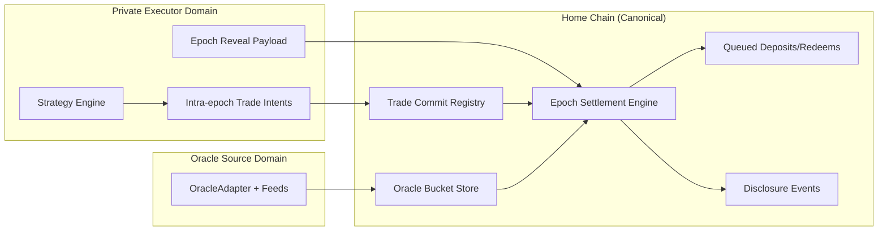
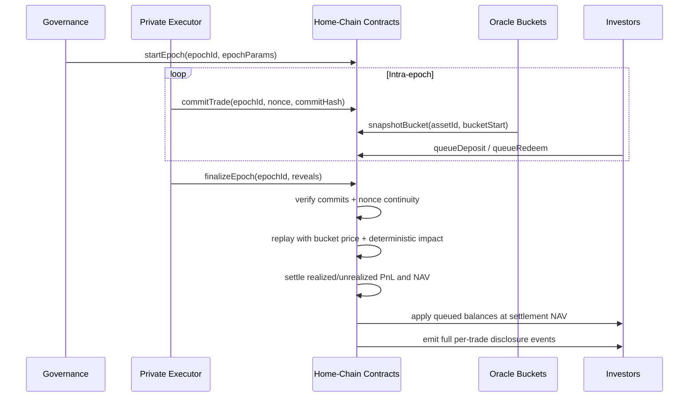
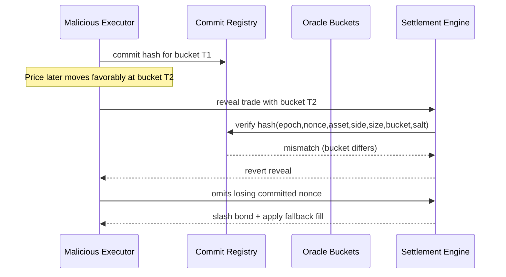
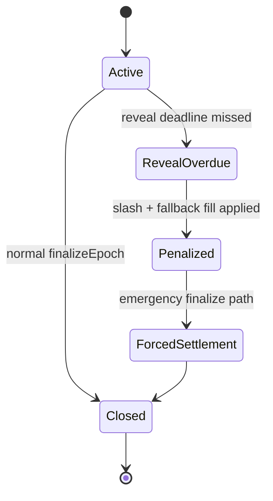

# Synthetic Epoch Security Review

Status: Peer-review draft (design/spec only, no contract implementation in this document)

## Purpose

Define a decision-complete, security-first design for synthetic epoch settlement with private intra-epoch strategy operation and full post-epoch trade disclosure.

This document is intentionally standalone and is not yet wired into in-app docs routes.

## Locked Decisions And Defaults

| Decision | Locked Value | Why |
| --- | --- | --- |
| Exposure model | Synthetic-only | Settlement is computed from protocol rules, not trusted venue-reported fills |
| Risk bearer | Vault investors | Investors directly absorb synthetic PnL |
| Canonical ledger | Home chain | Shares, NAV, settlement, and disclosure are finalized on one chain |
| Epoch cadence | 24h | Privacy/operations balance |
| Settlement pricing | Historical timestamp bucket + deterministic impact | Prevents settlement-time repricing |
| Trade disclosure timing | Full per-trade disclosure at epoch close | Intra-epoch privacy + post-epoch transparency |
| Executor trust on price | Non-authoritative | Protocol computes settlement prices |
| Bucket size | 5 minutes | Time granularity for replay |
| Commit lead-time | 2 buckets minimum | Blocks hindsight timestamp choice |
| Reveal deadline | Epoch end + 60 minutes | Bounded liveness with enforcement |

## System Trust Boundary

Boundary rule: only home-chain deterministic replay affects NAV. Private executor proposals are inputs, not economic truth.

## Protocol Flow

1. `startEpoch(epochId, epochParams)` freezes risk/impact/liquidity parameters for the epoch.
2. `commitTrade(epochId, nonce, commitHash)` records pre-committed trade tuples.
3. Oracle bucket prices are snapshotted and immutable for settlement use.
4. Deposits/redeems are queued during the epoch.
5. `finalizeEpoch(epochId, reveals)` verifies commitments, replays trades deterministically, settles NAV/PnL, applies queued investor actions, and emits full trade disclosure.
6. Open synthetic positions carry to the next epoch with updated state.

### Epoch Lifecycle Sequence

### Deposit/Redeem Queue Semantics

1. During epoch `N`, users submit `queueDeposit` and `queueRedeem`.
2. No mid-epoch execution against hidden strategy state.
3. At `finalizeEpoch(N)`, all queued actions settle at epoch `N` settlement NAV.
4. Resulting balances become active for epoch `N+1`.

### Position Carry-Over

1. Settlement computes realized PnL for reduced/closed legs.
2. Remaining synthetic exposure is marked with epoch-close bucket marks for unrealized PnL.
3. Open position state carries forward as next-epoch starting state.

## Anti-Cherry-Pick Rules

1. Commit hash binds exact tuple: `epochId, nonce, assetId, side, sizeUsd, timestampBucket, salt`.
2. Commit must be posted at least 2 buckets before `timestampBucket` opens.
3. Nonces are strictly increasing and continuous per epoch.
4. Every committed nonce must be revealed by reveal deadline.
5. Missing reveals trigger:
   - slashing of bonded stake, and
   - deterministic fallback fill rule (conservative/worst-case within protocol policy).
6. Oracle buckets are immutable once written.
7. Epoch parameters are immutable after `startEpoch`.

### Cherry-Pick Attack Vs Defense

## Threat Model

| Threat | Failure Mode | Primary Controls |
| --- | --- | --- |
| Oracle manipulation | Distorted bucket marks distort NAV/PnL | Canonical sources, immutable buckets, staleness/deviation checks, monitoring/challenge window |
| Reveal griefing/selective reveal | Profitable-only reveals or settlement blocking | Mandatory reveal, nonce continuity, slash + fallback fill |
| Replay/domain bugs | Cross-epoch/cross-deployment replay | Domain-separated hash: chainId, contract, version, epoch, nonce |
| Settlement gas DoS | Too many micro-trades block finalize | Max trades/epoch, min trade size, chunked finalization |
| Solvency/overexposure | Synthetic book exceeds collateral | Gross/net/notional caps, solvency floor checks, hard reverts |
| Epoch boundary sniping | Late commits exploit known marks | Commit lead-time, frozen epoch windows |
| Metadata leakage | Commit timing/count leaks strategy cadence | Batch commit options, cadence smoothing, disclosure policy clarity |
| Liveness/censorship | Inability to commit/reveal/finalize | Timeouts, emergency force-settlement mode |
| Governance abuse | Mid-epoch param tampering | Epoch-param freeze and delayed governance activation |
| Reorg/bucket ambiguity | Boundary bucket inconsistency | Finality threshold before bucket lock + deterministic boundary rules |
| Precision/rounding drift | NAV drift across implementations | Fixed-point spec, deterministic rounding policy, parity tests |

## Controls And Parameters

| Parameter | Default | Enforcement |
| --- | --- | --- |
| Bucket size | 5 minutes | Fixed epoch config |
| Commit lead-time | >= 2 buckets | Reject late commits |
| Reveal deadline | Epoch end + 60m | Missed reveal => slash + fallback |
| Max trades/epoch | Governance-set hard cap | Reject excess |
| Min trade size | Governance-set floor | Reject dust spam |
| Max gross exposure | Governance-set cap | Settlement revert on breach |
| Max net exposure | Governance-set cap | Settlement revert on breach |
| Max per-asset notional | Governance-set cap | Settlement revert on breach |
| Solvency floor | NAV safety floor | Settlement revert / emergency mode |
| Slashing bond | >= max plausible manipulation gain | Required for active executor |

Bond sizing rule: bond must exceed the maximum expected gain from withholding or distorting one full-epoch reveal set under configured risk limits.

## Settlement Replay Pipeline

Pricing rule: settlement never uses executor-reported fill price; it only uses protocol bucket price + deterministic impact function.

## Audit Invariants

1. No reveal can settle without a matching pre-commit.
2. Settlement price source is canonical bucket store only.
3. Epoch params used by settlement are immutable after `startEpoch`.
4. Every committed nonce is either settled or penalized.
5. Replay output is deterministic across independent implementations.
6. No silent nonce gaps are accepted.
7. Post-settlement exposures never exceed configured caps.
8. Queue settlement uses exactly epoch NAV and defined activation timing.

## Failure Handling State Diagram

## Operational Runbook

### Monitoring Signals

1. Commit lead-time violations attempted/rejected.
2. Missing nonce count at reveal deadline.
3. Bucket freshness, staleness, and source health.
4. Gross/net exposure headroom.
5. Solvency floor distance.
6. Finalization gas utilization versus cap.

### Emergency Pause Modes

1. Pause new commits.
2. Pause new queue submissions (optional, governance controlled).
3. Keep oracle snapshotting enabled for forced settlement continuity.

### Force-Settlement Path

1. Trigger after reveal timeout.
2. Apply deterministic fallback fills for missing reveals.
3. Settle epoch with penalties and emit incident annotations onchain.

### Incident Disclosure Expectations

1. Publish incident timeline with impacted epoch IDs.
2. Publish missing nonce set, penalties applied, and resulting NAV effect.
3. Publish remediation actions and parameter changes for subsequent epochs.

## Reviewer Checklist (Pass/Fail)

| Threat Class | Pass/Fail Question |
| --- | --- |
| Oracle integrity | Is each settlement price provably sourced from immutable canonical buckets? |
| Cherry-picking | Can an executor choose a more favorable timestamp after seeing outcomes? |
| Selective reveal | Can losing committed trades be omitted without economic penalty? |
| Replay isolation | Are commitments unusable across chain, contract, epoch, or version domains? |
| Liveness | Can the system always reach closure under reveal failure/censorship conditions? |
| Gas DoS | Can a malicious trade list prevent finalization by exceeding block gas constraints? |
| Solvency | Do enforced caps prevent undercollateralized synthetic exposure at settlement? |
| Governance safety | Can risk/impact params be changed mid-epoch to alter outcomes? |
| Numerical determinism | Do independent implementations produce byte-identical settlement results? |
| Disclosure guarantees | Are full per-trade details guaranteed at epoch close for every settled epoch? |

## Residual Risks

1. Oracle trust remains critical; corrupted oracle inputs can still distort settlement.
2. Intra-epoch metadata leakage remains (commit timing/count patterns).
3. Strategy discretion remains by design (trade-or-not decisions cannot be removed).
4. Extreme market moves can still challenge solvency despite caps.
5. Governance capture remains a systemic risk outside pure protocol logic.

## Scope Note

This document defines review targets and implementation constraints only. Existing live execution contracts are unchanged by this document.
