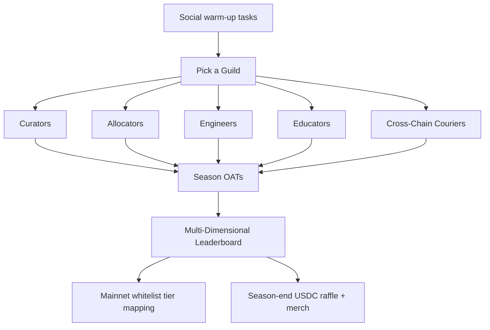
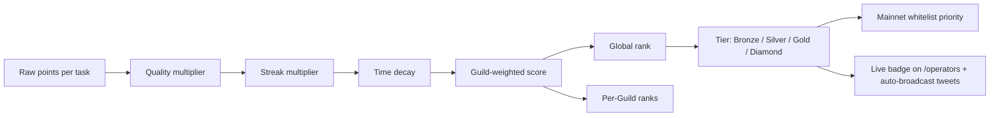

# IndexFlow Galxe Campaign — Season 1: Operator Trials

Season 1 of *Operator Trials* runs **Mon May 25, 2026 → Sun Jun 21, 2026** as the **Galxe portion of an Option C hybrid stack**. Galxe handles the light social and educational surface; **Boost.xyz handles every high-value onchain action**. The two platforms feed a single multi-dimensional leaderboard rendered at `/operators` on indexflow.app, which is the public artefact users actually see.

Companion docs:

- [`growth/X_GROWTH_PLAN.md`](./X_GROWTH_PLAN.md) — the X channel framework that drives wallets into this Galxe space.
- [`growth/X_CONTENT_CALENDAR.md`](./X_CONTENT_CALENDAR.md) — the date-slotted Season 1 schedule.
- Future: `growth/BOOST_CAMPAIGN_PLAN.md` — Boost.xyz Action definitions, TBI configuration, USDC pool sizing, and claim UI. **Not in scope for this doc. All onchain incentive design lives there.**
- `.cursor/plans/x_testnet_basket_activation_d9db6842.plan.md` — canonical campaign design (Option A/B/C trade-off discussion preserved for posterity).

---

## Why Galxe is scoped to socials + Educators only (Option C)

After researching the 2026 landscape, the Option C hybrid won on three criteria:

1. **Spend floor.** Galxe is free to list and free to run social/quiz/visit credentials. We pay $0 to keep the Onboarding surface live for Season 1 (an optional $0–500 Passport sponsorship covers Privy wallet onboarding for new users).
2. **Per-user quality.** Galxe's discover feed surfaces our campaign to ~14M wallets, but its audience skews to point-farmers (Optimism Quests reverted to pre-quest daily-transaction levels once rewards dried up — the textbook failure mode for Galxe-only). Pushing the high-value tasks off Galxe and onto Boost shields us from that failure mode while keeping the broad reach for cheap signals.
3. **Brand control.** Boost's USDC-per-action attribution surfaces on `/operators` under our brand, not Galxe's. Galxe is the wide-mouth funnel; `/operators` is the canonical operator surface.

The Educators Guild lives entirely in Galxe because Galxe is best-in-class for quizzes, UGC verifications, GitHub PR credentials, and visit-link checks — and because Educator tasks are exactly the ones where we *want* broad volume.

> **Engineering rule:** no high-value onchain action is implemented as a Galxe credential. If a task requires reading an Envio event that maps to USDC payout, it lives in Boost.xyz. Galxe credentials only verify "did this address do a *light* thing" (follow, quiz, visit, PR landed) where the answer is binary and the reward is reputational, not financial.

---

## Five Guilds at a glance

Movement's *Building the Parthenon* ran six Guilds; we trim to five and map them to our product surface so each Guild has its own win condition. **Only Onboarding + Educators tasks live in Galxe.** The remaining Guilds' onchain tasks live in Boost.xyz (tracked in the future Boost campaign plan).

| Guild | Win condition | Platform for this Guild's tasks |
| ----- | ------------- | ------------------------------- |
| **Curators** | Ship and *maintain* a real basket | Boost.xyz (One-Time Actions + TBI) |
| **Allocators** | Stay a depositor across multiple baskets | Boost.xyz (Deposit Variable Reward + TBI on `BasketShareToken` hold) |
| **Engineers** | An agent-managed basket on testnet | Boost.xyz (agent-write detection) + Galxe (GITHUB credential for PR-land tasks only) |
| **Educators** | The NAV ≠ exit-liquidity meme lands | **Galxe (full Guild surface)** |
| **Cross-Chain Couriers** | Multichain story works end-to-end (hub create + spoke deposit + redemption fill) | Boost.xyz (One-Time Actions per chain) |

The Onboarding sub-campaign (Twitter follow, Discord join, Privy wallet connect, NAV quiz, visit `/docs`) is open to every Guild and lives entirely in Galxe.

---

## Galxe Task Tree (Onboarding + Educators only)

Galxe credential types used: **TWITTER**, **DISCORD**, **TELEGRAM**, **GITHUB**, **VISIT_LINK**, **QUIZ**, **Contract Query**, **REST/GraphQL** (custom endpoint on our side). All task descriptions read in `smart_contract_event` style where applicable so the Boost-side counterparts (in the future Boost plan) can mirror the same wording.

### Onboarding sub-campaign (everyone, capped at ≤10% of total score)

| # | Task | Credential | Description |
| - | ---- | ---------- | ----------- |
| 1 | Follow `@IndexFlow` on X | TWITTER (follow) | Native Galxe Twitter credential. |
| 2 | Retweet the Season 1 hook tweet | TWITTER (retweet, fixed tweet ID) | Tweet ID locked to the Sat May 30 launch thread. |
| 3 | Quote-tweet with a "what would you basket?" reply | TWITTER (quote, tweet ID + min length) | Min 40 chars. UGC entry into the Educators chain. |
| 4 | Join the IndexFlow Telegram | TELEGRAM (channel join) | Native. |
| 5 | Join the IndexFlow Discord | DISCORD (server join) | Native. |
| 6 | Pass the 5-question *NAV vs exit liquidity* quiz | QUIZ (5 multiple-choice) | Quiz lives natively in Galxe. Questions sourced from [`docs/INVESTOR_FLOW.md`](../docs/INVESTOR_FLOW.md) and [`docs/SHARE_PRICE_AND_OPERATIONS.md`](../docs/SHARE_PRICE_AND_OPERATIONS.md). |
| 7 | Visit `/docs` and `/primer` | VISIT_LINK (× 2) | Native Galxe VISIT_LINK credential. |
| 8 | Connect a Privy wallet on testnet | REST credential | Calls our endpoint at `apps/web/src/app/api/galxe/credential/route.ts`; endpoint checks Envio for any read activity by the wallet. |

Reward: a single Onboarding OAT — **"IndexFlow Operator Trials: NAV Initiate"** — minted on completion of all 8 tasks. Onboarding contributes ≤10% of any individual's leaderboard score (hard cap enforced by the leaderboard worker).

### Educators Guild sub-campaign

| # | Task | Credential | Description |
| - | ---- | ---------- | ----------- |
| 1 | Pass the *Reserve Design* quiz (5 questions) | QUIZ | Sourced from [`docs/SHARE_PRICE_AND_OPERATIONS.md`](../docs/SHARE_PRICE_AND_OPERATIONS.md) and the `README.md` operations section. |
| 2 | Pass the *Perp Risk Math* quiz (5 questions) | QUIZ | Sourced from [`docs/PERP_RISK_MATH.md`](../docs/PERP_RISK_MATH.md). |
| 3 | Pass the *Asset Manager Flow* quiz (5 questions) | QUIZ | Sourced from [`docs/ASSET_MANAGER_FLOW.md`](../docs/ASSET_MANAGER_FLOW.md). |
| 4 | Post a UGC tweet using one of the canonical key phrases from [`growth/README.md`](./README.md) and submit the tweet ID | REST credential | Endpoint validates: tweet exists, contains the phrase, posted in the Season 1 window. |
| 5 | Land a typo-fix or doc PR | GITHUB | Native Galxe GITHUB credential checks for a merged PR touching `docs/` or any markdown file. |
| 6 | Verified doc-visit dwell time | REST credential | Endpoint validates an Envio-stored session showing ≥60s on a docs page in the last 7 days. |

Educator OATs (4 tiered, see "OAT Design" below) mint as the corresponding tasks complete. Educator contributes up to ~30% of an individual's Season 1 leaderboard score (the rest comes from Boost actions).

> **Note on Engineers Guild GitHub task:** Engineers also use Galxe's GITHUB credential for the "Land a PR touching `agents/` or `apps/mcps/`" task. That single credential is shared with the Educators Guild surface; everything else for Engineers lives in Boost.xyz. We've left that one task on Galxe because GITHUB credentials are free, native, and don't require an onchain payout.

---

## Galxe-native OAT design (5 OATs)

Five Galxe-native OATs mint to Gravity (no custom SBT contract for Season 1; we revisit for Season 2). Each is non-transferable; metadata pinned to IPFS; artwork stub uses the same brushwork as the [`growth/grants/indexflow-header-1500x500.svg`](./grants/indexflow-header-1500x500.svg) header.

| # | Name | Trigger | Mint timing |
| - | ---- | ------- | ----------- |
| 1 | **IndexFlow Operator Trials: NAV Initiate** | Complete all 8 Onboarding tasks | Onboarding completion |
| 2 | **IndexFlow Operator Trials: Reserve Designer** | Pass the Reserve Design quiz | On quiz pass |
| 3 | **IndexFlow Operator Trials: Risk Cartographer** | Pass the Perp Risk Math quiz | On quiz pass |
| 4 | **IndexFlow Operator Trials: Operator Voice** | Land a UGC tweet that uses a canonical key phrase | On REST credential pass |
| 5 | **IndexFlow Operator Trials: Doc Mason** | Land a merged doc PR | On GITHUB credential pass |

Naming convention: every OAT starts with **"IndexFlow Operator Trials: …"** so they read as a single Season 1 family in any wallet/explorer.

Custom artwork commission is **optional ($0–500)** for Season 1; default is Galxe-native templated cards with the IndexFlow wordmark and a per-OAT tag colour.

---

## Multi-Dimensional Leaderboard

For Option C, the leaderboard worker is **custom and lives in our repo**, not in Galxe. Galxe's `GetLeaderboard(spaceId, cursorAfter)` is one input source. Boost.xyz claim/accrual state is the second. Envio HyperIndex is the third (for quality-multiplier inputs).

### Six dimensions

1. **Raw points** — base value per task. Onboarding ≤ Allocator deposit ≤ Curator create-and-register ≤ Engineer agent-managed ≤ Curator maintain-14-days. Hard cap on social/onboarding share at ≤10% of any individual's score.
2. **Quality multiplier** — for Curators, points scale with vault *quality*, not just creation. Inputs: TVL retention (TVL still present 7/14/28 days after creation), unique depositor count, and time since last operator action (rebalance, perp allocation, reserve top-up). Computed from Envio. An abandoned basket scores ~0; a well-managed basket scores 1.5–2×.
3. **Streak multiplier** — consecutive ISO weeks with at least one qualifying action: 1 week = 1.0×, 2 = 1.1×, 3 = 1.25×, 4 = 1.5×. Resets on a gap week.
4. **Time decay** — points from week *k* are weighted `0.9^(currentWeek - k)`. Keeps a stale Week 1 sprint from locking the top of the board.
5. **Guild weight** — each Guild has its own per-task weight vector. Global rank is `Σ(guild_score * guild_global_weight)`; per-Guild rank uses unweighted Guild score.
6. **Tiers** — Bronze (top 50%) / Silver (top 25%) / Gold (top 10%) / Diamond (top 3%). Re-evaluated daily. Tiers translate to: visible badge on `/operators`, colour-coded auto-broadcast tweet, mainnet whitelist priority tier.

A **multi-Guild bonus** (+20% flat to global score) lands if you complete the lowest-tier OAT in 3+ Guilds.

### Surfaces

- **Galxe-native leaderboard** — auto-rendered by the Galxe campaign page. Useful for Educator/Onboarding completionists who care about Galxe-internal ranking.
- **`/operators` on indexflow.app** — the canonical surface. Joins Galxe `GetLeaderboard` + Boost claim/accrual + Envio onchain state. Shows global rank, current Guild + Guild rank, current Tier, current streak, this-week point delta. Lives at `apps/web/src/app/operators/`.
- **Weekly digest tweet** — the auto-broadcast bot posts a Sunday digest: "Season 1 — Week N: 3 new Diamond Curators, 12 new Silvers, 47 new baskets, top movers this week."
- **CSV export** — exposed at `/operators/export.csv` for the team to feed into the Clay outreach list.

---

## Anti-Sybil

- **Galxe Passport** — one Passport per Galxe account; Passport gates the higher-point Educator tasks. Optional $0–500 sponsorship covers the Passport mint fee for the first N new users so wallet friction doesn't kill conversion.
- **Privy gating** — Privy login already gates testnet writes by email. Same Privy session is what the Onboarding REST credential verifies.
- **Contract Query credentials** — every Educator task that has an onchain component (currently only the doc-visit + UGC verification, both REST-based) requires actual state changes that an Envio query can confirm.
- **Social/Onboarding cap at ≤10%** — enforced by the leaderboard worker. A user who only does socials cannot crack Silver tier no matter how many follows/quizzes they stack.
- **OATs are non-transferable** — multi-account farming costs gas without compounding value.

---

## Budget (Galxe-portion only)

Boost.xyz spend is tracked separately in the future `growth/BOOST_CAMPAIGN_PLAN.md`. Galxe-side numbers for Season 1:

| Line item | Floor | Cap | Notes |
| --------- | ----- | --- | ----- |
| Galxe campaign listing | $0 | $0 | Free. |
| Galxe discover-feed boost spend | $0 (Week 1) | $0–500 (Week 2, revisit) | Only spend if Week 1 organic discovery is weak. Decision check on Fri Jun 5. |
| Custom OAT artwork commission | $0 | $500 | Optional. Default is Galxe-native templated cards. |
| Galxe Passport sponsorship | $0 | $500 | Cover Passport mint fee for the first N Engineers/Curators new to Galxe. |
| **Galxe total** | **$0** | **~$1,000** | |

Total Season 1 envelope (Galxe + Boost + merch + cross-promo) targets ~$5–7k floor and $7–8k cap. The Boost.xyz portion (~$5,000 USDC pool + 10% protocol fee) is the dominant line and is sized in `growth/BOOST_CAMPAIGN_PLAN.md`.

---

## Engineering Surface (Galxe-only)

- **`apps/web/src/app/api/galxe/credential/route.ts`** — single Next.js API route implementing Galxe's REST credential contract. Takes `{credId, address}` and returns `1` / `0`.

  Handles:
  - Privy wallet connect verification (checks Envio for any read activity by the wallet).
  - UGC tweet verification (resolves tweet ID via Twitter API, checks for the presence of one of the canonical key phrases, checks the tweet was posted in the Season 1 window).
  - Doc-visit dwell-time verification (queries Envio session table for ≥60s on a docs page in the last 7 days).

- **AGENT_DEPLOYMENT_MEMORY ledger entry** — registered as `owner: user`, agent permission `read`. Endpoint lives inside the existing `apps/web` deploy so no new service is created beyond the existing Vercel project; the ledger entry tracks the *route* as a deployment surface.

- **Quiz authoring** — quizzes live as Galxe-native QUIZ credentials, authored in the Galxe dashboard. Source content for the three quizzes lives in [`docs/INVESTOR_FLOW.md`](../docs/INVESTOR_FLOW.md), [`docs/PERP_RISK_MATH.md`](../docs/PERP_RISK_MATH.md), and [`docs/ASSET_MANAGER_FLOW.md`](../docs/ASSET_MANAGER_FLOW.md).

- **OAT delivery** — Galxe-native OATs on Gravity. No custom SBT contract for Season 1.

No changes required to the contracts. No new services beyond the credential route. The leaderboard worker (shared with Boost.xyz) is documented in `growth/BOOST_CAMPAIGN_PLAN.md` because the worker's heavy logic is Boost-side; Galxe is one read source it joins.

---

## Inspiration Row (what we copy and what we leave)

| Reference | What we copy | What we leave |
| --------- | ------------ | ------------- |
| **Movement — *Building the Parthenon*** (2M+ participants, 50+ dApps, 400+ tasks) | Guild structure with separate task trees, sub-campaigns, per-Guild OATs. The "pick a Guild" entry flow. | The 50-dApp ecosystem-wide format (we are one app). |
| **Berachain — *March of the Beras*** (8.5M participants, 80 days) | Educational arc tied to actually using DeFi primitives (deposit, allocate, hold); interleaved quizzes. | 80-day length (we run 4 weeks first, extend if hot). |
| **Secured Finance — *Itayose* (March 2026)** | Multi-chain task pattern ("place an X on each chain") — mirrors our hub/spoke topology, lifts directly to Cross-Chain Couriers (which lives in Boost, not Galxe). | Only-1-OAT-for-all structure (too thin for retention). |
| **daGama — *Seasonal Growth on Galxe*** | Recurring "Season N" framing so we can re-run with fresh OATs and refresh interest without burning the brand. | — |

---

## What's pending before launch

- [ ] **Galxe space created** — `IndexFlow` workspace with Season 1 campaign drafted, three quizzes authored, 8 Onboarding tasks + 6 Educator tasks configured.
- [ ] **OAT artwork uploaded** — 5 OATs (1 Onboarding + 4 Educator). Galxe-native templated cards acceptable; commission optional.
- [ ] **REST credential endpoint deployed** — `apps/web/src/app/api/galxe/credential/route.ts` live, registered in [`AGENT_DEPLOYMENT_MEMORY.md`](../AGENT_DEPLOYMENT_MEMORY.md), responding to the three dynamic checks above.
- [ ] **Passport sponsorship reserved** — optional $0–500 set aside to cover Passport mint fees for the first N new users.
- [ ] **Boost.xyz Actions submitted** — separate workstream, tracked in `growth/BOOST_CAMPAIGN_PLAN.md` once that file lands; mention here only because the leaderboard worker depends on it. Submitted Week 0 (Sun May 24) for 24–48h review.
- [ ] **Leaderboard worker deployed** — Cloud Run service joining Galxe `GetLeaderboard` + Boost claim state + Envio; specified in `growth/BOOST_CAMPAIGN_PLAN.md` and registered in `AGENT_DEPLOYMENT_MEMORY.md`.

Week 0 prep day for the entire stack is **Sun May 24, 2026**. Campaign goes public on **Mon May 25, 2026** in soft-launch mode (Onboarding + Educators tasks live; no Galxe boost spend, observe organic discovery for one week before re-evaluating).
