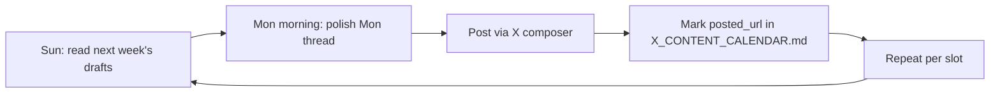

# IndexFlow X Content Calendar — Season 1

The canonical date-slotted schedule for every X post in Season 1 (Mon May 25, 2026 → Sun Jun 21, 2026). Each row points to a pre-seeded draft file in [`growth/drafts/`](./drafts/); the workflow is *edit + post*, not *write + post*. Strategy reference: [`growth/README.md`](./README.md). X-specific framework: [`growth/X_GROWTH_PLAN.md`](./X_GROWTH_PLAN.md).

This calendar is X-only. [`growth/CONTENT_CALENDAR.md`](./CONTENT_CALENDAR.md) remains the layer/pillar **backlog** across all channels (LinkedIn, Substack, YouTube). This file is the X **schedule**.

## Workflow

Each row in the table below has a corresponding draft file in [`growth/drafts/`](./drafts/). You polish, post, and update the row:

1. **Sun before**: read the next week's drafts. 10–15 min per draft to inject your voice.
2. **Day of**: polish the day's draft, post via the X composer at the slotted `time_utc`.
3. **Immediately after posting**: update `status` to `posted` and fill in `posted_url`.
4. **2–3 h after posting**: quote-tweet the hook with a one-line summary (per the note in [`growth/templates/tweet-thread.md`](./templates/tweet-thread.md)).

Status transitions: `seeded` → `polished` → `scheduled` → `posted`. A row marked `seeded` has a complete first-pass draft on disk; a row marked `polished` is post-ready in your voice; `scheduled` means it's queued in your X composer; `posted` means it's live and the `posted_url` is filled in. Rows marked `deferred` are blocked on an external prerequisite (see the draft file); flip back to `polished` once the blocker clears.

## Cadence and mix

Six posts/week baseline. Week 2 and Week 3 are seven — Week 2 carries an extra Sun Jun 7 reinforcement beat (the canonical "route by depth, not by default." standalone, bumped from Wed May 27 when the testnet-agents-live teaser took that slot); Week 3 is seven due to the confidential-infra trinity. Week 4 is also seven after the Thu Jun 18 16:30 Envio data-plane standalone was added on 2026-05-27 to anchor the agreed Envio co-marketing surface (per [`growth/partnerships/envio.md`](./partnerships/envio.md)). 60% educational/thought leadership, 30% project updates, 10% promotional across the season. One thread per week is the Operator-of-the-Week spotlight from Week 2 onward.

Threads default to **15:00 UTC**; standalones default to **16:30 UTC**; Spaces start at **21:00 UTC** on Sun Jun 21. All deep-links carry `utm_source=x&utm_campaign=season-1` so Envio can attribute `BasketCreated` events back to the source post.

---

## Season 1 schedule

| date | day | time_utc | slot_type | track | guild | pillar | hook_type | draft_path | status | posted_url |
| ---- | --- | -------- | --------- | ----- | ----- | ------ | --------- | ---------- | ------ | ---------- |
| 2026-05-25 | Mon | 16:30 | standalone | A | none | P1 | Contrarian | `growth/drafts/2026-05-25-tweet-portfolio-value-vs-exit-liquidity.md` | posted | https://x.com/indexflowDAO/status/2059033907975295163 |
| 2026-05-26 | Tue | 15:00 | thread | A | none | P1 | Contrarian | `growth/drafts/2026-05-26-thread-nav-is-not-exit-liquidity.md` | posted | https://x.com/indexflowDAO/status/2059141832618205409 |
| 2026-05-27 | Wed | 16:30 | standalone | cross | none | P3 | Data | `growth/drafts/DONE-2026-05-27-tweet-testnet-agents-live.md` | posted | https://x.com/indexflowDAO/status/2061353852604174436 |
| 2026-05-28 | Thu | 15:00 | thread | A | none | P3 | Contrarian | `growth/drafts/2026-05-28-thread-six-contracts-zero-chain-pickers.md` | polished |  |
| 2026-05-29 | Fri | 16:30 | standalone | A | none | P1 | Curiosity Gap | `growth/drafts/2026-05-29-tweet-reserve-depth-is-product-quality.md` | polished |  |
| 2026-05-30 | Sat | 15:00 | thread | cross | none | P4 | Insider Knowledge | `growth/drafts/2026-05-30-thread-operator-hall-of-fame-launch.md` | seeded |  |
| 2026-05-30 | Sat | 21:00 | thread | cross | none | P3 | Insider Knowledge | `growth/drafts/2026-05-30-thread-agent-company-launch.md` | seeded |  |
| 2026-05-31 | Sun | 16:30 | standalone | cross | none | P4 | Curiosity Gap | `growth/drafts/2026-05-31-tweet-season-1-launch-quote.md` | seeded |  |
| 2026-06-01 | Mon | 15:00 | thread | B | Curators | P1 | Curiosity Gap | `growth/drafts/2026-06-01-thread-build-a-basket-in-10-minutes.md` | polished |  |
| 2026-06-02 | Tue | 16:30 | standalone | B | Curators | P3 | Personal Story | `growth/drafts/2026-06-02-tweet-auto-broadcast-pattern.md` | polished |  |
| 2026-06-03 | Wed | 15:00 | thread | B | Curators | P4 | Personal Story | `growth/drafts/2026-06-03-thread-operator-of-the-week-curator-1.md` | seeded |  |
| 2026-06-04 | Thu | 16:30 | standalone | B | Cross-Chain Couriers | P3 | Data | `growth/drafts/2026-06-04-tweet-mantle-spoke-demo.md` | deferred |  |
| 2026-06-05 | Fri | 15:00 | thread | A | none | P2 | Insider Knowledge | `growth/drafts/2026-06-05-thread-five-waves-of-onchain-exposure.md` | seeded |  |
| 2026-06-06 | Sat | 16:30 | standalone | B | Curators | P4 | Stakes | `growth/drafts/2026-06-06-tweet-spaces-announcement-week-2.md` | seeded |  |
| 2026-06-07 | Sun | 16:30 | standalone | A | none | P3 | Insider Knowledge | `growth/drafts/DONE-2026-06-07-tweet-route-by-depth-not-by-default.md` | posted | https://x.com/indexflowDAO/status/2064033245059297681 |
| 2026-06-08 | Mon | 15:00 | thread | C | Engineers | P3 | Curiosity Gap | `growth/drafts/2026-06-08-thread-plug-your-agent-into-a-basket.md` | polished |  |
| 2026-06-09 | Tue | 16:30 | standalone | C | Engineers | P3 | Data | `growth/drafts/2026-06-09-tweet-run-log-as-receipt.md` | seeded |  |
| 2026-06-10 | Wed | 15:00 | thread | B | Curators | P4 | Personal Story | `growth/drafts/2026-06-10-thread-operator-of-the-week-curator-2.md` | seeded |  |
| 2026-06-11 | Thu | 16:30 | standalone | C | Engineers | P3 | Insider Knowledge | `growth/drafts/2026-06-11-tweet-many-baskets-one-engine.md` | seeded |  |
| 2026-06-12 | Fri | 15:00 | thread | C | Engineers | P3 | Insider Knowledge | `growth/drafts/2026-06-12-thread-iexec-confidential-agent.md` | seeded |  |
| 2026-06-13 | Sat | 16:30 | standalone | C | Curators (Private sub-track) | P3 | Curiosity Gap | `growth/drafts/2026-06-13-tweet-secret-network-private-basket.md` | seeded |  |
| 2026-06-14 | Sun | 16:30 | standalone | C | Engineers | P3 | Stakes | `growth/drafts/2026-06-14-tweet-nox-mpc-signing.md` | seeded |  |
| 2026-06-15 | Mon | 15:00 | thread | A | none | P5 | Contrarian | `growth/drafts/2026-06-15-thread-bring-your-own-license.md` | seeded |  |
| 2026-06-16 | Tue | 16:30 | standalone | A | none | P5 | Insider Knowledge | `growth/drafts/2026-06-16-tweet-licensed-managers-already-do-this.md` | seeded |  |
| 2026-06-17 | Wed | 15:00 | thread | B | Curators | P4 | Personal Story | `growth/drafts/2026-06-17-thread-operator-of-the-week-curator-3.md` | seeded |  |
| 2026-06-18 | Thu | 15:00 | thread | cross | none | P4 | Data | `growth/drafts/2026-06-18-thread-season-1-recap.md` | seeded |  |
| 2026-06-18 | Thu | 16:30 | standalone | cross | none | P3 | Data | `growth/drafts/2026-06-18-tweet-envio-data-plane.md` | seeded |  |
| 2026-06-19 | Fri | 16:30 | standalone | cross | none | P4 | Stakes | `growth/drafts/2026-06-19-tweet-season-1-72h-warning.md` | seeded |  |
| 2026-06-20 | Sat | 16:30 | standalone | cross | none | P4 | Stakes | `growth/drafts/2026-06-20-tweet-spaces-season-close.md` | seeded |  |
| 2026-06-21 | Sun | 21:00 | spaces | cross | none | P4 | Stakes | `growth/drafts/2026-06-21-spaces-season-close.md` | seeded |  |

Column legend:

- `date` — ISO date.
- `day` — short day-of-week (Mon, Tue, …).
- `time_utc` — recommended post window (per the 14:00–17:00 UTC note in [`growth/templates/tweet-thread.md`](./templates/tweet-thread.md)).
- `slot_type` — `thread` \| `standalone` \| `spotlight` \| `spaces`.
- `track` — X-plan track (A = ICP managers, B = crypto-native builders, C = AI-agent/DeFAI builders, cross = cross-track).
- `guild` — Galxe Guild tie-in (Curators, Allocators, Engineers, Educators, Cross-Chain Couriers, or `none`).
- `pillar` — P1–P6 from [`growth/README.md`](./README.md).
- `hook_type` — one of the six hook types in [`growth/templates/tweet-thread.md`](./templates/tweet-thread.md): Data, Contrarian, Insider Knowledge, Curiosity Gap, Stakes, Personal Story.
- `draft_path` — relative path to the draft file (every row has one on disk in `seeded` status).
- `status` — `seeded` \| `polished` \| `scheduled` \| `posted` \| `deferred`.
- `posted_url` — filled in after the user posts; closes the analytics loop.

---

## Catch-up sprint (Jun 8–10, 2026)

Backlog slots polished and queued after the May 27 testnet-agents post went live on Jun 1. Post in this order; fill `posted_url` after each goes live:

| priority | date | draft | status | action |
| -------- | ---- | ----- | ------ | ------ |
| P1 | 2026-06-07 | `2026-06-07-tweet-route-by-depth-not-by-default.md` | posted | https://x.com/indexflowDAO/status/2064033245059297681 |
| P1 | 2026-06-02 | `2026-06-02-tweet-auto-broadcast-pattern.md` | polished | Post standalone same morning (optional but recommended) |
| P0 | 2026-06-08 | `2026-06-08-thread-plug-your-agent-into-a-basket.md` | polished | Post 10-tweet thread at 15:00 UTC; QT hook ~17:30 UTC |
| P2 | 2026-06-01 | `2026-06-01-thread-build-a-basket-in-10-minutes.md` | polished | Post by Wed Jun 10 — capture fresh testnet screenshots first |
| P2 | 2026-05-28 | `2026-05-28-thread-six-contracts-zero-chain-pickers.md` | polished | Post by Wed Jun 10 |
| P2 | 2026-05-29 | `2026-05-29-tweet-reserve-depth-is-product-quality.md` | polished | Post by Wed Jun 10 |
| hold | 2026-06-04 | `2026-06-04-tweet-mantle-spoke-demo.md` | deferred | Blocked: Mantle Sepolia **spoke** deploy + live cross-chain deposit demo (hub exists; spoke does not) |

---

Done before any post goes live:

- [ ] Submit all Boost.xyz Actions to the Boost team for 24–48h review (per `docs.boost.xyz/v2/documentation/getting-started/setting-up-an-action`). Detailed list lives in the future [`growth/BOOST_CAMPAIGN_PLAN.md`](./BOOST_CAMPAIGN_PLAN.md) — submission window opens here.
- [ ] Stand up the Galxe space with Educators + Onboarding quests (no boost spend yet). Tasks detailed in [`growth/GALXE_CAMPAIGN_PLAN.md`](./GALXE_CAMPAIGN_PLAN.md).
- [ ] Deploy the `/operators` page skeleton at `apps/web/src/app/operators/`. Placeholder data acceptable; real Galxe + Boost + Envio joins land via the leaderboard worker.
- [ ] Deploy the leaderboard worker to Cloud Run (mirrors the `apps/push-worker` shape).
- [ ] Deploy the auto-broadcast bot. Confirm Envio HyperIndex `BasketCreated` subscription is wired to the `@IndexFlowBots` posting account.
- [ ] Register the three new services in [`AGENT_DEPLOYMENT_MEMORY.md`](../AGENT_DEPLOYMENT_MEMORY.md) with `owner: user`, agent permission `read` only:
  - `auto-broadcast-bot`
  - `leaderboard-worker`
  - `galxe-credential-endpoint` (the route at `apps/web/src/app/api/galxe/credential/route.ts`)
- [ ] Final read of all Week 1 drafts; confirm Boost Actions approved by EOD Sun.
- [ ] Confirm the Nox X handle for the Sun Jun 14 co-tweet (placeholder in the Week 3 draft until confirmed).

---

## Post-season — Jun 22–28, 2026

The campaign tapers, but the value capture continues:

- **Boost.xyz claim window** remains open per Boost's per-Action config (default 7 days unless overridden). The Sat Jun 20 standalone and Sun Jun 21 Spaces both emphasise that claims do not auto-execute and users should claim before Sun Jun 28.
- **Final raffle draw** on the Sun Jun 21 Spaces. USDC raffle entries are computed by the leaderboard worker from final tier counts; results pinned on `@IndexFlow` Monday morning Jun 22.
- **Season 1 recap blog post seed** — long-form atomization of the Thu Jun 18 recap thread. Drafts in [`growth/drafts/`](./drafts/) under the `blog` type, scheduled for publish on Mon Jun 29. LinkedIn cross-post Tue Jun 30.
- **Operator of the Week #4 spotlight (optional, post-season)** — if a Diamond curator emerges in the closing week who hasn't been spotlighted, run one more spotlight thread the following Wed (Jun 24).
- **Quote-tweet retrospective** — pin a summary tweet on Mon Jun 22 with final numbers: total baskets, total operators, total Boost USDC claimed, Diamond/Gold counts, top-attribution tweets.
- **AGENT_DEPLOYMENT_MEMORY review** — confirm all three services still listed `owner: user`, agent permission `read` only. Decision: keep auto-broadcast bot running (Season 2 prep) or pause until Season 2 launches.
