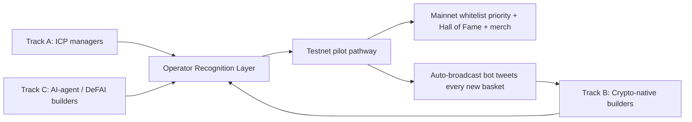

# IndexFlow X Growth Plan — Season 1

Living version of the X-channel growth plan that powers IndexFlow's Season 1 testnet activation. Companion docs: [`growth/README.md`](./README.md) for the 4-layer growth framework, [`growth/GALXE_CAMPAIGN_PLAN.md`](./GALXE_CAMPAIGN_PLAN.md) for the Galxe portion of the campaign stack, and [`growth/X_CONTENT_CALENDAR.md`](./X_CONTENT_CALENDAR.md) for the date-slotted Season 1 schedule.

This doc is tactical and reference-only. The canonical multi-option design discussion lives in `.cursor/plans/x_testnet_basket_activation_d9db6842.plan.md`.

---

## Objective

Pull more people onto testnet to **create and operate** baskets (not just deposit) via an X-native funnel.

[`growth/README.md`](./README.md)'s ICP is institutional asset managers — slow, high-fit, high-trust. X behaves differently. So Season 1 runs three parallel tracks into one shared **operator recognition layer**, all converging on the existing testnet pilot pathway in `growth/README.md` Layer 2.

The single number we optimise weekly:

> **New testnet baskets created from `utm_source=x` per week.**

Everything in this plan exists to move that number.

---

## The Shape

Three tracks, three voices, one funnel.

---

## Three Tracks, Three Voices

### Track A — Institutional / ICP managers (slow, high-fit)

Continues the existing thread / blog / Substack pipeline from [`growth/CONTENT_CALENDAR.md`](./CONTENT_CALENDAR.md) Layer 1, with one X-native twist: every Substack issue of *The Vault Operator's Edge* spawns a paired X thread plus a DM-warm play against asset managers identified in the Clay list (see [`growth/VC_OUTREACH_PLAYBOOK.md`](./VC_OUTREACH_PLAYBOOK.md) for the tooling pattern).

Voice: precise, systems-language, regulatory-fluent. The "bring your own license" thread on Week 4 Mon Jun 15 is the canonical Track A artefact.

### Track B — Crypto-native builders (fast, volume)

Tinkerer audience that can spin up a basket in an hour and is allergic to corporate prose. Mechanic: weekly *Build a basket in 10 minutes* thread that ends with "show me your basket — reply with the address." Each reply gets a quote-tweet spotlight.

Voice: same brand voice ("smart colleague at a conference"), but the source material shifts from regulatory docs to the testnet UI itself — screenshots from `/baskets/new`, copy-pasted run logs, recipe-style threads.

### Track C — AI-agent / DeFAI builders (differentiator)

The hardest segment to reach but also the one where IndexFlow has the most defensible angle. Lean into the agent framework documented in [`docs/AGENTS_FRAMEWORK.md`](../docs/AGENTS_FRAMEWORK.md) and [`agents/quality-matrix-manager.md`](../agents/quality-matrix-manager.md). Mechanic: "Fork an agent, point it at a testnet vault." The committed run-logs at `agents/memory/<agent>/run-log.<network>.jsonl` become tweetable receipts.

Voice: confident technical, run-log first. "Many baskets, one trading engine" is the canonical anchor.

---

## Recognition Layer — No cash, real upside

This is what makes the whole thing work without a funded competition. Recognition and priority, not prizes.

- **Operator Hall of Fame** at `/operators` — public list of every testnet basket curator, their handle, basket count, age of oldest position, current tier. One source of truth for the spotlight loop. New route at `apps/web/src/app/operators/`.
- **Weekly Operator of the Week** thread — 5-tweet spotlight on a curator: why this basket, fee policy, reserve % choice, what they'd do differently. Drafts live in `growth/drafts/` (one per week from Week 2 onward).
- **Mainnet whitelist priority** — testnet operators with N+ baskets and >M days of activity get earlier mainnet access. Display this as a non-binding "priority tier" on `/operators`, not as points or tokens (stays inside the regulatory posture from [`docs/REGULATORY_ROADMAP_DRAFT.md`](../docs/REGULATORY_ROADMAP_DRAFT.md)).
- **Milestone merch** — first basket, first perp allocation, first agent-managed basket, first cross-chain operator. Hoodies and stickers. Tweet each shipment.

Tier mapping (computed by the leaderboard worker, re-evaluated daily):

| Tier | Cohort cut | Translates to |
| ---- | ---------- | ------------- |
| Bronze | Top 50% of operators | Badge on `/operators` |
| Silver | Top 25% | Badge + colour-coded auto-broadcast tweet |
| Gold | Top 10% | Sticker pack mailed, badge + auto-broadcast |
| Diamond | Top 3% | Hoodie mailed, Tier 1 mainnet whitelist priority |

The point of the tier ladder is to make the *next* tier visible from any current position. Nobody opens `/operators` and feels they have nothing to chase.

---

## X-Native Mechanics

1. **Auto-broadcast bot** — a small worker watching the Envio HyperIndex GraphQL endpoint for `BasketCreated` events and tweeting each new basket from a `@IndexFlowBots` account. Pulls curator handle from a one-time off-chain mapping (registered at vault creation in the existing testnet email-capture step). Registered as `owner: user` in [`AGENT_DEPLOYMENT_MEMORY.md`](../AGENT_DEPLOYMENT_MEMORY.md) before going live.
2. **Build-along threads (weekly)** — "From idle USDC to live perp exposure in 6 tweets," screenshots from the testnet UI at `/baskets/[address]`. Self-contained recipe; ends with a deeplink carrying `utm_source=x&utm_campaign=<slug>`.
3. **Operator spotlights (weekly from Week 2)** — short 3–5 tweet threads, retweeted from main account and the curator's handle. Drives the curator's own network back into the funnel — and is the most reliable repeatable beat we have.
4. **Spaces (biweekly)** — *Office Hours with a Vault Operator*, 14:00–17:00 UTC per the thread timing note in [`growth/templates/tweet-thread.md`](./templates/tweet-thread.md). Pin recordings as quote-tweets the next morning. Season 1 schedules a kickoff Spaces in Week 2 and a season-close Spaces on Sun Jun 21.
5. **Agent thread arc (weekly during Track C activation)** — "What the agent did this week" using fresh entries from `agents/memory/<agent>/run-log.<network>.jsonl`. The committed-to-git audit trail *is* the meme.
6. **Reply hooks for prompts** — "If you had $5M to basket, what 4 assets are in it? Reply with tickers." Then reply with "Here's a starter scaffold on testnet" + deeplink that pre-fills the `/baskets/new` form. Turns a poll-style tweet into a basket creation.
7. **Memetic anchors** — recycle phrases already in [`growth/README.md`](./README.md) ("Portfolio value and exit liquidity are not the same thing", "Six contracts, zero chain pickers", "Many baskets, one trading engine", "Route by depth, not by default") as standalone tweets and reply quips.
8. **Cross-channel atomization** — every thread auto-becomes a Farcaster cast (using [`growth/templates/farcaster-cast.md`](./templates/farcaster-cast.md)) and a LinkedIn carousel (Track A only). Standalone tweets do not atomise — they live and die on X.

---

## 4-Week Launch Sequence

Season 1 runs **Mon May 25, 2026 → Sun Jun 21, 2026**. Week 0 prep day is **Sun May 24**. Week 1 carries a Memorial Day adjustment: Mon May 25 runs a softer standalone, and the official launch thread shifts to Tue May 26.

### Week 0 — Sun May 24 (prep)

- Submit all Boost.xyz Actions to the Boost team for 24–48h review (per `docs.boost.xyz/v2/documentation/getting-started/setting-up-an-action`).
- Stand up the Galxe space with Educators + Onboarding quests (no boosts yet).
- Deploy the `/operators` skeleton, the leaderboard worker, and the auto-broadcast bot to Cloud Run.
- Register all three services in [`AGENT_DEPLOYMENT_MEMORY.md`](../AGENT_DEPLOYMENT_MEMORY.md) as `owner: user`, agent permission `read` only.
- Final pass on Week 1 drafts.

### Week 1 — Mon May 25 → Sun May 31 (account warm-up + thesis)

Cold open. P1/P2/P3 educational + thesis content. The week culminates in the official Season 1 launch thread on **Sat May 30** (`thread-operator-hall-of-fame-launch.md`), which is the first post that explicitly invites action ("open a basket, claim a tier").

Track focus: **A** (thesis-heavy threads) with one cross-track launch beat.

### Week 2 — Mon Jun 1 → Sat Jun 6 (Track B / Curators activation, Mantle slot)

*Build a basket in 10 minutes* launches as the recurring weekly thread on Mon Jun 1. First Spaces co-hosted Mon/Tue Jun 8/9. First **Operator of the Week** spotlight thread on Wed Jun 3. **Mantle partnership slot** on Thu Jun 4 — Cross-Chain Courier spoke demo (basket on hub, deposit accepted on Mantle spoke via `StateRelay`).

Track focus: **B** with one **A** thesis thread (Five Waves) and one cross-track Spaces announcement.

### Week 3 — Mon Jun 8 → Sun Jun 14 (Track C / Engineers activation, confidential-infra trinity)

The partnership-dense week. Three co-branded slots forming a single narrative arc: **iExec** for confidential compute, **Secret Network** for confidential state, **Nox** for MPC signing. Seven posts (one more than other weeks) because the trinity is one of the strongest narratives we ship in Season 1.

The trinity tweet is the Week 3 close on Sun Jun 14: *Compute on iExec, state on Secret, writes signed by Nox MPC — none of it is custodial.*

Track focus: **C** with the second Operator of the Week spotlight on Wed Jun 10.

### Week 4 — Mon Jun 15 → Sat Jun 20 (Track A + Season close)

High-craft regulatory + *bring your own license* threads paired with Substack. DM warmups for asset managers from the Clay list. Re-broadcast Week 2/3 successes as proof for the institutional cohort. Friday: "Last 72h to hit Diamond" push. Sat: Spaces announcement for the Sun Jun 21 21:00 UTC season close.

Track focus: **A** with the third Operator of the Week spotlight on Wed Jun 17 and a cross-track Season 1 recap thread on Thu Jun 18.

### Post-season (Jun 22–28)

- Boost.xyz claim window remains open per Boost's per-Action config (default 7 days unless overridden).
- Final raffle draw on the Sun Jun 21 Spaces.
- Season 1 recap blog post + LinkedIn cross-post seeded for the following Monday.

---

## Cadence and Mix

Anchored to the channel cadence in [`growth/README.md`](./README.md) (3–5 X posts/week) and the 60/30/10 mix from [`growth/templates/tweet-thread.md`](./templates/tweet-thread.md). Season 1 intentionally ramps to **6 posts/week** (Week 3 is 7 due to the trinity).

Per week, roughly:

- 2 threads + 4 standalones
- One thread is the Operator of the Week spotlight from Week 2 onward
- 60% educational/thought leadership, 30% project updates, 10% promotional
- Weekly check that ≥3 of the week's posts are P1/P2/P3 educational/thesis

Threads post 15:00 UTC; standalones post 16:30 UTC; Spaces start 21:00 UTC. All deep-links include `utm_source=x&utm_campaign=season-1`.

---

## Brand Voice — apply to every post

- **"Smart colleague at a conference"** — precise, systems-language, confident. Not meme-y, not corporate.
- **Hook-first.** Every piece opens with one of the six hook types from [`growth/templates/tweet-thread.md`](./templates/tweet-thread.md): Data, Contrarian, Insider Knowledge, Curiosity Gap, Stakes, Personal Story. Avoid "thread on…", "so…", "okay…", "I've been thinking about…".
- **Educate before you pitch.** 80% education, 20% IndexFlow across the season.
- **No hashtag spam.** Zero or one hashtag per tweet, max.
- **No emojis** unless a canonical key phrase contains one (none do).
- **Canonical key phrases** to seed naturally where they fit:
  - "Portfolio value and exit liquidity are not the same thing."
  - "Reserve depth is a product-quality parameter, not a treasury setting."
  - "Many baskets, one trading engine."
  - "NAV does not mean redeemable liquidity."
  - "Seed liquidity first, emit later."
  - "Structured exposure infrastructure."
  - "The novelty is not a new primitive. It is the architectural synthesis."
  - "The user should never pick the chain. The protocol should."
  - "Route by depth, not by default."
  - "Six contracts, zero chain pickers."
  - "TWAP the pool, sync the state, route the intent."

---

## Measurement (X-specific)

| Funnel level | Metric | Source |
| ------------ | ------ | ------ |
| Top | Thread impressions, profile visits, link clicks per thread, follower velocity | X analytics |
| Mid | Testnet visits with `utm_source=x`, inbound DMs | Posthog / GA + DM inbox |
| Mid | `BasketCreated` events tagged to a `utm_source=x` session | Envio HyperIndex (see [`apps/envio/README.md`](../apps/envio/README.md)) |
| Bottom | Baskets created with non-zero TVL deposited | Envio |
| Bottom | Week-2 operator retention (opened a perp position, rebalanced, or topped reserve at least once in the second week) | Envio + leaderboard worker |

Weekly review Friday afternoon. One number we optimise every week:

> **New testnet baskets created from `utm_source=x` per week.**

Each row in [`growth/X_CONTENT_CALENDAR.md`](./X_CONTENT_CALENDAR.md) closes the loop by recording a `posted_url` after publish, which we then attribute against `utm_source=x` sessions Envio sees in the same window.

---

## How this plugs into Galxe (Option C) and partnerships

Season 1 runs on the **Option C hybrid stack**: Galxe handles light social / Onboarding tasks plus the Educators Guild; Boost.xyz handles all high-value onchain actions and retention. The X plan is the *acquisition layer* that drives wallets into both. Full design lives in [`growth/GALXE_CAMPAIGN_PLAN.md`](./GALXE_CAMPAIGN_PLAN.md) and (when seeded) `growth/BOOST_CAMPAIGN_PLAN.md`.

How each X mechanic feeds the campaign stack:

- **Auto-broadcast bot** — every tweet about a new basket is also a Boost-eligible event upstream (`BasketCreated`). The tweet copy links to `/operators?highlight=<vault>` so the curator can see their badge update in near-real-time.
- **Build-along threads** — pre-filled `/baskets/new` deeplinks carry `utm_source=x&utm_campaign=season-1` and trigger the full Boost Action ladder once the basket lands.
- **Operator of the Week spotlights** — each spotlight thread embeds the curator's `/operators` row screenshot + their current tier + the next Boost Action they're closest to claiming.
- **Confidential-infra trinity (Week 3)** — iExec, Secret Network, and Nox each get a co-tweet plus an Onboarding task on Galxe ("Follow @iEx_ec", "Pass the Secret Network privacy primer quiz", etc.). Tracked in [`growth/partnerships/README.md`](./partnerships/README.md) once that file lands.
- **Friday "72h to Diamond" push (Week 4)** — links to `/operators` leaderboard with a fresh tier delta, which is computed by the leaderboard worker against Galxe + Boost + Envio sources.

Partnerships are tracked as a first-class workstream alongside the X plan in `growth/partnerships/` (one file per partner + an index). Each partnership slots into a specific row of [`growth/X_CONTENT_CALENDAR.md`](./X_CONTENT_CALENDAR.md):

| Partner | X calendar slot | Trinity role |
| ------- | --------------- | ------------ |
| Mantle | 2026-06-04 standalone (Week 2) | Spoke-chain demo (not part of trinity) |
| iExec | 2026-06-12 thread (Week 3) | Compute |
| Secret Network | 2026-06-13 standalone (Week 3) | State |
| Nox | 2026-06-14 standalone (Week 3) | Signing |

---

## What's pending before launch

- Confirm the X handle and whether the founder posts from a personal account in parallel (per [`README.md`](../README.md) Growth checklist).
- Confirm the auto-broadcast bot is acceptable as an autonomous tweet source (it counts as a deployment under [`AGENT_DEPLOYMENT_MEMORY.md`](../AGENT_DEPLOYMENT_MEMORY.md) and needs a row added with `owner: user`).
- Confirm the Nox X handle for the Sun Jun 14 co-tweet (placeholder in the draft until confirmed).
- Confirm whether mainnet whitelist priority is shown as a visible tier on `/operators` or kept internal-only for Season 1 (regulatory posture choice).

---

## Deliverables linked from this plan

- [`growth/GALXE_CAMPAIGN_PLAN.md`](./GALXE_CAMPAIGN_PLAN.md) — Galxe portion of the Option C campaign stack.
- [`growth/X_CONTENT_CALENDAR.md`](./X_CONTENT_CALENDAR.md) — date-slotted Season 1 schedule, one row per post.
- [`growth/templates/tweet-standalone.md`](./templates/tweet-standalone.md) — single-tweet variant of the thread template.
- `growth/drafts/2026-05-25` through `growth/drafts/2026-06-20` — pre-seeded drafts for every calendar slot.
- `growth/partnerships/` — per-partner files + index for Mantle, iExec, Secret Network, Nox.
- Future: `growth/BOOST_CAMPAIGN_PLAN.md` for the Boost.xyz portion (Action definitions, TBI configuration, USDC pool sizing, claim UI).
