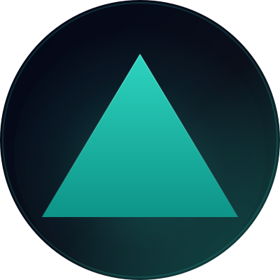

# Grant Applications

This directory contains grant application materials for IndexFlow.

## 0x Labs Grant

- [`0xlabs-grant-application.md`](0xlabs-grant-application.md) -- completed form (table format, ready to copy into the submission portal)
- [`blurb.md`](blurb.md) -- editable blurb text (copy into a shared Google Doc)
- [`indexflow-logo.png`](indexflow-logo.png) -- logo asset for upload
- [`indexflow-avatar-400.png`](indexflow-avatar-400.png) -- square profile photo (400×400, dark brand-gradient background + enlarged teal triangle that fills the circular crop; use for X/Twitter avatar)
- [`indexflow-avatar-400.svg`](indexflow-avatar-400.svg) -- editable source SVG for the avatar
- [`indexflow-header-1500x500.png`](indexflow-header-1500x500.png) -- X/Twitter header banner (1500×500, fully abstract: layered triangle composition + flow curves + soft blooms; no text; lower-left profile-photo overlap zone kept clear)
- [`indexflow-header-1500x500.svg`](indexflow-header-1500x500.svg) -- editable source SVG for the header
- [`architecture-diagram.png`](architecture-diagram.png) -- system architecture diagram for upload

### Before submitting: remaining action items

The form has `<!-- TODO -->` markers for the few items that still need manual upload. Everything else is filled in.

| Item | Status | Action needed |
|------|--------|---------------|
| LinkedIn URL | Done | Filled in: https://www.linkedin.com/in/reuben-rodrigues-020b74b4/ |
| Start date | Done | Filled in: 04/04/2026 |
| Pitch deck | Done | Linked: Google Slides URL |
| Blurb Google Doc | Pending | Copy `blurb.md` content into a new Google Doc (anyone can edit), paste URL into form |
| Whitepaper | Link in form | Drive URL is in `0xlabs-grant-application.md`; after each local regen of `docs/WHITEPAPER_DRAFT.pdf`, re-upload or replace the file on Drive so the link serves the latest PDF |
| Logo | Done | Public link: https://drive.google.com/file/d/1C3kMRC-9GRjQFVpFRqQJSiOqWl3BISvA/view?usp=sharing |
| Architecture diagram | Pending | Upload `architecture-diagram.png` to Google Drive, paste public link into form |
| Legal entity | Pending | Update when incorporated |
| Lawyer/legal firm | Pending | Update when retained |

### Assets ready to upload

| Asset | File in repo |
|-------|-------------|
| Whitepaper PDF | `docs/WHITEPAPER_DRAFT.pdf` |
| Pitch deck | Already linked (Google Slides) |
| Logo PNG | `growth/grants/indexflow-logo.png` |
| X / social avatar (400×400) | `growth/grants/indexflow-avatar-400.png` |
| X / social header (1500×500) | `growth/grants/indexflow-header-1500x500.png` (source: `indexflow-header-1500x500.svg`) |
| Architecture diagram | `growth/grants/architecture-diagram.png` |

### Regenerating the X social assets from SVG

Both the avatar (400×400) and the header (1500×500) are rasterized from their `.svg` sources via headless Chrome (`qlmanage` forces a square aspect ratio so it can't be used for the header):

```bash
# Header (1500×500)
mkdir -p /tmp/if-header && cp growth/grants/indexflow-header-1500x500.svg /tmp/if-header/
cat > /tmp/if-header/header.html <<'HTML'
<!doctype html><html><head><meta charset="utf-8"/>
<style>html,body{margin:0;padding:0;background:transparent}body{width:1500px;height:500px;overflow:hidden}img{display:block;width:1500px;height:500px}</style>
</head><body></body></html>
HTML
"/Applications/Google Chrome.app/Contents/MacOS/Google Chrome" \
  --headless --disable-gpu --hide-scrollbars \
  --window-size=1500,500 --default-background-color=00000000 \
  --screenshot=/tmp/if-header/indexflow-header.png \
  "file:///tmp/if-header/header.html"
cp /tmp/if-header/indexflow-header.png growth/grants/indexflow-header-1500x500.png

# Avatar (400×400)
mkdir -p /tmp/if-avatar && cp growth/grants/indexflow-avatar-400.svg /tmp/if-avatar/
cat > /tmp/if-avatar/avatar.html <<'HTML'
<!doctype html><html><head><meta charset="utf-8"/>
<style>html,body{margin:0;padding:0;background:transparent}body{width:400px;height:400px;overflow:hidden}img{display:block;width:400px;height:400px}</style>
</head><body></body></html>
HTML
"/Applications/Google Chrome.app/Contents/MacOS/Google Chrome" \
  --headless --disable-gpu --hide-scrollbars \
  --window-size=400,400 --default-background-color=00000000 \
  --screenshot=/tmp/if-avatar/indexflow-avatar.png \
  "file:///tmp/if-avatar/avatar.html"
cp /tmp/if-avatar/indexflow-avatar.png growth/grants/indexflow-avatar-400.png
```
